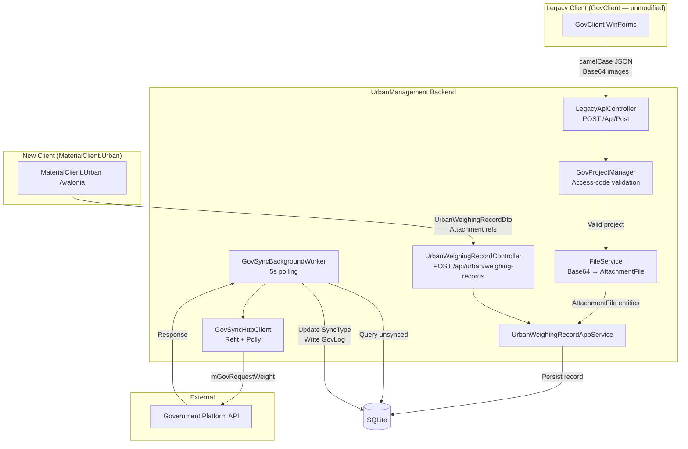

## Why

The XiaoShanServe system (ASP.NET Core + SqlSugar + SQLite) is a lightweight relay that receives weighing data from legacy GovClient instances and forwards it to a government platform. It must be consolidated into the UrbanManagement ABP platform so both the new MaterialClient.Urban client and the legacy Fdsoft.Weight.GovClient can submit data through a single backend, eliminating the need to maintain two separate server deployments.

## What Changes

### UrbanManagement Backend

- **Legacy API compatibility layer**: New `LegacyApiController` implementing `POST /Api/Post` to accept payloads from the unmodified legacy GovClient (camelCase field names, Base64 image arrays, `buildLicenseNo`/`fdBuildLicenseNo` dual access-code validation)
- **Access-code validation service**: New `IGovProjectManager` implementing dual validation logic (凡东码 + 城管码) that resolves a `GovProject` from either access code type
- **Image processing service**: New `IFileService` that receives Base64 images, saves to local disk, compresses when exceeding threshold, and records `AttachmentFile` entities (replacing `SnapImages` comma-separated string approach)
- **Attachment entities**: New `AttachmentFile` and `UrbanWeighingRecordAttachment` entities replacing `SnapImages` string field, supporting `Lrp` and `UrbanPhoto` attach types
- **Background sync worker**: New `GovSyncBackgroundWorker` (ABP `AsyncPeriodicBackgroundWorkerBase`) replacing the old `ExplortStatisticBgService`, polling every 5 seconds to forward unsynced records to the government API
- **Government HTTP forwarding**: New `IGovSyncHttpClient` (Refit) with Polly retry policies for government platform forwarding
- **Sync logging**: Real `GovLog` persistence replacing current mock data
- **Management controllers**: Replace `SampleDataProvider` mock implementations in `ProjectController` and `SyncInfoController` with real `IRepository` database operations
- **Configuration**: Add `StorageOptions` (FilesPhysicalPath, CompressImage, GovAddress) bound via `IOptions<T>`
- **Database indexes**: Add missing indexes on `GovProject.BuildLicenseNo`, `GovProject.FdBuildLicenseNo`, `UrbanWeighingRecord.SyncType`, `GovLog.SyncId`
- **Date format compatibility**: Add custom `JsonConverter` for `DateTime` to handle `yyyy-MM-dd HH:mm:ss` format from legacy client

### UrbanWeighingRecord Extended Fields

- Add to entity: `VehicleColor`, `PlateColor`, `VehicleType`, `DeviceId`, `BuildLicenseNo`, `SiteType`, `ProId`, `ProName`, `IsAnomaly`, `ClientSyncType`, `ClientSyncTime`, `ClientRetryCount`, `ClientLastErrorTime`, `SyncTime`, `RetryCount`, `LastErrorTime`
- Remove from entity: `SnapImages` (replaced by AttachmentFile join table)
- Extend `UrbanWeighingRecordDto` with matching fields + optional `AttachmentIds` list

### MaterialClient

- **Urban API integration**: New Refit API interface (`IUrbanManagementApi`) in `MaterialClient.Urban` to call `POST /api/urban/weighing-records` with extended `UrbanWeighingRecordDto` payloads
- **UrbanWeighingExtension sync**: Update the `UrbanWeighingExtension` variant extension to populate sync-state fields that map to the server-side `UrbanWeighingRecord`
- **Attachment upload**: Urban-mode weighing flow to include `AttachmentFile` references (type `Lrp`/`UrbanPhoto`) with each weighing record submission

## Capabilities

### New Capabilities

- `legacy-api-compat`: Compatibility layer accepting unmodified GovClient `POST /Api/Post` requests with dual access-code validation, Base64 image processing, and `ApiResultDto` response format
- `attachment-file-storage`: Structured file attachment system replacing `SnapImages` string field, with `AttachmentFile` + join table pattern, local disk storage, compression, and `Lrp`/`UrbanPhoto` type support
- `gov-sync-worker`: Background sync service that polls unsynced records every 5 seconds, assembles government API payloads, forwards via HTTP with retry/logging, and updates `SyncType`/`SyncNumber`/`GovLog`
- `urban-weighing-api`: Server-side API for receiving weighing records from MaterialClient.Urban including `ClientRecordId` idempotency, extended field mapping, and attachment association
- `urban-management-crud`: Real database-backed CRUD for projects, sync data, and sync logs, replacing `SampleDataProvider` mock implementations

### Modified Capabilities

(none — this is a greenfield migration into UrbanManagement; no existing specs are being modified)

## Impact

### Code Change Map

| File Path | Change Type | Change Reason | Impact Scope |
|-----------|-------------|---------------|--------------|
| **UrbanManagement.Core/Entities/** | | | |
| `Entities/AttachmentFile.cs` | **New** | Replace SnapImages with structured attachment model | Data model |
| `Entities/UrbanWeighingRecordAttachment.cs` | **New** | Join table for weighing-record ↔ attachment | Data model |
| `Entities/Enums/AttachType.cs` | **New** | Enum for Lrp=5, UrbanPhoto=6 attach types | Data model |
| `Entities/UrbanWeighingRecord.cs` | **Modify** | Add 16 extended fields (vehicle, sync state, project), remove SnapImages | Data model |
| `Entities/GovSyncData.cs` | **Modify** | Add IsAnomaly field, verify all forwarding fields present | Data model |
| `EntityFrameworkCore/UrbanManagementDbContext.cs` | **Modify** | Register AttachmentFile + UrbanWeighingRecordAttachment DbSets; add indexes; update UrbanWeighingRecord column mappings | Data access |
| **UrbanManagement.Core/Services/** | | | |
| `Services/IGovProjectManager.cs` | **New** | Access-code dual validation service | Business logic |
| `Services/GovProjectManager.cs` | **New** | Implementation: fdBuildLicenseNo priority → BuildLicenseNo fallback | Business logic |
| `Services/IFileService.cs` | **New** | Base64 image save/compress/record service | Business logic |
| `Services/FileService.cs` | **New** | Implementation: decode → save → compress → create AttachmentFile entities | Business logic |
| `Services/ILegacyGovSyncAppService.cs` | **New** | Orchestration: validate → save images → build GovSyncData → persist | Business logic |
| `Services/LegacyGovSyncAppService.cs` | **New** | Implementation tying together GovProjectManager + FileService + repositories | Business logic |
| `Services/IGovSyncHttpClient.cs` | **New** | Refit interface for government API forwarding | HTTP client |
| `Services/GovSyncBackgroundWorker.cs` | **New** | 5-second polling background worker | Background service |
| `Services/IUrbanWeighingRecordAppService.cs` | **Modify** | Extend to handle attachments and sync state fields | Business logic |
| `Services/SampleDataProvider.cs` | **Delete** | Remove after real services replace all mock usage | Cleanup |
| **UrbanManagement.App/Controllers/** | | | |
| `Controllers/LegacyApiController.cs` | **New** | `POST /Api/Post` compatibility endpoint | API layer |
| `Controllers/ProjectController.cs` | **Modify** | Replace SampleDataProvider with real IRepository | API layer |
| `Controllers/SyncInfoController.cs` | **Modify** | Replace SampleDataProvider with real IRepository | API layer |
| `Controllers/UrbanWeighingRecordController.cs` | **Modify** | Extend DTO handling for sync fields and attachments | API layer |
| **UrbanManagement.App/Models/** | | | |
| `Models/GovRequestWeightDto.cs` | **New** | Legacy client DTO with camelCase property names | API contract |
| `Models/GovResponseBase.cs` | **New** | Generic response wrapper with code field | API contract |
| `Models/UrbanWeighingRecordDto.cs` | **Modify** | Add sync state fields, vehicle fields, attachment IDs | API contract |
| **UrbanManagement.App/Configuration/** | | | |
| `Configuration/StorageOptions.cs` | **New** | IOptions binding for storage config | Configuration |
| `appsettings.json` | **Modify** | Add StorageOptions section | Configuration |
| `UrbanManagementAppModule.cs` | **Modify** | Register Refit client, Polly retry, DateTime converter | Module config |
| **MaterialClient.Urban/** | | | |
| `Api/IUrbanManagementApi.cs` | **New** | Refit interface to UrbanManagement weighing API | HTTP client |
| `Entities/Urban/UrbanWeighingExtension.cs` | **Modify** | Add sync-state fields mapping to server-side record | Data model |
| ViewModels / Views | **Modify** | Update Urban weighing flow to submit via new API | UI + logic |

### Interaction Flow

### Dependencies

- **Refit.HttpClientFactory** + **Microsoft.Extensions.Http.Polly** NuGet packages in UrbanManagement for HTTP client resilience
- No new external services; government API endpoint is configurable

### Risks

| Risk | Severity | Mitigation |
|------|----------|------------|
| Legacy GovClient cannot be modified — API contract must match exactly | **High** | `POST /Api/Post` with `JsonElement`/`GovRequestWeightDto`, response includes `code` field |
| `GovProject` table empty on deploy → all legacy requests rejected | **High** | Data migration from old XiaoShan.db before cutover |
| Image storage path mismatch between old and new deployments | Medium | Configurable `FilesPhysicalPath`; path existence validation on startup |
| Government API URL/format changes | Medium | Fully configurable via `appsettings.json`; Refit abstraction layer |
| Entity PK types remain as-is (int/long) — vault spec targets Guid but current code uses int for GovSyncData/GovLog and long for UrbanWeighingRecord | Medium | No PK type migration in this change; keep current types to avoid data migration complexity |
