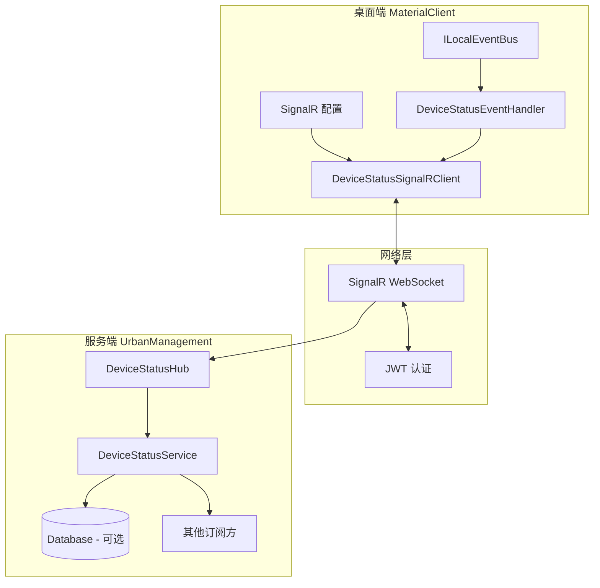
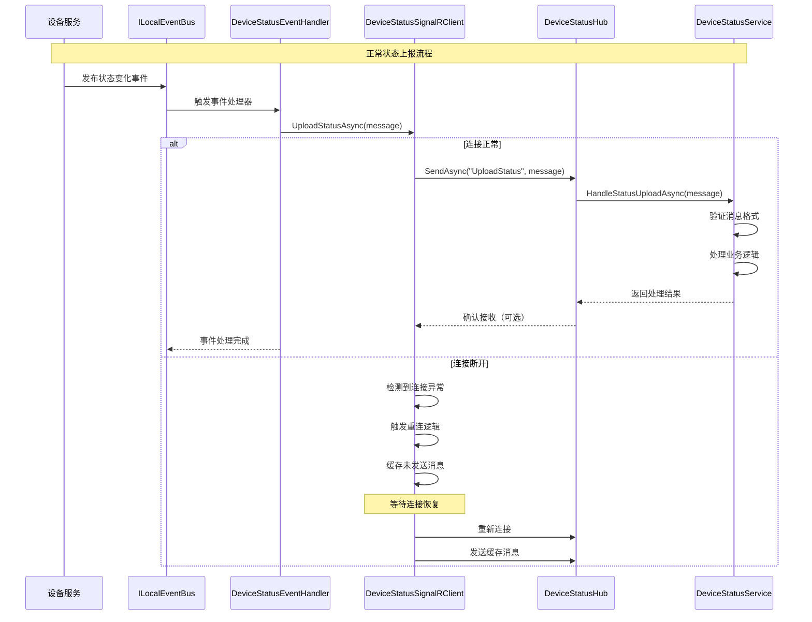

# SignalR Device Status Upload - Design

## Context

### 当前状态

- **桌面端（MaterialClient）**: 使用 ILocalEventBus 订阅设备状态变化事件，现有设备包括地磅、摄像头、车牌识别、音响设备等。状态变化仅在本地 UI 更新，无上报机制。
- **服务端（UrbanManagement）**: 提供 REST API 接收称重记录，使用 AsyncPeriodicBackgroundWorkerBase 实现政府平台同步。无实时通信能力。
- **通信模式**: 当前仅支持 HTTP 请求/响应模式，缺乏服务端主动推送能力。

### 技术约束

- ABP Framework 约定：服务端遵循 AppService/Repository/UnitOfWork 模式
- 跨子仓库 C# 约定：禁止使用 tuple，使用 `record` 类型
- Service 层约束：ViewModels 不得直接使用 Repository
- 现有 ILocalEventBus 架构：桌面端设备状态已通过事件总线分发

## Goals / Non-Goals

**Goals:**
- 实现桌面端与服务端的实时双向通信通道
- 支持设备状态变化实时上报至服务端
- 支持服务端向桌面端推送消息（预留扩展能力）
- 提供自动重连机制，保证连接稳定性
- 遵循 ABP SignalR 集成最佳实践

**Non-Goals:**
- 不实现设备状态历史查询功能（可后续通过 REST API 实现）
- 不实现服务端向桌面端的控制指令下发（预留扩展）
- 不实现设备状态 UI 展示（使用现有 DeviceStatusBar）
- 不涉及数据库表设计变更（如需持久化，由用户手动执行 Migration）

## Decisions

### 决策 1: 使用 SignalR 而非 WebSocket/轮询

**选择理由:**
- **SignalR**: ABP Framework 原生支持，提供自动重连、连接管理、JWT 认证集成
- **WebSocket 原生**: 需手动处理连接生命周期、重连逻辑、认证
- **HTTP 轮询**: 延迟高、服务器资源浪费、实时性差

**替代方案考虑:**
- **gRPC Streaming**: 不支持浏览器客户端，过度工程化
- **MQTT**: 需额外 Broker，运维复杂度高

### 决策 2: 服务端 Hub 设计模式

**采用模式:** 单一 Hub + 方法路由

```csharp
// DeviceStatusHub 提供状态接收、订阅管理和测试方法
public class DeviceStatusHub : Hub
{
    public async Task UploadStatus(DeviceStatusMessage message)
    public async Task SubscribeDeviceUpdates(string deviceType)
    public async Task SayHello(string message)  // 简单测试方法，用于验证服务端推送
}
```

**理由:**
- 单一 Hub 降低管理复杂度
- 方法路由清晰，易于扩展
- 符合 ABP Hub 设计约定

**替代方案:** 多 Hub（每种设备类型一个 Hub）- 过度设计，增加连接管理复杂度

### 决策 3: 桌面端连接生命周期管理

**采用模式:** 单例 SignalRClient + 自动重连

```csharp
public class DeviceStatusSignalRClient : ISingletonDependency
{
    private HubConnection _connection;
    
    public async Task StartAsync()
    public async Task StopAsync()
    public async Task UploadStatusAsync(DeviceStatusMessage message)
}
```

**理由:**
- 单例确保全局唯一连接，避免资源浪费
- 自动重连处理网络抖动、服务重启场景
- 实现 IDisposable 支持优雅关闭

**替代方案:** 每次上报新建连接 - 性能差，连接开销大

### 决策 4: 消息协议设计

**采用格式:** JSON + C# Record DTO

```csharp
public record DeviceStatusMessage(
    string ClientId,
    string DeviceType,
    string Status,
    DateTime Timestamp,
    string? AdditionalData
);
```

**理由:**
- JSON 兼容性好，易于调试
- Record 类型符合项目编码约定
- 包含时间戳支持乱序处理

### 决策 5: 认证与授权

**采用方案:** JWT Bearer Token + ABP 授权

```csharp
// 服务端配置
services.AddAuthentication()
    .AddJwtBearer(options => {
        options.Events = new JwtBearerEvents();
    });

// 客户端连接
_connection = new HubConnectionBuilder()
    .WithUrl(serverUrl, options => {
        options.AccessTokenProvider = () => Task.FromResult(token);
    })
    .Build();
```

**理由:**
- 复用现有 ABP JWT 认证体系
- 无需额外认证基础设施
- 支持用户级权限控制（预留）

### 决策 6: 错误处理与日志

**采用策略:** 分层错误处理

- **连接层**: 捕获网络异常，触发重连
- **消息层**: 记录发送失败，支持本地缓存
- **服务层**: 记录业务异常，返回友好错误码

**日志策略:**
- 使用 Serilog 记录连接生命周期事件
- 使用 ILogger 记录业务操作
- 敏感信息脱敏后再记录

## Architecture

### 组件架构

```
服务端（UrbanManagement）
├── SignalR Infrastructure
│   ├── DeviceStatusHub (Hub层)
│   │   ├── OnConnectedAsync() - 连接管理
│   │   ├── OnDisconnectedAsync() - 断开处理
│   │   ├── UploadStatus() - 状态接收
│   │   └── SubscribeDeviceUpdates() - 订阅管理
│   └── SignalR Configuration
│       ├── CORS 策略
│       ├── JWT 认证
│       └── 消息大小限制
├── Application Layer
│   └── IDeviceStatusService
│       ├── HandleStatusUploadAsync() - 状态处理
│       ├── QueryDeviceHistoryAsync() - 历史查询（预留）
│       └── BroadcastToSubscribersAsync() - 消息分发
├── Domain Layer
│   ├── DeviceStatusLog (实体 - 可选)
│   └── DeviceStatusMessage (DTO)
└── Infrastructure Layer
    ├── DeviceStatusRepository (可选 - 用于持久化)
    └── ABP Memory Cache (IDistributedCache - 用于离线消息缓存)

桌面端（MaterialClient）
├── SignalR Client Infrastructure
│   ├── DeviceStatusSignalRClient (单例服务)
│   │   ├── StartAsync() - 启动连接
│   │   ├── StopAsync() - 停止连接
│   │   ├── UploadStatusAsync() - 状态上报
│   │   └── ReconnectLoopAsync() - 重连逻辑
│   └── SignalR Configuration
│       ├── 服务端 URL 配置
│       └── JWT Token 提供
├── Integration Layer
│   └── DeviceStatusEventHandler (ILocalEventHandler)
│       └── HandleEventAsync() - 订阅设备状态事件
├── Domain Layer
│   └── DeviceStatusMessage (DTO - 与服务端共享)
└── Configuration
    └── SignalR Options (appsettings.json)
```

### 数据流图



### API 序列图



## Risks / Trade-offs

### 已知风险

| 风险 | 影响 | 缓解措施 |
|------|------|---------|
| 网络不稳定导致频繁断连 | 状态上报延迟 | 实现指数退避重连 + 本地消息缓存队列 |
| 服务端重启导致连接丢失 | 短期内状态丢失 | 客户端自动重连 + 重连后补发关键状态 |
| 高频状态变化导致消息积压 | 内存占用增加 | 实现消息去重 + 限流机制 |
| JWT Token 过期 | 认证失败 | 实现 Token 自动刷新机制 |
| SignalR 版本兼容性问题 | 升级困难 | 锁定 NuGet 版本 + 关注 ABP 更新日志 |

### 权衡取舍

**实时性 vs 可靠性:**
- 选择: 优先保证实时性，允许少量消息丢失
- 理由: 设备状态是周期性变化的，单次丢失不影响整体监控
- 补偿: 桌面端定期（如每分钟）发送完整状态快照

**复杂度 vs 功能完整性:**
- 选择: MVP 实现阶段，暂不实现消息持久化
- 理由: 降低首期开发成本，通过日志记录可追溯
- 扩展: 预留数据库持久化接口，后续按需添加

## Migration Plan

### 部署步骤

1. **服务端部署优先**
   - 更新 UrbanManagement 代码
   - 部署新版本（包含 SignalR Hub）
   - 验证 `/hubs/devicestatus` 端点可访问

2. **桌面端灰度发布**
   - 更新 MaterialClient 代码
   - 通过配置开关控制 SignalR 功能启用
   - 小范围试点验证连接稳定性

3. **全量发布**
   - 逐步扩大桌面端部署范围
   - 监控连接成功率和消息吞吐量
   - 收集用户反馈优化参数

### 回滚策略

- **服务端回滚**: 移除 SignalR 端点配置，恢复原有 REST API
- **桌面端回滚**: 通过配置开关关闭 SignalR 功能，恢复原有本地状态显示
- **数据回滚**: 删除可选的 DeviceStatusLog 表（如已创建）

## Open Questions

1. **Q: 是否需要持久化设备状态历史？**
   - A: 设计已考虑持久化需求（DeviceStatusLog 实体、Repository 模式），但 MVP 阶段不实现数据库写入。通过日志记录可追溯，如需历史查询，后续通过 REST API 实现独立接口。

2. **Q: 是否需要支持离线消息缓存？**
   - A: 首期使用 ABP 的内存缓存组件（IDistributedCache 的内存实现）缓存消息，最多缓存 100 条。连接断开时消息进入缓存，重连成功后按 FIFO 顺序补发。后续按需增加持久化。

3. **Q: 消息发送失败是否需要重试？**
   - A: 连接断开时触发自动重连，重连成功后补发缓存消息。单条消息发送失败不重试，依赖下一次状态更新。

4. **Q: 是否需要实现服务端向客户端的消息推送？**
   - A: 预留能力并实现简单的 Hello 测试方法。Hub 提供 `SayHello()` 方法，客户端可调用测试服务端推送，日志打印接收到的消息。后续可扩展至配置下发、远程控制等场景。

## 详细代码变更清单

### 服务端（UrbanManagement）

| 文件路径 | 变更类型 | 详细变更描述 | 影响模块 |
|---------|---------|-------------|---------|
| `src/UrbanManagement.App/UrbanManagementAppModule.cs` | 修改 | 添加 SignalR 服务注册 `AddSignalR()` 和 CORS 配置 | 依赖注入配置 |
| `src/UrbanManagement.Core/Hubs/DeviceStatusHub.cs` | 新增 | 实现 SignalR Hub，提供 `UploadStatus`、`SubscribeDeviceUpdates` 和 `SayHello` 测试方法 | SignalR Hub 层 |
| `src/UrbanManagement.Core/Services/IDeviceStatusService.cs` | 新增 | 定义设备状态服务接口 | 应用服务层 |
| `src/UrbanManagement.Core/Services/DeviceStatusService.cs` | 新增 | 实现状态处理、消息分发、日志记录，使用 ABP IDistributedCache 实现离线消息缓存（最多 100 条） | 应用服务层 |
| `src/UrbanManagement.Core/Configuration/SignalROptions.cs` | 新增 | SignalR 配置选项类（消息大小限制、超时） | 配置层 |
| `src/UrbanManagement.Core/Models/DeviceStatusMessage.cs` | 新增 | 设备状态消息 DTO（Record 类型） | 域模型层 |
| `src/UrbanManagement.Core/Entities/DeviceStatusLog.cs` | 新增（可选） | 设备状态日志实体，用于持久化 | 实体层 |
| `src/UrbanManagement.EntityFrameworkCore/DbContext.cs` | 修改（可选） | 添加 `DbSet<DeviceStatusLog>` | EF Core 上下文 |
| `src/UrbanManagement.App/Controllers/DeviceStatusController.cs` | 新增（可选） | 提供 REST API 查询设备状态历史 | API 层 |

### 桌面端（MaterialClient）

| 文件路径 | 变更类型 | 详细变更描述 | 影响模块 |
|---------|---------|-------------|---------|
| `src/MaterialClient.Common/Services/DeviceStatusSignalRClient.cs` | 新增 | SignalR 客户端单例服务，管理连接生命周期 | 通信层 |
| `src/MaterialClient.Common/Events/DeviceStatusEventHandler.cs` | 新增 | ILocalEventHandler 实现，订阅设备状态事件 | 事件集成层 |
| `src/MaterialClient.Common/Configuration/SignalRClientOptions.cs` | 新增 | SignalR 客户端配置（服务端 URL、重连间隔） | 配置层 |
| `src/MaterialClient.Common/Models/DeviceStatusMessage.cs` | 新增 | 设备状态消息 DTO（与服务端共享） | 域模型层 |
| `src/MaterialClient.Urban/MaterialClientUrbanModule.cs` | 修改 | 添加 SignalR 客户端注册和事件处理器注册 | 依赖注入配置 |
| `src/MaterialClient.Common/Services/ISoundDeviceService.cs` | 修改（可选） | 如需上报音响设备状态，集成 SignalR 上报逻辑 | 设备服务层 |

### 配置文件变更

| 文件路径 | 变更类型 | 详细变更描述 |
|---------|---------|-------------|
| `repos/UrbanManagement/src/UrbanManagement.App/appsettings.json` | 新增 | SignalR 配置节点（CORS、消息大小限制） |
| `repos/MaterialClient/src/MaterialClient.Urban/appsettings.json` | 新增 | SignalR 服务端 URL、ClientId 配置 |
| `repos/UrbanManagement/src/UrbanManagement.App/Directory.Packages.props` | 修改 | 确认 SignalR 包版本（ABP 已包含） |
| `repos/MaterialClient/Directory.Packages.props` | 新增 | 添加 `Microsoft.AspNetCore.SignalR.Client` 包引用 |

### 依赖包变更

**UrbanManagement** (无需新增，ABP 已包含):
- `Microsoft.AspNetCore.SignalR` (已通过 ABP Framework 引入)

**MaterialClient** (需新增):
- `Microsoft.AspNetCore.SignalR.Client` (最新稳定版)

## 测试策略

### 单元测试

- **服务端**:
  - `DeviceStatusServiceTests`: 测试状态处理逻辑、消息分发
  - `DeviceStatusMessageTests`: 测试 DTO 序列化/反序列化

- **桌面端**:
  - `DeviceStatusSignalRClientTests`: Mock HubConnection 测试连接管理、重连逻辑
  - `DeviceStatusEventHandlerTests`: 测试事件处理、消息转换

### 集成测试

- 搭建本地 SignalR 服务端
- 模拟客户端连接、消息发送、重连场景
- 验证消息格式、认证流程

### 手动验证

1. 启动服务端，验证 `/hubs/devicestatus` 端点可访问
2. 启动桌面端，检查日志确认连接成功
3. 触发设备状态变化（如断开摄像头），观察服务端是否接收消息
4. 模拟网络中断，验证重连机制
5. 验证 JWT Token 过期场景
