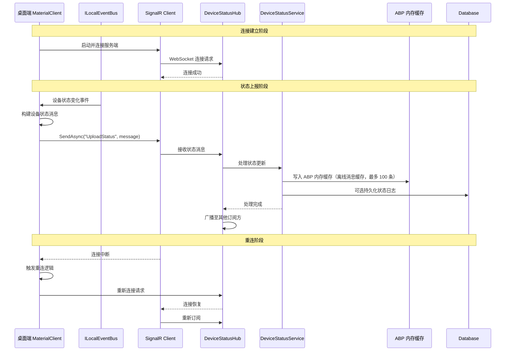

# SignalR Device Status Upload - Proposal

## Why

当前桌面端（MaterialClient）缺少与服务端（UrbanManagement）的实时双向通信机制，无法实时上报设备同步状态。当设备连接状态发生变化时，服务端无法及时感知，导致监管平台与现场设备状态不同步，影响运维效率和故障响应速度。

通过引入 SignalR 双向通信通道，使桌面端能够主动推送设备状态变更至服务端，实现状态实时同步，为远程监控和故障预警提供基础设施支撑。

## What Changes

### 服务端（UrbanManagement）

- 新增 `DeviceStatusHub` SignalR Hub，提供设备状态接收端点和简单的 `SayHello` 测试方法
- 实现客户端连接管理（连接/断开事件处理）
- 实现设备状态消息分发逻辑（将状态更新转发至订阅方）
- 新增 `IDeviceStatusService` 应用服务，使用 ABP 内存缓存（IDistributedCache）处理离线消息缓存（最多 100 条）
- 配置 SignalR 服务端点（CORS、JWT 认证集成）

### 桌面端（MaterialClient）

- 新增 `DeviceStatusSignalRClient` 服务，管理与服务端的 SignalR 连接
- 实现自动重连机制（网络中断、服务重启场景）
- 封装设备状态上报 API（设备类型、状态码、时间戳）
- 集成现有 `ILocalEventBus` 机制，订阅设备状态变化事件
- 新增 SignalR 客户端依赖注入配置

### 通信协议

- 定义设备状态消息协议（DeviceStatusMessage DTO）
- 定义连接参数（ClientId、DeviceType、AuthToken）
- 实现消息序列化/反序列化

## Capabilities

### New Capabilities

- `signalr-device-status-upload`: 基于 SignalR 的设备状态实时上传能力，涵盖连接管理、状态上报、消息协议、错误处理

### Modified Capabilities

无现有能力的需求变更。本变更为新增基础设施，不修改现有 Spec 要求。

## Impact

### 受影响代码模块

| 仓库 | 文件路径 | 变更类型 | 变更原因 |
|------|---------|---------|---------|
| UrbanManagement | `src/UrbanManagement.App/` | 新增 | 添加 SignalR Hub 端点配置 |
| UrbanManagement | `src/UrbanManagement.Core/Hubs/` | 新增 | DeviceStatusHub 实现 |
| UrbanManagement | `src/UrbanManagement.Core/Services/` | 新增 | IDeviceStatusService 及实现 |
| UrbanManagement | `src/UrbanManagement.Core/Entities/` | 新增 | DeviceStatusLog 实体（可选，用于持久化） |
| MaterialClient | `src/MaterialClient.Common/Services/` | 新增 | DeviceStatusSignalRClient 服务 |
| MaterialClient | `src/MaterialClient.Common/Configuration/` | 新增 | SignalR 连接配置选项 |
| MaterialClient | `src/MaterialClient.Urban/` | 修改 | 集成 SignalR 客户端注册 |

### 依赖项变更

- **UrbanManagement**: 新增 `Microsoft.AspNetCore.SignalR` NuGet 包（已包含在 ABP Framework）
- **MaterialClient**: 新增 `Microsoft.AspNetCore.SignalR.Client` NuGet 包

### API 端点变更

- **UrbanManagement**: 新增 `/hubs/devicestatus` SignalR 端点

### 配置变更

- **UrbanManagement**: `appsettings.json` 新增 SignalR 配置节点（可选，用于 CORS、消息大小限制）
- **MaterialClient**: `appsettings.json` 新增 SignalR 服务端 URL 配置

### 数据库变更

- **可选**: 新增 `DeviceStatusLog` 表用于持久化设备状态历史（用户手动执行 EF Migration）

## Interaction Flow

## Technical Constraints

遵循以下项目约束：

1. **跨子仓库 C# 编码约定**: 禁止使用 tuple，多值返回使用 `record` 类型
2. **ViewModels 不得直接使用 Repository**: 所有数据访问必须通过 Service 层
3. **Service 方法必须使用 UnitOfWork**: 涉及数据写入的方法必须使用 `[UnitOfWork]` 特性
4. **ILocalEventBus 事件驱动**: 桌面端使用现有事件总线订阅设备状态变化
5. **ABP Framework 约定**: 服务端遵循 ABP 的 AppService、Repository、UnitOfWork 模式
