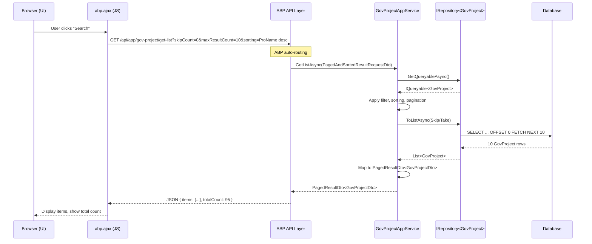
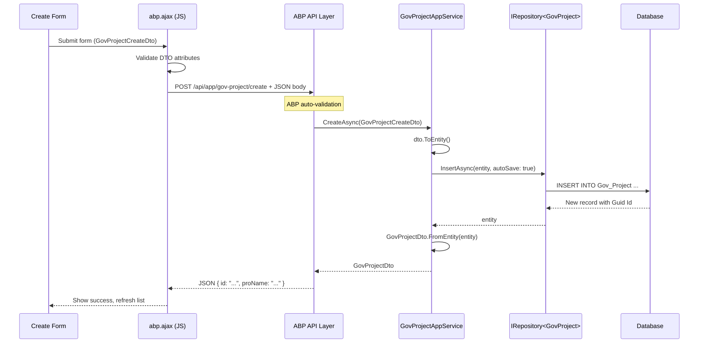
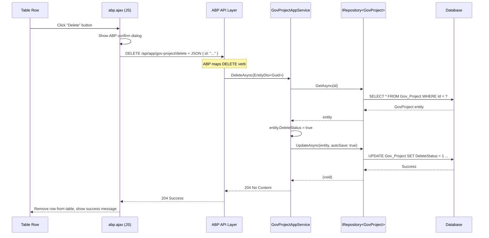

## Context

### Delivery Tier Assessment

**Tier**: Core → Assumption-Validation

**Rationale**: The guess governance analysis revealed:
- Guess Ratio: 100% (10 assumptions / 10 facts) - Exceeds 35% threshold
- High-risk assumptions: 1 (A-09 PagedResult dependencies at Risk 45)
- **Updated**: UrbanManagement confirmed as internal site with no login/authorization requirements (reduces A-03 risk)
- Critical unknowns that require validation before full implementation

**Recommended Path**:
1. **Current Change (Assumption-Validation)**: Validate the 10 critical assumptions through discovery tasks
2. **Follow-up Change (Core)**: After assumptions are validated, implement the full ABP pattern refactor

### Requirements Completeness Assessment

**This change operates with incomplete requirements.** The following areas have documented gaps and rely on assumptions that will be validated during implementation:

| Requirement Area | Known Gap | Assumption | Validation Trigger |
|------------------|-----------|------------|-------------------|
| Site Access | **RESOLVED**: UrbanManagement is internal site with no login/authorization | No external access possible | N/A (confirmed fact) |
| Layui Features | Complete feature inventory not documented | Only basic CRUD is critical | User testing reveals missing critical features |
| Search Usage | Unknown how heavily search is used | Keep search, simplify if complex | Implementation > 2 days for search |
| Internal API Callers | Unknown if other internal systems call endpoints | None exist (low priority) | Server log check if convenient |
| Form Validation | Current validation rules not documented | DTO attributes are sufficient | Validation gaps found in testing |
| ABP JS Infrastructure | Unknown if abp.js is available | Can be added if missing | Build fails or auth errors occur |

### Current State

UrbanManagement.APP implements government project management as an internal site (no login/authorization required) with non-standard ABP patterns:

**Backend (GovProjectAppService):**
- Uses custom `PagedResult<T>(IReadOnlyList<T> Data, int Total)` for pagination
- Accepts custom parameters: `int page`, `int limit`, `string? searchText`
- Returns custom response structure incompatible with ABP's JavaScript proxies
- Already inherits from `ApplicationService` and implements `IApplicationService` ✓

**Frontend (Project/Index.cshtml):**
- Uses Layui (third-party UI library) for table rendering
- Uses jQuery AJAX to call non-existent endpoints: `/Project/PageList`, `/Project/Add`, `/Project/SetStatus`, `/Project/Del`
- No integration with ABP JavaScript API (`abp.ajax`, `abp.services`)
- Manual pagination logic independent of ABP conventions

**ABP Auto-generated Endpoints (Unused by frontend):**
- ABP automatically generates: `/api/app/gov-project/get-list`, `/api/app/gov-project/create`, `/api/app/gov-project/update`, `/api/app/gov-project/delete`
- Swagger documentation auto-generated but not leveraged
- ABP JavaScript proxies available but not used

### Constraints

- **No backward compatibility required**: Can perform breaking changes
- **Skip unit tests**: Testing not required for this refactor
- **Skip documentation**: Focus on code changes only
- **ABP Framework**: Target ABP framework conventions (not custom patterns)
- **Existing infrastructure**: ABP modules already configured, EF Core migrations in place

## Goals / Non-Goals

**Goals:**
- Align backend with ABP standard DTOs: `PagedResultDto<T>` and `PagedAndSortedResultRequestDto`
- Align frontend with ABP JavaScript API for HTTP communication
- Enable ABP auto-generated Swagger documentation to accurately reflect API contracts
- Remove custom pagination implementation in favor of ABP patterns
- Standardize method naming to ABP conventions (GetAll, Get, Create, Update, Delete)

**Non-Goals:**
- Data migration: No database schema changes required
- UI redesign: Functional changes only, visual styling can remain
- Complete Layui removal: Other pages using Layui unchanged in this scope
- Business logic changes: Only refactoring API contracts and frontend calls
- **Unknown Scope Risks** (to be validated during implementation):
  - External API consumers calling `/Project/*` endpoints
  - Advanced Layui features that may be business-critical
  - Complex search/filter requirements beyond basic text search

## Decisions

### Assumption Validation Decisions

The following decisions have been deferred pending assumption validation results:

| Decision | Affected Assumption | Validation Method | Decision Timeline |
|----------|-------------------|-------------------|-------------------|
| Layui feature removal | A-01 | Stakeholder sign-off on feature inventory | Before frontend refactor |
| Search DTO approach | A-02, A-05 | Implementation complexity assessment | During backend refactor |
| Internal API caller verification | A-03 | Quick server log check (low priority) | During refactor if convenient |
| ABP JS infrastructure approach | A-04 | Test abp.js availability, implement fallback if needed | During frontend refactor |
| SyncInfo scope inclusion | A-07 | Impact assessment during site.js refactor | Reassess if critical breakage occurs |
| Form validation approach | A-08 | Test ABP validation, add manual validation if gaps | During frontend refactor |
| PagedResult deletion | A-09 | Global codebase search for dependencies | **Before deletion** |
| Update endpoint necessity | A-10 | Usage assessment during implementation | Defer if never used in UI |

### Design Decisions (Approved)

**These decisions represent already-approved technical choices based on current understanding of ABP conventions. They may be revisited if assumption validation reveals new information.**

### Decision 1: Use PagedAndSortedResultRequestDto for Input

**Choice**: Replace custom `(int page, int limit, string? searchText)` parameters with ABP's `PagedAndSortedResultRequestDto`.

**Rationale**:
- ABP provides `PagedAndSortedResultRequestDto` with `SkipCount`, `MaxResultCount`, and `Sorting` properties
- Enables ABP's built-in Swagger documentation and JavaScript proxy generation
- Standardizes pagination across all ApplicationServices in the project
- `SkipCount = (page - 1) * limit` conversion is straightforward

**Alternatives Considered**:
- **Custom request DTO**: Would maintain current parameter names but loses ABP ecosystem benefits
- **Pass-through params**: Keep custom params and wrap in ABP response (adds complexity without benefit)

**Uncertainty on SearchText**: `PagedAndSortedResultRequestDto` lacks `searchText` property. Current frontend search functionality needs preservation path.

**Decision on Search**: Create `GovProjectListRequestDto : PagedAndSortedResultRequestDto` with additional `string? SearchText` property. This preserves ABP compatibility while maintaining search feature. If implementation reveals search is rarely/never used, can simplify to pure ABP DTO in follow-up change.

**Frontend Impact**:
- Old: `{ page: 1, limit: 10, searchText: "abc" }`
- New: `{ skipCount: 0, maxResultCount: 10, sorting: "ProName desc", searchText: "abc" }`

### Decision 2: Use PagedResultDto<T> for Output

**Choice**: Replace custom `PagedResult<T>(Data, Total)` with ABP's `PagedResultDto<T>(Items, TotalCount)`.

**Rationale**:
- ABP's `PagedResultDto<T>` is the standard response format for paginated queries
- Property names (`Items`, `TotalCount`) align with ABP JavaScript proxy expectations
- Integrates with ABP's auto-generated Swagger UI
- Frontend can use `abp.services` proxy for type-safe calls

**Alternatives Considered**:
- **Keep custom PagedResult**: Would require frontend to handle non-standard property names
- **Wrapper pattern**: Create custom wrapper around PagedResultDto (adds unnecessary indirection)

### Decision 3: Frontend Uses abp.ajax Directly

**Choice**: Replace jQuery AJAX calls with `abp.ajax.get()`, `abp.ajax.post()`, `abp.ajax.delete()`.

**Rationale**:
- `abp.ajax` automatically includes authentication headers (ABP session tokens)
- Standardized error handling with ABP's error message display
- Loading indicators automatically managed
- No need to configure Refit or generate proxies for simple CRUD operations

**Alternatives Considered**:
- **ABP dynamic C# proxies**: Not applicable for JavaScript frontend
- **Refit HTTP client**: Backend-only, not relevant for Razor views
- **继续保持 jQuery AJAX**: Loses ABP integration benefits

**Uncertainty on ABP JS Availability**: Current `_Layout.cshtml` may not include ABP JavaScript libraries.

**Discovery Task**: During implementation, verify if `abp.js` and `abp.utils.js` are present in layout. If missing, add script references using ABP's CDN or local copies. If ABP JS infrastructure is not available, fallback to standard jQuery with manual header management (document as technical debt).

### Decision 4: Method Naming Follows ABP Conventions

**Choice**: Rename/approve methods to align with ABP's HTTP verb mapping:
- `GetListAsync` → GET `/api/app/gov-project/get-list`
- `GetAsync` → GET `/api/app/gov-project/get`
- `CreateAsync` → POST `/api/app/gov-project/create`
- `UpdateAsync` → PUT `/api/app/gov-project/update`
- `DeleteAsync` → DELETE `/api/app/gov-project/delete`

**Rationale**:
- ABP automatically maps method names to HTTP verbs and routes
- `GetList` prefix → GET requests
- `Create`, `Update`, `Delete` → POST, PUT, DELETE respectively
- Enables Swagger documentation and API explorer to work correctly

**Current State**:
- `GetListAsync` ✓ (already correct)
- `CreateAsync` ✓ (already correct)
- `SetSyncStatusAsync` → Should remain as action method (not CRUD, custom action name is fine)
- `DeleteAsync` ✓ (already correct)

### Decision 5: Remove PagedResult.cs After Migration

**Choice**: Delete `src/UrbanManagement.Core/Models/PagedResult.cs` after all references are migrated.

**Rationale**:
- Custom class is replaced by ABP's `PagedResultDto<T>`
- Removing unused code reduces maintenance burden
- Prevents future developers from accidentally using non-ABP patterns

**Migration Safety**:
- Verify no other services use `PagedResult<T>` before deletion
- Global search for "PagedResult" to ensure complete removal

## Architecture

### Component Hierarchy

```
UrbanManagement.App (MVC Web Host)
├── Controllers
│   ├── HomeController.cs (unchanged - serves views)
│   ├── MainPageController.cs (unchanged - serves views)
│   └── LegacyApiController.cs (unchanged - legacy client compatibility)
├── Views
│   └── Project
│       ├── Index.cshtml (REFACTORED - uses abp.ajax, calls ABP endpoints)
│       └── Add.cshtml (REFACTORED - uses abp.ajax, calls ABP endpoints)
└── wwwroot
    └── js
        └── site.js (UPDATED - add ABP AJAX utility functions)

UrbanManagement.Core (Domain Layer)
├── Services
│   └── GovProjectAppService.cs (REFACTORED - uses ABP DTOs)
├── Models
│   ├── GovProjectDto.cs (UNCHANGED - already ABP-compliant)
│   ├── GovProjectCreateDto.cs (UNCHANGED - already ABP-compliant)
│   ├── GovProjectUpdateDto.cs (ADDED - update operations)
│   └── PagedResult.cs (REMOVED - replaced by ABP's PagedResultDto<T>)
└── Entities
    └── GovProject.cs (UNCHANGED - no schema changes)
```

### Layer Interaction

```
┌─────────────────────────────────────────────────────────────┐
│                   Frontend Layer (Razor Views)              │
│  ┌──────────────────────────────────────────────────────┐  │
│  │ Project/Index.cshtml                                 │  │
│  │  - Renders table with ABP data                      │  │
│  │  - Uses abp.ajax for API calls                      │  │
│  │  - Handles PagedResultDto.Items/TotalCount          │  │
│  └──────────────────────────────────────────────────────┘  │
└─────────────────────────────────────────────────────────────┘
                              │
                              ▼
┌─────────────────────────────────────────────────────────────┐
│                   ABP API Layer (Auto-generated)              │
│  ┌──────────────────────────────────────────────────────┐  │
│  │ GET    /api/app/gov-project/get-list                  │  │
│  │ POST   /api/app/gov-project/create                    │  │
│  │ PUT    /api/app/gov-project/update                     │  │
│  │ DELETE /api/app/gov-project/delete                    │  │
│  └──────────────────────────────────────────────────────┘  │
└─────────────────────────────────────────────────────────────┘
                              │
                              ▼
┌─────────────────────────────────────────────────────────────┐
│              Application Service Layer (C#)                 │
│  ┌──────────────────────────────────────────────────────┐  │
│  │ GovProjectAppService : ApplicationService            │  │
│  │  - GetListAsync(PagedAndSortedResultRequestDto)     │  │
│  │  - CreateAsync(GovProjectCreateDto)                 │  │
│  │  - UpdateAsync(Guid, GovProjectUpdateDto)           │  │
│  │  - DeleteAsync(EntityDto<Guid>)                     │  │
│  │  - SetSyncStatusAsync(Guid, bool)                   │  │
│  └──────────────────────────────────────────────────────┘  │
└─────────────────────────────────────────────────────────────┘
                              │
                              ▼
┌─────────────────────────────────────────────────────────────┐
│                    Repository Layer (EF Core)                  │
│  ┌──────────────────────────────────────────────────────┐  │
│  │ IRepository<GovProject, Guid>                        │  │
│  │  - GetListAsync (with Skip/Take)                      │  │
│  │  - InsertAsync                                        │  │
│  │  - UpdateAsync                                        │  │
│  │  - DeleteAsync (soft delete)                          │  │
│  └──────────────────────────────────────────────────────┘  │
└─────────────────────────────────────────────────────────────┘
```

## API Sequence Diagrams

### Sequence: Paged Project List



### Sequence: Create Project



### Sequence: Delete Project



## Detailed Code Change Inventory

### Backend Changes

| File Path | Change Type | Change Description |
|-----------|-------------|-------------------|
| `src/UrbanManagement.Core/Services/GovProjectAppService.cs` | REFACTOR | Replace `PagedResult<GovProjectDto>` return type with `PagedResultDto<GovProjectDto>` |
| `src/UrbanManagement.Core/Services/GovProjectAppService.cs` | REFACTOR | Replace `GetListAsync(int page, int limit, string? searchText)` with `GetListAsync(PagedAndSortedResultRequestDto input)` |
| `src/UrbanManagement.Core/Services/GovProjectAppService.cs` | REFACTOR | Implement pagination: `query.Skip(input.SkipCount).Take(input.MaxResultCount)` |
| `src/UrbanManagement.Core/Services/GovProjectAppService.cs` | REFACTOR | Implement sorting: parse `input.Sorting` and apply to query |
| `src/UrbanManagement.Core/Services/GovProjectAppService.cs` | REFACTOR | Return `new PagedResultDto<GovProjectDto> { Items = dtoData, TotalCount = total }` |
| `src/UrbanManagement.Core/Services/GovProjectAppService.cs` | ADD | Add `UpdateAsync(Guid id, GovProjectUpdateDto input)` method for update operations |
| `src/UrbanManagement.Core/Services/GovProjectAppService.cs` | REFACTOR | Update `DeleteAsync(Guid id)` to accept `EntityDto<Guid> dto` (ABP convention) |
| `src/UrbanManagement.Core/Models/PagedResult.cs` | DELETE | Remove entire file after migration verification |
| `src/UrbanManagement.Core/Models/GovProjectUpdateDto.cs` | UPDATE | Add `ToEntity(GovProject existing)` method for update mapping |
| `src/UrbanManagement.Core/UrbanManagement.Core.csproj` | REVIEW | Ensure `Volo.Abp.Core` includes `PagedResultDto` and `PagedAndSortedResultRequestDto` types |

### Frontend Changes

| File Path | Change Type | Change Description |
|-----------|-------------|-------------------|
| `src/UrbanManagement.App/Views/Project/Index.cshtml` | **BREAKING** | Replace Layui table.render with custom HTML table rendering |
| `src/UrbanManagement.App/Views/Project/Index.cshtml` | **BREAKING** | Replace `url: '/Project/PageList'` with `abp.ajax.get('/api/app/gov-project/get-list', params)` |
| `src/UrbanManagement.App/Views/Project/Index.cshtml` | **BREAKING** | Replace pagination params: `{ skipCount: (page-1)*limit, maxResultCount: limit }` |
| `src/UrbanManagement.App/Views/Project/Index.cshtml` | **BREAKING** | Update response handling: `res.items` instead of `res.data`, `res.totalCount` instead of `res.total` |
| `src/UrbanManagement.App/Views/Project/Index.cshtml` | **BREAKING** | Replace `$.post("/Project/Add", field)` with `abp.ajax.post('/api/app/gov-project/create', formData)` |
| `src/UrbanManagement.App/Views/Project/Index.cshtml` | **BREAKING** | Replace `$.post("/Project/Del", { proId })` with `abp.ajax.delete('/api/app/gov-project/delete', { id })` |
| `src/UrbanManagement.App/Views/Project/Index.cshtml` | **BREAKING** | Replace `$.post("/Project/SetStatus", { proId })` with `abp.ajax.put('/api/app/gov-project/set-sync-status', { id, status })` |
| `src/UrbanManagement.App/Views/Project/Index.cshtml` | REMOVE | Remove Layui CDN references: `layui.css`, `layui.js` |
| `src/UrbanManagement.App/Views/Project/Add.cshtml` | REVIEW | May need similar ABP AJAX integration if it makes independent API calls |
| `src/UrbanManagement.App/Views/Shared/_Layout.cshtml` | VERIFY | Ensure ABP JavaScript libraries are included: `abp.js`, `abp.utils.js` |
| `src/UrbanManagement.App/wwwroot/js/site.js` | ADD | Add utility functions for ABP AJAX calls if needed for reusability |

### Migration Verification Steps

1. **Backend verification**:
   - Search codebase for remaining `PagedResult<` references (should be zero)
   - Test Swagger UI: `/swagger/index.html` should show correct endpoint signatures
   - Verify auto-generated endpoints return `PagedResultDto<T>` structure

2. **Frontend verification**:
   - Test project list page loads with data
   - Test pagination (next/prev page buttons work)
   - Test search/filter functionality
   - Test create project flow
   - Test delete project flow
   - Test sync status toggle

## Risks / Trade-offs

### Risk 1: Frontend Learning Curve for ABP Patterns

**Risk**: Developers unfamiliar with ABP JavaScript API may struggle with `abp.ajax` patterns.

**Mitigation**:
- Add code comments in `site.js` with ABP AJAX examples
- Reference ABP documentation links in code
- Keep one example file (Index.cshtml) well-documented as template

### Risk 2: Layui Table Features Lost

**Risk**: Layui table provides built-in features (fixed columns, row editing, export) that custom HTML table doesn't have.

**Mitigation**:
- Evaluate if Layui features are actually used in production
- If needed, can implement custom JavaScript for specific features
- Consider using ABP's datatables integration as alternative (future enhancement)

### Risk 3: Frontend-Backend Contract Change Breaks Existing Clients

**Risk**: If external systems call `/Project/PageList` directly (not through browser), they will break.

**Mitigation**:
- Document that this is an internal refactor with no backward compatibility guarantee
- Verify no external integrations exist (check with stakeholders)
- If external clients exist, add compatibility shim controller (out of scope for this change)

### Risk 4: Pagination State Management Complexity

**Risk**: Frontend must manage `SkipCount` calculation: `skipCount = (currentPage - 1) * pageSize`.

**Mitigation**:
- Implement utility function in `site.js`: `calculateSkipCount(page, pageSize)`
- Add unit tests for pagination calculations (if tests were in scope)
- Document formula clearly in code comments

### Risk 5: ABP Sorting Query Parsing Complexity

**Risk**: `PagedAndSortedResultRequestDto.Sorting` is a string (e.g., "ProName desc") that requires parsing.

**Mitigation**:
- Use EF Core's `EF.Property<T>(entity, propertyName)` for dynamic sorting
- Handle potential parsing errors gracefully with try-catch
- Default to `AddTime desc` if sorting is null or invalid
- Consider using ABP's built-in `IQueryable.OrderBy` extension if available

**Implementation Guardrail**: If dynamic sorting proves too complex or error-prone during implementation, simplify to fixed sorting by `AddTime desc` only. Document this as a known limitation and add follow-up task to implement full sorting if business need is confirmed.

## Migration Plan

### Phase 1: Backend Refactor (Low Risk)

1. Update `GovProjectAppService.GetListAsync` signature and implementation
2. Add `GovProjectUpdateDto.ToEntity(GovProject existing)` method
3. Test via Swagger UI: `/swagger/index.html`
4. Verify JSON response structure matches `PagedResultDto<T>`
5. **Rollback**: Revert changes if backend tests fail

### Phase 2: Frontend Refactor (Medium Risk)

1. Update `Project/Index.cshtml` to use `abp.ajax`
2. Replace Layui table with standard HTML table
3. Update pagination logic to use `SkipCount`/`MaxResultCount`
4. Test all user flows: list, create, delete, search
5. **Rollback**: Revert frontend changes if UI doesn't work

### Phase 3: Cleanup (Low Risk)

1. Search codebase for remaining `PagedResult<` references
2. Delete `PagedResult.cs` file
3. Remove Layui CDN references
4. **Rollback**: Restore `PagedResult.cs` if other services depend on it

### Rollback Strategy

- **Backend**: Git revert to previous commit (backend changes are isolated)
- **Frontend**: Git revert to previous commit (frontend changes are isolated)
- **Database**: No schema changes, no data migration needed
- **External Systems**: Not applicable (no backward compatibility guarantee)

## Decisions Requiring Validation

These decisions were made with incomplete information. Implementation must validate and adjust if assumptions are incorrect:

### Decision Validation Framework

| Decision | Assumption | Validation Method | If Invalid, Then... |
|----------|------------|-------------------|-------------------|
| Use custom `GovProjectListRequestDto` for search | Search feature is worth extra DTO complexity | Implement and test search functionality | Simplify to pure ABP DTO, handle search separately |
| Remove Layui entirely | Only basic table display is critical | User testing of replacement UI | Restore critical Layui features or defer refactor |
| No external API consumers | Project is internal-only | Check server logs for `/Project/*` calls | Create compatibility shim for external callers |
| ABP JS infrastructure available | Can add abp.js if missing | Try adding script references | Use jQuery fallback, document tech debt |
| Fixed sorting sufficient | Dynamic sorting not critical | Test with stakeholders | Revisit sorting requirements if needed |

### Open Questions

1. **SyncInfo/Index.cshtml**: Does this page also need ABP pattern alignment?
   - **Decision**: Out of scope for this change. Can be addressed in follow-up refactor.
   - **Trigger to Revisit**: If `site.js` changes break SyncInfo page critically.

2. **Should we implement Update endpoint for GovProjectAppService?**
   - **Current state**: No update endpoint exists, only SetSyncStatus
   - **Decision**: Add `UpdateAsync` method as part of this refactor for completeness.
   - **Trigger to Revisit**: If implementation reveals Update is never used in UI, can defer.

3. **Should we use ABP's dynamic JavaScript proxies (`abp.services.govProject`) instead of `abp.ajax`?**
   - **Current decision**: Use `abp.ajax` for simplicity and direct control
   - **Alternative**: Generate JavaScript proxies via ABP CLI (requires additional build step)
   - **Final decision**: Use `abp.ajax` for this refactor. Proxies can be added later if needed.

4. **What about form validation?**
   - **Current state**: Layui form validation
   - **Assumption**: Backend DTOs have `[Required]`, `[StringLength]` attributes that ABP auto-validates
   - **Decision**: Use ABP's built-in validation attributes on DTOs, display errors via `abp.message.error`
   - **Fallback**: If ABP client-side validation is not configured, use HTML5 validation + manual JavaScript validation as interim solution

5. **Are there external systems calling `/Project/*` endpoints directly?**
   - **Fact**: UrbanManagement is an internal site with no login or authorization requirements
   - **Updated Assumption**: No other internal systems call these endpoints (low risk)
   - **Risk**: Minimal - internal site with controlled access
   - **Mitigation**: Quick server log check if convenient; otherwise proceed with breaking changes

6. **Search functionality complexity**: Is search heavily used and worth the implementation complexity?
   - **Assumption**: Search is used but can be simplified if implementation is complex
   - **Decision Criteria**: If search implementation takes > 2 days, simplify to basic filtering only
   - **Fallback**: Document search limitation and create follow-up task for comprehensive search if business need is confirmed.


## Assumption Validation Framework

This design operates under guess governance principles. The following framework guides assumption validation:

### Validation Matrix

| Assumption ID | Area | L-Level | Risk | Validation Trigger | Success Criteria | Fallback Plan |
|--------------|------|---------|------|-------------------|-----------------|---------------|
| A-01 | Layui Features | L1 | 8 | Before frontend refactor | Stakeholder sign-off on feature list | Restore critical features |
| A-02 | Search Usage | L2 | 36 | During backend refactor | < 2 days implementation | Simplify to basic filter |
| A-03 | Internal API Callers | L1 | 8 | During refactor (low priority) | No other internal systems found | Coordinate with internal teams |
| A-04 | ABP JS Infra | L1 | 12 | During frontend refactor | abp.js loads successfully | jQuery with manual headers |
| A-05 | DTO Complexity | L2 | 27 | During backend refactor | Proxy generation works | Pure ABP DTO |
| A-06 | Sorting | L1 | 8 | Stakeholder query | Fixed sorting accepted | Revisit if needed |
| A-07 | SyncInfo Scope | L2 | 24 | During refactor | SyncInfo unaffected | Include in scope |
| A-08 | Form Validation | L1 | 6 | During frontend refactor | ABP validation sufficient | Manual JS validation |
| A-09 | PagedResult Deps | L2 | 45 | **Before deletion** | No other services use it | Keep PagedResult |
| A-10 | Update Necessity | L1 | 4 | During implementation | Update used in UI | Defer to follow-up |

### Governance Gates

Current gate status (to be updated after validation):

- **Guess Ratio**: 100% (10 assumptions / 10 facts) - BLOCKS full implementation
- **High-Risk Count**: 1 assumption >= Risk 40 (A-09 PagedResult dependencies) - REQUIRES degrade path
- **Can Proceed**: NO - Must complete Assumption-Validation change first

### When Validation Completes

1. **If all assumptions validated**: Move validated items to Facts, recalculate ratio, proceed to Core implementation
2. **If assumptions invalidated**: Create follow-up changes to address invalid assumptions, update design accordingly
3. **If new assumptions discovered**: Add to assumption list, reassess gate status
