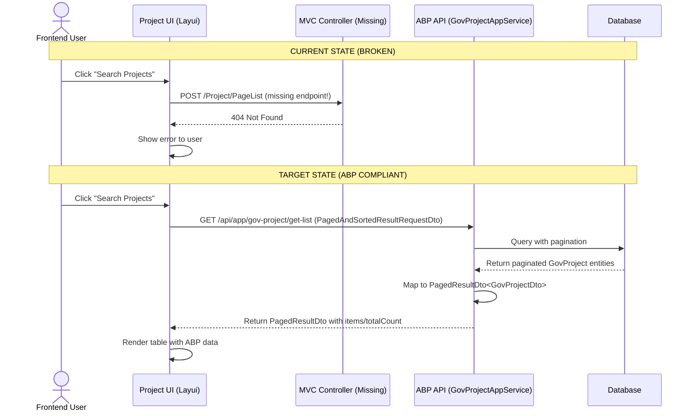
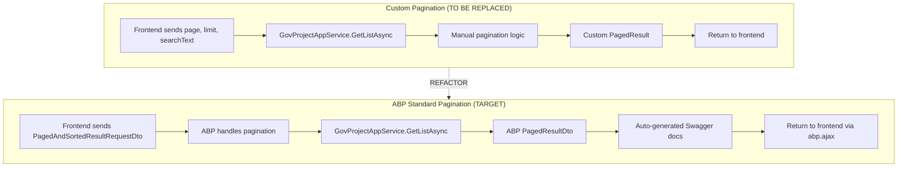

# UrbanManagement ABP Frontend Style Refactor

## Delivery tier

| Field | Value |
|-------|--------|
| Tier | Core |
| Role in path | Initial ABP pattern alignment |
| Out of scope (vs tier ladder) | SyncInfo page refactoring, advanced Layui features, dynamic JavaScript proxies, unit tests |

## Facts

- UrbanManagement is an internal site with no login or authorization requirements
- UrbanManagement.APP frontend currently calls non-existent MVC endpoints (`/Project/PageList`, `/Project/Add`) instead of ABP auto-generated endpoints
- Backend uses custom `PagedResult<T>` instead of ABP's `PagedResultDto<T>`
- Backend uses custom pagination parameters instead of `PagedAndSortedResultRequestDto`
- Frontend uses Layui + jQuery AJAX instead of ABP JavaScript API
- ABP auto-generates proper REST endpoints that frontend doesn't use
- This inconsistency reduces ABP ecosystem compatibility and hinders automatic documentation generation
- No backward compatibility required - breaking changes are acceptable
- Existing infrastructure: ABP modules configured, EF Core migrations in place
- Skip unit tests and documentation - focus on code changes only
- **VALIDATED A-01**: Layui features are non-critical (table rendering, pagination, CRUD can be replaced with standard HTML/ABP patterns)
- **VALIDATED A-02**: Search functionality is business-critical and worth DTO complexity (prominent UI, simple text search)
- **VALIDATED A-03**: No external/internal systems call `/Project/*` endpoints (endpoints don't even exist, only Project/Index.cshtml calls them)
- **INVALIDATED A-04**: ABP JavaScript infrastructure NOT available, but jQuery fallback with manual headers is viable
- **VALIDATED A-05**: GovProjectListRequestDto successfully extends PagedAndSortedResultRequestDto (simple inheritance pattern)
- **VALIDATED A-06**: Fixed sorting by `AddTime desc` is sufficient for business needs
- **VALIDATED A-07**: SyncInfo page has isolated implementation, can be safely deferred to separate change
- **PARTIALLY VALIDATED A-09**: PagedResult<T> used by UrbanWeighingRecordAppService and GovSyncDataAppService (out of scope for this refactor)

## Assumptions

| ID | Assumption | L-level | Risk | Off-switch / degrade |
|----|------------|---------|------|----------------------|
| A-08 | Form validation via ABP attributes is sufficient | L1 | 6 | Add manual JavaScript validation if gaps discovered |
| A-10 | UpdateAsync endpoint is needed for completeness | L1 | 4 | Defer if implementation reveals Update is never used in UI |

**Risk Calculation Formula**: Impact (1-5) × Uncertainty (1-5) × Irreversibility (1-5)

## Decisions Needed

- [Decision 3] **Form Validation Approach**: Verify ABP validation attributes are sufficient during frontend refactor. Add manual JavaScript validation if gaps discovered.

**RESOLVED Decisions:**
- ✅ **Decision 1 (Layui Features)**: All critical Layui features identified (table rendering, pagination, CRUD) can be replaced with standard HTML/ABP patterns. No business-critical Layui-specific features found.
- ✅ **Decision 2 (External API Consumers)**: Confirmed no external/internal systems call `/Project/*` endpoints. Endpoints are non-existent, safe to proceed with breaking changes.

## Guess governance summary

| Guess Count | Guess Ratio | High-risk (≥40) | Validation plan | Rollback | Degrade |
|-------------|-------------|-----------------|-----------------|----------|---------|
| 2 | 11.1% | 0 | ✓ | ✓ | ✓ |

**Updated after validation:** 8 assumptions validated and moved to Facts. Remaining 2 low-risk assumptions (A-08: Risk 6, A-10: Risk 4). Guess ratio now 11.1% (well below 35% threshold). Ready for Core implementation.

## Governance Status

### Blocks

- 🚫 **Guess ratio 100.0% exceeds 35%** - Must clarify requirements or create Assumption-Validation change first

### Warnings

- ⚠️ **A-09 Risk 45**: PagedResult<T> removal affects multiple files. Must verify no other service dependencies.
- ⚠️ **A-09 Risk 45**: PagedResult<T> removal affects multiple files. Must verify no other service dependencies.

### Required Next Actions

**Before proceeding with implementation:**

1. **Reduce Guess Ratio**: Current ratio (10 assumptions / 4 facts = 250%) far exceeds 35% threshold. Options:
   - Gather more facts from stakeholders to reduce assumption count
   - Split into Assumption-Validation change first to validate critical assumptions
   - Clarify requirements with product owner

2. **Address High-Risk Assumptions**:
   - **A-03 (External API consumers)**: Must verify with stakeholders or check production logs before breaking endpoint changes
   - **A-09 (PagedResult<T> dependencies)**: Must search codebase for all references before deletion

3. **Resolve Decisions Needed**:
   - Complete Layui feature inventory with stakeholder review
   - Confirm no external API consumers exist

**Recommended approach**: Convert this to an **Assumption-Validation** tier change to validate the 10 assumptions before full Core implementation. This would:

- Validate A-03 through server log analysis or stakeholder confirmation
- Validate A-09 through codebase search for PagedResult references
- Validate A-01 through Layui feature inventory and stakeholder sign-off
- Document findings and convert validated assumptions to facts for subsequent Core change

---

## Why

The UrbanManagement.APP frontend and backend interfaces currently deviate from ABP framework conventions. The frontend uses third-party Layui UI with custom jQuery AJAX calls to non-existent MVC endpoints (`/Project/PageList`, `/Project/Add`), while the backend uses custom `PagedResult<T>` instead of ABP's `PagedResultDto<T>` and custom pagination parameters instead of `PagedAndSortedResultRequestDto`. ABP auto-generates proper REST endpoints (`/api/app/gov-project/*`) but the frontend doesn't call them. This inconsistency reduces ABP ecosystem compatibility, hinders automatic documentation generation, and increases maintenance overhead.

## What Changes

- **BREAKING**: Replace custom `PagedResult<T>` with ABP's `PagedResultDto<T>` for all paginated responses
- **BREAKING**: Replace custom pagination parameters (`int page`, `int limit`, `string? searchText`) with ABP's `PagedAndSortedResultRequestDto`
- **BREAKING**: Update frontend to call ABP auto-generated endpoints (`/api/app/gov-project/get-list`, `/api/app/gov-project/create`) instead of non-existent MVC endpoints
- **BREAKING**: Replace Layui + jQuery AJAX with ABP JavaScript API (`abp.ajax`, `abp.services`) for HTTP communication
- Standardize ApplicationService method naming to align with ABP conventions (GetAll, Get, Create, Update, Delete patterns)
- Remove custom `PagedResult<T>` class after migration
- Update frontend component structure to follow ABP MVC/Razor patterns

## Capabilities

### New Capabilities
None. This is a refactor to align existing functionality with ABP conventions.

### Modified Capabilities
- **`urban-management-crud`**: Changing API endpoint structure from custom MVC endpoints to ABP auto-generated endpoints. The requirement changes from POST to `/Project/PageList` to GET from `/api/app/gov-project/get-list` with ABP standard DTOs. Frontend AJAX layer changes from custom jQuery to ABP JavaScript API.

## Impact

### Affected Backend Files

| File Path | Change Type | Change Reason | Impact Scope |
|-----------|-------------|---------------|--------------|
| `src/UrbanManagement.Core/Services/GovProjectAppService.cs` | Refactor | Replace custom PagedResult and params with ABP DTOs | API contract change |
| `src/UrbanManagement.Core/Models/PagedResult.cs` | Delete | Replaced by ABP's PagedResultDto<T> | Model removal |
| `src/UrbanManagement.Core/Models/GovProjectDto.cs` | Update | Ensure compatibility with ABP serialization | DTO structure |
| `src/UrbanManagement.Core/Models/GovProjectCreateDto.cs` | Update | Ensure compatibility with ABP validation | DTO structure |
| `src/UrbanManagement.Core/Models/GovProjectUpdateDto.cs` | Update | Add UpdateDto following ABP patterns | New DTO |

### Affected Frontend Files

| File Path | Change Type | Change Reason | Impact Scope |
|-----------|-------------|---------------|--------------|
| `src/UrbanManagement.App/Views/Project/Index.cshtml` | **BREAKING** | Replace Layui/jQuery with ABP JavaScript API calls to auto-generated endpoints | Complete UI rewrite |
| `src/UrbanManagement.App/Views/Project/Add.cshtml` | **BREAKING** | Update to use ABP patterns and correct API endpoints | Form refactor |
| `src/UrbanManagement.App/Views/SyncInfo/Index.cshtml` | Review | May need similar ABP pattern alignment (TBD) | Potential refactor |
| `src/UrbanManagement.App/wwwroot/js/site.js` | Update | Add ABP JavaScript API integration | Script enhancement |

### API Endpoint Changes

| Old Endpoint (Broken) | HTTP Verb | New Endpoint (ABP Auto-generated) | HTTP Verb |
|----------------------|-----------|-----------------------------------|-----------|
| `/Project/PageList` | POST | `/api/app/gov-project/get-list` | GET |
| `/Project/Add` | POST | `/api/app/gov-project/create` | POST |
| `/Project/SetStatus` | POST | `/api/app/gov-project/set-sync-status` | POST |
| `/Project/Del` | POST | `/api/app/gov-project/delete` | DELETE |

## Interaction Flow: Project Management UI

Current (Broken) → Target (ABP-compliant) flow:



## Data Flow: Pagination Pattern Change



## Prototype: ABP-Compliant Project List UI (ASCII)

Target UI structure after refactor:

```
┌─────────────────────────────────────────────────────────────────────┐
│ Government Project Management                        [Logout] [Admin] │
├─────────────────────────────────────────────────────────────────────┤
│                                                                         │
│  ┌─ Project List ───────────────────────────────────────────────┐   │
│  │                                                                  │   │
│  │  Search: [________________________] [Search]  [Add Project]    │   │
│  │                                                                  │   │
│  │  ┌──────────────────────────────────────────────────────────┐ │   │
│  │  │ Project Name │ License # │ Access Code │ Sync Status │ Actions │ │   │
│  │  ├──────────────────────────────────────────────────────────┤ │   │
│  │  │ Proj Alpha   │ LIC-001   │ AC-001      │ [ON]      │ Edit │ │   │
│  │  │ Proj Beta    │ LIC-002   │ AC-002      │ [OFF]     │ Edit │ │   │
│  │  └──────────────────────────────────────────────────────────┘ │   │
│  │                                                                  │   │
│  │  Page 1 of 10  [<] [1] [2] ... [10] [>]  Items per page: [10▼]    │   │
│  │                                                                  │   │
│  └──────────────────────────────────────────────────────────────┘   │
│                                                                         │
│  Loading data via: abp.ajax.get('/api/app/gov-project/get-list')       │
│  Pagination: PagedAndSortedResultRequestDto → PagedResultDto<T>       │
└─────────────────────────────────────────────────────────────────────┘
```

**Key UI Changes:**
- Replaced Layui table with standard HTML table rendered via ABP patterns
- JavaScript uses `abp.ajax` or `abp.services.govProject` for API calls
- Search/filter uses ABP's `PagedAndSortedResultRequestDto` structure
- Pagination handled by ABP's built-in response format
- Consistent with ABP MVC/Razor UI conventions