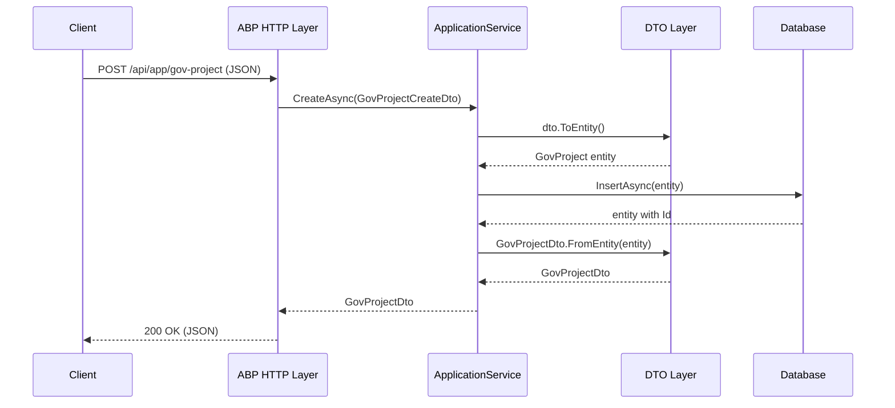
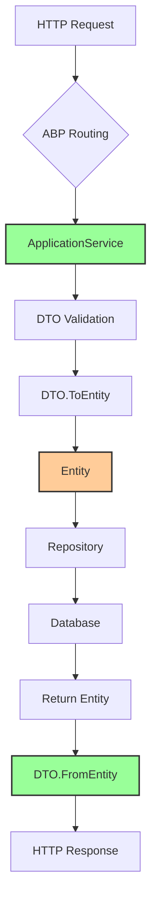

## Context

UrbanManagement 项目当前使用传统的 ASP.NET Core MVC 架构，通过 Controller 层暴露 API。项目使用 ABP 框架 v10.0.1，但未充分利用 ABP 的 ApplicationService 自动路由特性。当前架构存在以下问题：

1. **Controller 层冗余**：所有 API 端点都通过显式定义的 Controller 实现，增加了代码维护负担
2. **实体直接暴露**：多个 Controller 直接返回实体对象，缺乏 DTO 封装，存在数据泄露风险
3. **映射方法缺失**：现有 DTO 缺乏实体转换方法，导致映射逻辑分散在 Controller 中
4. **模式不一致**：部分业务逻辑在 Controller，部分在 AppService，缺乏统一模式

ABP 框架提供了 `ApplicationService` 基类和 `IApplicationService` 接口，可以自动为 ApplicationService 方法生成 HTTP 端点，无需显式定义 Controller。这是 ABP 推荐的 API 开发模式。

## Goals / Non-Goals

**Goals:**
- 移除所有显式定义的 Controller，采用 ABP ApplicationService 自动路由
- 为所有 API 端点创建对应的 DTO 类，消除实体直接暴露
- 在 DTO 中实现 `FromEntity` 和 `ToEntity` 映射方法，标准化实体转换逻辑
- 将所有业务逻辑迁移到继承自 `ApplicationService` 的 AppService 类中
- 在 `AGENTS.md` 中固化 ABP 开发约束，确保后续开发一致性

**Non-Goals:**
- 不修改业务逻辑或数据模型
- 不考虑向后兼容性（URL 约定变更属于预期范围）
- 不编写单元测试或文档
- 不涉及 AutoMapper（项目中未使用）

## Decisions

### 1. ApplicationService 继承层次

**Decision**: 所有 AppService 继承自 `ApplicationService` 而非仅实现 `ITransientDependency`

**Rationale**:
- `ApplicationService` 提供了 ABP 自动路由的基础设施
- 继承 `ApplicationService` 的类会自动注册为 HTTP 端点，无需配置路由
- ABP 会根据方法签名自动生成 Swagger 文档和 API 约定

**Alternatives Considered**:
- 保持仅实现 `ITransientDependency`：需要手动配置路由，失去了 ABP 自动化的优势
- 使用 `AbpServiceBase`：这是旧版基类，功能不如 `ApplicationService` 完善

### 2. DTO 命名和位置约定

**Decision**: DTO 类放在 `UrbanManagement.Core.Models` 命名空间，使用 `*Dto` 或 `*OutputDto` / `*InputDto` 命名

**Rationale**:
- DTO 属于领域层的一部分，定义了 API 的输入输出契约
- 放在 Core 层便于跨项目复用（如果未来需要分离 API 层）
- 输入输出分开命名可以提高代码可读性

**Alternatives Considered**:
- 放在 `UrbanManagement.App.Models`：DTO 属于 API 契约，放在应用层会造成领域层依赖应用层
- 使用 `*Request` / `*Response` 命名：不符合 C# 和 ABP 社区的惯例

### 3. DTO 映射方法设计

**Decision**: DTO 提供 `static <Dto> FromEntity(<Entity> entity)` 静态方法和可能的 `<Entity> ToEntity()` 实例方法

**Rationale**:
- 静态 `FromEntity` 方法无状态，线程安全，符合函数式编程原则
- `ToEntity` 方法通常用于创建新实体，放在 DTO 上更符合"工厂"模式
- 这种设计在 ABP 社区中有广泛使用，便于团队理解

**Alternatives Considered**:
- 使用扩展方法：需要额外的静态类，增加文件数量
- 使用 AutoMapper：增加项目依赖，映射逻辑分散在 Profile 配置中
- 在 AppService 中手动映射：导致映射逻辑重复，难以维护

### 4. 分页查询统一模式

**Decision**: 使用 `PagedResult<TDto>` 作为所有分页查询的返回类型

**Rationale**:
- 项目已有 `PagedResult<T>` 泛型类型，复用可减少代码
- 统一返回格式便于前端处理
- DTO 泛型确保实体不直接暴露

**Alternatives Considered**:
- 返回 `PagedResult<TEntity>`：违反 DTO 约束
- 自定义分页类型：增加复杂度，与现有模式不一致

### 5. API 端点约定

**Decision**: 遵循 ABP 默认约定，无需显式配置路由

**Rationale**:
- ABP 会根据 ApplicationService 类名和方法名自动生成路由
- 约定优于配置，减少手动配置的工作量
- 自动生成的 Swagger 文档准确反映 API 结构

**路由转换示例**:
- `ProjectController.Add` → `ProjectAppService.CreateAsync`
- `UrbanWeighingRecordController.GetPaged` → `UrbanWeighingRecordAppService.GetListAsync`

### 6. 保留 Legacy API 兼容性

**Decision**: `LegacyApiController` 处理旧版政府客户端同步请求时保留 Controller 形式，但内部调用 ApplicationService

**Rationale**:
- 旧版客户端使用固定的 API 端点，变更会导致兼容性问题
- 通过 Controller 包装 ApplicationService，既保持兼容性，又统一业务逻辑

**Implementation**: `LegacyApiController` 变为薄包装层，仅处理 HTTP 协议适配，业务逻辑委托给 `LegacyGovSyncAppService`

## Architecture Diagram

```
┌─────────────────────────────────────────────────────────────────────┐
│                         Current Architecture                         │
├─────────────────────────────────────────────────────────────────────┤
│                                                                      │
│  ┌──────────────────┐     ┌──────────────────┐                     │
│  │  Controllers      │────▶│  Services        │                     │
│  │  (AbpController)  │     │  (ITransientDep) │                     │
│  └────────┬─────────┘     └────────┬─────────┘                     │
│           │                        │                                │
│           ▼                        ▼                                │
│  ┌──────────────────┐     ┌──────────────────┐                     │
│  │  Direct Entity   │     │  DTOs (partial)  │                     │
│  │  Exposure        │     │  (no mapping)    │                     │
│  └──────────────────┘     └──────────────────┘                     │
│                                                                      │
└─────────────────────────────────────────────────────────────────────┘

┌─────────────────────────────────────────────────────────────────────┐
│                         Target Architecture                          │
├─────────────────────────────────────────────────────────────────────┤
│                                                                      │
│  ┌──────────────────┐     ┌──────────────────┐                     │
│  │  HTTP (Auto)     │────▶│  AppServices     │                     │
│  │  (ABP Routing)   │     │  (ApplicationSvc)│                     │
│  └──────────────────┘     └────────┬─────────┘                     │
│                                    │                                │
│                                    ▼                                │
│                           ┌──────────────────┐                      │
│                           │  DTOs            │                      │
│                           │  (FromEntity)    │                      │
│                           └────────┬─────────┘                      │
│                                    │                                │
│                                    ▼                                │
│                           ┌──────────────────┐                      │
│                           │  Entities        │                      │
│                           └──────────────────┘                      │
│                                                                      │
└─────────────────────────────────────────────────────────────────────┘
```

## Component Hierarchy

```
UrbanManagement.Core
├── Services/
│   ├── GovProjectAppService (ApplicationService)
│   │   ├── GetListAsync() → PagedResult<GovProjectDto>
│   │   ├── CreateAsync(GovProjectCreateDto) → GovProjectDto
│   │   ├── UpdateAsync(Guid id, GovProjectUpdateDto) → GovProjectDto
│   │   ├── DeleteAsync(Guid id)
│   │   └── SetSyncStatusAsync(Guid id, bool status)
│   ├── UrbanWeighingRecordAppService (ApplicationService)
│   │   ├── GetListAsync() → PagedResult<UrbanWeighingRecordOutputDto>
│   │   └── ReceiveAsync(UrbanWeighingRecordDto) → long
│   ├── GovSyncDataAppService (ApplicationService)
│   │   ├── GetListAsync() → PagedResult<GovSyncDataDto>
│   │   └── GetLogsAsync(int syncId) → List<GovLogDto>
│   └── LegacyGovSyncAppService (ApplicationService)
│       └── ProcessLegacyRequestAsync(...) → LegacyGovSyncResult
└── Models/
    ├── GovProjectDto (+ FromEntity)
    ├── GovProjectCreateDto (+ ToEntity)
    ├── GovProjectUpdateDto
    ├── UrbanWeighingRecordOutputDto (+ FromEntity)
    ├── UrbanWeighingRecordDto (+ ToEntity)
    ├── GovSyncDataDto (+ FromEntity)
    └── GovLogDto (+ FromEntity)
```

## API Sequence Diagram



## Data Flow Diagram



## Risks / Trade-offs

| Risk | Impact | Mitigation |
|------|--------|------------|
| API 端点 URL 变更导致前端调用失败 | 高 | 前端团队需要更新 API 调用地址；可以考虑临时保留旧路由（如使用 `[Route]` 特性） |
| DTO 映射方法实现遗漏导致运行时错误 | 中 | 建立 Code Review 流程，确保每个 DTO 都实现了必要的映射方法 |
| ApplicationService 方法签名变更导致 API 变更 | 中 | 遵循 ABP 约定使用 `Async` 后缀，保持命名一致性 |
| Legacy API 兼容性处理增加复杂度 | 低 | 将 Legacy 视为特殊情况，其他 API 严格遵循新模式 |

## Migration Plan

1. **Phase 1: 创建 DTO 基础设施**
   - 为所有实体创建对应的 DTO 类
   - 实现 `FromEntity` 和 `ToEntity` 方法
   - 验证映射方法正确性（手动测试）

2. **Phase 2: 重构现有 AppService**
   - 将 `UrbanWeighingRecordAppService` 改为继承 `ApplicationService`
   - 修改方法返回类型为 DTO
   - 将 `LegacyGovSyncAppService` 改为继承 `ApplicationService`

3. **Phase 3: 创建新 AppService**
   - 创建 `GovProjectAppService` 替代 `ProjectController`
   - 创建 `GovSyncDataAppService` 替代 `SyncInfoController`
   - 实现 CRUD 方法

4. **Phase 4: 移除 Controller**
   - 删除所有 Controller 文件
   - 保留 `LegacyApiController` 作为薄包装层（如需要）
   - 验证 API 路由正确性

5. **Phase 5: 更新开发约束**
   - 在 `AGENTS.md` 中添加 ABP 开发约束章节
   - 记录 DTO 命名和映射方法约定

6. **Phase 6: 集成测试**
   - 使用 Swagger UI 验证所有 API 端点
   - 测试 CRUD 操作完整性
   - 验证分页查询功能

## Open Questions

- **Q1**: 是否需要保留旧的 API 端点以兼容现有前端？
  - **A1**: 本次不考虑向后兼容性，前端需要同步更新。如需兼容，可在后续迭代中添加适配层。

- **Q2**: `LegacyApiController` 是否也需要迁移到 ApplicationService？
  - **A2**: 是的，但可以保留 Controller 形式作为薄包装层，内部调用 ApplicationService，以保持对旧版客户端的兼容性。

- **Q3**: DTO 验证规则（如 `[Required]`）应该放在哪里？
  - **A3**: 验证规则放在 DTO 属性上，使用 DataAnnotations 或 FluentValidation，ABP 会自动验证。

## Dependencies

本文档基于 `proposal.md` 中的需求定义。详细的业务逻辑和 API 规范将在对应的 `specs/**/*.md` 文件中定义。
