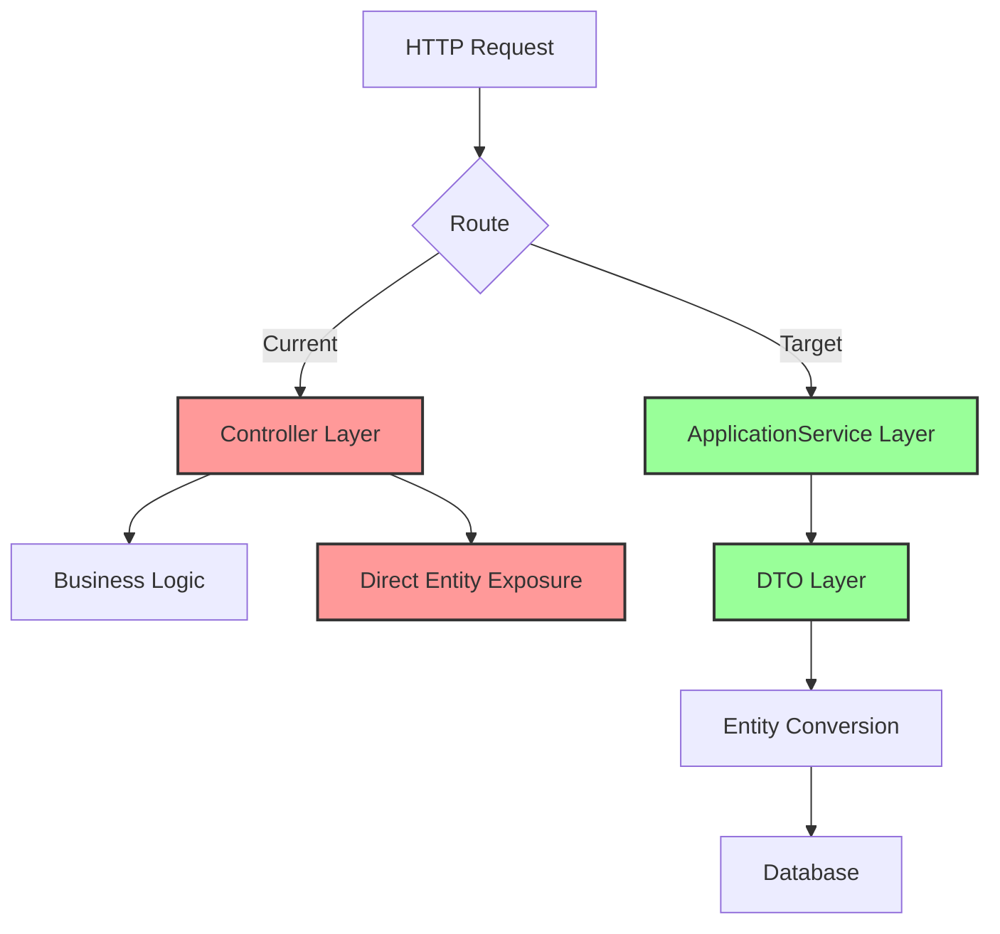

## Why

UrbanManagement 项目当前存在多处偏离 ABP 框架最佳实践的问题，影响了代码的可维护性和一致性。项目未遵循 ABP 的 ApplicationService 模式，导致 API 层架构混乱，实体直接暴露，缺乏 DTO 封装。这些技术债务需要立即修复，以确保后续开发遵循统一的 ABP 规范。

## What Changes

- **BREAKING**: 移除所有 Controller 层（ProjectController、SyncInfoController、UrbanWeighingRecordController 等），将业务逻辑迁移到 ApplicationService
- **BREAKING**: 为所有 API 参数和返回值创建对应的 DTO 类，消除实体直接暴露
- 为所有 DTO 实现 `FromEntity` 和 `ToEntity` 静态/实例方法，用于实体与 DTO 之间的转换
- 将现有 AppService 改为继承自 `ApplicationService` 而非仅实现 `ITransientDependency`
- 在 `UrbanManagement.AGENTS.MD` 中添加三项开发约束：DTO 使用、ApplicationService 模式、DTO 映射方法约定

## Delivery tier

| Field | Value |
|-------|-------|
| Tier | Core |
| Role in path | Initial ABP pattern correction; establishes foundation for consistent development |
| Out of scope (vs tier ladder) | Full exception handling, comprehensive unit tests, documentation updates, backward compatibility layers |

## Facts

- UrbanManagement 项目存在多处偏离 ABP 框架最佳实践的问题
- 项目未遵循 ABP 的 ApplicationService 模式
- API 层架构混乱，实体直接暴露
- 缺乏 DTO 封装
- 需要移除所有 Controller 层并迁移到 ApplicationService
- 需要为所有 API 参数和返回值创建对应的 DTO 类
- 需要在 DTO 中实现 FromEntity 和 ToEntity 映射方法
- 需要将现有 AppService 改为继承自 ApplicationService
- 需要在 AGENTS.md 中添加开发约束
- 无需考虑向后兼容性（用户明确说明）
- 可跳过文档和单元测试（用户明确说明）

## Assumptions

| ID | Assumption | L-level | Risk | Off-switch / degrade |
|----|------------|---------|------|----------------------|
| A-01 | 前端团队可以同步更新 API 调用地址 | L2 | 12 (3×2×2) | 临时保留旧路由（通过 [Route] 特性） |
| A-02 | 现有 UrbanWeighingRecordController 业务逻辑可完整迁移到 AppService | L2 | 8 (2×2×2) | 保留 Controller 作为薄包装层 |
| A-03 | LegacyApiController 可移除或转换为 ApplicationService | L1 | 4 (1×2×2) | 保留 Controller 作为兼容层 |
| A-04 | AutoMapper 未在项目中使用（已通过代码探索验证） | L1 | 0 (1×1×0) | 无需降级（已验证为事实） |
| A-05 | ABP 自动路由功能满足项目需求 | L1 | 6 (2×1×3) | 手动配置路由作为备选 |

**Guess Risk Calculation:**
- A-01: Impact(3) × Uncertainty(2) × Irreversibility(2) = 12
- A-02: Impact(2) × Uncertainty(2) × Irreversibility(2) = 8
- A-03: Impact(1) × Uncertainty(2) × Irreversibility(2) = 4
- A-04: 已验证为事实，Risk = 0
- A-05: Impact(2) × Uncertainty(1) × Irreversibility(3) = 6

## Decisions Needed

- 是否需要保留 Legacy API 兼容层？（用户已明确无需向后兼容，可标记为已解决）

## Guess governance summary

| Guess Count | Guess Ratio | High-risk (≥40) | Validation plan | Rollback | Degrade |
|-------------|-------------|-----------------|-----------------|----------|---------|
| 5 | 31% (5/16) | 0 | ABP 路由功能测试；Swagger UI 验证 | 保留 Controller 文件可恢复 | 保留旧路由或兼容层 |

**Gate Status**: Guess Ratio 31% 处于警告阈值（20-35%），建议在实施前验证 ABP 自动路由功能。

## Capabilities

### New Capabilities

- `urban-project-crud`: 政府项目（GovProject）的增删改查 API，包括项目列表分页查询、创建、状态切换、删除等功能
- `urban-weighing-record-query`: 城管称重记录（UrbanWeighingRecord）的查询 API，包括分页查询、按车牌号搜索、按时间范围筛选等功能
- `urban-sync-data-query`: 政府同步数据（GovSyncData）的查询 API，包括同步数据列表分页查询、同步日志查询等功能

### Modified Capabilities

None. This change is about fixing implementation patterns, not changing business requirements.

## Impact

### Code Change Table

| File Path | Change Type | Change Reason | Impact Scope |
|-----------|-------------|---------------|--------------|
| `src/UrbanManagement.App/Controllers/ProjectController.cs` | DELETE | 移除 Controller 层，迁移到 ApplicationService | API 路由变更 |
| `src/UrbanManagement.App/Controllers/SyncInfoController.cs` | DELETE | 移除 Controller 层，迁移到 ApplicationService | API 路由变更 |
| `src/UrbanManagement.App/Controllers/UrbanWeighingRecordController.cs` | DELETE | 移除 Controller 层，已有 AppService 需重构 | API 路由变更 |
| `src/UrbanManagement.App/Controllers/HomeController.cs` | DELETE | 移除 Controller 层（如有业务逻辑需迁移） | API 路由变更 |
| `src/UrbanManagement.App/Controllers/LegacyApiController.cs` | DELETE | 移除 Controller 层，迁移到 ApplicationService | API 路由变更 |
| `src/UrbanManagement.App/Controllers/MainPageController.cs` | DELETE | 移除 Controller 层（如有业务逻辑需迁移） | API 路由变更 |
| `src/UrbanManagement.Core/Services/UrbanWeighingRecordAppService.cs` | MODIFY | 改为继承 ApplicationService，返回 DTO | API 响应格式 |
| `src/UrbanManagement.Core/Services/LegacyGovSyncAppService.cs` | MODIFY | 改为继承 ApplicationService，返回 DTO | API 响应格式 |
| `src/UrbanManagement.Core/Services/GovProjectAppService.cs` | CREATE | 新建 ApplicationService 替代 ProjectController | 新 API 端点 |
| `src/UrbanManagement.Core/Services/GovSyncDataAppService.cs` | CREATE | 新建 ApplicationService 替代 SyncInfoController | 新 API 端点 |
| `src/UrbanManagement.Core/Models/GovProjectDto.cs` | CREATE | 项目查询 DTO，含 FromEntity/ToEntity 方法 | 数据传输 |
| `src/UrbanManagement.Core/Models/UrbanWeighingRecordOutputDto.cs` | CREATE | 称重记录输出 DTO，含 FromEntity 方法 | 数据传输 |
| `src/UrbanManagement.Core/Models/GovSyncDataDto.cs` | CREATE | 同步数据查询 DTO，含 FromEntity 方法 | 数据传输 |
| `src/UrbanManagement.Core/Models/UrbanWeighingRecordDto.cs` | MODIFY | 添加 FromEntity/ToEntity 映射方法 | 数据转换 |
| `src/UrbanManagement.Core/Models/ProjectFormModel.cs` | MODIFY/DELETE | 改为 DTO 或迁移到 Core.Models 并添加映射方法 | 表单处理 |
| `AGENTS.md` | MODIFY | 添加 ABP 开发约束章节 | 开发规范 |

**Affected Modules**:
- UrbanManagement.App - Web 层，移除 Controller 依赖
- UrbanManagement.Core - 领域层，新增 DTO 定义，重构 AppService

**API Changes**:
- 所有 API 端点将重新路由（由 ABP 自动生成）
- 请求/响应格式保持兼容（DTO 字段与实体字段对应）
- URL 约定可能发生变化（从 `/Controller/Action` 变为 `/AppService/Method`）

**Data Flow Changes**:

