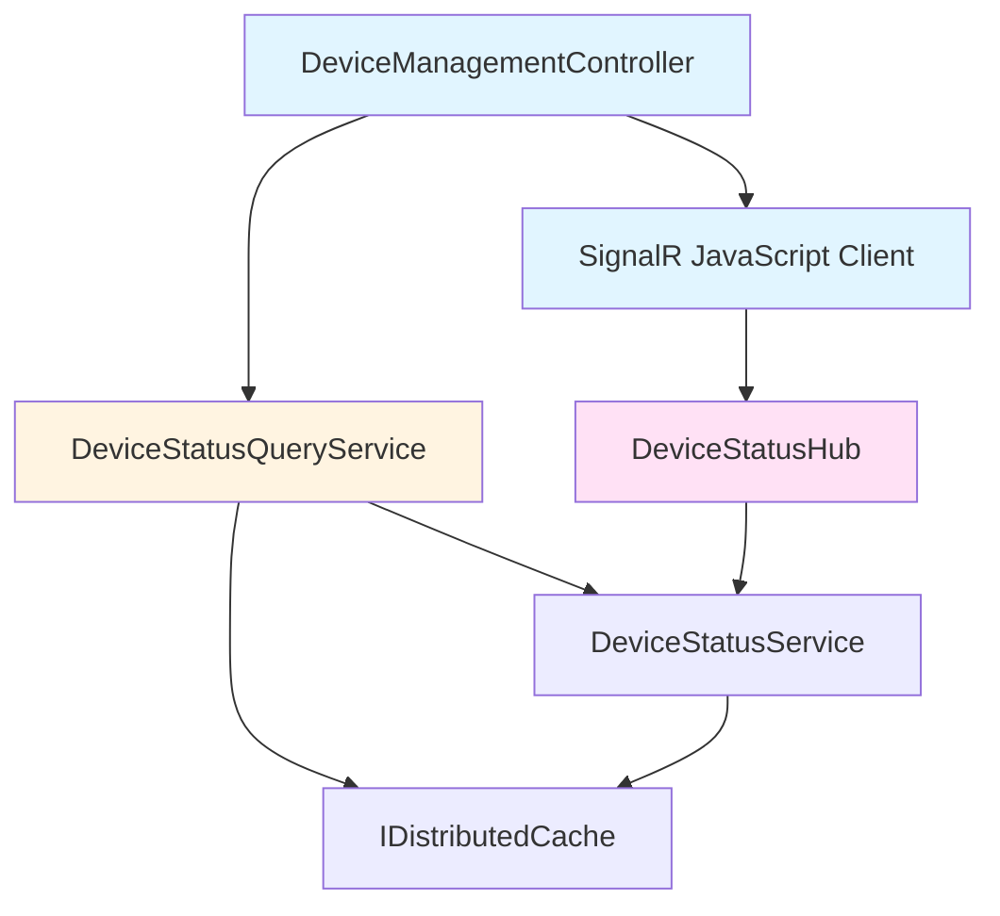
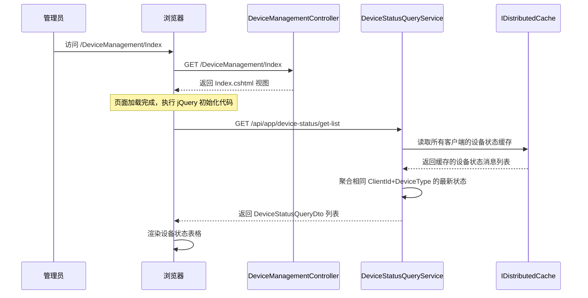
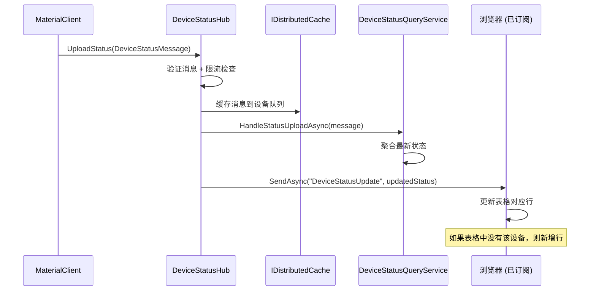
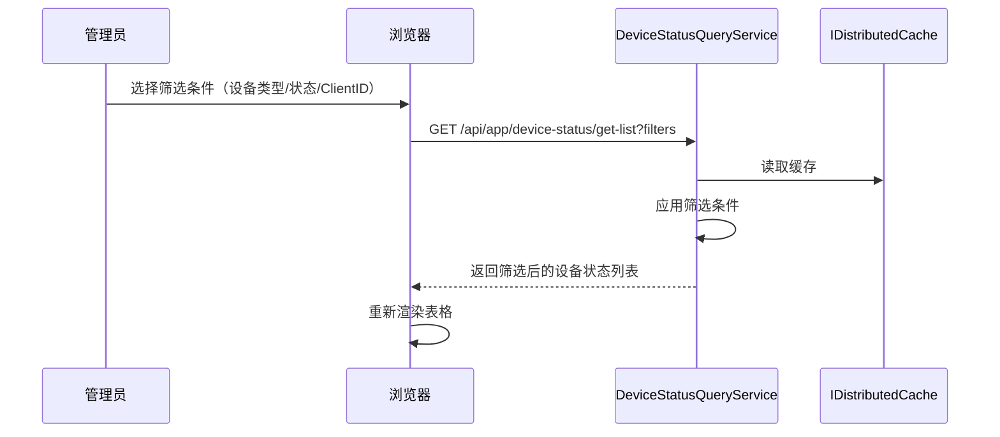

# Design: Device Management Page

## Relationship to Proposal (Guess Governance)

本设计文档基于 proposal.md 中定义的 **Facts**、**Assumptions** 和 **Decisions Needed**，将需求转化为技术实现方案。

### Design Decision Sources

| Design Decision | Source Type | Source ID | Rationale |
|----------------|-------------|-----------|-----------|
| 数据源选择 - 分布式缓存 | Fact | F-03 | 利用现有 DeviceStatusHub 基础设施 |
| 实时通信 - SignalR | Fact | F-03 | 复用现有 Hub，无需新增 |
| 设备类型 - 5 种固定类型 | Assumption | A-01 | 当前假设，需在后续变更中验证 |
| 分页大小 - 50 条/页 | Assumption | A-02 | 当前假设，可通过配置调整 |
| UI 组件库 - Bootstrap 5.3.3 | Assumption | A-03 | 与现有 Project 页面一致 |

### Decisions Needed Impact

以下来自 proposal.md 的 **Decisions Needed** 影响本设计的范围：

| Decision Needed | Current Design Stance | Future Impact |
|-----------------|----------------------|---------------|
| D-01 - 历史记录查询 | 不实现，数据源仅用缓存 | 如确认需要，需激活 DeviceStatusLog 实体 |
| D-02 - 告警通知 | 不实现，无通知系统集成 | 如确认需要，需集成 ABP Notification 系统 |
| D-03 - 多租户隔离 | 不实现，所有租户共享视图 | 如确认需要，需在查询中增加租户过滤 |
| D-04 - SignalR 降级策略 | 实现自动重连 + 降级为轮询 | 本设计已包含降级方案 |
| D-05 - 设备类型扩展 | 硬编码 5 种设备类型 | 如需扩展，改为配置化管理 |

### Assumption Validation Plan

本设计包含以下需要验证的假设（来自 proposal.md）：

| ID | Assumption | Design Implementation | Validation Method |
|----|-------------|----------------------|-------------------|
| A-06 | SignalR Push 模式 | DeviceStatusHub 订阅机制 | 性能测试：P95 延迟 < 1s |
| A-07 | 缓存非持久化 | IDistributedCache 查询逻辑 | 数据可靠性评估：重启后可恢复 |

### Risk Mitigation

针对 proposal.md 中识别的风险，本设计采取以下缓解措施：

| Risk | Mitigation in Design |
|------|---------------------|
| SignalR 连接不稳定 | 内置降级为 30 秒轮询（Level 2 → Level 1） |
| 缓存数据丢失 | MaterialClient 重连后自动恢复状态 |
| 大量设备性能问题 | 服务端分页 + 前端虚拟滚动（未来优化） |

---

## Context

### Current State

UrbanManagement 项目已具备完善的设备状态接收和处理基础设施：

- **DeviceStatusHub**: SignalR Hub 端点，接收来自 MaterialClient 桌面客户端的设备状态上传
- **DeviceStatusService**: 处理设备状态消息，提供消息缓存和广播功能
- **DeviceStatusLog**: 设备状态日志实体（已定义但未激活持久化）
- **DeviceStatusMessage**: 设备状态消息 record 类型，包含 ClientId、DeviceType、Status、Timestamp、AdditionalData

现有设备状态流程：
```
MaterialClient (Desktop)
    ↓ SignalR UploadStatus
DeviceStatusHub (rate limiting)
    ↓ HandleStatusUploadAsync
DeviceStatusService (cache + broadcast)
    ↓ BroadcastToSubscribersAsync
Subscribers (SignalR groups)
```

### Constraints

- **仅查询功能**：任务明确要求"仅需要查询项目的设备状态即可"，不涉及设备管理操作
- **前端技术栈**：必须使用现有的 jQuery + Bootstrap + Razor Pages 架构
- **后端技术栈**：必须遵循 ABP ApplicationService + AutoConstructor + DTO mapping 模式
- **UI 一致性**：参考 MaterialClient 的 DeviceStatusBar 设计模式，保持界面风格一致
- **无破坏性变更**：不得修改现有设备状态上传和处理流程

### Stakeholders

- **系统管理员**：主要用户，需要实时监控设备状态
- **运维人员**：需要快速发现设备故障
- **开发团队**：需要维护和扩展设备监控功能

## Goals / Non-Goals

### Goals

- **设备状态可视化**：提供 Web 页面展示当前所有设备的在线状态
- **实时状态更新**：通过 SignalR 实时推送设备状态变化
- **灵活筛选查询**：支持按客户端ID、设备类型、在线状态筛选
- **UI 风格一致**：与现有 Project 页面保持 UI/UX 一致性
- **可扩展架构**：为未来的设备管理功能（如历史记录、告警）预留扩展点

### Non-Goals

- **设备控制操作**：不提供设备启动/停止/配置等控制功能
- **设备增删改**：不提供设备的添加、编辑、删除管理功能（由 MaterialClient 负责）
- **历史数据分析**：初期不提供设备状态历史趋势分析（可选未来扩展）
- **告警通知**：初期不提供设备离线告警功能（可选未来扩展）
- **多租户隔离**：初期不实现多租户设备隔离（当前所有租户共享设备状态视图）

## Decisions

### Decision 1: 数据源选择 - 分布式缓存 vs 数据库持久化

**选择**：使用分布式缓存（IDistributedCache）作为主数据源

**理由**：
- ✅ **实时性**：缓存中的设备状态是最新状态，无需查询数据库
- ✅ **性能**：缓存读取速度快，适合高频查询
- ✅ **架构简单**：DeviceStatusService 已实现缓存逻辑，直接复用
- ✅ **低延迟**：无需等待数据库写入和查询

**替代方案**：使用数据库持久化（DeviceStatusLog 实体）
- ❌ 需要激活实体并运行 EF 迁移
- ❌ 数据库写入有延迟，无法保证实时性
- ❌ 增加存储开销

**未来扩展**：如果需要历史记录查询，可激活 DeviceStatusLog 实体并启用持久化。

### Decision 2: 实时通信方案 - SignalR vs 轮询

**选择**：使用现有的 SignalR DeviceStatusHub

**理由**：
- ✅ **基础设施就绪**：DeviceStatusHub 已实现，无需新增 Hub
- ✅ **低延迟**：推送模式比轮询延迟更低
- ✅ **减少服务器负载**：避免频繁轮询请求
- ✅ **实时性**：设备状态变化立即推送到页面

**替代方案**：使用定时轮询（setInterval + AJAX）
- ❌ 延迟较高（轮询间隔通常 5-10 秒）
- ❌ 增加服务器负载
- ❌ 不适合高频查询场景

### Decision 3: 服务层设计 - 扩展现有服务 vs 新建查询服务

**选择**：新建 IDeviceStatusQueryService 专用于查询操作

**理由**：
- ✅ **职责分离**：DeviceStatusService 负责写入和广播，DeviceStatusQueryService 负责查询
- ✅ **接口隔离**：查询接口和写入接口分离，符合 ISP 原则
- ✅ **易于测试**：查询服务可独立测试
- ✅ **扩展性**：未来可独立扩展查询功能（如历史查询、聚合统计）

**替代方案**：扩展现有 DeviceStatusService
- ❌ 违反单一职责原则
- ❌ 查询和写入逻辑耦合

### Decision 4: 前端架构 - Razor Pages + jQuery vs SPA (React/Vue)

**选择**：使用现有的 Razor Pages + jQuery 架构

**理由**：
- ✅ **与现有页面一致**：Project 页面使用相同架构，维护成本低
- ✅ **团队熟悉度高**：团队已有 jQuery + Bootstrap 开发经验
- ✅ **无需额外构建**：无需配置 Webpack/Vite 等构建工具
- ✅ **SEO 友好**：服务端渲染，搜索引擎友好

**替代方案**：使用 SPA 框架（React/Vue）
- ❌ 需要额外构建配置
- ❌ 与现有页面架构不一致
- ❌ 增加学习成本

### Decision 5: 设备类型管理 - 硬编码 vs 配置化

**选择**：初期使用硬编码设备类型列表

**理由**：
- ✅ **简单直接**：当前设备类型固定（Scale, Camera, LPR, Sound, Printer）
- ✅ **类型安全**：编译期验证，避免配置错误
- ✅ **性能**：无需读取配置文件

**替代方案**：使用配置文件或数据库管理设备类型
- ❌ 初期过度设计
- ❌ 增加复杂度

**未来扩展**：如果设备类型需要动态扩展，可改为配置化管理。

## Architecture

### Component Architecture

```
UrbanManagement.App (Presentation Layer)
├── Controllers/
│   └── DeviceManagementController.cs
│       ├── Index() -> View device status list page
│       └── GetDeviceStatusDetails() -> Get single device status (optional)
├── Views/
│   ├── DeviceManagement/
│   │   ├── Index.cshtml (main monitor page)
│   │   └── _DeviceStatusTable.cshtml (partial view for table)
│   └── Shared/
│       └── _Layout.cshtml (add navigation menu item)

UrbanManagement.Core (Business Layer)
├── Services/
│   ├── IDeviceStatusQueryService.cs (query interface)
│   └── DeviceStatusQueryService.cs
│       ├── GetDeviceStatusListAsync() -> Query device status with filters
│       ├── GetLatestDeviceStatusAsync() -> Get latest status by client/device
│       └── GetCachedDeviceStatusAsync() -> Read from distributed cache
├── Models/
│   ├── DeviceStatusListRequestDto.cs (query request)
│   ├── DeviceStatusQueryDto.cs (query result)
│   └── DeviceStatusDetailDto.cs (optional detail view)
└── Hubs/
    └── DeviceStatusHub.cs (existing - no changes)

Infrastructure Layer
├── DeviceStatusService.cs (existing - handles write/broadcast)
└── IDistributedCache (existing - message queue)
```

### Module Dependencies



## Data Flow

### Query Flow (Initial Page Load)



### Real-time Update Flow (SignalR)



### Filter Query Flow



## API Design

### Device Status Query API

**Endpoint**: `GET /api/app/device-status/get-list`

**Request Parameters**:
```csharp
public class DeviceStatusListRequestDto
{
    public string? ClientId { get; init; }       // 筛选：客户端ID
    public string? DeviceType { get; init; }      // 筛选：设备类型 (Scale, Camera, LPR, Sound, Printer)
    public string? Status { get; init; }          // 筛选：状态 (Online, Offline, Busy)
    public int SkipCount { get; init; } = 0;      // 分页：跳过记录数
    public int MaxResultCount { get; init; } = 50; // 分页：最大返回数
}
```

**Response**:
```csharp
public class DeviceStatusQueryDto
{
    public string ClientId { get; init; }          // 客户端ID
    public string DeviceType { get; init; }         // 设备类型
    public string Status { get; init; }            // 状态 (Online/Offline/Busy)
    public DateTime LastUpdateTime { get; init; }  // 最后更新时间
    public string? AdditionalData { get; init; }    // 附加信息（可选）
}

public class PagedResultDto_DeviceStatusQueryDto
{
    public List<DeviceStatusQueryDto> Items { get; init; }  // 设备状态列表
    public long TotalCount { get; init; }                    // 总记录数
}
```

### SignalR Events

**Subscribe to Updates**:
```javascript
// 客户端代码
const connection = new signalR.HubConnectionBuilder()
    .withUrl("/hubs/devicestatus")
    .build();

// 订阅设备类型更新
connection.invoke("SubscribeDeviceUpdates", "Scale");
connection.invoke("SubscribeDeviceUpdates", "Camera");

// 接收实时更新
connection.on("DeviceStatusUpdate", (message) => {
    updateDeviceStatusRow(message);
});
```

**Event Message Format**:
```csharp
public record DeviceStatusMessage
{
    public string ClientId { get; init; }        // 客户端ID
    public string DeviceType { get; init; }       // 设备类型
    public string Status { get; init; }           // 状态
    public DateTime Timestamp { get; init; }      // 时间戳
    public string? AdditionalData { get; init; }  // 附加信息
}
```

## Implementation Details

### Backend Implementation

#### 1. DeviceStatusQueryService

```csharp
public interface IDeviceStatusQueryService : IApplicationService
{
    Task<PagedResultDto<DeviceStatusQueryDto>> GetDeviceStatusListAsync(DeviceStatusListRequestDto input);
}

[AutoConstructor]
public partial class DeviceStatusQueryService : ApplicationService, IDeviceStatusQueryService
{
    private readonly IDistributedCache _distributedCache;
    private readonly ILogger<DeviceStatusQueryService> _logger;

    public async Task<PagedResultDto<DeviceStatusQueryDto>> GetDeviceStatusListAsync(DeviceStatusListRequestDto input)
    {
        // 从缓存读取所有客户端的设备状态
        var allDeviceStatuses = await GetAllDeviceStatusFromCacheAsync();

        // 应用筛选条件
        var query = allDeviceStatuses.AsQueryable();

        if (!string.IsNullOrWhiteSpace(input.ClientId))
            query = query.Where(d => d.ClientId.Contains(input.ClientId));

        if (!string.IsNullOrWhiteSpace(input.DeviceType))
            query = query.Where(d => d.DeviceType == input.DeviceType);

        if (!string.IsNullOrWhiteSpace(input.Status))
            query = query.Where(d => d.Status == input.Status);

        // 聚合相同 ClientId + DeviceType 的最新状态
        var latestStatuses = query
            .GroupBy(d => new { d.ClientId, d.DeviceType })
            .Select(g => g.OrderByDescending(d => d.Timestamp).First());

        // 分页
        var total = latestStatuses.Count();
        var items = latestStatuses
            .Skip(input.SkipCount)
            .Take(input.MaxResultCount)
            .ToList();

        return new PagedResultDto<DeviceStatusQueryDto>
        {
            Items = items.Select(DeviceStatusQueryDto.FromMessage).ToList(),
            TotalCount = total
        };
    }

    private async Task<List<DeviceStatusMessage>> GetAllDeviceStatusFromCacheAsync()
    {
        // 从分布式缓存读取所有客户端的设备状态队列
        // 实现细节：遍历所有缓存键，提取设备状态消息
        // ...
    }
}
```

#### 2. DeviceStatusQueryDto

```csharp
public class DeviceStatusQueryDto
{
    public string ClientId { get; set; } = string.Empty;
    public string DeviceType { get; set; } = string.Empty;
    public string Status { get; set; } = string.Empty;
    public DateTime LastUpdateTime { get; set; }
    public string? AdditionalData { get; set; }

    public static DeviceStatusQueryDto FromMessage(DeviceStatusMessage message)
    {
        return new DeviceStatusQueryDto
        {
            ClientId = message.ClientId,
            DeviceType = message.DeviceType,
            Status = message.Status,
            LastUpdateTime = message.Timestamp,
            AdditionalData = message.AdditionalData
        };
    }
}
```

### Frontend Implementation

#### 1. Index.cshtml (主页面)

```html
@{
    Layout = "_Layout";
    ViewData["Title"] = "设备管理";
}

<!-- 筛选区域 -->
<div class="card mb-3">
    <div class="card-body">
        <form id="filterForm" class="row g-3">
            <div class="col-md-3">
                <label for="deviceType" class="form-label">设备类型</label>
                <select class="form-select" id="deviceType">
                    <option value="">全部</option>
                    <option value="Scale">地磅 (Scale)</option>
                    <option value="Camera">摄像头 (Camera)</option>
                    <option value="LPR">车牌识别 (LPR)</option>
                    <option value="Sound">音响 (Sound)</option>
                    <option value="Printer">打印机 (Printer)</option>
                </select>
            </div>
            <div class="col-md-3">
                <label for="status" class="form-label">状态</label>
                <select class="form-select" id="status">
                    <option value="">全部</option>
                    <option value="Online">在线 (Online)</option>
                    <option value="Offline">离线 (Offline)</option>
                    <option value="Busy">忙碌 (Busy)</option>
                </select>
            </div>
            <div class="col-md-3">
                <label for="clientId" class="form-label">客户端ID</label>
                <input type="text" class="form-control" id="clientId" placeholder="输入客户端ID">
            </div>
            <div class="col-md-3">
                <label class="form-label">&nbsp;</label>
                <button type="submit" class="btn btn-primary w-100">
                    <i class="bi bi-search"></i> 搜索
                </button>
            </div>
        </form>
    </div>
</div>

<!-- 设备状态表格 -->
<div class="card">
    <div class="card-body">
        <!-- 实时状态指示 -->
        <div class="d-flex justify-content-between align-items-center mb-3">
            <h5 class="card-title mb-0">设备状态列表</h5>
            <div class="live-indicator">
                <span class="badge bg-success">● 实时更新</span>
                <small class="text-muted ml-2">最后心跳: <span id="lastHeartbeat">-</span></small>
            </div>
        </div>

        <!-- 表格 -->
        <div class="table-responsive">
            <table class="table table-hover" id="deviceStatusTable">
                <thead>
                    <tr>
                        <th>客户端ID</th>
                        <th>设备类型</th>
                        <th>状态</th>
                        <th>最后更新时间</th>
                        <th>附加信息</th>
                    </tr>
                </thead>
                <tbody id="deviceStatusTableBody">
                    <tr>
                        <td colspan="5" class="text-center">加载中...</td>
                    </tr>
                </tbody>
            </table>
        </div>

        <!-- 分页 -->
        <nav aria-label="设备状态分页">
            <ul class="pagination justify-content-center" id="pagination"></ul>
        </nav>
    </div>
</div>

@section Scripts {
    <script src="https://cdn.jsdelivr.net/npm/@microsoft/signalr@latest/dist/browser/signalr.min.js"></script>
    <script>
        // SignalR 连接和实时更新逻辑
        // jQuery AJAX 查询逻辑
        // 分页逻辑
    </script>
}
```

#### 2. SignalR 集成

```javascript
// 建立 SignalR 连接
const connection = new signalR.HubConnectionBuilder()
    .withUrl("/hubs/devicestatus")
    .withAutomaticReconnect()
    .configureLogging(signalR.LogLevel.Information)
    .build();

// 订阅所有设备类型更新
const deviceTypes = ["Scale", "Camera", "LPR", "Sound", "Printer"];
deviceTypes.forEach(type => {
    connection.invoke("SubscribeDeviceUpdates", type).catch(err => {
        console.error(`订阅设备类型 ${type} 失败:`, err);
    });
});

// 接收实时更新
connection.on("DeviceStatusUpdate", (message) => {
    updateDeviceStatusRow(message);
    updateLastHeartbeat(message.timestamp);
});

// 启动连接
connection.start().then(() => {
    console.log("SignalR 连接成功");
    loadDeviceStatusList(); // 加载初始数据
}).catch(err => {
    console.error("SignalR 连接失败:", err);
});

// 更新表格行
function updateDeviceStatusRow(message) {
    const rowId = `device-${message.clientId}-${message.deviceType}`;
    let row = $(`#${rowId}`);

    if (row.length === 0) {
        // 新增行
        row = createDeviceStatusRow(message);
        $("#deviceStatusTableBody").append(row);
    } else {
        // 更新现有行
        updateRowData(row, message);
    }
}

// 创建设备状态行
function createDeviceStatusRow(message) {
    const statusBadge = getStatusBadge(message.status);
    return $(`
        <tr id="device-${message.clientId}-${message.deviceType}">
            <td>${message.clientId}</td>
            <td>${getDeviceTypeLabel(message.deviceType)}</td>
            <td>${statusBadge}</td>
            <td>${formatDateTime(message.timestamp)}</td>
            <td>${message.additionalData || '-'}</td>
        </tr>
    `);
}
```

## Risks / Trade-offs

### Risk 1: 缓存数据一致性

**风险**：分布式缓存中的设备状态可能与实际状态不同步

**缓解措施**：
- DeviceStatusService 已实现消息缓存，确保最新状态优先
- 设置缓存过期时间为 24 小时，自动清理过期数据
- 缓存仅用于查询，不影响设备状态上传流程

### Risk 2: SignalR 连接稳定性

**风险**：SignalR 连接可能因网络问题中断，导致实时更新失效

**缓解措施**：
- 使用 `.withAutomaticReconnect()` 启用自动重连
- 实现降级方案：连接断开时，降级为定时轮询（每 30 秒）
- 显示连接状态指示器，让用户了解实时更新是否可用

### Risk 3: 性能影响（大量设备）

**风险**：当设备数量很大时（如 1000+ 设备），页面渲染和更新可能变慢

**缓解措施**：
- 实现服务端分页，限制单次查询返回 50 条记录
- 使用虚拟滚动（未来优化）
- 优化 DOM 更新，只更新变化的数据行

### Risk 4: 浏览器兼容性

**风险**：SignalR JavaScript 客户端可能不支持旧版浏览器

**缓解措施**：
- 项目已使用现代技术栈（Bootstrap 5.3），假设用户使用现代浏览器
- 提供 Polyfill（如需要）

### Trade-off: 功能范围 vs 实施时间

**权衡**：初期仅实现基础查询功能，暂不实现历史记录和告警

**理由**：
- 快速上线核心功能，满足当前需求
- 为未来扩展预留接口和架构
- 避免过度设计

## Migration Plan

### 部署步骤

1. **后端部署**：
   ```bash
   # 1. 编译 UrbanManagement 项目
   dotnet build

   # 2. 发布到服务器
   dotnet publish -c Release

   # 3. 重启应用服务
   systemctl restart urbanmanagement
   ```

2. **前端部署**：
   - 部署新的 Razor 视图文件（`Views/DeviceManagement/Index.cshtml`）
   - 更新 `_Layout.cshtml` 添加导航菜单项

3. **验证**：
   - 访问 `/DeviceManagement/Index` 确认页面可访问
   - 打开浏览器开发者工具，确认 SignalR 连接成功
   - 从 MaterialClient 上报设备状态，确认页面实时更新

### 回滚策略

- **无破坏性变更**：新增页面不影响现有功能
- **数据库无变更**：不需要数据库迁移
- **回滚步骤**：删除新增的 Controller 和 View 文件即可

## Open Questions

### Q1: 是否需要设备状态历史记录查询？

**状态**：待确认

**选项**：
- **选项 A**：仅查询当前状态（使用缓存）
- **选项 B**：支持历史记录查询（需要激活 DeviceStatusLog 实体并运行 EF 迁移）

**建议**：初期使用选项 A，如果需要历史记录，再激活 DeviceStatusLog 实体。

### Q2: 是否需要设备离线告警功能？

**状态**：待确认

**建议**：初期不实现告警功能，未来可通过 ABP Notification 系统扩展。

### Q3: 是否需要多租户设备隔离？

**状态**：当前不需要

**建议**：如果未来需要多租户隔离，可以在 DeviceStatusMessage 中添加 TenantId 字段。

## Testing Strategy

### 单元测试

- `DeviceStatusQueryService.GetDeviceStatusListAsync` 的各种筛选场景
- `DeviceStatusQueryDto.FromMessage` 的映射正确性

### 集成测试

- SignalR 连接和消息推送
- API 端点的请求/响应
- 分布式缓存的读写

### 手动测试

- 页面加载和初始数据显示
- 筛选功能（设备类型、状态、客户端ID）
- SignalR 实时更新（从 MaterialClient 上报状态）
- 分页功能
- 浏览器兼容性（Chrome, Firefox, Edge）

## Success Criteria

- [ ] 管理员可访问 `/DeviceManagement/Index` 查看设备状态列表
- [ ] 页面正确显示当前所有设备的在线状态
- [ ] 页面支持按设备类型、状态、客户端ID筛选
- [ ] 页面通过 SignalR 实时接收设备状态更新
- [ ] SignalR 连接断开时自动重连
- [ ] 页面 UI 风格与现有 Project 页面保持一致
- [ ] 设备状态数据准确反映 MaterialClient 上报的状态
- [ ] 页面响应时间 < 1 秒（100 设备以内）
