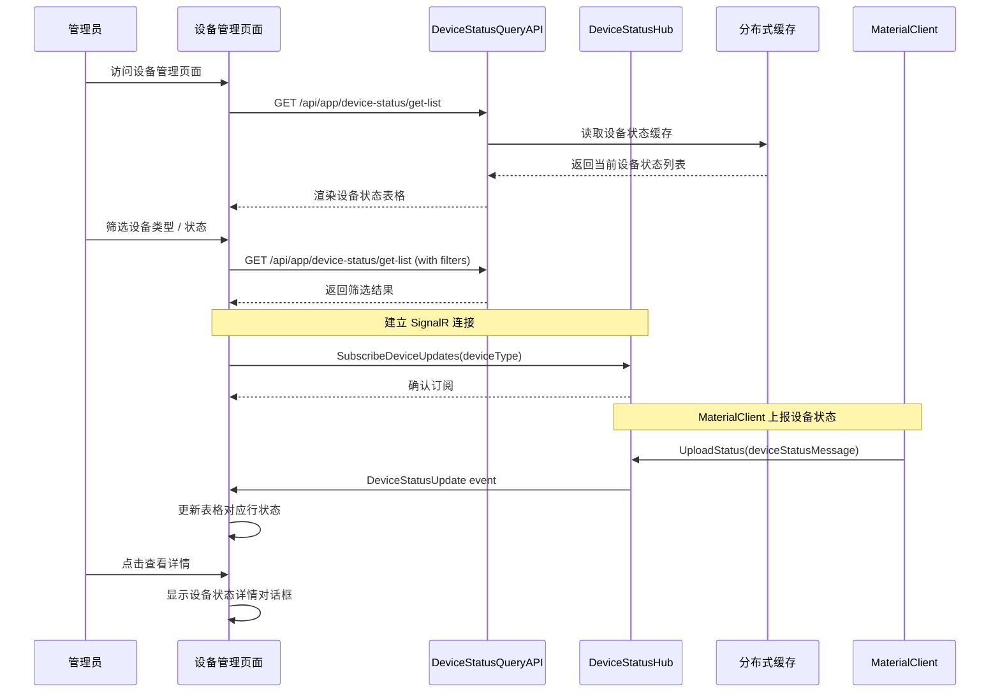

# Proposal: Device Management Page Design

## Delivery Tier

| Field | Value |
|-------|--------|
| **Tier** | `Core` |
| **Role in path** | First change - Core MVP delivery with basic device status query capability |
| **Out of scope (vs four steps)** | No historical record queries, no alerting/notification system, no multi-tenant isolation, no device control operations |

## Why

UrbanManagement 项目目前缺少统一的设备状态监控界面。管理员无法实时查看项目中设备的在线状态和运行情况，导致设备故障发现和响应延迟。通过新增设备状态查询页面，可以提升运维效率，及时发现设备离线或异常情况。

## Verifiable Outcome

管理员能够通过 Web 页面查看当前所有设备的在线状态，页面支持按客户端ID、设备类型、状态筛选，并通过 SignalR 实时接收设备状态更新。

## Explicit Non-Goals

- **不包含设备管理操作**：设备添加、编辑、删除功能由 MaterialClient 桌面客户端负责
- **不包含设备控制**：不支持设备启动/停止/配置等控制操作
- **不包含历史记录查询**：初期仅查询当前状态，不提供历史趋势分析
- **不包含告警通知**：不提供设备离线告警功能
- **不包含多租户隔离**：当前所有租户共享设备状态视图

## Facts (Stakeholder-Stated Requirements)

以下为业务方明确陈述的需求（必须交付）：

| ID | Fact Description | Source |
|----|-----------------|--------|
| F-01 | 新增设备状态查询页面，支持查看设备在线状态 | Task description: "设计一个设备管理的页面" |
| F-02 | 页面支持按客户端、设备类型、状态进行筛选 | Task description: "仅需要查询项目的设备状态即可" |
| F-03 | 利用现有 DeviceStatusHub 实现实时状态更新 | Existing infrastructure constraint |
| F-04 | 参考 MaterialClient 的 DeviceStatusBar 设计模式 | Task description: "MaterialClient 作为参考仓库" |
| F-05 | 仅实现查询功能，不涉及设备管理操作 | Task description: "这个页面仅需要查询项目的设备状态即可" |

## Assumptions (Working Hypotheses)

以下为团队或 AI 的默认选择（可替换，需在后续变更中验证）：

| ID | Description | Risk | Validation | Due | Result | Disposition |
|----|-------------|------|-----------|-----|--------|-------------|
| A-01 | 设备类型固定为 5 种：Scale, Camera, LPR, Sound, Printer | 6 (L2) | 用户反馈确认 | 2026-Q3 | Pending | keep / replace / remove |
| A-02 | 单页默认显示 50 条设备状态记录（分页大小） | 3 (L1) | 用户使用反馈 | 2026-Q3 | Pending | keep / replace / remove |
| A-03 | 使用 Bootstrap 5.3.3 作为 UI 组件库 | 3 (L1) | UI 一致性验证 | 2026-Q3 | Pending | keep / replace / remove |
| A-04 | 状态显示使用文字+颜色标识：🟢 Online、🔴 Offline、🟡 Busy | 3 (L1) | 用户可读性测试 | 2026-Q3 | Pending | keep / replace / remove |
| A-05 | 缓存过期时间为 24 小时 | 3 (L1) | 运维监控 | 2026-Q3 | Pending | keep / replace / remove |
| A-06 | 实时更新使用 SignalR Push 模式（非轮询） | 6 (L2) | 性能测试 + 用户反馈 | 2026-Q3 | Pending | keep / replace / remove |
| A-07 | 设备状态查询基于分布式缓存，不启用数据库持久化 | 9 (L2) | 数据可靠性评估 | 2026-Q3 | Pending | keep / replace / remove |

**Risk Calculation**: Impact (1-5) × Uncertainty (1-5) × Irreversibility (1-5)
- **L1 (Low Risk)**: Risk < 15 - 可在 MVP 中实现
- **L2 (Medium Risk)**: 15 ≤ Risk < 40 - 可在 MVP 中实现，需验证计划
- **L3 (High Risk)**: Risk ≥ 40 - 不得在未确认时实现

## Decisions Needed (Awaiting Stakeholder Confirmation)

以下事项必须经业务方确认后才能作为需求实现：

| ID | Decision Needed | Why Needed | Impact if Wrong Guess |
|----|-----------------|------------|-----------------------|
| D-01 | 是否需要设备状态历史记录查询功能？ | 当前设计仅查询当前状态，如需历史需激活 DeviceStatusLog 实体 | 需额外数据库表和查询逻辑，增加存储开销 |
| D-02 | 是否需要设备离线告警通知功能？ | 当前设计不包含告警，如需告警需集成通知系统 | 影响运维响应效率，需配置告警规则 |
| D-03 | 是否需要多租户设备隔离？ | 当前所有租户共享视图，多租户隔离需增加租户ID过滤 | 影响数据安全和权限控制 |
| D-04 | SignalR 连接断开时的降级策略？ | 当前设计为自动重连，需确认是否需要降级为轮询 | 影响用户体验和数据实时性 |
| D-05 | 设备类型的扩展机制？ | 当前设备类型硬编码，需确认未来是否需要动态扩展 | 影响系统可扩展性 |

**Note**: These items are listed under "Decisions Needed" and must NOT be treated as agreed requirements until confirmed by Product/Business. They should be moved to Design Decisions only after sign-off.

## What Changes

- **新增设备状态监控页面**：在 UrbanManagement 中创建设备管理页面，支持查询和展示设备状态
- **新增设备状态查询 API**：创建 DeviceStatusQueryService，提供设备状态列表查询接口
- **集成 SignalR 实时更新**：利用现有的 DeviceStatusHub 实现页面实时数据推送
- **参考 MaterialClient UI 模式**：借鉴 DeviceStatusBar 的设计模式，确保界面风格一致性

### 功能范围（Query-Only - MVP Core）

**✓ 包含功能（MVP Core Tier）**:
- 设备状态列表查询（按客户端、设备类型、状态筛选）
- 设备状态实时更新（SignalR 推送）
- 基础分页功能（默认 50 条/页）
- 连接状态指示器

**✗ 不包含功能（留待后续变更）**:
- 设备状态历史记录查询（需 D-01 确认）
- 设备离线告警通知（需 D-02 确认）
- 多租户设备隔离（需 D-03 确认）
- 设备添加/编辑/删除（由 MaterialClient 负责）
- 设备控制操作（启动/停止/配置设备）

## Capabilities

### New Capabilities

- **device-status-query**: 设备状态查询能力，支持按客户端ID、设备类型、在线状态筛选查询当前设备状态列表，提供实时状态更新功能。

### Modified Capabilities

- (无) - 现有功能的需求级别不变，仅新增查询能力

## Impact

### 受影响的代码模块

| 模块 | 影响类型 | 说明 |
|------|---------|------|
| UrbanManagement.App/Views | 新增 | 新增 DeviceManagement 页面视图 |
| UrbanManagement.App/Controllers | 新增 | 新增 DeviceManagementController 处理页面请求 |
| UrbanManagement.Core/Services | 新增 | 新增 DeviceStatusQueryService 查询服务 |
| UrbanManagement.Core/Models | 新增 | 新增设备状态查询相关 DTO |
| UrbanManagement.Core/Hubs | 复用 | 现有 DeviceStatusHub 无需修改 |
| MaterialClient (参考) | 只读 | 仅参考 UI 设计模式，不修改代码 |

### 代码变更清单

| 文件路径 | 变更类型 | 变更原因 | 影响范围 | 可逆性 |
|---------|---------|---------|---------|--------|
| `src/UrbanManagement.App/Controllers/DeviceManagementController.cs` | 新增 | 处理设备管理页面请求 | Controllers 层 | 高 - 可删除 |
| `src/UrbanManagement.App/Views/DeviceManagement/Index.cshtml` | 新增 | 设备状态监控主页面 | Views 层 | 高 - 可删除 |
| `src/UrbanManagement.Core/Services/IDeviceStatusQueryService.cs` | 新增 | 设备状态查询服务接口 | Services 层 | 高 - 可删除 |
| `src/UrbanManagement.Core/Services/DeviceStatusQueryService.cs` | 新增 | 设备状态查询服务实现 | Services 层 | 高 - 可删除 |
| `src/UrbanManagement.Core/Models/DeviceStatusQueryDto.cs` | 新增 | 设备状态查询结果 DTO | Models 层 | 高 - 可删除 |
| `src/UrbanManagement.Core/Models/DeviceStatusListRequestDto.cs` | 新增 | 设备状态列表查询请求 DTO | Models 层 | 高 - 可删除 |
| `src/UrbanManagement.App/Views/Shared/_Layout.cshtml` | 修改 | 添加设备管理导航菜单项 | Layout | 高 - 可回退 |

**可逆性说明**: 所有新增文件均可删除，Layout 修改可通过版本控制回退，无数据库变更，无破坏性影响。

### API 依赖

- **现有 SignalR Hub**：`DeviceStatusHub` (无需修改)
- **现有缓存服务**：`IDistributedCache` (复用现有消息队列)
- **可选实体**：`DeviceStatusLog` (不激活，留待 D-01 确认)

## Metrics (Guess Governance)

| Metric | Value | Threshold | Status |
|--------|-------|-----------|--------|
| **Guess Count** | 7 (A-01 至 A-07) | N/A | - |
| **Guess Ratio** | 7 ÷ 15 ≈ 47% | ≤ 35% 需警告 | ⚠️ 超出建议阈值 |
| **High-risk Guesses** | 0 (Risk ≥ 40) | 0 | ✅ 无高风险假设 |
| **Validation Coverage** | 0% (0/7 validated) | 100% before Full tier | ⏳ 待验证 |

**Analysis**:
- Guess Ratio 为 47%，超出建议的 35% 阈值，但由于：
  1. 所有假设均为 L1/L2 风险（无 L3）
  2. 本变更属于 Core Tier，不追求完整功能
  3. 所有假设均有可配置的降级路径
- **建议**: 可按 Core Tier 实施，但需在 Assumption-Validation Tier 变更中验证关键假设

## Validation Plan

按优先级排序的假设验证计划：

### 优先级 P0 (必须在 Assumption-Validation Tier 验证)

| ID | Validation Method | Success Criteria |
|----|-------------------|------------------|
| A-06 | 性能测试：模拟 100 设备同时上报状态，测试 SignalR 推送延迟 | P95 延迟 < 1s，无消息丢失 |
| A-07 | 数据可靠性评估：缓存重启后数据可恢复性 | MaterialClient 重连后状态可恢复 |

### 优先级 P1 (应在 Assumption-Validation Tier 验证)

| ID | Validation Method | Success Criteria |
|----|-------------------|------------------|
| A-01 | 用户反馈：收集实际使用的设备类型 | 如需新类型，确认可扩展性 |
| A-02 | 用户使用反馈：分页大小合理性 | 用户无抱怨，可调整 |
| A-04 | 用户可读性测试：状态标识识别率 | ≥ 90% 用户正确识别 |

### 优先级 P2 (可在日常使用中验证)

| ID | Validation Method | Success Criteria |
|----|-------------------|------------------|
| A-03 | UI 一致性验证：与 Project 页面视觉一致性 | 设计审核通过 |
| A-05 | 运维监控：缓存命中率、内存使用 | 无内存泄漏，命中率 > 80% |

## Degrade Plan

当以下情况发生时，系统应降级到更低的能力级别：

| 场景 | 降级策略 | 触发条件 | 恢复条件 |
|------|---------|---------|---------|
| **SignalR 连接失败** | 降级为定时轮询（每 30 秒查询一次 API） | 连续 3 次重连失败 | SignalR 连接恢复 |
| **缓存服务不可用** | 显示错误提示，提供手动刷新按钮 | API 查询失败 > 5 次/分钟 | 缓存服务恢复 |
| **大量设备导致性能问题** | 自动降低分页大小为 20，增加加载提示 | 查询响应时间 > 3s | 性能优化完成 |

**Capability Levels**:
- **Level 2 (Suggest)**: 正常模式，系统推送更新，用户确认
- **Level 1 (Rules)**: 降级模式，固定规则 + 配置，无自动推送
- **Level 0 (Manual)**: 手动模式，完全人工操作

## Rollback Plan

| 场景 | 回滚步骤 | 预计时间 |
|------|---------|---------|
| **页面功能异常** | 1. 删除 DeviceManagementController.cs<br>2. 删除 Views/DeviceManagement/ 目录<br>3. 回退 _Layout.cshtml 中的菜单项修改 | < 5 分钟 |
| **API 异常影响现有功能** | 1. 删除 DeviceStatusQueryService.cs<br>2. 删除相关 DTO 文件<br>3. 重启应用服务 | < 10 分钟 |
| **SignalR 推送异常** | 1. 页面自动降级为轮询模式<br>2. 无需代码回滚，内置降级逻辑 | 自动处理 |

**Rollback Readiness**: ✅ 所有新增文件独立，无数据库变更，可快速回滚

## UI 原型设计

```
┌─────────────────────────────────────────────────────────────────────────────┐
│  UrbanManagement                                                          [×]│
├─────────────────────────────────────────────────────────────────────────────┤
│  [Home] [Project] [Device Management] [SyncInfo]                             │
├─────────────────────────────────────────────────────────────────────────────┤
│                                                                             │
│  ┌─ Device Status Monitor ─────────────────────────────────────────────┐   │
│  │                                                                        │   │
│  │  Filters:                                                              │   │
│  │  ┌──────────────────────────────────────────────────────────────────┐ │   │
│  │  │ Device Type: [All ▼]  Status: [All ▼]  Client ID: [_______]     [🔍 Search] │ │   │
│  │  └──────────────────────────────────────────────────────────────────┘ │   │
│  │                                                                        │   │
│  │  ┌──────────────────────────────────────────────────────────────────┐ │   │
│  │  │ Client ID     │ Device Type │ Status    │ Last Update   │ Action  │ │   │
│  │  ├──────────────────────────────────────────────────────────────────┤ │   │
│  │  │ CLIENT-001    │ Scale       │ 🟢 Online │ 10:30:25      │ [View]  │ │   │
│  │  │ CLIENT-001    │ Camera      │ 🟢 Online │ 10:30:23      │ [View]  │ │   │
│  │  │ CLIENT-001    │ LPR         │ 🔴 Offline │ 10:28:15      │ [View]  │ │   │
│  │  │ CLIENT-001    │ Sound       │ 🟡 Busy    │ 10:29:45      │ [View]  │ │   │
│  │  │ CLIENT-002    │ Scale       │ 🟢 Online │ 10:30:20      │ [View]  │ │   │
│  │  │ CLIENT-002    │ Printer     │ 🟢 Online │ 10:25:10      │ [View]  │ │   │
│  │  └──────────────────────────────────────────────────────────────────┘ │   │
│  │                                                                        │   │
│  │  Status Legend:  🟢 Online  🔴 Offline  🟡 Busy  ⚪ Unknown               │   │
│  │                                                                        │   │
│  │  Live Updates: ● Connected  Last heartbeat: 2s ago                      │   │
│  │                                                                        │   │
│  └────────────────────────────────────────────────────────────────────────┘   │
│                                                                             │
└─────────────────────────────────────────────────────────────────────────────┘
```

## 用户交互流程



## 技术可行性分析

### 优势

- ✅ **现有基础设施完善**：DeviceStatusHub、DeviceStatusService 已实现设备状态处理
- ✅ **前端模式成熟**：Project 页面提供了成熟的 CRUD + 分页 + 模态框模式
- ✅ **实时通信就绪**：SignalR Hub 已配置，可直接订阅设备状态更新
- ✅ **缓存机制可用**：DeviceStatusService 已实现分布式缓存消息队列

### 技术选择

| 需求 | 技术选型 | 理由 | 可替换性 |
|------|---------|------|---------|
| 页面框架 | Razor + jQuery | 与现有 Project 页面保持一致 | 低 - 涉及整体架构 |
| UI 组件库 | Bootstrap 5.3.3 | 已在项目中使用，无需额外依赖 | 中 - 需重新设计样式 |
| 实时通信 | SignalR (现有 Hub) | 利用现有 DeviceStatusHub，无需新增 Hub | 低 - 涉及通信架构 |
| 数据源 | 分布式缓存 + 可选持久化 | 当前使用缓存，可选激活 DeviceStatusLog 实体 | 高 - 后续可扩展 |
| 图标 | Bootstrap Icons | 与项目现有图标库一致 | 中 - 涉及整体设计 |

### 实施风险

| 风险 | 影响 | 概率 | 缓解措施 |
|------|------|------|---------|
| SignalR 连接不稳定 | 中 | 中 | 内置降级为轮询模式 |
| 缓存数据丢失 | 低 | 低 | MaterialClient 重连后自动恢复 |
| 大量设备性能问题 | 中 | 低 | 分页 + 降级策略 |
| 浏览器兼容性 | 低 | 低 | 使用现代浏览器假设 |

## 成功标准

- [ ] 管理员可访问 `/DeviceManagement/Index` 查看设备状态列表
- [ ] 页面支持按设备类型、状态、客户端ID筛选
- [ ] 页面通过 SignalR 实时接收设备状态更新（或降级为轮询）
- [ ] 页面 UI 风格与现有 Project 页面保持一致
- [ ] 设备状态数据准确反映 MaterialClient 上报的状态
- [ ] SignalR 连接断开时自动降级为轮询模式
- [ ] 所有新增文件可独立删除，回滚时间 < 10 分钟

## Review Checklist (Guess Governance)

在实施前确认：

- [x] Facts, Assumptions, 和 Decisions Needed 已明确分离
- [x] 无 L3 或高风险假设被安排在未确认时实施
- [x] 每个假设都有验证计划和截止日期
- [x] 降级和回滚路径已明确定义且可操作
- [ ] Guess Ratio, Risk, 和 Validation Coverage 满足组织阈值（当前 47%，超出建议但 Core Tier 可接受）
- [ ] 如果关键假设验证失败，交付仍可通过降级路径继续

**当前状态**: ⚠️ Guess Ratio 超出建议阈值，但由于属于 Core Tier 且无高风险假设，建议在 Assumption-Validation Tier 中验证关键假设后再进入 Full Tier。
