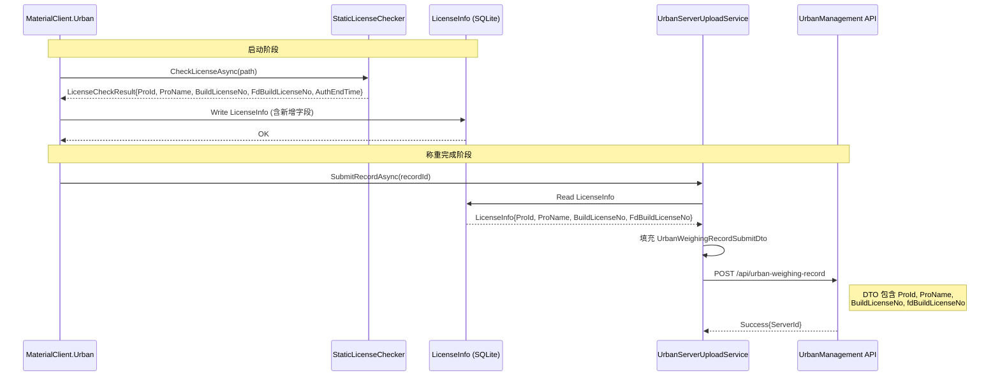
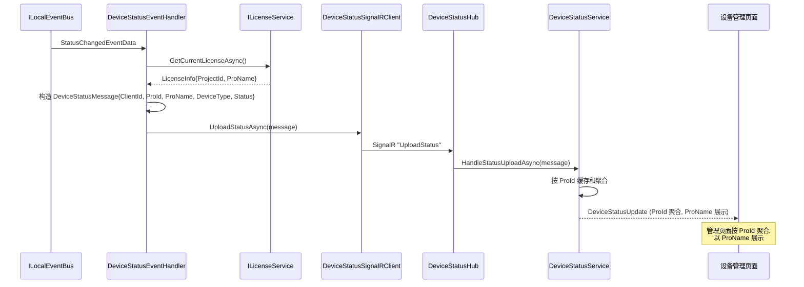

## Context

MaterialClient.Urban 的静态授权管线当前是空壳：`StaticLicenseChecker.CheckLicenseAsync()` 总是返回成功但不携带任何数据。启动流程仅记录日志，不将授权信息写入 `LicenseInfo` 表。下游的 `UrbanServerUploadService` 提交称重记录时，ProId/ProName/BuildLicenseNo/FdBuildLicenseNo 全部为 null。

UrbanManagement 服务端的 `DeviceStatusHub` 当前按 `ClientId` 隔离设备状态，但设备管理页面需要以项目为维度展示。需将 `DeviceStatusMessage` 新增 `ProId`（主键）和 `ProName`（展示名称），服务端以 ProId 为聚合主键，页面以 ProName 展示。

当前阶段目标：**硬编码固定测试值**打通从 `StaticLicenseChecker → LicenseInfo → UrbanServerUploadService → 服务端` 的完整数据链路，使测试流程可以正常运行。

### Architecture: 授权数据流层级

```
┌─────────────────────────────────────────────────────────────┐
│                    MaterialClient.Urban                      │
│                                                             │
│  ┌──────────────────┐    ┌──────────────────────────────┐   │
│  │ StaticLicense    │    │ LicenseInfo (SQLite)          │   │
│  │ Checker          │───>│                              │   │
│  │ (硬编码测试数据)  │    │ + ProId (Guid)               │   │
│  └──────────────────┘    │ + ProName (string) NEW       │   │
│          │               │ + BuildLicenseNo (string) NEW│   │
│          ▼               │ + FdBuildLicenseNo NEW       │   │
│  ┌──────────────────┐    │ + AuthToken, AuthEndTime,    │   │
│  │ Module           │    │   MachineCode (existing)     │   │
│  │ OnAppInit        │    └──────────────┬───────────────┘   │
│  │ (write License   │                   │                    │
│  │  Info to DB)     │                   ▼                    │
│  └──────────────────┘    ┌──────────────────────────────┐   │
│                          │ UrbanServerUploadService      │   │
│                          │ (read LicenseInfo, fill DTO)  │   │
│                          └──────────────┬───────────────┘   │
│                                         │                    │
└─────────────────────────────────────────┼────────────────────┘
                                          │ HTTP POST
                                          ▼
┌─────────────────────────────────────────────────────────────┐
│                    UrbanManagement (Server)                   │
│                                                             │
│  ┌──────────────────────────────────────────────────────┐   │
│  │ UrbanWeighingRecordAppService                        │   │
│  │   → UrbanWeighingRecord (ProId, ProName,             │   │
│  │     BuildLicenseNo, FdBuildLicenseNo NEW)            │   │
│  └──────────────────────────────────────────────────────┘   │
│                                                             │
│  ┌──────────────────────────────────────────────────────┐   │
│  │ DeviceStatusHub                                      │   │
│  │   → DeviceStatusMessage (ClientId + ProId + ProName) │   │
│  │   → ProId 主键聚合, ProName 展示                      │   │
│  └──────────────────────────────────────────────────────┘   │
└─────────────────────────────────────────────────────────────┘
```

### API Sequence: 称重记录提交流程



### API Sequence: 设备状态上报流程（ProName 关联）



## Goals / Non-Goals

**Goals:**
- 硬编码固定测试授权数据，打通 MaterialClient.Urban → UrbanManagement 的 ProId 数据流
- 扩展 `LicenseInfo` 实体支持 ProName/BuildLicenseNo/FdBuildLicenseNo，通过 EF 迁移持久化
- 修复 `UrbanServerUploadService` 从 `LicenseInfo` 读取项目信息填充 DTO
- 补全 DTO 缺失的 `FdBuildLicenseNo` 字段
- 确认 `DeviceStatusHub` 需要关联 ProId — 设备管理以 ProId 为主键，ProName 为展示标签，替代 ClientId

**Non-Goals:**
- 不实现真实的授权文件解析逻辑（StaticLicenseChecker 仍为测试桩）
- 不修改 `DeviceStatusHub` 的连接管理逻辑（仅新增 ProName 字段传递）
- 不修改 `LicenseService.VerifyAuthorizationCodeAsync`（线上授权流程）
- 不修改 `GovProject` 实体或服务端项目管理功能
- 不实现 ProId 变更时的数据迁移或级联更新

## Decisions

### Decision 1: 沿用 LicenseInfo 实体扩展字段

**选择**: 在现有 `LicenseInfo` 实体上新增 `ProName`、`BuildLicenseNo`、`FdBuildLicenseNo` 字段。

**替代方案**:
- A) 创建独立的 `StaticLicenseData` 实体 — 增加复杂度，需要额外的 Repository 和关联查询
- B) 使用配置文件（appsettings.json）存储 — 数据分散，无法与 LicenseInfo 的生命周期同步

**理由**: `LicenseInfo` 已经持有 `ProjectId`（即 ProId），新增字段是最自然的扩展。`LicenseService.VerifyAuthorizationCodeTestAsync` 已有将测试数据写入 LicenseInfo 的模式，静态授权数据写入同一个实体保持一致性。

### Decision 2: 扩展 LicenseCheckResult 携带授权数据

**选择**: 在 `LicenseCheckResult` 中新增 `ProId`、`ProName`、`BuildLicenseNo`、`FdBuildLicenseNo`、`AuthEndTime` 属性，由 `StaticLicenseChecker` 填充硬编码值。`AuthEndTime` 使用硬编码的固定过期时间（与 `LicenseService.VerifyAuthorizationCodeTestAsync` 中 `testAuthEndTime = DateTime.Now.AddYears(1)` 的模式一致）。

**替代方案**:
- A) `StaticLicenseChecker` 直接注入 Repository 写入 LicenseInfo — 打破单一职责，Checker 变成读写混合
- B) 用独立的 `IStaticLicenseDataProvider` 接口 — 过度设计，当前阶段只需要硬编码

**理由**: `LicenseCheckResult` 已经是授权检查的返回值，携带解析出的数据符合其职责。Module 启动流程负责将结果写入 LicenseInfo，保持 Checker 为纯数据提供者。

### Decision 3: 启动流程写入 LicenseInfo

**选择**: 在 `MaterialClientUrbanModule.OnApplicationInitializationAsync` 中，静态授权检查成功后将 `LicenseCheckResult` 的数据写入 `LicenseInfo`（通过 `IRepository<LicenseInfo, Guid>`）。

**理由**: 与 `LicenseService.VerifyAuthorizationCodeTestAsync` 的模式一致 — 授权数据写入 LicenseInfo 后，其他服务（如 `UrbanServerUploadService`）通过 `ILicenseService.GetCurrentLicenseAsync()` 读取。

### Decision 4: DeviceStatusMessage 新增 ProId + ProName，ProId 为主键，ProName 为展示

**选择**: 在 `DeviceStatusMessage` 中新增 `ProId` (string) 和 `ProName` (string) 字段。`ProId` 作为服务端聚合、缓存和筛选的主键；`ProName` 作为管理页面面向用户的展示名称。客户端从 `LicenseInfo` 读取 ProId（ProjectId.ToString()）和 ProName 填充到消息中。

**替代方案**:
- A) 仅用 ProName — ProName 不唯一（理论上可能重名），不适合作为主键
- B) 仅用 ProId (Guid) — Guid 不便于人阅读，管理页面需额外查询才能显示名称
- C) 保持 ClientId 不变 — 服务端无法直接获知设备所属项目

**理由**: 同时传递 ProId 和 ProName 是最佳方案 — ProId 保证唯一性（用于聚合和缓存主键），ProName 提供可读性（用于 UI 展示）。客户端已拥有完整的 LicenseInfo 数据，两个字段均在消息中直接携带，服务端无需额外查询。ClientId 保留用于底层连接管理。

### Decision 5: 服务端新增 FdBuildLicenseNo 字段

**选择**: 在 `UrbanWeighingRecord` 实体和对应的接收 DTO 中新增 `FdBuildLicenseNo` 字段，与 `GovProject` 实体对齐。

**理由**: `GovProject` 已有 `FdBuildLicenseNo`（对接码），且 `LegacyGovSyncAppService` 在同步时使用该字段查找项目。称重记录携带 `FdBuildLicenseNo` 可以在政府同步时直接关联项目，无需额外查询。

## Risks / Trade-offs

- **[硬编码测试值泄漏到生产]** → 通过 `#if DEBUG` 条件编译保护，或使用明确的 `TestLicense` 常量前缀使测试数据可识别
- **[LicenseInfo 字段扩展需要 EF 迁移]** → 迁移脚本简单（3 个 nullable string 列），对现有数据无破坏性影响
- **[LicenseInfo 字段与 LicenseService 线上流程不一致]** → `LicenseService.VerifyAuthorizationCodeAsync` 从 API 获取的数据也需要扩展 LicenseInfoDto 以包含新字段，但当前阶段不修改线上流程，仅影响测试路径
- **[服务端新增 FdBuildLicenseNo 需迁移]** → 与客户端 LicenseInfo 迁移同步进行，均为新增 nullable 列
- **[DeviceStatusMessage 新增 ProId + ProName 改变 SignalR 消息协议]** → 新增字段为 nullable 有默认值，旧客户端不发 ProId/ProName 时服务端使用 ClientId 作为降级显示

## Migration Plan

1. **MaterialClient**: 新增 EF 迁移，为 `LicenseInfo` 表添加 `ProName`、`BuildLicenseNo`、`FdBuildLicenseNo` 三个 nullable string 列
2. **UrbanManagement**: 新增 EF 迁移，为 `UrbanWeighingRecord` 表添加 `FdBuildLicenseNo` nullable string 列
3. 部署顺序：先服务端后客户端（确保 API 能接收新字段）
4. 回滚：删除迁移即可（新增列对现有数据无影响）

## Open Questions

- 硬编码的 ProId、ProName、BuildLicenseNo、FdBuildLicenseNo 具体值需确认（可使用与 `LicenseService.VerifyAuthorizationCodeTestAsync` 中 `testProjectId` 一致的值）。AuthEndTime 使用 `DateTime.Now.AddYears(1)` 固定一年有效期
- `UrbanWeighingRecord` 是否需要为 `FdBuildLicenseNo` 添加索引（`GovProject` 中有索引，但称重记录可能不需要）
