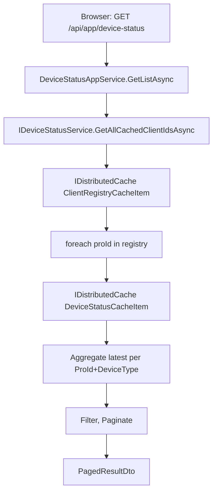

## Context

UrbanManagement 的设备状态子系统通过 SignalR Hub 接收 MaterialClient 上报的设备状态，使用 `Microsoft.Extensions.Caching.Distributed.IDistributedCache`（原始非泛型接口）存储设备消息队列、客户端注册表和连接状态。所有缓存读写均需手动调用 `System.Text.Json.JsonSerializer` 进行序列化/反序列化，并配以自定义 `DateTimeJsonConverter` 处理旧格式时间字符串。

项目已使用 ABP Framework（`Volo.Abp.Core` v10.0.1），但尚未引用 `Volo.Abp.Caching` 模块。当前缓存操作分散在 `DeviceStatusService`（写入）、`DeviceStatusAppService`（直接读取）、`DeviceStatusHub`（注入但未使用）三个类中。

## Goals / Non-Goals

**Goals:**

- 将所有手动 JSON 序列化缓存替换为 ABP `IDistributedCache<TCacheItem>` 类型化缓存
- 统一缓存过期策略管理，利用 `ConfigureCache<T>()` 声明式配置替代逐调用点手动设置
- 消除 `DeviceStatusAppService` 直接读取原始缓存的越层访问，统一通过 `IDeviceStatusService` 委托
- 移除不再需要的自定义 JSON 转换器代码

**Non-Goals:**

- 不改变任何 REST API 端点签名或响应格式
- 不改变 SignalR Hub 方法或事件载荷结构
- 不引入 Redis 等外部缓存基础设施（沿用内存分布式缓存）
- 不处理 `recommendation-cache`（`IMemoryCache`，不在本仓库）
- 不处理 `ghost-session-plate-cache-sync`（MaterialClient 仓库，非本仓库）
- 不添加单元测试或文档（提案明确跳过）

## Decisions

### D1: 引入 Volo.Abp.Caching 包

ABP 类型化缓存 `IDistributedCache<TCacheItem>` 由 `Volo.Abp.Caching` 包提供，需显式引用。该模块自动注册 `IDistributedCache<T>` 为 singleton，并提供 `Utf8JsonDistributedCacheSerializer` 处理序列化。

**替代方案：** 继续使用原始 `IDistributedCache` 但封装自定义泛型辅助类。
**选择理由：** ABP 原生类型化缓存已处理序列化、键规范化、多租户前缀、错误隐藏等横切关注点，封装方案需重复实现这些功能且无框架支持。

### D2: CacheItem 类独立定义（不复用 DTO）

为 4 种缓存数据定义独立的 CacheItem 类，而非复用现有 DTO：

| CacheItem 类 | 包装数据 | 缓存键 |
|---|---|---|
| `DeviceStatusCacheItem` | `List<DeviceStatusMessage>` Messages | `{proId}` 或 `{clientId}` |
| `ClientRegistryCacheItem` | `HashSet<string>` ProIds | 固定键 `"__registry__"` |
| `ClientConnectionCacheItem` | ProId, ProName, IsConnected, ConnectedAt, DisconnectedAt | `{proId}` |
| `ConnectionRegistryCacheItem` | `HashSet<string>` ProIds | 固定键 `"__registry__"` |

**替代方案 A：** 直接将 `ClientConnectionDto` 用作缓存项。
**选择理由：** 缓存项与 API DTO 关注点不同（缓存项含内部状态如 ConnectedAt/DisconnectedAt，DTO 面向前端展示）。独立 CacheItem 类使用 `[CacheName]` 属性控制缓存名，避免暴露 "Dto" 后缀。

**替代方案 B：** 将 `List<DeviceStatusMessage>` 直接作为 TCacheItem。
**选择理由：** 包装为 `DeviceStatusCacheItem` 可附带 FIFO 容量约束常量和辅助方法，且遵循 ABP 命名惯例。

### D3: DeviceStatusAppService 不再直接注入缓存

当前 `DeviceStatusAppService` 直接注入 `IDistributedCache` 并在 `GetClientDevicesAsync` 和 `GetAllDeviceStatusFromCacheAsync` 中绕过 `IDeviceStatusService` 读取原始缓存。重构后移除该注入，所有缓存读取通过 `IDeviceStatusService` 接口委托。

**选择理由：** 缓存层细节应封装在 `DeviceStatusService` 内部，AppService 作为应用层不应感知缓存实现。

### D4: 缓存配置集中声明

在 `UrbanManagementCoreModule.ConfigureServices` 中使用 `Configure<AbpDistributedCacheOptions>` 集中声明各 CacheItem 类的过期策略：

```
DeviceStatusCacheItem      → 24h AbsoluteExpiration
ClientConnectionCacheItem   → 24h AbsoluteExpiration
ClientRegistryCacheItem     → 25h AbsoluteExpiration
ConnectionRegistryCacheItem → 25h AbsoluteExpiration
KeyPrefix                   → "UM:"
```

**选择理由：** 将分散在各调用点的 `DistributedCacheEntryOptions` 统一到模块配置中，符合 ABP 声明式配置惯例。

## Architecture

```
Module Dependency Chain
├── AbpCachingModule (NEW - from Volo.Abp.Caching)
│   ├── AbpSerializationModule
│   ├── AbpThreadingModule
│   └── AbpMultiTenancyModule
└── UrbanManagementCoreModule
    ├── DependsOn: AbpCachingModule
    └── Configures: AbpDistributedCacheOptions per CacheItem type

Cache Layer (DeviceStatusService)
├── IDistributedCache<DeviceStatusCacheItem>
│   └── Key: proId → List<DeviceStatusMessage> (FIFO max 100)
├── IDistributedCache<ClientRegistryCacheItem>
│   └── Key: "__registry__" → HashSet<string>
├── IDistributedCache<ClientConnectionCacheItem>
│   └── Key: proId → Connection state
└── IDistributedCache<ConnectionRegistryCacheItem>
    └── Key: "__registry__" → HashSet<string>
```

### Data Flow: Cache Query Path



## Detailed Code Change Inventory

| File Path | Change Type | Change Description |
|-----------|-------------|-------------------|
| `UrbanManagement.Core/UrbanManagement.Core.csproj` | MODIFY | 添加 `<PackageReference Include="Volo.Abp.Caching" />` |
| `UrbanManagement.Core/UrbanManagementCoreModule.cs` | MODIFY | 添加 `typeof(AbpCachingModule)` 到 `[DependsOn]`；添加 `Configure<AbpDistributedCacheOptions>` 配置块 |
| `UrbanManagement.Core/Services/DeviceStatusService.cs` | MODIFY | 替换 `IDistributedCache _distributedCache` 为 4 个 `IDistributedCache<T>` 字段；重写 `CacheMessageAsync`、`GetCachedMessagesAsync`、`ClearCachedMessagesAsync`、`GetAllCachedClientIdsAsync`、`UpdateClientRegistryAsync`、`CacheClientConnectedAsync`、`CacheClientDisconnectedAsync`、`GetClientConnectionAsync`、`GetAllConnectionRegistryIdsAsync`、`UpdateConnectionRegistryAsync` |
| `UrbanManagement.Core/Services/DeviceStatusAppService.cs` | MODIFY | 移除 `IDistributedCache _distributedCache` 字段；移除 `GetAllDeviceStatusFromCacheAsync` 中直接缓存读取；改为通过 `IDeviceStatusService` 或注入 `IDistributedCache<DeviceStatusCacheItem>` 委托 |
| `UrbanManagement.Core/Hubs/DeviceStatusHub.cs` | MODIFY | 移除构造函数中 `IDistributedCache` 参数 |
| `UrbanManagement.Core/Models/DeviceStatusCacheItem.cs` | CREATE | CacheItem 类，含 `List<DeviceStatusMessage> Messages` 属性 |
| `UrbanManagement.Core/Models/ClientRegistryCacheItem.cs` | CREATE | CacheItem 类，含 `HashSet<string> ProIds` 属性 |
| `UrbanManagement.Core/Models/ClientConnectionCacheItem.cs` | CREATE | CacheItem 类，含 ProId/ProName/IsConnected/ConnectedAt/DisconnectedAt |
| `UrbanManagement.Core/Models/ConnectionRegistryCacheItem.cs` | CREATE | CacheItem 类，含 `HashSet<string> ProIds` 属性 |
| `UrbanManagement.Core/Tools/DateTimeJsonConverter.cs` | DELETE | ABP 序列化器自动处理 DateTime 格式 |

## Risks / Trade-offs

- **[Cache key format change]** ABP 自动生成键格式为 `c:{CacheName},k:{key}`，与现有 `device_status_cache:{key}` 不同 → 重构后部署时旧缓存自然过期（24h TTL），无需迁移。若需即时清除旧缓存，重启应用即可（内存缓存）。

- **[FIFO 读-改-写非原子性]** 当前和重构后的 FIFO 队列操作均为 read-modify-write 模式，在高并发下可能丢失消息 → 与现有行为一致，不引入新风险。ABP typed cache 不提供原子操作。

- **[ABP 序列化器 DateTime 格式差异]** ABP 默认使用 ISO 8601 格式（`"O"`），与自定义 `DateTimeJsonConverter` 的 `"yyyy-MM-dd HH:mm:ss"` 不同 → 不影响行为，因为序列化/反序列化闭环均在 ABP 内部完成，不涉及外部消费者解析缓存数据。
