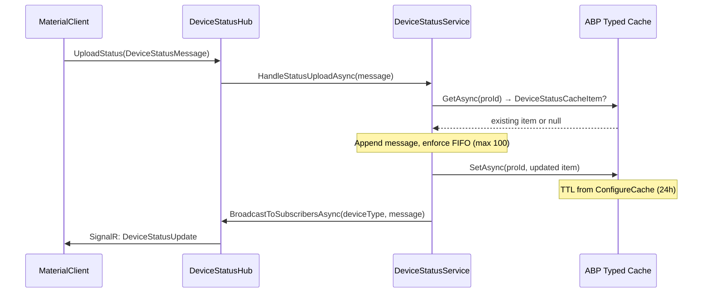

## Why

UrbanManagement 的设备状态缓存逻辑当前使用手动 `System.Text.Json` 序列化 + 原始 `IDistributedCache` 字符串存取，存在自定义序列化器维护负担、缺少统一过期策略管理、与 ABP 框架缓存体系脱节等问题。ABP Framework 提供的 `IDistributedCache<TCacheItem>` 类型化缓存能够自动处理序列化、键命名和过期配置，可一次性消除这些手搓代码。

## What Changes

- 引入 `Volo.Abp.Caching` NuGet 包和 `AbpCachingModule` 模块依赖
- 定义 4 个 CacheItem 类替代原始 JSON 结构：`DeviceStatusCacheItem`（设备状态消息队列）、`ClientRegistryCacheItem`（客户端发现注册表）、`ClientConnectionCacheItem`（连接状态）、`ConnectionRegistryCacheItem`（连接发现注册表）
- 将 `DeviceStatusService` 中所有原始 `IDistributedCache` 调用替换为类型化 `IDistributedCache<TCacheItem>` 注入
- 将 `DeviceStatusAppService` 中直接读取原始缓存的代码改为通过类型化缓存或服务委托
- 移除 `DeviceStatusHub` 中未使用的 `IDistributedCache` 注入
- 在 `UrbanManagementCoreModule` 中配置 `AbpDistributedCacheOptions`，按 CacheItem 类型声明过期策略
- 删除 `DateTimeJsonConverter.cs` / `NullableDateTimeJsonConverter.cs`（ABP 序列化器自动处理 DateTime）

## Capabilities

### New Capabilities

- `abp-typed-device-cache`: 基于 ABP `IDistributedCache<TCacheItem>` 的设备状态类型化缓存层，定义 CacheItem 类、统一过期策略、自动序列化，替代原有手搓 JSON 缓存

### Modified Capabilities

（无行为级需求变更。现有 `device-status-query` 和 `client-device-online-detail` 的行为契约不变，仅内部实现从原始 `IDistributedCache` 迁移至类型化缓存）

## Impact

### Code Change Map

| File Path | Change Type | Change Reason |
|-----------|-------------|---------------|
| `src/UrbanManagement.Core/UrbanManagement.Core.csproj` | MODIFY | 添加 `Volo.Abp.Caching` NuGet 包引用 |
| `src/UrbanManagement.Core/UrbanManagementCoreModule.cs` | MODIFY | 添加 `[DependsOn(typeof(AbpCachingModule))]`；配置 `AbpDistributedCacheOptions` 按类型声明 TTL |
| `src/UrbanManagement.Core/Services/DeviceStatusService.cs` | MODIFY | 将 `IDistributedCache`（原始）替换为 4 个 `IDistributedCache<T>` 注入；重写全部缓存方法 |
| `src/UrbanManagement.Core/Services/DeviceStatusAppService.cs` | MODIFY | 移除直接 `IDistributedCache` 注入；缓存读取改用类型化缓存或委托服务 |
| `src/UrbanManagement.Core/Hubs/DeviceStatusHub.cs` | MODIFY | 移除未使用的 `IDistributedCache` 注入 |
| `src/UrbanManagement.Core/Models/`（新建） | CREATE | 4 个 CacheItem 类文件 |
| `src/UrbanManagement.Core/Tools/DateTimeJsonConverter.cs` | DELETE | 不再需要自定义 DateTime JSON 转换器 |

### Dependencies

- 新增 NuGet: `Volo.Abp.Caching`（ABP Framework 提供的类型化分布式缓存模块）
- 无需额外 Redis 或外部缓存依赖（沿用现有内存分布式缓存实现）

### API & Behavioral Impact

- 所有 REST API 端点签名和行为不变
- SignalR Hub 方法和事件载荷不变
- 缓存键命名由 ABP 自动管理（`c:{CacheName},k:{key}` 格式），不再使用手搓 `device_status_cache:{key}` 前缀

### Data Flow: Status Upload -> Cache

