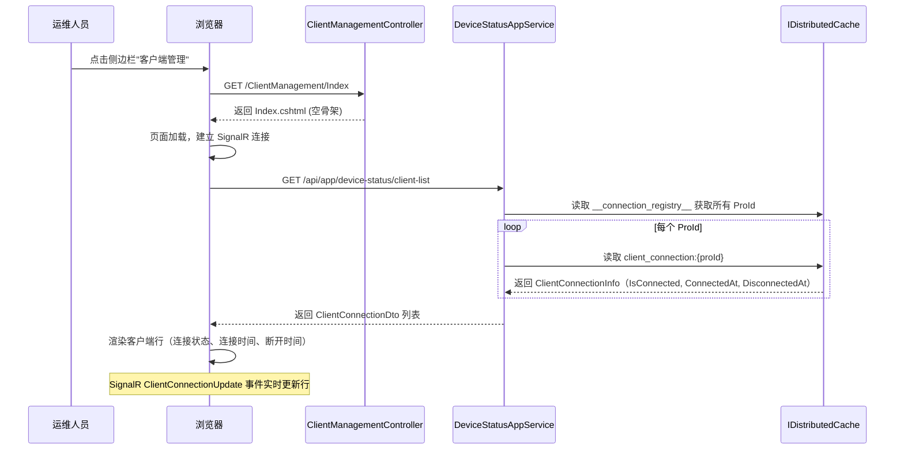
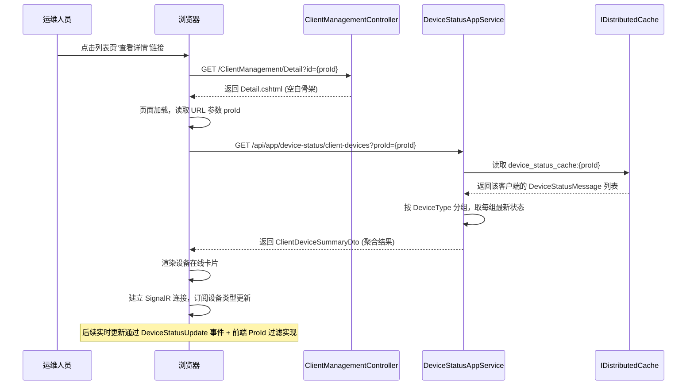
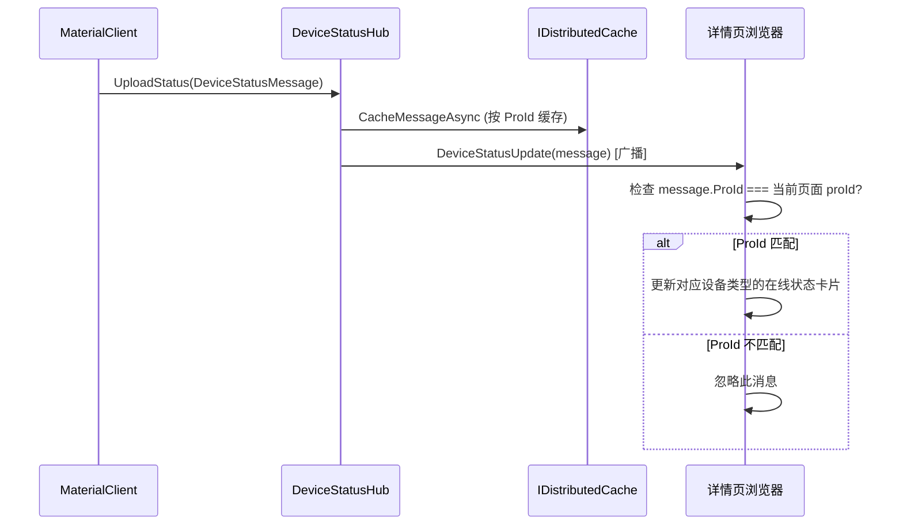

## Context

UrbanManagement 是一个 ASP.NET Core + ABP 的 Web 应用，使用 MVC + Razor Views 架构。主页面采用 Layui 框架的 admin 布局（`Home/Index.cshtml`），左侧导航通过 `data-url` 属性加载 iframe 内容页。"设备管理"模块当前由三部分组成：

1. **控制器**: `DeviceManagementController` → `/DeviceManagement/Index`
2. **视图**: `Views/DeviceManagement/Index.cshtml` — 独立页面（`Layout = null`），使用 Bootstrap + jQuery + SignalR
3. **导航入口**: `Home/Index.cshtml` 侧边栏中的 `<dd>` 链接，通过 iframe 加载

数据流：MaterialClient 桌面端通过 SignalR 上报设备状态 → `DeviceStatusHub` 接收并写入 `IDistributedCache` → `DeviceStatusAppService` 从缓存读取并聚合查询 → 前端通过 HTTP API 获取数据，同时通过 SignalR 实时推送更新。

## Goals / Non-Goals

**Goals:**
- 将"设备管理"更名为"客户端管理"，覆盖所有 UI 文本、路由、控制器、视图目录
- 将列表页重构为按客户端展示 SignalR 长连接状态（连接是否存在、连接时间、断开时间），一行对应一个客户端
- 新增客户端设备在线详情页，以客户端为维度聚合展示所有设备类型的在线状态
- 复用现有 SignalR 推送和分布式缓存基础设施，无需新增外部依赖
- 保持 layui admin 布局风格一致

**Non-Goals:**
- 不新增向后兼容路由重定向
- 不修改 MaterialClient 侧代码或 SignalR 协议
- 不持久化设备状态到数据库（继续使用分布式缓存）
- 不修改 ABP API 自动路由约定（`/api/app/device-status` 基础路由保持不变）
- 不修改原有 `GetListAsync` 逐设备查询接口（保留供其他调用方使用，但列表页不再使用）

## Decisions

### Decision 1: 控制器重命名策略 — 整体重命名而非新建控制器

**选择**: 将 `DeviceManagementController` 直接重命名为 `ClientManagementController`，删除旧控制器。

**备选方案**: 保留旧控制器并添加重定向 → 弃用（需求明确不需要向后兼容）。

**理由**: 需求明确说明无需向后兼容，直接重命名最简洁，不引入无用代码。

### Decision 2: 详情页路由设计 — 新增 Detail action

**选择**: 在 `ClientManagementController` 上新增 `Detail(string id)` action，路由为 `/ClientManagement/Detail?id={proId}`。

**备选方案**: 将详情作为列表页的展开行或弹窗 → 弃用（详情页需要独立的 SignalR 连接和更复杂的 UI 状态管理，独立页面更清晰）。

**理由**: 详情页需要订阅特定客户端的 SignalR 推送事件、维护独立的实时状态，独立页面比弹窗/展开行更适合承载这些复杂度。

### Decision 3: 前端数据获取 — HTTP API + 浏览器端 SignalR 组合

**选择**: 列表页和详情页均通过 HTTP API 获取初始数据，同时建立浏览器端 SignalR 连接接收实时推送更新，SignalR 断开时降级为 30 秒轮询。

**备选方案**: 纯 HTTP 轮询无 SignalR → 弃用（变更频率虽低但实时推送体验更佳，且现有列表页已有 SignalR 基础设施可复用）。

**理由**: 复用现有列表页的 SignalR 连接模式（连接、订阅、实时更新、断线降级轮询），保持与原有代码的一致性。Hub 广播 `ClientConnectionUpdate` 事件供列表页实时更新连接状态，`DeviceStatusUpdate` 事件供详情页实时更新设备状态。

### Decision 4: UI 框架选择 — 详情页使用 Bootstrap + jQuery（与列表页一致）

**选择**: 详情页继续使用与列表页相同的技术栈（Bootstrap 5 + jQuery + SignalR），不引入 layui 到独立页面中。

**理由**: 列表页（`Index.cshtml`）已使用 Bootstrap + jQuery + SignalR，详情页保持一致可最大化代码复用（SignalR 连接逻辑、状态 badge 渲染、时间格式化函数）。layui 布局仅在 admin shell（`Home/Index.cshtml`）中使用，独立内容页不应混用两套 CSS 框架。

### Decision 5: 列表页粒度 — 按客户端展示连接状态而非设备状态

**选择**: 列表页重构为一行对应一个客户端（ProId），展示该客户端的 SignalR 长连接状态：是否在线、连接时间、断开时间，而非设备在线汇总信息。

**备选方案**: 展示设备在线汇总（在线设备数/总数、整体状态）→ 弃用（运维人员关注的是客户端是否连上来，设备级详情放在详情页中查看）。

**理由**: "客户端管理"列表页的核心价值是让运维人员一眼判断每个客户端是否在线。设备级别的状态详情在详情页中展示更合适。列表页需要 `DeviceStatusHub` 在连接/断开时记录连接元数据到分布式缓存。

### Decision 6: 列表页数据获取 — Hub 连接生命周期跟踪 + GetClientListAsync API

**选择**: 扩展 `DeviceStatusHub` 在 `OnConnectedAsync`/`OnDisconnectedAsync` 中将连接元数据（ProId、ConnectedAt、DisconnectedAt、IsConnected）写入分布式缓存，并广播 `ClientConnectionUpdate` 事件。列表页通过 `GetClientListAsync` 获取初始数据，通过 SignalR 实时更新。

**备选方案**: 仅依赖 `DeviceStatusMessage` 心跳时间推断连接状态 → 弃用（心跳是设备级粒度，无法准确反映长连接的连接/断开时间点）。

**理由**: 直接在 Hub 连接生命周期中记录连接状态是最准确的方式。缓存 key 使用 `client_connection:{proId}`，与设备状态缓存 `device_status_cache:{proId}` 分离，职责清晰。

## Architecture

```
UrbanManagement.App (Web)
├── Controllers
│   ├── ClientManagementController.cs        ← RENAMED from DeviceManagementController
│   │   ├── Index()                          ← 渲染客户端连接状态列表页
│   │   └── Detail(string id)                ← NEW: 渲染客户端设备在线详情页
│   └── (other controllers)
├── Views
│   ├── ClientManagement/                     ← RENAMED from DeviceManagement/
│   │   ├── Index.cshtml                      ← REWRITTEN: 客户端连接状态列表页
│   │   └── Detail.cshtml                     ← NEW: 设备在线详情页
│   ├── Shared/
│   │   └── _Layout.cshtml                    ← 导航链接文本和路由更新
│   └── Home/Index.cshtml                     ← 侧边栏菜单项文本和路由更新
└── wwwroot/public/style/admin.css            ← 可能需要新增样式

UrbanManagement.Core (Services)
├── Services
│   ├── IDeviceStatusAppService.cs           ← NEW: GetClientListAsync + GetClientDevicesAsync
│   ├── DeviceStatusAppService.cs            ← NEW: 两个查询方法实现
│   ├── IDeviceStatusService.cs               ← MODIFIED: 新增连接生命周期缓存方法
│   └── DeviceStatusService.cs                ← MODIFIED: OnConnected/OnDisconnected 缓存连接元数据
├── Hubs
│   └── DeviceStatusHub.cs                   ← MODIFIED: 连接/断开时缓存连接元数据，广播 ClientConnectionUpdate
└── Models
    ├── DeviceStatusMessage.cs                ← 无变更
    ├── DeviceStatusQueryDto.cs               ← 无变更
    ├── DeviceStatusListRequestDto.cs         ← 无变更
    ├── ClientConnectionDto.cs               ← NEW: 客户端连接状态 DTO（列表页）
    └── ClientDeviceSummaryDto.cs             ← NEW: 客户端设备在线汇总 DTO（详情页）

MaterialClient (Desktop)                     ← 无变更
```

## API Sequence

### 列表页加载序列



### 详情页加载序列



### SignalR 实时更新序列



## Data Flow

```mermaid
flowchart TD
    MC[MaterialClient 桌面端] -->|SignalR Connect| Hub[DeviceStatusHub]
    Hub -->|OnConnectedAsync: 缓存连接元数据| ConnCache[IDistributedCache<br/>key: client_connection:proId]
    Hub -->|OnDisconnectedAsync: 更新断开时间| ConnCache
    Hub -->|UploadStatus: 缓存设备状态| DeviceCache[IDistributedCache<br/>key: device_status_cache:proId]
    Hub -->|Broadcast DeviceStatusUpdate| Group[SignalR Group<br/>device_type]
    Hub -->|Broadcast ClientConnectionUpdate| Group2[SignalR Group<br/>client_connection]

    subgraph 列表页（客户端连接状态）
        ListAPI[GET /api/app/device-status/client-list] -->|读取连接记录| ConnCache
        ListSignalR[SignalR ClientConnectionUpdate] -->|实时更新连接状态| ClientTable[客户端列表<br/>每行=一个客户端<br/>列: 连接状态/连接时间/断开时间]
    end

    subgraph 详情页（设备在线状态）
        DetailAPI[GET /api/app/device-status/client-devices?proId=x] -->|读取指定 ProId 设备缓存| DeviceCache
        DetailSignalR[SignalR DeviceStatusUpdate] -->|按 ProId 过滤后更新| DetailCards[设备在线卡片]
    end

    Group2 --> ListSignalR
    Group --> DetailSignalR
```

## UI Prototype

### 列表页（Index.cshtml）— 客户端连接状态

```
┌──────────────────────────────────────────────────────────────────────────┐
│ 客户端列表                               ● 实时更新                       │
├──────────────────────────────────────────────────────────────────────────┤
│ [项目名称___搜索]  [刷新]                                              │
├────────────┬──────────┬────────────────────┬────────────────────┬────────┤
│ 客户端名称   │ 连接状态  │ 连接时间             │ 断开时间             │ 操作   │
├────────────┼──────────┼────────────────────┼────────────────────┼────────┤
│ 萧山项目A    │ 🟢 在线   │ 2026-06-03 09:15:32 │ -                  │ [详情] │
│ 萧山项目B    │ 🔴 离线   │ 2026-06-03 08:00:10 │ 2026-06-03 14:23:05 │ [详情] │
│ 萧山项目C    │ 🟢 在线   │ 2026-06-02 22:05:18 │ -                  │ [详情] │
│ ...         │          │                    │                    │        │
└────────────┴──────────┴────────────────────┴────────────────────┴────────┘
                                          < 1 2 3 ... 共 8 条，第 1/1 页 >
```

**列说明：**
- **客户端名称**: ProName 或 ClientId
- **连接状态**: 🟢 在线（SignalR 长连接存在）/ 🔴 离线（SignalR 长连接断开或从未连接）
- **连接时间**: 该客户端最后一次建立 SignalR 连接的时间（最近一次 OnConnectedAsync）
- **断开时间**: 该客户端最后一次断开 SignalR 连接的时间；若当前在线则显示 "-"

### 详情页（Detail.cshtml）— 客户端设备在线总览

```
┌──────────────────────────────────────────────────────────────────────────┐
│ ← 返回列表    客户端设备详情 - 萧山项目A                                  │
├──────────────────────────────────────────────────────────────────────────┤
│                                                                          │
│  ┌──────────────────┐  ┌──────────────────┐  ┌──────────────────┐     │
│  │  🟢  地磅 (Scale)  │  │  🟢  摄像头 (Camera)│  │  🔴  车牌识别 (LPR) │     │
│  │                   │  │                   │  │                   │     │
│  │  状态: 在线        │  │  状态: 在线        │  │  状态: 离线        │     │
│  │  更新: 1分钟前     │  │  更新: 30秒前      │  │  更新: 2小时前     │     │
│  └──────────────────┘  └──────────────────┘  └──────────────────┘     │
│                                                                          │
│  ┌──────────────────┐  ┌──────────────────┐                            │
│  │  ⚪  音响 (Sound) │  │  ⚪  打印机 (Printer)│                            │
│  │                   │  │                   │                            │
│  │  状态: 未上报      │  │  状态: 未上报      │                            │
│  │  更新: -          │  │  更新: -          │                            │
│  └──────────────────┘  └──────────────────┘                            │
│                                                                          │
│  连接状态: ● 实时更新  |  最后心跳: 刚刚                                  │
└──────────────────────────────────────────────────────────────────────────┘
```

## Risks / Trade-offs

| 风险 | 影响 | 缓解措施 |
|------|------|----------|
| 旧路由 `/DeviceManagement/Index` 失效导致书签/收藏失效 | 低（需求明确不需要向后兼容） | 文档通知运维人员更新书签 |
| 详情页 SignalR 推送量包含所有客户端数据，前端过滤 | 极低 — 每秒消息量很小（≤50/连接） | 前端 ProId 过滤开销可忽略不计 |
| 分布式缓存 24 小时过期导致客户端离线后数据消失 | 中 — 详情页可能显示"未上报" | 设计为合理行为：24h 无心跳视为离线，用"未上报"状态明确区分 |
| 详情页新增 API 方法 `GetClientDevicesAsync` 需与现有 `GetListAsync` 保持缓存读取逻辑一致 | 低 | 复用相同的 `GetAllDeviceStatusFromCacheAsync` 基础方法 |
| 列表页新增 `GetClientListAsync` 需遍历所有 ProId 的连接记录 | 低 — 缓存条目数量有限（=活跃客户端数） | 使用独立的 `__connection_registry__` 缓存 key 管理连接记录索引 |
| Hub 需在连接/断开时写入缓存，增加 Hub 方法执行时间 | 极低 — 单次缓存写入 <1ms | 使用与设备状态缓存相同的 `IDistributedCache`，无额外基础设施 |
| **MaterialClient → UrbanManagement SignalR 断开时设备状态不会实时更新** | **中 — 页面显示的设备状态为断开前最后一次缓存的状态，存在陈旧风险** | MaterialClient 端已有离线消息队列（`DeviceStatusSignalRClient`），重连后自动补发；服务端缓存 24h TTL 保证数据不过期；浏览器端有 30s 降级轮询确保即使浏览器 SignalR 断开也能刷新数据 |

### SignalR 离线场景分析

设备状态和连接状态的准确性取决于 MaterialClient → UrbanManagement 之间的 SignalR 连接。以下是三种断开场景的影响：

| 场景 | 数据链路断开点 | 影响范围 | 恢复方式 |
|------|----------------|----------|----------|
| MaterialClient 网络中断 | MaterialClient → UrbanManagement | 服务端缓存不再收到新状态，显示为断开前最后状态 | MaterialClient 自动重连（指数退避），重连后补发缓存队列中的消息 |
| UrbanManagement 服务重启 | MaterialClient → UrbanManagement（服务端） | 分布式缓存（如 Redis）保留数据，Hub 连接全部断开 | MaterialClient 自动重连到恢复的服务端；浏览器自动重连 |
| 浏览器 SignalR 断开 | UrbanManagement → 浏览器（前端） | 页面不再收到实时推送，但 API 查询仍可用 | 前端 30s 降级轮询；SignalR 自动重连后恢复推送 |

**关键结论**：MaterialClient → UrbanManagement 的 SignalR 断开期间，设备状态**不会自动变为"离线"**——页面显示的是断开前最后一次缓存的状态。服务端缓存（24h TTL）保证了数据的持久性，但状态的实时性取决于 SignalR 连接恢复速度。通过"最后更新时间"列/卡片，运维人员可以判断数据的新鲜程度。

## Open Questions

无。技术方案清晰，所有依赖基础设施已就绪。
