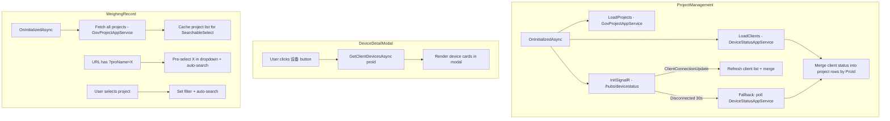

## Context

UrbanManagement 是一个 Blazor Server 应用（ABP 10 + LayUI CDN），管理城市施工项目的称重记录与设备监控。当前有 5 个页面：Dashboard、ProjectManagement、WeighingRecord、ClientList、DeviceStatus。客户端/设备相关功能分布在 3 个独立页面中，用户需频繁切换。

项目使用 LayUI CDN 做基础样式框架，自定义 CSS token 体系（tokens.css）+ 组件样式（components.css）+ 管理后台布局（admin.css）。无共享 Blazor 组件目录，所有页面为顶级 `.razor` 文件。

## Goals / Non-Goals

**Goals:**
- 将 ClientList + ClientDetail + DeviceStatus 的核心功能合并进 ProjectManagement
- ProjectManagement 实时展示客户端在线状态（SignalR + fallback polling）
- WeighingRecord 的项目名搜索改为 SearchableSelectable 下拉选择
- ProjectManagement 提供跳转 WeighingRecord 的快捷入口（携带 proName 参数）

**Non-Goals:**
- 不修改服务层（AppService）或数据层（Entity/EF Core）
- 不引入新的 UI 框架或组件库（继续使用 LayUI + 自定义 CSS）
- 不做移动端适配优化
- 不保留 `/clients`、`/device-status` 的重定向兼容（直接废弃路由）

## Architecture

```
Page Architecture (After Change)
├── Dashboard.razor (/)                     — 不变
├── ProjectManagement.razor (/projects)      — 主变更：合并客户端+设备功能
│   ├── SignalR HubConnection               — 从 ClientList 迁移
│   ├── Device Detail Modal                  — 从 ClientDetail 迁移（改为 Modal）
│   └── Weighing Record Link                 — 新增 NavigationManager.NavigateTo
├── WeighingRecord.razor (/weighing)         — 修改：SearchableSelectable
│   └── SearchableSelect 内联组件            — 新增：下拉搜索选择
├── AdminLayout.razor                        — 修改：减少导航项
├── MainLayout.razor                          — 不变
└── App.razor                                 — 不变

Removed:
├── ClientList.razor (/clients)               — 删除
├── ClientDetail.razor (/clients/{proId})    — 删除
└── DeviceStatus.razor (/device-status)      — 删除
```

## Data Flow



## Decisions

### D1: 设备详情展示为 Modal 而非子页面

**选择**: 在 ProjectManagement 中使用 Modal 弹窗展示设备详情（迁移自 ClientDetail.razor 的 device-detail-grid 布局）。

**替代方案**: 使用 `/projects/{id}/devices` 子路由页面。
**理由**: 设备信息是辅助查看性质，不适合作为独立导航目标。Modal 保持用户在项目管理上下文中，避免跳转后再返回。

### D2: 客户端状态与项目列表的合并策略

**选择**: 在 `OnInitializedAsync` 中并行调用 `GetListAsync(GovProject)` 和 `GetClientListAsync(ClientList)`，然后通过 `ProId` 将客户端状态合并到项目行数据中。

**替代方案**: 服务端返回合并数据（新增 AppService 方法）。
**理由**: 不修改服务层，UI 层合并足以满足需求。`ClientConnectionDto.ProId` 与 `GovProject` 的 `FdBuildLicenseNo` 是对应关系（ProId 实际存储的是对接码），合并键需要使用 `GovProject.FdBuildLicenseNo` 匹配 `ClientConnectionDto.ProId`。

### D3: SearchableSelect 作为内联组件而非独立页面

**选择**: 在 WeighingRecord.razor 内部实现 SearchableSelect 逻辑，不创建独立 `.razor` 组件文件。

**替代方案**: 创建 `Shared/SearchableSelect.razor` 通用组件。
**理由**: 当前项目无 Shared 组件目录，且 SearchableSelect 仅在此一处使用。内联实现更简单，避免引入项目级组件约定。如果未来有更多使用场景可以提取。

### D4: 项目跳转称重记录使用 URL query parameter

**选择**: 通过 `NavigationManager.NavigateTo($"/weighing?proName={Uri.EscapeDataString(project.ProName)}")` 实现跳转。

**替代方案**: 使用 Blazor cascading parameter 或 state service。
**理由**: URL query parameter 简单直观，支持浏览器刷新保持状态，且与现有 tab 系统兼容（AdminLayout 通过 URL 变化创建/切换 tab）。

## Risks / Trade-offs

| Risk | Mitigation |
|------|------------|
| SignalR 连接管理从两个页面合并到一个，连接生命周期复杂度增加 | 复用 ClientList 中已验证的 HubConnection + fallback polling 模式，保持 DisposeAsync 清理 |
| ProId/FdBuildLicenseNo 匹配可能因数据不一致导致状态显示缺失 | 合并时对未匹配的项目显示"未注册"状态，不因数据问题导致页面异常 |
| SearchableSelect 内联实现增加 WeighingRecord 页面复杂度 | 将 dropdown 逻辑封装在 `@code` 块的独立方法组中，保持职责分离 |
| 删除 3 个页面后，书签/外部链接到 `/clients` 会 404 | 不影响（需求明确不需要向后兼容） |

## Detailed Code Change Inventory

| File Path (relative to repos/UrbanManagement/) | Change Type | Change Description | Affected Module |
|-----------|-------------|-------------------|-----------------|
| `src/UrbanManagement.App/Pages/ProjectManagement.razor` | 重写 | 添加 SignalR 注入 + IDeviceStatusAppService 注入；新增客户端状态列；新增设备详情 Modal；新增称重记录跳转按钮；实现 IAsyncDisposable | 页面 |
| `src/UrbanManagement.App/Pages/WeighingRecord.razor` | 修改 | 注入 IGovProjectAppService；替换项目名 input 为 SearchableSelect dropdown；添加 OnParametersAsync 处理 proName query param；添加 dropdown CSS class | 页面 |
| `src/UrbanManagement.App/Pages/AdminLayout.razor` | 修改 | `_navItems` 从 5 项缩减为 3 项，移除 `/clients` 和 `/device-status` | 布局 |
| `src/UrbanManagement.App/Pages/ClientList.razor` | 删除 | 整文件删除 | 页面 |
| `src/UrbanManagement.App/Pages/ClientDetail.razor` | 删除 | 整文件删除 | 页面 |
| `src/UrbanManagement.App/Pages/DeviceStatus.razor` | 删除 | 整文件删除 | 页面 |
| `src/UrbanManagement.App/wwwroot/css/components.css` | 修改 | 新增 `.searchable-select` 下拉样式（trigger、dropdown、items、highlight）；新增 `.device-modal` 弹窗内设备网格样式（复用已有 `.device-detail-grid`） | 共享样式 |
| `src/UrbanManagement.App/wwwroot/public/style/admin.css` | 修改 | 移除 `.client-card`、`.device-grid`、`.device-card`、`.connection-indicator` 等仅 DeviceStatus 使用的样式 | 布局样式 |

## Open Questions

（无 — 需求明确，所有技术方案已确定）
