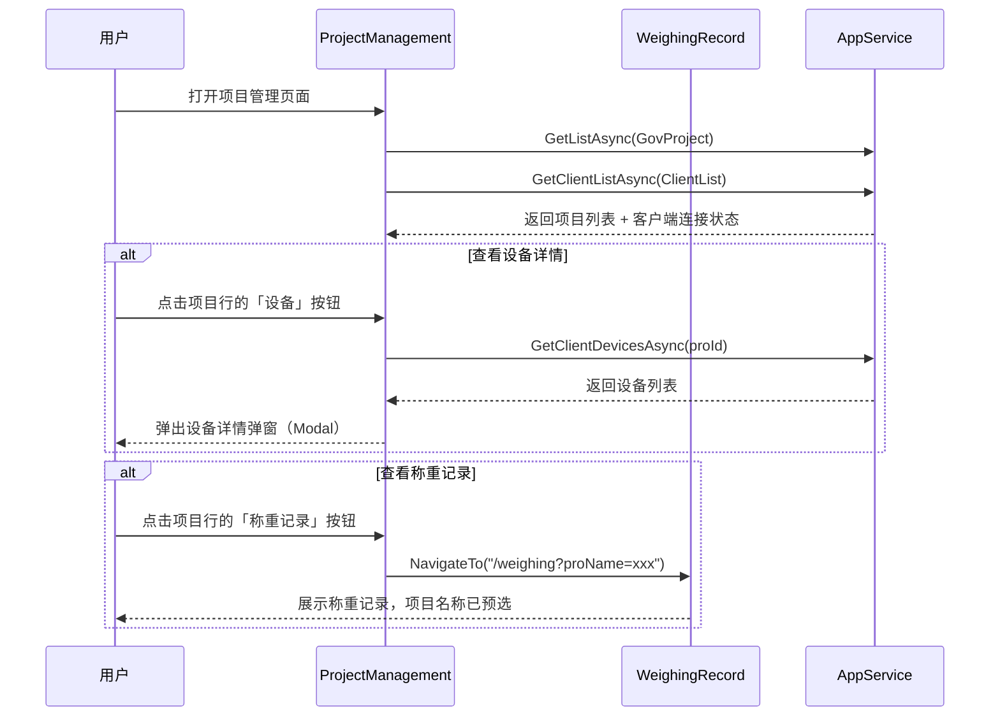

## Why

ClientList、DeviceStatus、ProjectManagement 三个页面功能分散，用户需要在多个页面间切换才能完成项目管理和设备状态监控，操作流程割裂。同时 WeighingRecord 页面的项目名称过滤使用纯文本输入，无法从已知项目列表中选择，容易因输入差异导致过滤失败。现在将客户端/设备功能合并到 ProjectManagement，优化 WeighingRecord 项目选择交互，并建立页面间的快速跳转能力。

## What Changes

- **BREAKING** 移除 ClientList.razor（`/clients`）、ClientDetail.razor（`/clients/{proId}`）、DeviceStatus.razor（`/device-status`）三个独立页面
- **BREAKING** 从 AdminLayout.razor 导航菜单中移除「客户端管理」和「设备状态」两个入口
- 增强 ProjectManagement.razor：合并客户端在线状态展示与设备详情查看功能
- 在 ProjectManagement 每个项目行新增「查看称重记录」操作按钮，点击跳转 WeighingRecord 页面并预填项目名称
- WeighingRecord.razor 的项目名称搜索字段从纯文本输入改为 SearchableSelectable 下拉选择模式（从 GovProject 列表中搜索选取）

## Capabilities

### New Capabilities

- `project-client-merge`: 将客户端在线状态与设备详情功能合并到 ProjectManagement 页面，支持在每个项目行展示连接状态、展开查看设备网格
- `searchable-project-select`: WeighingRecord 页面使用 SearchableSelectable 组件选择项目名称，替代纯文本输入
- `project-weighing-link`: ProjectManagement 页面提供跳转到 WeighingRecord 的快捷操作，携带预选项目参数

### Modified Capabilities

（无已有 spec 需要修改）

## Interaction Flow



## UI Prototype

### 合并后的 ProjectManagement 页面

```
┌──────────────────────────────────────────────────────────────┐
│ 项目管理                          [搜索...] [搜索] [添加项目] │
├──────────────────────────────────────────────────────────────┤
│ 项目名称    │ 许可证号   │ 对接码   │ 客户端 │ 同步 │ 操作  │
├──────────────┼────────────┼──────────┼────────┼──────┼───────┤
│ 项目A       │ XXX-001    │ FD001    │ ● 在线 │ 已开 │ 编辑  │
│              │            │          │        │      │ 删除  │
│              │            │          │        │      │ 设备  │
│              │            │          │        │      │ 称重  │
├──────────────┼────────────┼──────────┼────────┼──────┼───────┤
│ 项目B       │ XXX-002    │ FD002    │ ○ 离线 │ 已关 │ 编辑  │
│              │            │          │        │      │ 删除  │
│              │            │          │        │      │ 设备  │
│              │            │          │        │      │ 称重  │
└──────────────┴────────────┴──────────┴────────┴──────┴───────┘
```

### 设备详情弹窗（Modal）

```
┌──────────────────────────────────────────────┐
│ 设备详情 - 项目A                        [×] │
├──────────────────────────────────────────────┤
│  ┌──────────┐  ┌──────────┐  ┌──────────┐   │
│  │  📊 地磅  │  │  📷 摄像  │  │  🚗 车牌  │   │
│  │  ● 在线   │  │  ● 在线   │  │  ○ 离线   │   │
│  │ 14:30:22 │  │ 14:30:22 │  │ 13:45:10 │   │
│  └──────────┘  └──────────┘  └──────────┘   │
│  ┌──────────┐  ┌──────────┐                  │
│  │  🔊 音响  │  │  🖨 打印  │                  │
│  │  ● 在线   │  │  ● 在线   │                  │
│  │ 14:30:22 │  │ 14:30:22 │                  │
│  └──────────┘  └──────────┘                  │
│                                              │
│                        [关闭]                │
└──────────────────────────────────────────────┘
```

### WeighingRecord SearchableSelectable

```
┌──────────────────────────────────────────────────────────────┐
│ 称重记录                    [车牌号...] [▼ 项目名称  ] [搜索] │
├──────────────────────────────────────────────────────────────┤
│                                              ┌─────────────┐ │
│                                              │ 🔍 搜索项目  │ │
│                                              ├─────────────┤ │
│                                              │ 项目A       │ │
│                                              │ 项目B       │ │
│                                              │ 项目C       │ │
│                                              └─────────────┘ │
└──────────────────────────────────────────────────────────────┘
```

## Change Map

| File Path | Change Type | Change Reason | Impact Scope |
|-----------|-------------|---------------|--------------|
| `Pages/ProjectManagement.razor` | 重写 | 合并客户端状态与设备详情功能 | 项目管理主页面 |
| `Pages/WeighingRecord.razor` | 修改 | 项目搜索改为 SearchableSelectable | 称重记录过滤交互 |
| `Pages/AdminLayout.razor` | 修改 | 移除客户端管理、设备状态导航项 | 侧边栏导航 |
| `Pages/ClientList.razor` | 删除 | 功能合并到 ProjectManagement | 整页移除 |
| `Pages/ClientDetail.razor` | 删除 | 功能合并到 ProjectManagement 弹窗 | 整页移除 |
| `Pages/DeviceStatus.razor` | 删除 | 功能合并到 ProjectManagement | 整页移除 |
| `wwwroot/css/components.css` | 修改 | 新增 SearchableSelectable 与设备弹窗样式 | 共享样式 |
| `wwwroot/public/style/admin.css` | 修改 | 清理 DeviceStatus 专属样式 | 公共样式 |

## Impact

- **页面路由**: `/clients`、`/clients/{proId}`、`/device-status` 三条路由废弃
- **导航结构**: 侧边栏从 5 个入口缩减为 3 个（仪表盘、项目管理、称重记录）
- **SignalR**: ProjectManagement 需引入 HubConnection 以支持客户端实时状态更新
- **新增依赖**: SearchableSelectable 下拉组件需要新建（项目中不存在该组件）
- **服务层**: 无变更，复用现有 `IGovProjectAppService`、`IDeviceStatusAppService`、`IUrbanWeighingRecordAppService`
