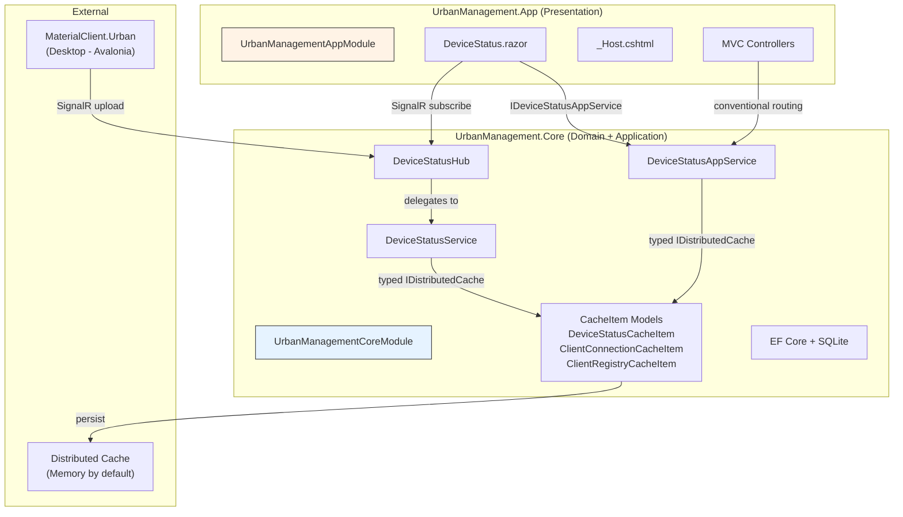

## Context

UrbanManagement is an ABP 10.0.1 application using Blazor Server for a device-status monitoring dashboard and SignalR for real-time device updates from MaterialClient desktop instances. The project was assembled incrementally across 5+ specs and now has several architectural inconsistencies:

- **Core module registers Blazor services** — `UrbanManagement.Core` calls `AddServerSideBlazor()` and references `Volo.Abp.AspNetCore.Components.Server`. In ABP's layering model, the Core layer should be free of UI framework dependencies.
- **Blazor component has dead DI injections** — `DeviceStatus.razor` injects 3 typed `IDistributedCache<>` instances that are never referenced in code.
- **Two structurally identical registry cache types** — `ClientRegistryCacheItem` and `ConnectionRegistryCacheItem` both hold `HashSet<string> ProIds` with different `[CacheName]` attributes and identical internal keys `"__registry__"`.
- **Unbounded iteration in query path** — `DeviceStatusAppService.GetListAsync` iterates all ProIds without a size guard.

### Architecture Diagram

### Current State (File Map)

| File | Current Responsibility | Issue |
|---|---|---|
| `UrbanManagement.Core/UrbanManagementCoreModule.cs` | Registers `AddServerSideBlazor()` | Core should not own web UI registration |
| `UrbanManagement.Core/UrbanManagement.Core.csproj` | References `Volo.Abp.AspNetCore.Components.Server` | Core should not reference Blazor packages |
| `UrbanManagement.App/UrbanManagementAppModule.cs` | Maps Blazor endpoints | Correct, but should also own service registration |
| `UrbanManagement.App/Pages/DeviceStatus.razor` | Device status dashboard | Injects 3 unused `IDistributedCache<>` |
| `UrbanManagement.Core/Models/ConnectionRegistryCacheItem.cs` | Connection registry | Identical structure to `ClientRegistryCacheItem` |
| `UrbanManagement.Core/Services/DeviceStatusService.cs` | Cache read/write + broadcast | Uses both registry types redundantly |
| `UrbanManagement.Core/Services/DeviceStatusAppService.cs` | Query API | No iteration guard; uses both registry types |

## Goals / Non-Goals

**Goals:**
- Move Blazor Server registration (`AddServerSideBlazor`, package reference) from Core to App module — correct ABP layering.
- Remove 3 dead `IDistributedCache<>` injections from `DeviceStatus.razor` — eliminate DI confusion.
- Consolidate `ConnectionRegistryCacheItem` into `ClientRegistryCacheItem` with a distinct cache key — reduce type duplication.
- Add a defensive iteration cap in `DeviceStatusAppService.GetListAsync` — prevent runaway cache reads at scale.

**Non-Goals:**
- No new features, UI changes, or API contract changes.
- No documentation or unit tests (per project instructions).
- No backward compatibility considerations (per project instructions).
- No changes to MaterialClient code (it communicates via SignalR, not cache).

## Decisions

### Decision 1: Move Blazor registration to App module

**Choice**: Transfer `AddServerSideBlazor()` call and `Volo.Abp.AspNetCore.Components.Server` package reference from `UrbanManagement.Core` to `UrbanManagement.App`.

**Rationale**: ABP's layering model keeps UI framework concerns in the presentation/host layer. Core should only depend on domain and infrastructure packages (`Volo.Abp.Caching`, `Volo.Abp.EntityFrameworkCore`). This also makes it possible to swap Blazor for a different UI framework without touching Core.

**Alternative considered**: Keep in Core and add a comment — rejected because the dependency is architectural, not cosmetic.

**Implementation notes**:
- Remove `context.Services.AddServerSideBlazor()` from `UrbanManagementCoreModule.ConfigureServices`.
- Add it to `UrbanManagementAppModule.ConfigureServices` (after existing service registrations).
- Move `Volo.Abp.AspNetCore.Components.Server` package reference from `Core.csproj` to `App.csproj`.
- The App module already depends on Core, so the order is correct (Core configures first, App configures second).

### Decision 2: Remove unused cache injections from DeviceStatus.razor

**Choice**: Delete the 3 `@inject IDistributedCache<...>` lines from `DeviceStatus.razor`.

**Rationale**: All data access goes through `IDeviceStatusAppService` — the cache injections are dead code that adds DI overhead and misleads future developers into thinking the component has a secondary data path.

**Alternative considered**: Keep for potential future direct cache reads — rejected because the current architecture intentionally centralizes cache access through the app service layer.

### Decision 3: Consolidate ConnectionRegistryCacheItem into ClientRegistryCacheItem

**Choice**: Delete `ConnectionRegistryCacheItem` and use `ClientRegistryCacheItem` with a different cache key (`"__connection_registry__"`) for connection tracking.

**Rationale**: Both types hold `HashSet<string> ProIds` — the structural identity means the generic parameter adds no type safety value. Using one type with distinct keys reduces code surface area while preserving semantic separation.

**Alternative considered**: Keep both types but add documentation — rejected because the types serve the same data shape and the split was likely an artifact of incremental development.

**Implementation notes**:
- `DeviceStatusService` currently injects both `IDistributedCache<ClientRegistryCacheItem>` and `IDistributedCache<ConnectionRegistryCacheItem>`. After consolidation, it injects `IDistributedCache<ClientRegistryCacheItem>` twice (ABP's typed cache distinguishes by key at runtime, but DI needs separate named registrations or a factory pattern).
- **Better approach**: Use a single `IDistributedCache<ClientRegistryCacheItem>` with two distinct key constants: `"__registry__"` for client discovery and `"__connection_registry__"` for connection tracking. The ABP typed cache wraps `IDistributedCache` and adds key prefix + type name, so both keys will coexist safely.
- Wait — ABP's `IDistributedCache<T>` uses the `[CacheName]` attribute as part of the key. Since both keys would use the same `ClientRegistryCacheItem` type (with `[CacheName("ClientRegistry")]`), the keys would be `"UM:ClientRegistry:__registry__"` and `"UM:ClientRegistry:__connection_registry__"` — these are distinct, so this works.
- However, we need to consider that `DeviceStatusService` currently has two separate `IDistributedCache<>` fields. After consolidation, it would have just one `IDistributedCache<ClientRegistryCacheItem>` used with two different key strings.
- Remove the `ConnectionRegistryCacheItem` expiration configuration from `AbpDistributedCacheOptions` (25h for connection registry). The remaining `ClientRegistryCacheItem` (25h) will serve both use cases.
- Delete `ConnectionRegistryCacheItem.cs`.

### Decision 4: Add iteration cap in GetListAsync

**Choice**: Add a `MaxRegistryIteration` constant (default 500) in `DeviceStatusAppService`. When iterating ProIds, log a warning and stop if the count exceeds this threshold.

**Rationale**: The current "read all, then filter" pattern assumes the registry stays small. At scale (hundreds of connected clients), loading each client's cache entry serially becomes a performance concern. The cap provides a safety valve without changing the query architecture.

**Alternative considered**: Switch to a proper query index — rejected as over-engineering for the current scale; the cap is a pragmatic guard.

**Implementation notes**:
- Add `private const int MaxRegistryIteration = 500;` in `DeviceStatusAppService`.
- In `GetListAsync`, after reading `allProIds`, add: `if (allProIds.Count > MaxRegistryIteration) { logger.LogWarning(...); allProIds = allProIds.Take(MaxRegistryIteration).ToHashSet(); }`
- Same guard in `GetClientListAsync`.

## Risks / Trade-offs

| Risk | Impact | Mitigation |
|---|---|---|
| Moving Blazor registration breaks startup order | App won't start if Blazor services aren't registered before endpoint mapping | App module `ConfigureServices` runs after Core; `AddServerSideBlazor()` is order-independent within `ConfigureServices` |
| Consolidating registry types orphans existing cache entries | Transient data loss for cached device statuses | Cache entries have 24-25h TTL and self-heal as clients reconnect via SignalR. No persistent data is lost. |
| Removing `Volo.Abp.AspNetCore.Components.Server` from Core breaks build if anything in Core references Blazor types | Build failure | Verify no Core code references `ComponentBase`, `LayoutComponentBase`, or other Blazor types. Current exploration shows no such usage in Core. |
| Iteration cap truncates results | Some clients not shown in API response | Cap is set high (500) and logged as warning; actual deployment has far fewer clients. Paginated API returns partial data regardless. |

## Open Questions

- **App.csproj transitive reference**: Does `UrbanManagement.App.csproj` already get `Volo.Abp.AspNetCore.Components.Server` transitively through `Volo.Abp.AspNetCore.Mvc` or another reference? If so, the explicit package reference in App.csproj may not be needed. Validate at build time.
