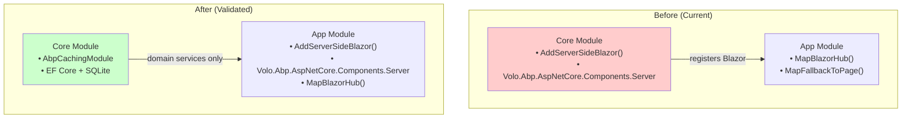
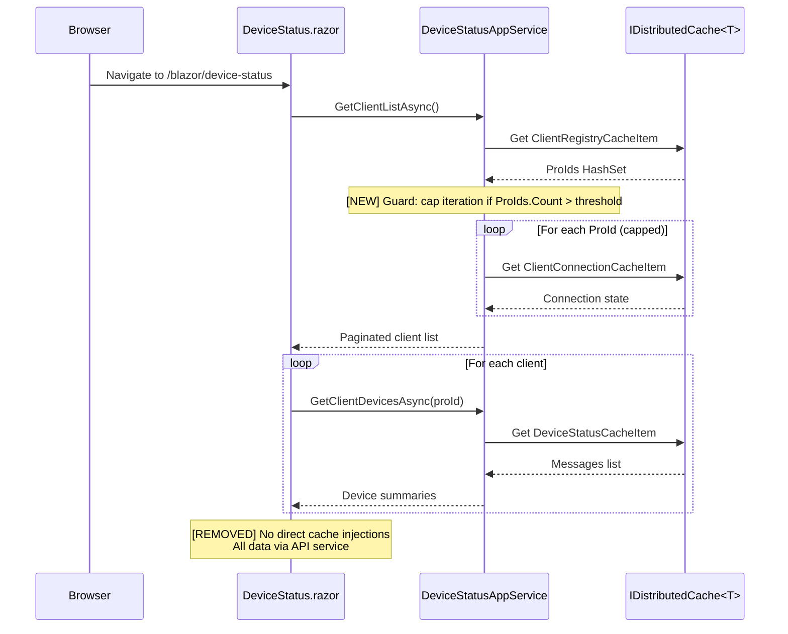

## Why

The UrbanManagement project was built incrementally — ABP caching, Blazor Server hosting, and SignalR device-status delivery were added across multiple specs. Several architectural assumptions need validation now that the system is assembled and running:

1. **Core layer owns web concerns** — `UrbanManagement.Core` registers Blazor Server services (`AddServerSideBlazor`) and references `Volo.Abp.AspNetCore.Components.Server`, which are application/host-layer responsibilities in ABP's layering model. This couples the domain layer to a specific UI framework.
2. **Dead cache injections in Blazor components** — `DeviceStatus.razor` injects three typed `IDistributedCache<>` instances (`ClientRegistryCacheItem`, `DeviceStatusCacheItem`, `ClientConnectionCacheItem`) that are never read in the `@code` block; all data flows through `DeviceStatusAppService`. These create unnecessary DI overhead and confuse future maintainers.
3. **Duplicate registry cache types** — `ClientRegistryCacheItem` and `ConnectionRegistryCacheItem` are structurally identical (`HashSet<string> ProIds`) with separate `[CacheName]` attributes. Both use the same internal key `"__registry__"`. Their semantic split is unclear and the duplication increases maintenance surface.
4. **Cache read path correctness** — `DeviceStatusAppService.GetListAsync` reads the full `ClientRegistryCacheItem`, then iterates every ProId to load individual `DeviceStatusCacheItem` entries. This "load-all-then-filter" pattern is assumed safe for the current scale but has no size guard.

These assumptions were reasonable during rapid prototyping but should be validated and corrected before the system grows further.

## What Changes

- **Move Blazor Server registration from Core to App** — Transfer `AddServerSideBlazor()` and the `Volo.Abp.AspNetCore.Components.Server` package reference from `UrbanManagement.Core` to `UrbanManagement.App`. Core should only depend on `Volo.Abp.Caching` and data/EF packages.
- **Remove unused cache injections from DeviceStatus.razor** — Drop the three `IDistributedCache<>` injections; the component already gets all data through `IDeviceStatusAppService`.
- **Consolidate or clarify dual registry caches** — Either merge `ClientRegistryCacheItem` and `ConnectionRegistryCacheItem` into a single type with distinct cache keys, or add clear documentation/comments explaining why they must remain separate. Prefer consolidation if no runtime reason to keep them apart.
- **Add defensive size check in GetListAsync** — Guard against unbounded iteration when the client registry grows unexpectedly (log a warning and cap iteration).

## Capabilities

### New Capabilities

_(none — this is a refactoring/validation pass)_

### Modified Capabilities

- `abp-blazor-server-hosting`: Move Blazor Server service registration and NuGet reference from Core to App module; Core no longer owns web framework concerns.
- `abp-typed-device-cache`: Remove unused cache injections from Blazor component; consolidate duplicate registry cache types; add iteration guard in app service.
- `blazor-device-status-page`: Remove three dead `IDistributedCache<>` injections from `DeviceStatus.razor`; all data access already flows through `IDeviceStatusAppService`.

## Impact

### Code Change Map

| Repository | File | Change Type | Why |
|---|---|---|---|
| UrbanManagement | `src/UrbanManagement.Core/UrbanManagementCoreModule.cs` | **Modify** | Remove `AddServerSideBlazor()` call; move to App module |
| UrbanManagement | `src/UrbanManagement.Core/UrbanManagement.Core.csproj` | **Modify** | Remove `Volo.Abp.AspNetCore.Components.Server` package reference |
| UrbanManagement | `src/UrbanManagement.App/UrbanManagementAppModule.cs` | **Modify** | Add `AddServerSideBlazor()` call in `ConfigureServices` |
| UrbanManagement | `src/UrbanManagement.App/UrbanManagement.App.csproj` | **Modify** | Add `Volo.Abp.AspNetCore.Components.Server` package reference (transitive may suffice — validate) |
| UrbanManagement | `src/UrbanManagement.App/Pages/DeviceStatus.razor` | **Modify** | Remove 3 unused `IDistributedCache<>` inject lines |
| UrbanManagement | `src/UrbanManagement.Core/Models/ConnectionRegistryCacheItem.cs` | **Delete** (if merging) | Duplicate of ClientRegistryCacheItem |
| UrbanManagement | `src/UrbanManagement.Core/Services/DeviceStatusService.cs` | **Modify** | Replace `ConnectionRegistryCacheItem` usage with `ClientRegistryCacheItem`; update registry key logic |
| UrbanManagement | `src/UrbanManagement.Core/Services/DeviceStatusAppService.cs` | **Modify** | Replace `ConnectionRegistryCacheItem` usage; add iteration cap guard in `GetListAsync` |

### Interaction Flow



### Data Flow (Cache Read Path)



### Dependencies & Risks

- **Low risk**: Removing unused DI injections is purely additive-safe (no behavioral change).
- **Low risk**: Moving `AddServerSideBlazor()` between modules — ABP module ordering is already correct (`App` depends on `Core`, so App's `ConfigureServices` runs after Core's).
- **Medium risk**: Merging registry cache types requires updating all 4 consumers (`DeviceStatusService`, `DeviceStatusAppService`, `DeviceStatusHub`, `DeviceStatus.razor`). Cache keys will change; existing cache entries in production will be orphaned (acceptable since cache is transient and self-healing via TTL).
- **No backward compatibility concern** per project instructions.

### Prototype: DeviceStatus.razor Injection Diff

```
 ┌─────────────────────────────────────────────┐
 │  DeviceStatus.razor - Before                │
 │                                             │
 │  @inject IDeviceStatusAppService AppSvc     │
 │  @inject IDistributedCache<ClientReg...> ❌  │
 │  @inject IDistributedCache<DeviceSta...> ❌  │
 │  @inject IDistributedCache<ClientCon...> ❌  │
 │                                             │
 │  // @code block uses ONLY AppSvc           │
 └─────────────────────────────────────────────┘
                    │
                    ▼
 ┌─────────────────────────────────────────────┐
 │  DeviceStatus.razor - After                 │
 │                                             │
 │  @inject IDeviceStatusAppService AppSvc     │
 │                                             │
 │  // Clean — single data source              │
 └─────────────────────────────────────────────┘
```
