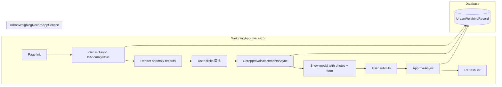
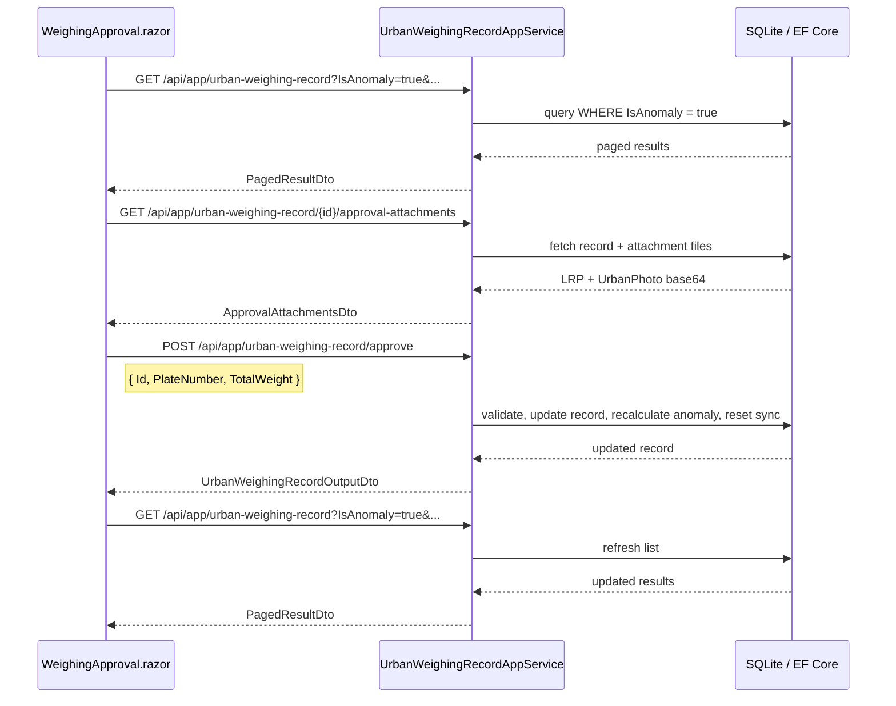

## Context

UrbanManagement is a Blazor Server application using ABP framework with LayUI CSS styling. The current `WeighingRecord.razor` page at `/weighing` serves two roles: general weighing record browsing and approval workflow processing. The approval flow involves opening a modal with LPR/Urban photo previews, editing plate number and weight, validating inputs, and calling `ApproveAsync` which updates the record, recalculates anomaly status, and resets government sync state.

Current architecture:
- `AdminLayout.razor` defines sidebar navigation (`_navItems` list) and a tab-bar system
- `WeighingRecord.razor` injects `IUrbanWeighingRecordAppService` and uses `GetListAsync` + `ApproveAsync` + `GetApprovalAttachmentsAsync`
- `UrbanWeighingRecordListInputDto` supports `PlateNumber`, `ProName`, `StartTime`, `EndTime` filters but NOT `IsAnomaly`
- `UrbanWeighingRecordAppService.GetListAsync` builds LINQ queries with optional filter predicates

## Goals / Non-Goals

**Goals:**
- Create a standalone `/weighing-approval` page dedicated to anomaly record approval
- Default filter to `IsAnomaly == true` with a toggle to show all records
- Preserve the exact same approval modal UX (photos, validation, submit flow)
- Clean WeighingRecord.razor to be a pure record-browsing page
- Add server-side `IsAnomaly` filtering to the API to avoid over-fetching

**Non-Goals:**
- Modifying the approval business logic (validation rules, anomaly recalculation, sync reset)
- Adding new database migrations or schema changes
- Changing the existing approval API contract (`ApproveAsync`, `GetApprovalAttachmentsAsync`)
- Adding role-based access control (all users see both pages)

## Decisions

### Decision 1: New Razor page vs. component extraction

**Choice**: Create a new `WeighingApproval.razor` page at `@page "/weighing-approval"`.

**Rationale**: The approval page needs its own route, its own default filter state, and its own navigation identity. A shared component would require complex parameterization to handle the different default filter behaviors and the presence/absence of the approval modal. A standalone page copies the list template once and then diverges cleanly.

**Alternative considered**: Extract a shared `WeighingRecordTable` component. Rejected because the two pages have meaningfully different column sets (approval page keeps the "操作" column, WeighingRecord removes it) and different filter defaults, making the shared component interface more complex than duplication.

### Decision 2: Server-side IsAnomaly filter vs. client-side

**Choice**: Add `IsAnomaly` (bool?) to `UrbanWeighingRecordListInputDto` and apply server-side in `GetListAsync`.

**Rationale**: The anomaly dataset may be large. Client-side filtering would require fetching all records. Server-side filtering is a one-line LINQ addition and keeps the page responsive. The parameter is nullable — `null` means no filter, preserving backward compatibility for WeighingRecord.razor.

### Decision 3: Filter toggle UI — dropdown vs. toggle button

**Choice**: A dropdown select with three options: "仅异常" (default), "全部记录", "仅正常".

**Rationale**: Three options map directly to `IsAnomaly = true`, `IsAnomaly = null`, and `IsAnomaly = false`. A dropdown fits naturally next to the existing search controls without adding a new UI pattern.

### Decision 4: Reusing SearchableSelect for project filter

**Choice**: Copy the project SearchableSelect into the new page identically.

**Rationale**: The SearchableSelect is self-contained within each page (no shared component). Copying is simpler than extracting and maintains independence. If future changes standardize it, both pages can be updated together.

## Architecture

```
UrbanManagement.App/Pages
├── AdminLayout.razor          (MODIFY: add nav item + tab)
├── WeighingRecord.razor       (MODIFY: remove approval code)
├── WeighingApproval.razor     (NEW: approval page)
├── Dashboard.razor
├── ProjectManagement.razor
└── ...

UrbanManagement.Core
├── Models
│   └── UrbanWeighingRecordDtos.cs   (MODIFY: add IsAnomaly filter)
├── Services
│   └── UrbanWeighingRecordAppService.cs  (MODIFY: apply IsAnomaly filter)
└── ...
```

## Data Flow



## API Sequence: Approval Flow



## Detailed Code Change Inventory

| File Path | Change Type | Change Description | Affected Module |
|-----------|-------------|-------------------|-----------------|
| `src/UrbanManagement.App/Pages/WeighingApproval.razor` | **CREATE** | New page: `@page "/weighing-approval"`, full table with anomaly filter toggle + approval modal. Copies list/search/pagination structure from WeighingRecord.razor, adds `IsAnomaly` filter state and toggle dropdown. Retains approval modal (lines 174-256) and all approval code-behind (lines 267-277 state, 495-576 methods). Removes `IsAnomaly`/`SyncType` badge columns from WeighingRecord.razor since that page no longer needs the approval column. | UI |
| `src/UrbanManagement.App/Pages/WeighingRecord.razor` | **MODIFY** | Remove: "操作" column header (line 103), approval button cell (lines 123-125), approval modal block (lines 174-256), all approval state fields (lines 268-277), approval methods: `OpenApprovalDialog`, `CloseApprovalDialog`, `HandleModalKeydown`, `SubmitApproval` (lines 495-576). Keep: all search, pagination, SearchableSelect, badge rendering code. | UI |
| `src/UrbanManagement.App/Pages/AdminLayout.razor` | **MODIFY** | Add `new("/weighing-approval", "异常审批")` to `_navItems` list (line 103-108). Tab bar auto-supports new route via `UpdateActiveRoute` logic. | Navigation |
| `src/UrbanManagement.Core/Models/UrbanWeighingRecordDtos.cs` | **MODIFY** | Add `public bool? IsAnomaly { get; set; }` to `UrbanWeighingRecordListInputDto` (after line 55). | DTO |
| `src/UrbanManagement.Core/Services/UrbanWeighingRecordAppService.cs` | **MODIFY** | In `GetListAsync` (after line 160, before count query): add `if (input.IsAnomaly.HasValue) { query = query.Where(r => r.IsAnomaly == input.IsAnomaly.Value); }` | Service |

## Risks / Trade-offs

- **Duplicated list template** → WeighingApproval.razor and WeighingRecord.razor share ~70% identical table markup. If table columns change, both pages must be updated. Mitigation: the pages are small (~300 lines each) and the column set will likely diverge further over time.
- **IsAnomaly filter name collision** → The existing `urban-anomaly-detection` spec defines tab-based filtering in MaterialClient (desktop), which is a different system. The new filter is UrbanManagement web-only. No confusion expected since they run in separate applications.
