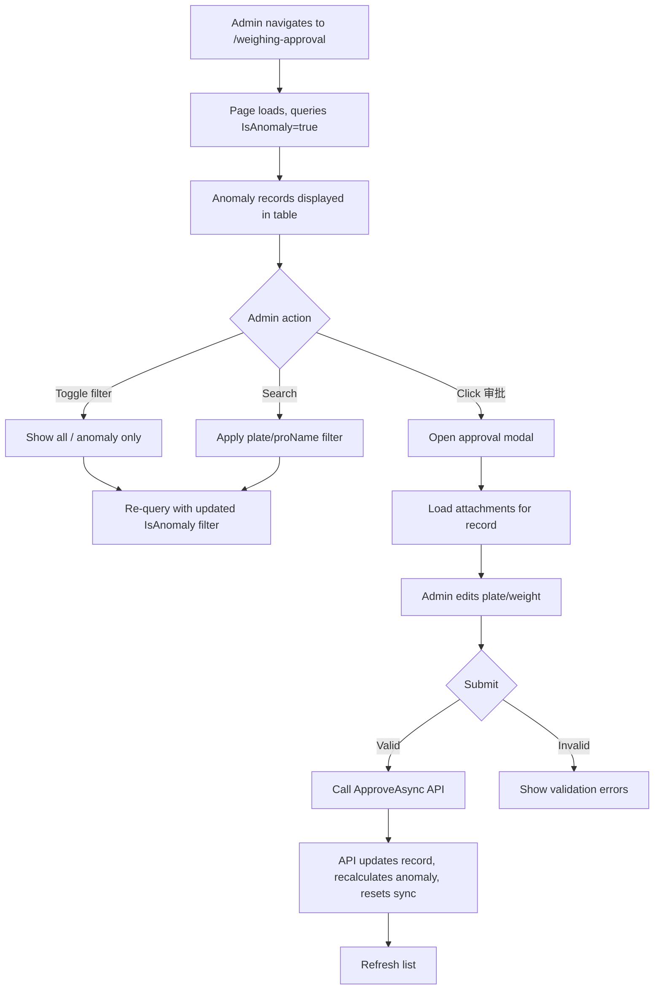

## Why

WeighingRecord.razor mixes approval workflow (anomaly-only focus) with general weighing record management (full CRUD browsing). Approval staff need a focused view of anomalous records, not the full dataset. Separating these concerns reduces cognitive load for each role and lowers maintenance cost by giving each page a single responsibility.

## What Changes

- Add a new `/weighing-approval` Blazor page with its own route, sidebar entry, and tab
- The new page reuses the same table layout, filters (plate number, project name), and pagination as WeighingRecord.razor
- The new page defaults to filtering `IsAnomaly == true` only; a toggle allows showing all records
- The approval modal (photo preview, plate/weight editing, validation, submit) is migrated in full to the new page
- **BREAKING**: Remove the "审批" button column and all approval dialog code from WeighingRecord.razor
- Add `IsAnomaly` filter parameter to `UrbanWeighingRecordListInputDto` so the API can server-side filter

## Interaction Flow



## UI Prototype

```
┌─ 萧山城管对接平台 ────────────────────────────────────────────────────────────┐
│ [仪表盘] [项目管理] [称重记录] [异常审批]  ← NEW nav item              刷新 全屏 │
├─────────────────────────────────────────────────────────────────────────────┤
│                                                                             │
│  ┌─ 异常审批 ─────────────────────────────────────────────────────────────┐  │
│  │  车牌号: [____________]  选择项目: [▼ 项目名     ]  [搜索]            │  │
│  │                                                        [仅异常 ▼]     │  │
│  ├───────────────────────────────────────────────────────────────────────┤  │
│  │  车牌号 │ 重量(kg) │ 称重时间 │ 项目名 │ 数据质量 │ 同步状态 │ 操作  │  │
│  │  ───────┼──────────┼──────────┼────────┼──────────┼──────────┼────── │  │
│  │  浙A123 │ 35,200   │ 06-05... │ XX工程 │  异常    │  待同步  │ [审批]│  │
│  │  浙B456 │  1,800   │ 06-05... │ YY路   │  异常    │  同步失败 │ [审批]│  │
│  │  ...    │  ...     │  ...     │  ...   │  ...     │  ...     │ ...  │  │
│  ├───────────────────────────────────────────────────────────────────────┤  │
│  │  共 42 条记录                        ‹ 1 2 3 ›                         │  │
│  └───────────────────────────────────────────────────────────────────────┘  │
│                                                                             │
│  ─── Approval Modal (on [审批] click) ─────────────────────────────────────  │
│  ┌─ 审批 - 浙A123 ──────────────────────────────────────────────────────┐  │
│  │  ┌──────────────┐  ┌──────────────┐                                 │  │
│  │  │ 车牌识别抓拍  │  │ 现场抓拍      │                                 │  │
│  │  │  [LPR img]   │  │  [Urban img]  │                                 │  │
│  │  └──────────────┘  └──────────────┘                                 │  │
│  │  车牌号 *  [浙A123____________]                                        │  │
│  │  重量(kg) * [35200____________]                                        │  │
│  │                                                      [取消] [提交审批] │  │
│  └──────────────────────────────────────────────────────────────────────┘  │
└─────────────────────────────────────────────────────────────────────────────┘
```

## Code Change Map

| File Path | Change Type | Change Reason | Impact Scope |
|-----------|-------------|---------------|--------------|
| `src/UrbanManagement.App/Pages/WeighingApproval.razor` | **NEW** | Independent approval page with anomaly filter, approval modal | UI layer |
| `src/UrbanManagement.App/Pages/WeighingRecord.razor` | **MODIFY** | Remove approval button column, approval modal markup, all approval dialog state/methods | UI layer |
| `src/UrbanManagement.App/Pages/AdminLayout.razor` | **MODIFY** | Add `/weighing-approval` nav item and tab support | Navigation |
| `src/UrbanManagement.Core/Models/UrbanWeighingRecordDtos.cs` | **MODIFY** | Add `IsAnomaly` filter to `UrbanWeighingRecordListInputDto` | API/DTO |
| `src/UrbanManagement.Core/Services/UrbanWeighingRecordAppService.cs` | **MODIFY** | Apply `IsAnomaly` filter in `GetListAsync` query | Service layer |

## Capabilities

### New Capabilities
- `independent-approval-page`: Standalone approval page at `/weighing-approval` with anomaly-only default filtering, full approval modal (photo preview, plate/weight editing, validation), and anomaly filter toggle
- `weighing-record-anomaly-filter`: Server-side `IsAnomaly` filter parameter on the weighing record list API

### Modified Capabilities
- `urbanmanagement-weighing-record-approval`: Approval UI moves from WeighingRecord.razor to the new dedicated page; no requirement changes to the approval workflow itself

## Impact

- **Navigation**: New sidebar entry "异常审批" → `/weighing-approval`, new tab in AdminLayout tab bar
- **API**: `GetListAsync` gains optional `IsAnomaly` bool filter — backward compatible (null = no filter)
- **WeighingRecord.razor**: Loses ~100 lines of approval markup + ~80 lines of approval code-behind; table loses one column
- **No database changes**: `IsAnomaly` already exists on entity and DTO
- **No new services**: Reuses existing `IUrbanWeighingRecordAppService.ApproveAsync` and `GetApprovalAttachmentsAsync`
