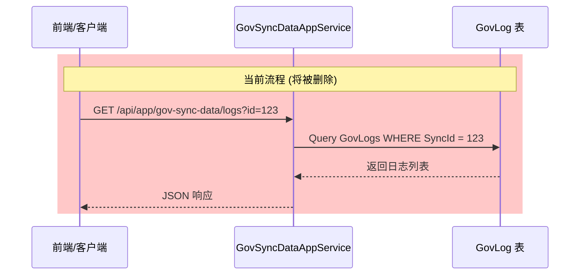
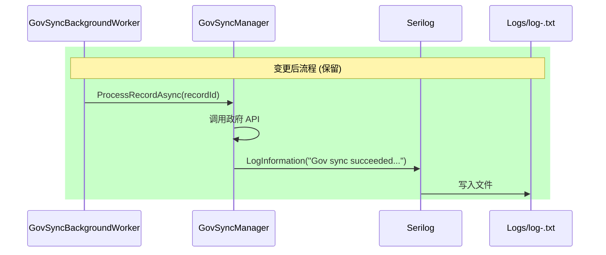

# Design: Remove GovLog

## Context

### Current State

GovLog 是 UrbanManagement 项目中用于记录政府同步操作的专用日志表。当前实现中：

- `GovLog` 实体存储同步操作的时间、结果、响应码、消息等信息
- `GovSyncManager.InsertLogAsync()` 在每次同步尝试后插入一条 GovLog 记录
- `GovSyncDataAppService.GetLogsAsync()` 提供查询日志的 API 端点
- Serilog 同时记录相同的同步信息到文件日志

### Constraints

- 必须保持 Serilog 日志的完整性（同步成功/失败/异常信息已记录）
- 数据库迁移需要安全处理 GovLogs 表的删除
- 需要确认前端没有依赖 logs API

### Stakeholders

- 系统维护者：简化代码维护
- 运维人员：通过 Serilog 日志排查问题
- 管理员：可能需要导出历史 GovLog 数据

## Goals / Non-Goals

**Goals:**
- 完全删除 GovLog 相关代码（实体、DTO、服务、API、数据库表）
- 统一使用 Serilog 作为唯一的日志记录机制
- 简化系统架构，减少维护成本

**Non-Goals:**
- 不修改 Serilog 配置（现有配置已满足需求）
- 不提供新的日志查询 UI（Serilog 文件日志可供运维查询）
- 不保留历史 GovLog 数据（如需保留，需手动导出）

## Decisions

### 1. 数据库迁移策略

**Decision**: 创建新的迁移删除 GovLogs 表，而不是修改初始迁移。

**Rationale**:
- 初始迁移 (`20260601094803_Initial`) 已经应用到生产环境
- 修改已应用的迁移会导致数据库历史不一致
- 新迁移 `RemoveGovLogEntity` 可以安全回滚

**Alternatives considered**:
- 修改初始迁移：被拒绝，因为初始迁移已应用
- 保留表但清空数据：被拒绝，仍需维护实体和代码

### 2. 日志记录增强

**Decision**: 在删除 GovLog 的同时，增强 Serilog 日志以记录上传参数和返回结果。

**Rationale**:
- GovLog 原本记录了 `SyncSource`（JSON payload）和 `SyncResult`、`SyncCode`、`SyncMsg`
- 删除 GovLog 后，这些信息必须通过 Serilog 保留
- Serilog 支持结构化日志，可通过 `@` 符号序列化对象
- 当前代码仅在异常时记录日志，需补充成功和失败的日志记录

**Implementation**:

在 `GovSyncManager.ProcessRecordAsync()` 中添加结构化日志记录：

```csharp
// 成功同步
await _logRepository.InsertAsync(log, autoSave: true);
// 替换为 ↓
_logger.LogInformation("Gov sync succeeded for record {RecordId}, Code={Code}, Msg={Msg}, Payload={@Payload}", 
    record.Id, response.Code, response.Msg, payload);

// 失败同步
await _logRepository.InsertAsync(log, autoSave: true);
// 替换为 ↓
_logger.LogWarning("Gov sync failed for record {RecordId}, Code={Code}, Msg={Msg}, Payload={@Payload}", 
    record.Id, response.Code, response.Msg, payload);

// 异常（已有，无需修改）
_logger.LogError(ex, "Failed to forward record {RecordId}", recordId);
```

**Log Content**:
- `RecordId`: 称重记录 ID
- `Code`: 政府 API 响应码
- `Msg`: 政府 API 响应消息
- `@Payload`: 上传的完整 JSON payload（结构化序列化）

**Log Levels**:
- Success: `LogInformation`
- Failed: `LogWarning`
- Exception: `LogError`

### 3. API 端点删除

**Decision**: 直接删除 `GetLogsAsync()` 方法，ABP 框架会自动移除对应的 HTTP 端点。

**Rationale**:
- `IGovSyncDataAppService` 实现了 `IApplicationService`，ABP 自动生成 API
- 删除方法后，API 端点自动消失
- 无需手动配置路由

### 4. 代码删除顺序

**Decision**: 按依赖关系自下而上删除代码。

**Rationale**:
- 避免编译错误
- 确保删除过程中代码保持可编译状态

**Order**:
1. 删除 `GovLogDto` 和 `GovSyncDataLogsInputDto`（最底层）
2. 删除 `GetLogsAsync()` 方法和接口定义
3. 删除 `GovLog` 实体
4. 从 `UrbanManagementDbContext` 移除 `DbSet<GovLog>`
5. 从 `GovSyncManager` 移除 `InsertLogAsync()` 调用
6. 创建迁移删除 GovLogs 表

## Detailed Code Changes

### File Change Map

| 文件路径 | 变更类型 | 变更说明 |
|---------|---------|---------|
| `src/UrbanManagement.Core/Entities/GovLog.cs` | 删除 | 删除 GovLog 实体类 |
| `src/UrbanManagement.Core/Models/GovLogDto.cs` | 删除 | 删除 GovLogDto 类 |
| `src/UrbanManagement.Core/Models/GovSyncDataQueryDtos.cs` | 修改 | 删除 `GovSyncDataLogsInputDto` 类 |
| `src/UrbanManagement.Core/Services/GovSyncDataAppService.cs` | 修改 | 删除 `GetLogsAsync()` 方法和 `_logRepository` 依赖 |
| `src/UrbanManagement.Core/Services/GovSyncManager.cs` | 修改 | 删除 `InsertLogAsync()` 方法及其调用 |
| `src/UrbanManagement.Core/EntityFrameworkCore/UrbanManagementDbContext.cs` | 修改 | 删除 `DbSet<GovLog>` 属性和 `OnModelCreating` 中的配置 |
| `src/UrbanManagement.Core/EntityFrameworkCore/Migrations/` | 新增 | 创建 `RemoveGovLogEntity` 迁移 |
| `src/UrbanManagement.Core/EntityFrameworkCore/Migrations/UrbanManagementDbContextModelSnapshot.cs` | 自动更新 | EF Core 更新快照 |

### Code Changes Detail

#### 1. Delete `GovLog.cs`

Complete file deletion.

#### 2. Modify `GovSyncDataQueryDtos.cs`

Delete the `GovSyncDataLogsInputDto` class:
```csharp
// DELETE THIS CLASS:
/// <summary>
///     政府同步日志查询输入 DTO
/// </summary>
public class GovSyncDataLogsInputDto : EntityDto<int>
{
}
```

#### 3. Modify `GovSyncDataAppService.cs`

Delete the interface method and implementation:
```csharp
// DELETE FROM INTERFACE:
/// <summary>
///     查询同步日志
/// </summary>
Task<ListResultDto<GovLogDto>> GetLogsAsync(GovSyncDataLogsInputDto input);

// DELETE FROM CLASS:
private readonly IRepository<GovLog, int> _logRepository;

public async Task<ListResultDto<GovLogDto>> GetLogsAsync(GovSyncDataLogsInputDto input)
{
    // ... entire method
}
```

#### 4. Modify `GovSyncManager.cs`

Delete `InsertLogAsync()` method and its calls:
```csharp
// DELETE THIS METHOD:
private async Task InsertLogAsync(long recordId, object? payload, string result, string code, string msg)
{
    var log = new GovLog { /* ... */ };
    await _logRepository.InsertAsync(log, autoSave: true);
}

// DELETE THESE CALLS:
await InsertLogAsync(record.Id, payload, "Success", response.Code.ToString(), response.Msg ?? "Sync completed");
await InsertLogAsync(record.Id, payload, "Failed", response.Code.ToString(), response.Msg ?? "Sync failed");
await InsertLogAsync(recordId, null, "Exception", "-1", ex.Message);
```

Remove `_logRepository` dependency:
```csharp
// DELETE FROM CONSTRUCTOR:
private readonly IRepository<GovLog, int> _logRepository;
```

#### 5. Modify `UrbanManagementDbContext.cs`

Delete DbSet and configuration:
```csharp
// DELETE:
public DbSet<GovLog> GovLogs => Set<GovLog>();

// DELETE FROM OnModelCreating:
builder.Entity<GovLog>(b =>
{
    b.ConfigureByConvention();
    b.Property(e => e.SyncMsg).HasMaxLength(2000);
});
```

#### 6. Create Migration

```bash
dotnet ef migrations remove RemoveGovLogEntity --project src/UrbanManagement.Core
```

Generated migration should include:
```csharp
protected override void Up(MigrationBuilder migrationBuilder)
{
    migrationBuilder.DropTable(
        name: "GovLogs");
}

protected override void Down(MigrationBuilder migrationBuilder)
{
    migrationBuilder.CreateTable(
        name: "GovLogs",
        columns: table => new
        {
            // ... GovLog columns
        });
}
```

## Risks / Trade-offs

| Risk | Impact | Mitigation |
|------|--------|-----------|
| 历史日志数据丢失 | 中 | 在删除前提供 SQL 导出脚本 |
| 前端依赖 logs API | 中 | 确认前端无调用；如有，需修改前端 |
| 日志查询不便 | 低 | Serilog 文件日志支持 grep/search |
| 回滚复杂度 | 低 | 迁移支持 Down() 方法，可恢复表 |

### Trade-off Analysis

**GovLog vs Serilog**:

| 方面 | GovLog | Serilog |
|------|--------|---------|
| 存储位置 | 数据库 | 文件系统 |
| 查询方式 | SQL/LINQ | grep/日志工具 |
| 结构化 | 强类型 | 结构化日志 |
| 维护成本 | 高（需维护实体、迁移） | 低（配置一次） |
| 性能影响 | 每次同步写入数据库 | 异步写入文件 |

## Migration Plan

### Pre-Deployment

1. **数据备份**（可选）:
   ```sql
   -- 导出 GovLog 数据
   COPY GovLogs TO 'govlog_backup.csv' CSV HEADER;
   ```

2. **前端确认**: 确认前端代码无对 `/api/app/gov-sync-data/logs` 的调用

### Deployment Steps

1. 编译并部署新代码
2. 应用 EF Core 迁移:
   ```bash
   dotnet ef database update --project src/UrbanManagement.Core
   ```

### Rollback Strategy

如果需要回滚：
1. 回退代码版本
2. 运行迁移 Down 方法:
   ```bash
   dotnet ef database update [previous-migration] --project src/UrbanManagement.Core
   ```

## Open Questions

1. **是否需要提供历史数据导出工具？**
   - 当前计划：提供 SQL 脚本，由运维手动执行
   - 待确认：是否需要内置导出功能

2. **Serilog 日志保留策略是否需要调整？**
   - 当前配置：30 天滚动保留
   - 待确认：是否需要延长保留期或归档

## API Impact Visualization

**删除的 API 端点**:
```
GET /api/app/gov-sync-data/logs?id={syncDataId}
```

**时序图对比**:





## Testing Strategy

### Unit Tests

无需新增单元测试（删除功能不需要测试）

### Integration Tests

验证删除后系统正常：
1. 政府同步功能正常工作
2. Serilog 日志正确记录
3. 数据库迁移成功

### Manual Tests

1. 触发一次政府同步，检查 Serilog 日志文件
2. 尝试访问已删除的 API 端点，应返回 404
3. 检查数据库，确认 GovLogs 表已删除
