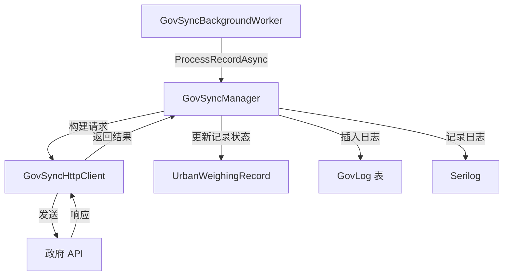
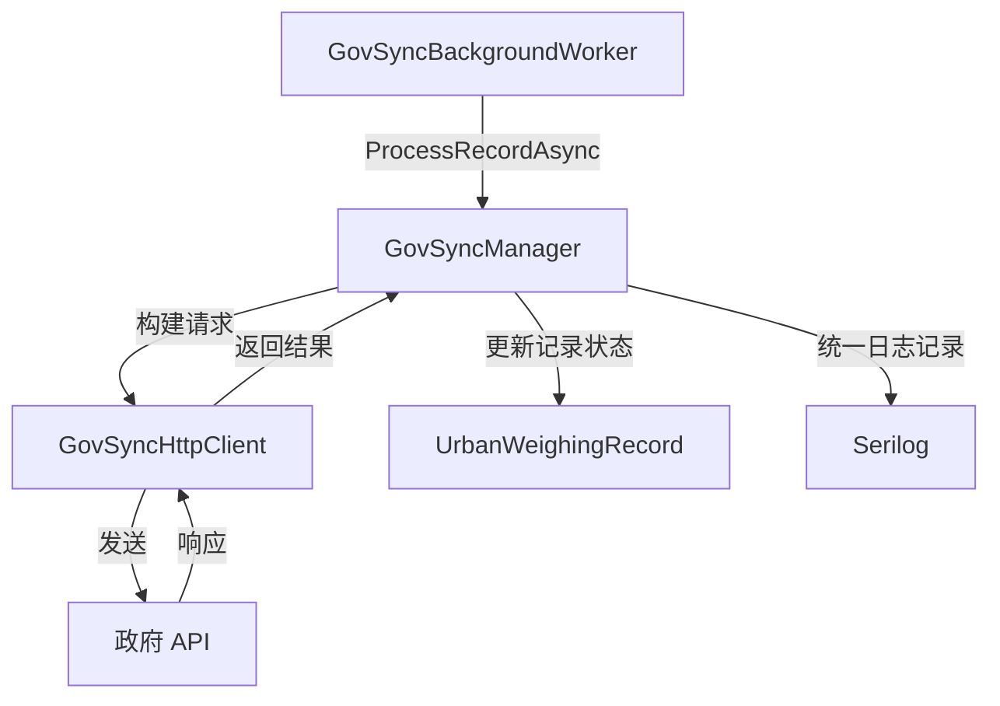

# Proposal: Remove GovLog

## Why

GovLog 功能作为政府同步的专用日志记录机制，使用频率低且维护成本高。其提供的详细信息（同步时间、结果、响应码等）完全可以通过现有的 Serilog 日志框架记录和查询。保留 GovLog 导致系统中存在两套日志机制，增加了架构复杂度和数据库存储负担。

删除 GovLog 可以：
- 统一日志记录机制，简化系统架构
- 减少数据库存储占用（GovLogs 表及相关数据）
- 降低代码维护负担（实体、DTO、服务、API 层的相关代码）
- 避免功能重复带来的认知负担

## What Changes

- **BREAKING**: 删除 `GovLog` 实体类 (`src/UrbanManagement.Core/Entities/GovLog.cs`)
- **BREAKING**: 删除 `GovLogDto` 类 (`src/UrbanManagement.Core/Models/GovLogDto.cs`)
- **BREAKING**: 删除 `GovSyncDataAppService.GetLogsAsync()` 方法及对应的 API 端点
- **BREAKING**: 从 `UrbanManagementDbContext` 中移除 `DbSet<GovLog>` 和相关配置
- **BREAKING**: 从 `GovSyncManager.InsertLogAsync()` 中移除 GovLog 插入逻辑
- 删除初始迁移中创建的 `GovLogs` 表定义
- 同步更新 `gov-sync-worker` spec，移除 Sync logging 需求

**注意**: 现有 GovLog 数据将被删除。如需保留历史日志，应在删除前导出数据。

## Capabilities

### Modified Capabilities

- `gov-sync-worker`: 移除 "Sync logging" 需求，统一使用 Serilog 记录同步操作日志

## Impact

### Affected Components

| 组件层级 | 受影响项 | 变更类型 | 说明 |
|---------|---------|---------|------|
| 数据层 | `GovLog` 实体 | 删除 | 专用日志实体类 |
| 数据层 | `GovLogs` 表 | 删除 | 数据库表及索引 |
| 数据层 | `UrbanManagementDbContext` | 修改 | 移除 DbSet 和实体配置 |
| 数据层 | EF Core 迁移 | 修改 | 初始迁移包含 GovLogs 表定义 |
| 业务层 | `GovSyncManager` | 修改 | 移除 `InsertLogAsync()` 调用 |
| 应用层 | `GovSyncDataAppService` | 修改 | 移除 `GetLogsAsync()` 方法 |
| 应用层 | `IGovSyncDataAppService` | 修改 | 移除 `GetLogsAsync()` 接口定义 |
| DTO 层 | `GovLogDto` | 删除 | 日志输出 DTO |
| DTO 层 | `GovSyncDataLogsInputDto` | 删除 | 日志查询输入 DTO |
| API 层 | `GET /api/app/gov-sync-data/logs` | 删除 | ABP 自动生成的 HTTP 端点 |
| Spec | `gov-sync-worker` | 修改 | 移除 Sync logging 需求 |

### 数据流变更

**变更前** (当前流程):

**变更后** (目标流程):

### API 影响

删除的 HTTP 端点:
- `GET /api/app/gov-sync-data/logs?id={syncDataId}` - 查询同步日志

### 日志查询替代方案

删除 GovLog 后，同步日志查询可通过 Serilog 实现：

**Serilog 日志内容** (已在 `GovSyncManager` 中记录):
- 成功同步: `"Gov sync succeeded for record {RecordId}, Code={Code}, Msg={Msg}"`
- 失败同步: `"Gov sync failed for record {RecordId}, Code={Code}, Msg={Msg}"`
- 异常: `"Failed to forward record {RecordId}"` (带 Exception 详情)

**Serilog 日志位置**:
- 文件: `Logs/log-.txt` (按日滚动，保留 30 天)
- 级别: Information (成功/失败), Error (异常)

### 风险评估

| 风险项 | 影响 | 缓解措施 |
|-------|------|---------|
| 历史日志数据丢失 | 中 | 删除前提供数据导出脚本 |
| 前端依赖 logs API | 低 | ABP 自动生成 API，前端需确认无调用 |
| 同步问题排查困难 | 低 | Serilog 日志已包含完整信息 |
