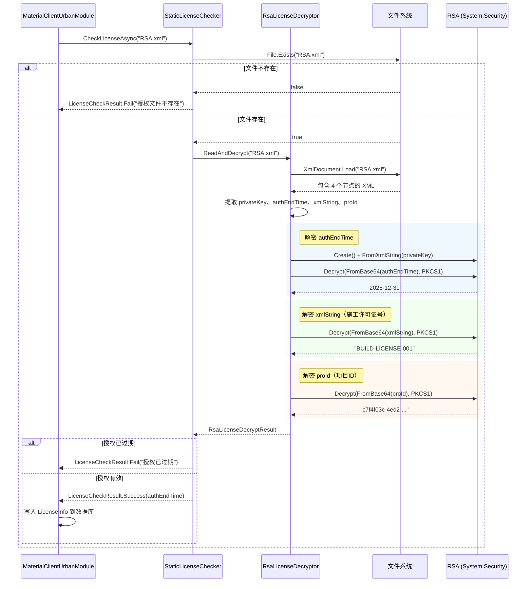

## 背景

MaterialClient.Urban 使用 ABP 模块架构，`IStaticLicenseChecker` 作为授权接口。当前实现（`StaticLicenseChecker`）返回硬编码测试数据。本次变更将其替换为基于 RSA.xml 文件的离线授权机制，与 Fdsoft.Weight.GovClient 中已有的生产模式保持一致。

目标框架为 .NET 10。代码库使用 ABP DI（`ISingletonDependency`、`ITransientDependency`）、Serilog 日志，服务约定存放在 `MaterialClient.Common/Services/` 目录下。当前代码库中不存在任何 RSA 或 XML 解析相关代码。

RSA.xml 格式（由授权服务器生成，部署到应用根目录）：

```xml
<?xml version="1.0" encoding="utf-8"?>
<config>
  <privateKey>&lt;RSAKeyValue&gt;...&lt;/RSAKeyValue&gt;</privateKey>
  <authEndTime>Base64(RSA_Encrypt(authEndTimeDateTime))</authEndTime>
  <xmlString>Base64(RSA_Encrypt(BuildLicenseNo))</xmlString>
  <proId>Base64(RSA_Encrypt(proIdString))</proId>
</config>
```

参考实现：GovClient 的 `RSACryption` 使用 `RSACryptoServiceProvider.FromXmlString(true)` 加载私钥，使用 PKCS1 v1.5 填充进行解密。

## 目标 / 非目标

**目标：**
- 用真实的 RSA.xml 文件离线授权替换硬编码授权
- 匹配 GovClient RSA 授权模式（XML 解析 → 私钥加载 → 解密 → 验证）
- 保持 `IStaticLicenseChecker` 接口不变，使 `MaterialClientUrbanModule` 启动流程无需修改
- 提供清晰、可测试的 RSA 操作工具类

**非目标：**
- RSA.xml 生成（服务端职责，由授权 API 处理）
- 向后兼容 `.lic` 文件格式
- 从 RSA.xml 填充 ProName/FdBuildLicenseNo（这些字段在 XML 中不存在；ProId 和 BuildLicenseNo 从加密节点解密获取）

## 设计决策

### D1: RsaLicenseDecryptor 作为静态工具类（非可注入服务）

**决策**：`RsaLicenseDecryptor` 为静态类，所有方法均为静态方法，不注册 DI。

**理由**：RSA 解密是无状态的纯计算操作。GovClient 使用相同模式（`RSACryption` 上的静态方法）。添加接口 + DI 注册只会增加无意义的复杂度 —— `StaticLicenseChecker` 是唯一的消费者，且它本身已经是 DI 注册的服务边界。

**备选方案**：可注入的 `IRsaLicenseDecryptor` 服务。未采用，原因：加密逻辑在生产环境中无需替换，测试通过生成测试用 RSA.xml 文件实现，而非 mock 解密器。

### D2: 现代 RSA API + PKCS1 填充

**决策**：使用 `RSA.Create()` + `FromXmlString()` + `Decrypt(bytes, RSAEncryptionPadding.Pkcs1)`。

**理由**：`RSA.Create()` 是现代 .NET 工厂方法（替代 `RSACryptoServiceProvider`）。`FromXmlString()` 在 .NET 5+（含 .NET 10）上可用。PKCS1 v1.5 填充与 GovClient 的 `Decrypt(bytes, false)` 参数匹配。RSA 密钥长度由 XML 内容决定，无需在代码中指定。

### D3: 使用 XmlDocument 解析 XML（非 XDocument/LINQ）

**决策**：使用 `System.Xml.XmlDocument` + `SelectSingleNode()` XPath 查询。

**理由**：与 GovClient 参考实现完全一致。简单的加载 + 节点选择对于 4 节点 XML 结构已足够，无需引入 LINQ-to-XML 复杂度。

### D4: RsaLicenseDecryptResult 使用 record 类型

**决策**：`ReadAndDecrypt()` 返回 `public record RsaLicenseDecryptResult(DateTime AuthEndTime, string BuildLicenseNo, string ProId, bool IsExpired, int DaysRemaining)`。

**理由**：.NET 10 / 现代 C# —— record 是不可变结果类型的惯用写法。将所有解密数据封装在一个返回值中，由 `StaticLicenseChecker` 决定如何映射到 `LicenseCheckResult`。

### D5: LicenseCheckResult 返回部分数据（RSA.xml 不含 ProName）

**决策**：`StaticLicenseChecker` 返回的 `LicenseCheckResult` 包含解密后的真实 `AuthEndTime`、`BuildLicenseNo`（从 xmlString 解密）和 `ProId`（从 proId 节点解密后解析为 Guid），但 `ProName = null`、`FdBuildLicenseNo = null`（初始化为空）。

**理由**：RSA.xml 包含授权时间、施工许可证号（BuildLicenseNo）和项目ID（ProId）。`MaterialClientUrbanModule` 启动流程会将 `LicenseCheckResult` 携带的数据写入 —— ProId、BuildLicenseNo、AuthEndTime 现在都有真实值。ProName 和 FdBuildLicenseNo 在 XML 中不存在，保持为 null。

### D6: 错误处理策略

**决策**：所有错误（文件缺失、XML 格式错误、解密失败、解析错误）均返回 `LicenseCheckResult.Fail()` 并附带描述信息。不向启动流程传播异常。

**理由**：启动流程将授权检查视为非阻塞操作 —— 记录警告日志后继续启动。在 `StaticLicenseChecker` 中捕获所有异常可维持此契约。

## 架构图

```
组件层级
├── MaterialClientUrbanModule（ABP 模块，启动编排）
│   └── IStaticLicenseChecker（接口，通过 ABP DI 注入）
│       └── StaticLicenseChecker（单例，重写）
│           └── RsaLicenseDecryptor（静态工具类，新增）
│               ├── System.Xml.XmlDocument（XML 解析）
│               └── System.Security.Cryptography.RSA（解密）
│
├── RsaLicenseDecryptResult（record，新增 —— 承载解密数据）
│
└── LicenseCheckResult（已有，不变 —— 承载结果传递给模块）
```

## 数据流

```
RSA.xml 文件
  │
  ├── <privateKey>  ──► FromXmlString() ──► RSA 解密器实例
  │
  ├── <authEndTime> ──► Base64 解码 ──► RSA 解密 (PKCS1) ──► "2026-12-31"
  │                                                                │
  │                                                          解析 → DateTime
  │                                                                │
  │                                                         ┌──────┴──────┐
  │                                                         │ IsExpired?   │
  │                                                         │ DaysRemaining│
  │                                                         └─────────────┘
  │
  ├── <xmlString>   ──► Base64 解码 ──► RSA 解密 (PKCS1) ──► BuildLicenseNo 字符串
  │
  └── <proId>       ──► Base64 解码 ──► RSA 解密 (PKCS1) ──► ProId 字符串 ──► Guid.Parse → Guid
```

## 时序图



## 详细代码变更清单

| 文件路径 | 变更类型 | 变更说明 | 影响模块 |
|---|---|---|---|
| `src/MaterialClient.Common/Services/RsaLicenseDecryptor.cs` | **新增** | 静态工具类：`Decrypt(privateKeyXml, encryptedBase64)` 和 `ReadAndDecrypt(xmlFilePath)` 方法 + `RsaLicenseDecryptResult` record | MaterialClient.Common/Services |
| `src/MaterialClient.Common/Services/StaticLicenseChecker.cs` | **重写** | 移除硬编码测试数据，调用 `RsaLicenseDecryptor.ReadAndDecrypt()`，将结果映射为 `LicenseCheckResult`。文件缺失、解密失败、授权过期时返回失败 | MaterialClient.Common/Services |
| `src/MaterialClient.Common/Configuration/SystemSettings.cs` | **修改** | `LicenseFilePath` 默认值从 `"license.lic"` 改为 `"RSA.xml"`（第 95 行） | MaterialClient.Common/Configuration |
| `src/MaterialClient.Common/Services/IStaticLicenseChecker.cs` | **不变** | 接口签名 `Task<LicenseCheckResult> CheckLicenseAsync(string)` 保持不变 | MaterialClient.Common/Services |
| `src/MaterialClient.Urban/MaterialClientUrbanModule.cs` | **不变** | 启动流程通过接口抽象工作，无需代码修改 | MaterialClient.Urban |
| `tests/.../StaticLicenseCheckerTests.cs` | **修改** | 重写测试，使用测试生成的 RSA.xml 文件。覆盖：有效授权、已过期授权、文件缺失、XML 格式错误、加密数据无效 | Tests |

## 风险与权衡

**[RSA 密钥从 XML 加载]** → RSA.xml 中的 `<privateKey>` 使用 .NET 的 `ToXmlString(true)` 格式（`<RSAKeyValue>` 含 mod/exp/P/Q/DP/DQ/InverseQ/D）。此格式与 .NET 10 上的 `RSA.FromXmlString()` 兼容。无需缓解措施。

**[ProName/FdBuildLicenseNo 为默认值]** → 模块启动会将 null 写入 ProName 和 FdBuildLicenseNo。ProId 和 BuildLicenseNo 从 RSA.xml 解密获取真实值。 → 根据"无需考虑向后兼容"可接受。如后续需要项目名称，可在启动后从平台 API 获取。

**[PKCS1 v1.5 填充]** → 较旧的填充方案，但与 GovClient 和现有 RSA.xml 数据匹配。使用 OAEP 需要重新生成密钥。 → 无需缓解；填充方式由数据格式决定，非我们的选择。
