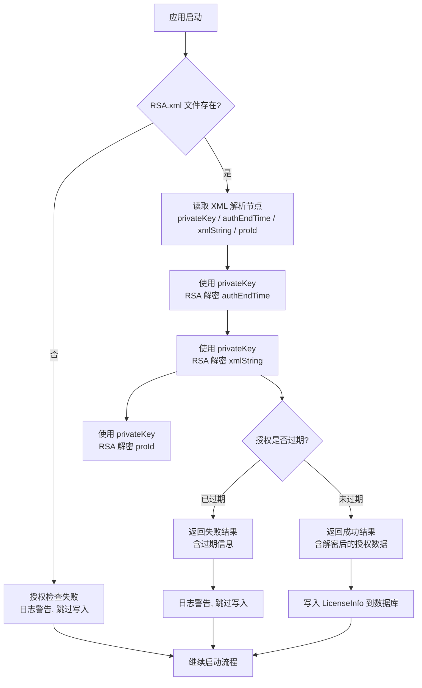

## Why

MaterialClient.Urban 当前使用硬编码测试数据作为授权验证（`StaticLicenseChecker` 返回固定值），不具备真实的授权检查能力。需要参考 Fdsoft.Weight.GovClient 已有的 RSA.xml 授权模式，将授权实现改为从 RSA.xml 文件中读取加密数据并使用 RSA 私钥解密验证，实现真实的离线授权机制。

## What Changes

- **BREAKING** `StaticLicenseChecker` 从返回硬编码测试数据改为读取 RSA.xml 文件，使用 RSA 私钥解密 `<authEndTime>`、`<xmlString>`、`<proId>` 节点，验证授权有效期
- 新增 RSA 解密工具类（参考 GovClient 的 `RSACryption` 模式），封装 XML 读取、私钥解析、RSA 解密、时间验证逻辑
- `SystemSettings.LicenseFilePath` 默认值从 `"license.lic"` 改为 `"RSA.xml"`
- `MaterialClientUrbanModule` 启动流程中的授权检查逻辑适配新返回结构（解密后的授权数据写入 `LicenseInfo`）
- 现有 `static-license-test-data` 规格中的硬编码测试数据需求将被替换为 RSA XML 解密验证需求

## Capabilities

### New Capabilities

- `rsa-xml-license`: 基于 RSA.xml 文件的授权读取与解密验证能力。从 XML 文件中解析 RSA 私钥、加密的授权过期时间、加密的施工许可证号和加密的项目ID，使用私钥解密并验证授权状态（过期时间判断、剩余天数计算）。

### Modified Capabilities

- `static-license-test-data`: 需求将从 "StaticLicenseChecker 返回硬编码测试数据" 变更为 "StaticLicenseChecker 从 RSA.xml 读取并解密授权数据"。接口签名 `IStaticLicenseChecker.CheckLicenseAsync(string)` 保持不变，实现逻辑完全替换。

## Impact

| 维度 | 影响范围 |
|---|---|
| **代码文件** | `StaticLicenseChecker.cs`（重写实现）、新增 `RsaLicenseDecryptor.cs`、`SystemSettings.cs`（默认值变更）、`MaterialClientUrbanModule.cs`（适配逻辑微调） |
| **数据格式** | 授权文件从 `.lic` 变更为 `RSA.xml`（包含 privateKey、authEndTime、xmlString、proId 四个加密节点） |
| **依赖项** | 无新增 NuGet 包（使用 `System.Security.Cryptography` 内置 RSA + `System.Xml` XmlDocument） |
| **向后兼容** | 无需兼容，旧的 `.lic` 文件格式不再支持 |
| **测试** | 现有 `StaticLicenseCheckerTests` 需要适配新的 RSA XML 验证逻辑 |
| **运行时** | RSA.xml 文件需在应用启动前部署到应用根目录，文件缺失时授权检查失败（应用可继续启动但不写入授权数据） |

### Interaction Flow

### Code Change Map

| File | Change Type | Description |
|---|---|---|
| `MaterialClient.Common/Services/RsaLicenseDecryptor.cs` | **NEW** | RSA 解密工具类：XML 读取、私钥解析、RSA 解密（authEndTime、xmlString、proId）、时间验证 |
| `MaterialClient.Common/Services/StaticLicenseChecker.cs` | **REWRITE** | 注入 `RsaLicenseDecryptor`，从 RSA.xml 读取解密授权数据替代硬编码 |
| `MaterialClient.Common/Services/IStaticLicenseChecker.cs` | **UNCHANGED** | 接口签名保持 `Task<LicenseCheckResult> CheckLicenseAsync(string)` |
| `MaterialClient.Common/Configuration/SystemSettings.cs` | **MODIFY** | `LicenseFilePath` 默认值 `"license.lic"` → `"RSA.xml"` |
| `MaterialClient.Urban/MaterialClientUrbanModule.cs` | **UNCHANGED** | 启动流程已通过接口解耦，无需修改 |
| `tests/.../StaticLicenseCheckerTests.cs` | **MODIFY** | 测试适配 RSA XML 验证逻辑，需构造测试用 RSA.xml |
