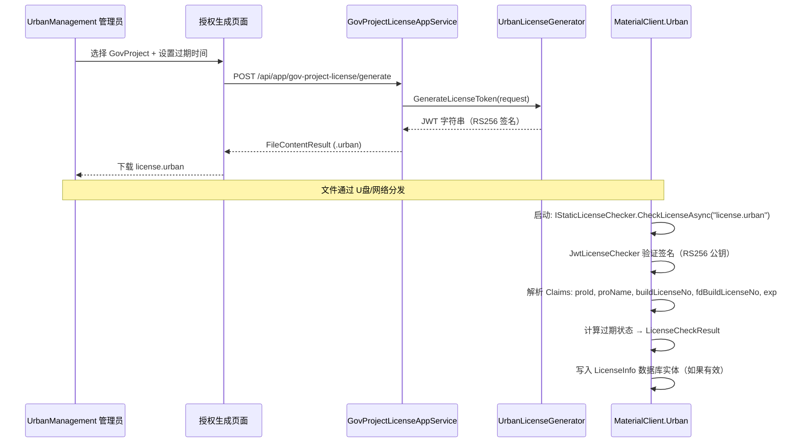

## Why

当前离线授权使用 RSA.xml 文件，其中 RSA 私钥与加密字段一同嵌入文件，导致方案可被伪造且与 XML 解析强耦合。迁移至 JWT (RS256) 后，签名密钥与令牌分离（私钥保留在服务端，公钥嵌入客户端），可利用成熟的 .NET 官方库支持，并支持更丰富的 Claims 而不受格式限制。

## What Changes

- **BREAKING**: 将 RSA.xml 离线授权替换为基于 JWT 的 `.urban` 令牌文件，涉及 MaterialClient 和 UrbanManagement 两个仓库
- 在 MaterialClient 中新增 `JwtLicenseChecker`，实现 `IStaticLicenseChecker` — 验证 JWT 签名并提取 Claims
- 从 MaterialClient 中移除 `RsaLicenseDecryptor`（静态工具类）和 `StaticLicenseChecker`（RSA.xml 实现）
- 在 UrbanManagement 中新增 `IUrbanLicenseGenerator` + `UrbanLicenseGenerator` — 使用 RS256 私钥签名 JWT
- 在 UrbanManagement 中新增管理后台页面，用于选择 GovProject 并下载 `.urban` 授权文件
- 两个仓库均新增 `System.IdentityModel.Tokens.Jwt` NuGet 依赖
- 将 `SystemSettings.LicenseFilePath` 默认值从 `"RSA.xml"` 改为 `"license.urban"`

## Capabilities

### New Capabilities

- `jwt-offline-license`: 客户端 JWT 授权验证 — 读取 `.urban` 文件、使用内嵌公钥验证 RS256 签名、解析 Claims（proId、proName、buildLicenseNo、fdBuildLicenseNo、exp）、计算过期状态、通过 `IStaticLicenseChecker` 返回 `LicenseCheckResult`
- `jwt-license-generation`: 服务端 JWT 授权生成 — 接收项目选择和过期时间、使用 RS256 私钥签名 JWT、通过 API 端点 + Blazor 管理后台提供 `.urban` 文件下载

### Modified Capabilities

- `rsa-xml-license`: 已被取代 — 所有需求由 `jwt-offline-license` 替代。`RsaLicenseDecryptor.ReadAndDecrypt()` 和 `RsaLicenseDecryptor.Decrypt()` 方法以及 `RsaLicenseDecryptResult` 记录类型将被完整移除。

## Impact

### Code Change Map

| 文件路径 | 变更类型 | 变更原因 |
|---------|---------|---------|
| **MaterialClient** | | |
| `MaterialClient.Common/Services/RsaLicenseDecryptor.cs` | 删除 | 已被 JWT 验证替代，不再需要 |
| `MaterialClient.Common/Services/StaticLicenseChecker.cs` | 删除 | 已被 `JwtLicenseChecker` 替代 |
| `MaterialClient.Common/Services/IStaticLicenseChecker.cs` | 保留 | 接口设计良好，是干净的切换点 — 不做修改 |
| `MaterialClient.Common/Services/JwtLicenseChecker.cs` | 新增 | JWT 验证实现，实现 `IStaticLicenseChecker` |
| `MaterialClient.Common/Configuration/SystemSettings.cs` | 编辑 | `LicenseFilePath` 默认值 `"RSA.xml"` → `"license.urban"` |
| `MaterialClient.Urban/appsettings.json` | 编辑 | 新增 `Jwt:PublicKey` PEM 配置 |
| `MaterialClient.Urban/MaterialClientUrbanModule.cs` | 保留 | 启动时注入逻辑不变（解析 `IStaticLicenseChecker`） |
| `MaterialClient.Common/Entities/LicenseInfo.cs` | 保留 | 数据库实体结构不变 |
| `MaterialClient.Common/Services/Authentication/LicenseService.cs` | 保留 | 在线授权路径 — 独立于本次变更 |
| `Directory.Packages.props` | 编辑 | 新增 `System.IdentityModel.Tokens.Jwt` 包版本 |
| **UrbanManagement** | | |
| `UrbanManagement.Core/Services/UrbanLicenseGenerator.cs` | 新增 | JWT 签名服务，使用 RS256 私钥 |
| `UrbanManagement.Core/Services/GovProjectLicenseAppService.cs` | 新增 | API 端点，用于生成/下载 `.urban` 文件 |
| `UrbanManagement.Core/Models/UrbanLicenseRequestDto.cs` | 新增 | 授权生成请求输入 DTO |
| Blazor UI: 授权生成页面/组件 | 新增 | 管理后台页面，选择项目并下载 `.urban` |
| `UrbanManagement.App/appsettings.json` | 编辑 | 新增 `Jwt:PrivateKey` PEM 配置 |
| `Directory.Packages.props` | 编辑 | 新增 `System.IdentityModel.Tokens.Jwt` 包版本 |

### Dependencies

- 新增 NuGet: `System.IdentityModel.Tokens.Jwt`（两个仓库）
- 需生成 RSA 密钥对（2048 位）— 私钥配置在 UrbanManagement，公钥配置在 MaterialClient

### Systems Affected

- **MaterialClient.Urban 启动**: 离线授权检查现在读取 `.urban` 而非 `RSA.xml`
- **UrbanManagement 管理后台**: 新增授权文件生成功能
- **现有在线同步**（SignalR `GetClientProjectLicenseInfo`）：不变 — 继续从服务端刷新 `LicenseInfo` 字段

### Interaction Flow



### UI Prototype: 授权生成页面 (UrbanManagement)

```
┌──────────────────────────────────────────────────────────────┐
│  生成离线授权                                          [×] │
├──────────────────────────────────────────────────────────────┤
│                                                              │
│  项目 *                                                      │
│  ┌──────────────────────────────────────────────────────────┐ │
│  │ ▼ 选择项目...                                              │ │
│  └──────────────────────────────────────────────────────────┘ │
│                                                              │
│  项目名称: 测试项目A                                           │
│  施工许可证号: BL-2026-001                                      │
│  授权截止时间: 2027-12-31                                       │
│                                                              │
│  ─────────────────────────────────────────────────────────── │
│                                                              │
│  授权过期日期 *                                                │
│  ┌──────────────────────────────────────────────────────────┐ │
│  │ 2027-12-31                                        [📅]   │ │
│  └──────────────────────────────────────────────────────────┘ │
│                                                              │
│                         [生成并下载 .urban]                     │
│                                                              │
└──────────────────────────────────────────────────────────────┘
```

<!-- reasoning-annotate: auto-generated — openspec/reasoning-categories.yaml -->
## Reasoning Annotations

**Classification source**: `openspec/reasoning-categories.yaml`
**Artifact type**: proposal
**Categories active**: 17 / 20
**Annotations found**: 9

### Summary by Domain
| Domain | Categories matched | Annotation count |
|--------|-------------------|-----------------|
| 技术   | auth-license, abp-module, data-model, ui-architecture | 6 |
| 业务   | gov-compliance | 1 |
| 通用   | cross-repo, scope-decision | 2 |

### Coverage metrics
- Reasoning passages detected: 11
- Matched to subscribed categories: 9
- Unmatched passages: 2

---

### auth-license ⬆️ HIGH
**Location**: "Why — 第一段"
> RSA 私钥与加密字段一同嵌入文件，导致方案可被伪造且与 XML 解析强耦合

当前方案将签名能力（私钥）与授权数据同文件分发，违反密钥分离原则。JWT RS256 非对称签名模型是直接对症的改进 — 客户端只持公钥无法伪造。

### auth-license ⬆️ HIGH
**Location**: "Why — 第二段"
> 迁移至 JWT (RS256) 后，签名密钥与令牌分离（私钥保留在服务端，公钥嵌入客户端）

密钥与令牌分离是非对称签名的基本安全优势，直接消除伪造风险并简化客户端信任模型。私钥不离开 UrbanManagement 服务端。

### cross-repo ⬆️ HIGH
**Location**: "What Changes — BREAKING 变更"
> 将 RSA.xml 离线授权替换为基于 JWT 的 .urban 令牌文件，涉及 MaterialClient 和 UrbanManagement 两个仓库

跨仓库 BREAKING 变更需要协调部署顺序 — UrbanManagement 先部署（获得生成 .urban 能力），MaterialClient 随后更新（消费 .urban），否则离线验证中断。

### abp-module ◉ MEDIUM
**Location**: "Impact / Code Change Map — IStaticLicenseChecker"
> 接口设计良好，是干净的切换点 — 不做修改

ABP DI 容器通过 `IStaticLicenseChecker` 解析单例 — 接口不变意味着 `MaterialClientUrbanModule` 启动注入逻辑零修改，是策略模式切换的最佳切入点。

### data-model ◉ MEDIUM
**Location**: "Why"
> 支持更丰富的 Claims 而不受格式限制

JWT 标准声明(exp, iss, aud) + 自定义业务声明(proId, proName, fdBuildLicenseNo) 的混合设计，比 RSA.xml 自定义 XML 字段更可扩展，消除了格式耦合。

### auth-license ◉ MEDIUM
**Location**: "Why"
> 可利用成熟的 .NET 官方库支持

选择 `System.IdentityModel.Tokens.Jwt` 而非第三方库，与 ABP 的 Microsoft 技术栈保持一致。单包同时覆盖生成(UrbanManagement)和验证(MaterialClient)简化版本对齐。

### gov-compliance ⬆️ HIGH
**Location**: "Capabilities — jwt-offline-license"
> 客户端 JWT 授权验证 — 解析 Claims（proId, proName, buildLicenseNo, fdBuildLicenseNo、exp）

离线授权服务于城管合规场景 — Claims 中的 buildLicenseNo 和 fdBuildLicenseNo 是政务平台项目标识字段，JWT 格式化承载合规字段替代 RSA.xml 自定义格式。

### scope-decision ◉ MEDIUM
**Location**: "Interaction Flow — 文件分发"
> 文件通过 U盘/网络分发

离线分发渠道是安全模型的隐含约束 — .urban 一旦分发无法远程吊销。公钥更新需重新配置 MaterialClient，密钥轮换机制不在初始版本范围内（Non-Goals 明确排除）。

### ui-architecture ○ LOW
**Location**: "UI Prototype: 授权生成页面"
> Blazor 管理后台页面 — GovProject 下拉选择 + 过期日期选择器 + 生成并下载按钮

新增 Blazor Server 管理后台组件，集成到 GovProject 管理中而非独立页面，降低导航复杂度。

<!-- /reasoning-annotate -->
