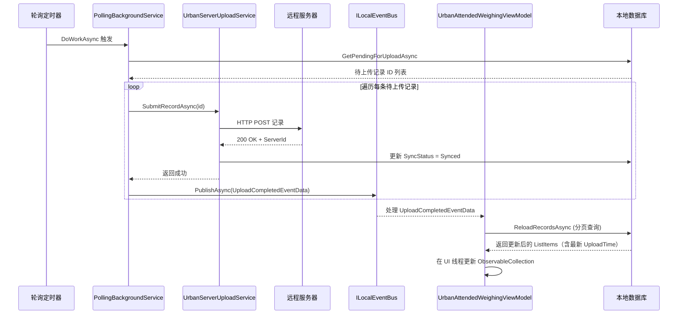

## Context

`MaterialClient.Urban.Backgrounds` 中的 `PollingBackgroundService` 定期将待上传的过磅记录上传至服务器。成功调用 `SubmitRecordAsync` 后，将 `SyncStatus` 更新为 `Synced`，但未发布任何事件。`UrbanAttendedWeighingViewModel` 订阅了 `WeighingRecordCreatedEventData`（新建记录）和 `StatusChangedEventData`（过磅状态转换），但没有订阅上传完成事件，因此列表中的 `UploadTime` 和 `SyncStatus` 字段保持旧值。

审批流程已展示了正确的模式：`ApproveRecordAsync` 在成功后直接调用 `ReloadRecordsAsync()`。区别在于审批在 ViewModel 的命令上下文中运行（前台），而上传在后台 Worker 中运行，没有 ViewModel 引用。

现有的 `ILocalEventBus`（ABP）可以自由跨程序集传递——`WeighingRecordCreatedEventData` 从 `MaterialClient.Common` 服务发布，在 `MaterialClient.Urban` ViewModel 中消费。新的上传事件遵循同样的既有模式。

## Goals / Non-Goals

**Goals:**
- 在 `PollingBackgroundService` 中每次上传成功后发布 `UploadCompletedEventData`
- 在 `UrbanAttendedWeighingViewModel` 中订阅该事件并调用 `ReloadRecordsAsync()`
- 保持变更最小化——新增一个事件类、两个注入点、一个订阅

**Non-Goals:**
- 批量上传事件（每条记录上传单独发布——与现有逐条日志模式一致）
- 上传完成的通知/Toast 提示（列表刷新即可）
- 上传失败时的刷新（仅成功上传需要更新 UI）
- 修改轮询周期或批量大小

## Decisions

### 1. 在 `MaterialClient.Common/Events/` 中新建 `UploadCompletedEventData`

**决策**：创建专用的 `UploadCompletedEventData` 类，携带 `WeighingRecordId`。

**理由**：遵循现有的 `EventData` 命名约定（`WeighingRecordCreatedEventData`、`StatusChangedEventData`）。`WeighingRecordId` 是最小有效载荷——ViewModel 的 `ReloadRecordsAsync` 会获取完整分页数据，无需关注具体是哪条记录发生变化。

**备选方案**：复用 `WeighingRecordCreatedEventData`——已否决，因为语义不匹配（上传不是创建），且未来如需区分两者会造成混淆。

### 2. 从 `PollingBackgroundService` 发布，而非 `UrbanServerUploadService`

**决策**：在 `PollingBackgroundService` 中注入 `ILocalEventBus`，在 `UploadPendingRecordsAsync` 循环中 `SubmitRecordAsync` 成功后发布事件。

**理由**：`UrbanServerUploadService` 是专注于服务器通信的领域服务——在其中添加事件发布会扩大其职责范围。后台 Worker 已经编排了上传生命周期（批量处理、错误处理、日志记录），是"上传完成"信号的自然归属者。

**备选方案**：从 `UrbanServerUploadService.SubmitRecordAsync` 发布——已否决，因为这会将领域服务与 UI 通知耦合，且在非轮询场景下（如手动同步触发）也会触发事件。

### 3. 在 `UrbanAttendedWeighingViewModel.Initialize()` 中订阅，使用 fire-and-forget 安全模式

**决策**：在已有的 `Initialize()` 方法中添加 `ILocalEventBus.Subscribe<UploadCompletedEventData>` 处理器，镜像 `WeighingRecordCreatedEventData` 的订阅模式。用 try/catch 包裹 `ReloadRecordsAsync()`，与现有处理器保持一致。

**理由**：ViewModel 已经为 `WeighingRecordCreatedEventData` 演示了完全相同的模式。一致性降低认知负担，遵循代码库中已建立的惯例。

## Architecture

```
MaterialClient.Common（共享事件定义）
└── Events/
    └── UploadCompletedEventData.cs (新建)

MaterialClient.Urban（发布者 + 消费者）
├── Backgrounds/
│   └── PollingBackgroundService.cs (修改 - 发布事件)
└── ViewModels/
    └── UrbanAttendedWeighingViewModel.cs (修改 - 订阅 + 刷新)
```

## API Sequence



## Risks / Trade-offs

- **[批量上传期间频繁刷新]** → 批量上传每次 tick 处理最多 50 条记录。每条成功上传都触发一次刷新。缓解措施：`ReloadRecordsAsync` 是单次分页查询——多次快速调用开销很小。`ObservableCollection` 的清空再添加模式能优雅处理并发调用。
- **[后台线程发布，UI 线程订阅]** → ABP 的 `ILocalEventBus.PublishAsync` 会分发到处理器。现有的 `WeighingRecordCreatedEventData` 处理器已经在无需显式线程调度的情况下运行 `ReloadRecordsAsync`，表明事件总线在当前架构中已正确处理了线程问题。
