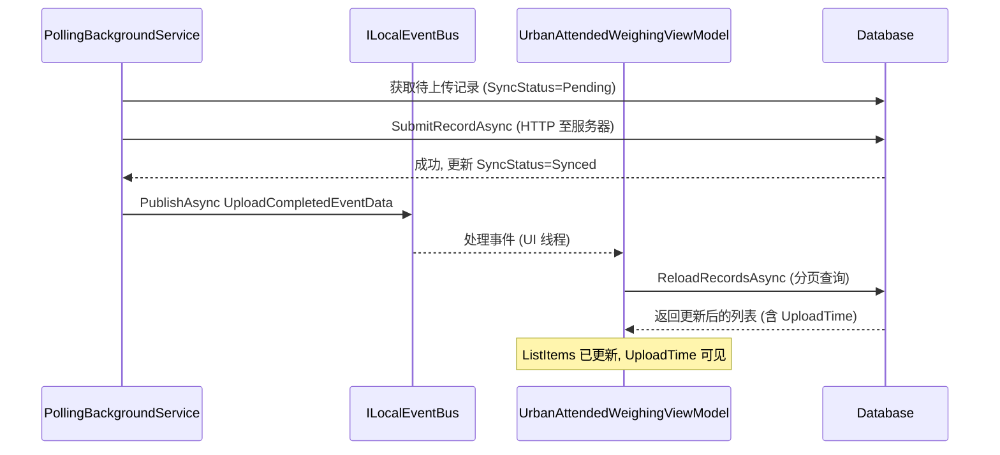

## Why

Urban 过磅记录列表在后台上传完成后不自动刷新。`PollingBackgroundService` 成功提交记录并将 `SyncStatus` 更新为 `Synced`，但未发布事件——UI 保持旧状态，直到用户手动点击查询或切换标签页。

## What Changes

- 在 `PollingBackgroundService` 中每次上传成功后通过 `ILocalEventBus` 发布新的 `UploadCompletedEventData`
- 在 `UrbanAttendedWeighingViewModel` 中订阅 `UploadCompletedEventData` 并触发 `ReloadRecordsAsync()`
- 确保刷新在 UI 线程执行（与现有 `WeighingRecordCreatedEventData` 处理模式一致）

## Capabilities

### New Capabilities

无——这是一个连接修复，不是新能力。

### Modified Capabilities

- `urban-polling-background-service`：新增上传成功后发布 `UploadCompletedEventData` 的需求
- `urban-weighing-list-presentation`：新增订阅上传事件并自动刷新列表的需求

## Interaction Flow

## Change Map

| 文件路径 | 变更类型 | 变更原因 |
|-----------|-------------|---------------|
| `MaterialClient.Common/Events/UploadCompletedEventData.cs` | 新建文件 | 定义上传完成通知的事件类型 |
| `MaterialClient.Urban/Backgrounds/PollingBackgroundService.cs` | 修改 | 注入 `ILocalEventBus`，上传成功后发布 `UploadCompletedEventData` |
| `MaterialClient.Urban/ViewModels/UrbanAttendedWeighingViewModel.cs` | 修改 | 订阅 `UploadCompletedEventData`，调用 `ReloadRecordsAsync()` |

## Impact

- `MaterialClient.Common` — 新增 `EventData` 类（无破坏性变更，仅增量添加）
- `MaterialClient.Urban` — 后台 Worker 和 ViewModel 增加事件连接
- 无 API、数据库结构或外部系统变更
