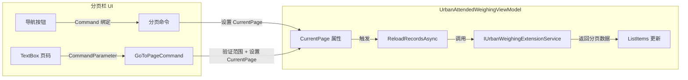
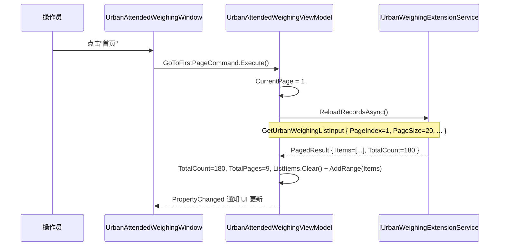

## 背景

`UrbanAttendedWeighingWindow.axaml` 是城管地磅系统的主界面，左侧展示称重记录列表。列表底部的分页栏（第 301-325 行）当前仅有「上一页」和「下一页」两个 `secondary-button` 按钮，以及"共 N 条 第 X / Y 页"的页码信息文本。

对应的 `UrbanAttendedWeighingViewModel` 已有 `CurrentPage`（int）、`TotalPages`（int）、`TotalCount`（int）属性和 `PreviousPageCommand`、`NextPageCommand` 命令。数据加载通过 `ReloadRecordsAsync()` 方法完成，该方法构建 `GetUrbanWeighingListInput`（含 `PageIndex`、`PageSize=20`、标签筛选、搜索条件），调用 `IUrbanWeighingExtensionService.GetPagedListItemsAsync()` 后更新 `ListItems` 和分页状态。

`WeighingRecordEditDialog` 不涉及本次变更。

## 目标 / 非目标

**目标:**
- 在现有分页栏中新增「首页」和「尾页」导航按钮
- 增加页码输入框与「跳转」按钮，允许输入目标页码直接跳转
- 保持与现有分页逻辑（`PreviousPageCommand`/`NextPageCommand`/`ReloadRecordsAsync`）完全兼容

**非目标:**
- 修改 `WeighingRecordEditDialog`（编辑对话框无分页需求）
- 修改分页数据加载逻辑（`ReloadRecordsAsync` 和 `GetUrbanWeighingListInput` 保持不变）
- 修改页面大小（`PageSize = 20` 保持不变）
- 修改父列表视图的其他区域

## 设计决策

### D1: 复用现有 ReloadRecordsAsync 数据加载

**决策**: 新增的 `GoToFirstPageCommand`、`GoToLastPageCommand`、`GoToPageCommand` 命令仅修改 `CurrentPage` 值后调用 `ReloadRecordsAsync()`，与现有 `PreviousPageCommand`/`NextPageCommand` 模式一致。

**理由**: 现有数据加载链路完整且稳定（命令 → 设置 CurrentPage → ReloadRecordsAsync → 服务调用 → 更新 ListItems/TotalCount/TotalPages）。新命令遵循相同模式，零重复代码，行为一致。

### D2: 页码跳转使用 CommandParameter 传递 TextBox 值

**决策**: 「跳转」按钮绑定 `GoToPageCommand`，TextBox 的文本值通过 `CommandParameter` 传递。

**理由**: 与项目中现有的 ReactiveUI `ReactiveCommand<T>` 模式一致（如 `ApproveRecordCommand` 接收 `UrbanWeighingListItemDto` 参数）。命令内部解析字符串为整数并验证范围。

### D3: 按钮排列顺序

**决策**: 分页栏按钮从左到右排列为：「首页」「上一页」「下一页」「尾页」，然后是页码输入框和「跳转」按钮。

**理由**: 首页/尾页包裹在上下页外侧，符合直觉导航顺序。页码跳转放在最右侧作为快捷操作，与信息文本区域分离。

## 风险 / 权衡

- **页码输入验证**: 用户可能输入非数字或超出范围的值。→ 命令内部静默忽略无效输入，不弹窗。与现有分页行为一致（上一页/下一页在边界时也静默不操作）。
- **快速连续点击**: 用户可能快速连续点击导航按钮。→ `ReloadRecordsAsync` 已有 try-catch 保护，连续调用安全。

## 架构

```
组件层级
└── UrbanAttendedWeighingWindow (主窗口)
    ├── UrbanAttendedWeighingWindow.axaml
    │   └── 分页栏 (Grid.Row="4", Border)
    │       ├── 页码信息 TextBlock (绑定 CurrentPage/TotalPages/TotalCount)
    │       └── 导航按钮 StackPanel
    │           ├── "首页" Button → GoToFirstPageCommand
    │           ├── "上一页" Button → PreviousPageCommand (现有)
    │           ├── "下一页" Button → NextPageCommand (现有)
    │           ├── "尾页" Button → GoToLastPageCommand
    │           ├── TextBox (页码输入) → CommandParameter
    │           └── "跳转" Button → GoToPageCommand
    │
    └── UrbanAttendedWeighingViewModel
        ├── 现有属性: CurrentPage, TotalPages, TotalCount
        ├── 现有命令: PreviousPageCommand, NextPageCommand
        ├── 新增命令: GoToFirstPageCommand, GoToLastPageCommand, GoToPageCommand
        └── 数据加载: ReloadRecordsAsync() (不变)
```

### 数据流



### 时序: 首页导航



## 详细代码变更清单

| 文件路径 | 变更类型 | 变更描述 | 影响模块 |
|---------|---------|---------|---------|
| `Views/UrbanAttendedWeighingWindow.axaml` | 修改 | 分页栏 StackPanel 中新增"首页"和"尾页" Button（Classes="secondary-button"），以及页码输入 TextBox + "跳转" Button | MaterialClient.Urban.Views |
| `ViewModels/UrbanAttendedWeighingViewModel.cs` | 修改 | 新增 `GoToFirstPageCommand`（CurrentPage=1）、`GoToLastPageCommand`（CurrentPage=TotalPages）、`GoToPageCommand(int page)`（验证范围后设置 CurrentPage）三个异步命令，均调用 `ReloadRecordsAsync` | MaterialClient.Urban.ViewModels |

## 待确认问题

无 — 变更范围小，完全复用现有分页数据加载链路。
