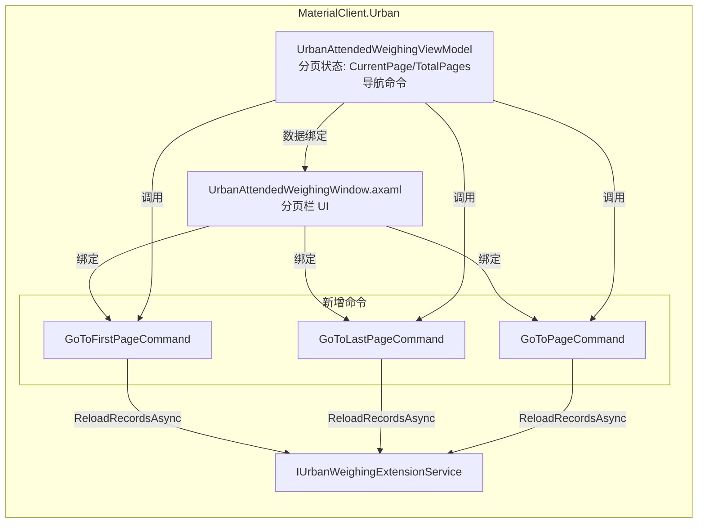
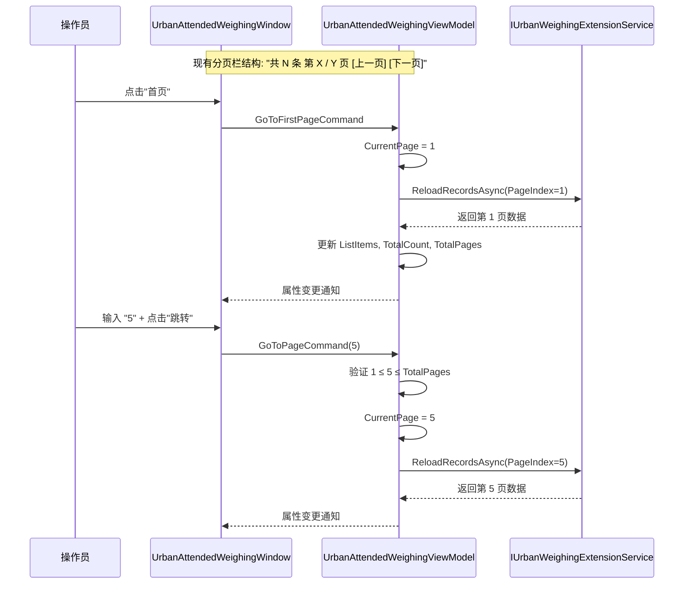

## Why

`UrbanAttendedWeighingWindow.axaml` 左侧称重记录列表的分页栏当前仅提供「上一页」和「下一页」两个导航按钮。在大量记录场景下（如数百条异常记录积压），操作员需要逐页点击才能到达目标页码，操作效率低下。新增「首页」、「尾页」导航按钮以及页码输入跳转功能，使操作员可以一键到达任意页码，显著提升列表浏览效率。

## What Changes

- **UrbanAttendedWeighingWindow.axaml**: 在现有分页栏中新增「首页」和「尾页」按钮，以及页码输入框和「跳转」按钮
- **UrbanAttendedWeighingViewModel.cs**: 新增 `GoToFirstPageCommand`、`GoToLastPageCommand`、`GoToPageCommand` 导航命令

## Capabilities

### New Capabilities
- `list-pagination-enhancement`: 在称重记录列表分页栏中提供首页/尾页/页码跳转导航能力

### Modified Capabilities
_无_（现有分页逻辑 `PreviousPageCommand`/`NextPageCommand` 保持不变）

## Impact

### File Change Map

| File | Module | Change Type | Rationale |
|------|--------|-------------|-----------|
| `Views/UrbanAttendedWeighingWindow.axaml` | MaterialClient.Urban | **修改** | 分页栏新增首页/尾页按钮 + 页码输入跳转控件 |
| `ViewModels/UrbanAttendedWeighingViewModel.cs` | MaterialClient.Urban | **修改** | 新增首页/尾页/跳转页命令，复用现有 `ReloadRecordsAsync` 数据加载 |

### ASCII Interface Prototype

```
修改前:
┌─────────────────────────────────────────────────────────────┐
│  共 180 条  第 3 / 9 页              [上一页] [下一页]       │
└─────────────────────────────────────────────────────────────┘

修改后:
┌──────────────────────────────────────────────────────────────────────┐
│  共 180 条  第 3 / 9 页   [首页][上一页][下一页][尾页]  [  5  ][跳转]│
└──────────────────────────────────────────────────────────────────────┘
```

### Interaction Flow

```mermaid
flowchart TD
    A[操作员在列表分页栏操作] --> B{操作类型}

    B -->|点击"首页"| C[GoToFirstPageCommand<br/>CurrentPage = 1<br/>ReloadRecordsAsync]
    B -->|点击"上一页"| D[PreviousPageCommand<br/>CurrentPage--<br/>ReloadRecordsAsync]
    B -->|点击"下一页"| E[NextPageCommand<br/>CurrentPage++<br/>ReloadRecordsAsync]
    B -->|点击"尾页"| F[GoToLastPageCommand<br/>CurrentPage = TotalPages<br/>ReloadRecordsAsync]
    B -->|输入页码+跳转| G[GoToPageCommand<br/>验证范围 1..TotalPages<br/>CurrentPage = 输入值<br/>ReloadRecordsAsync]

    C --> H[列表刷新显示对应页数据]
    D --> H
    E --> H
    F --> H
    G --> H
```

### Architecture Overview



### API Sequence: 分页导航调用流程


