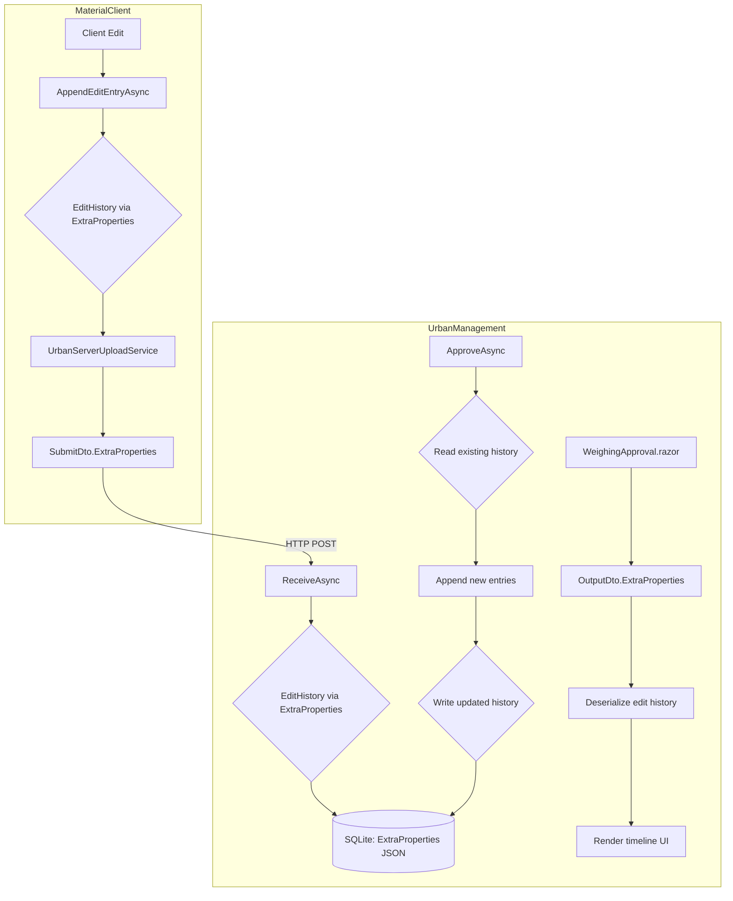
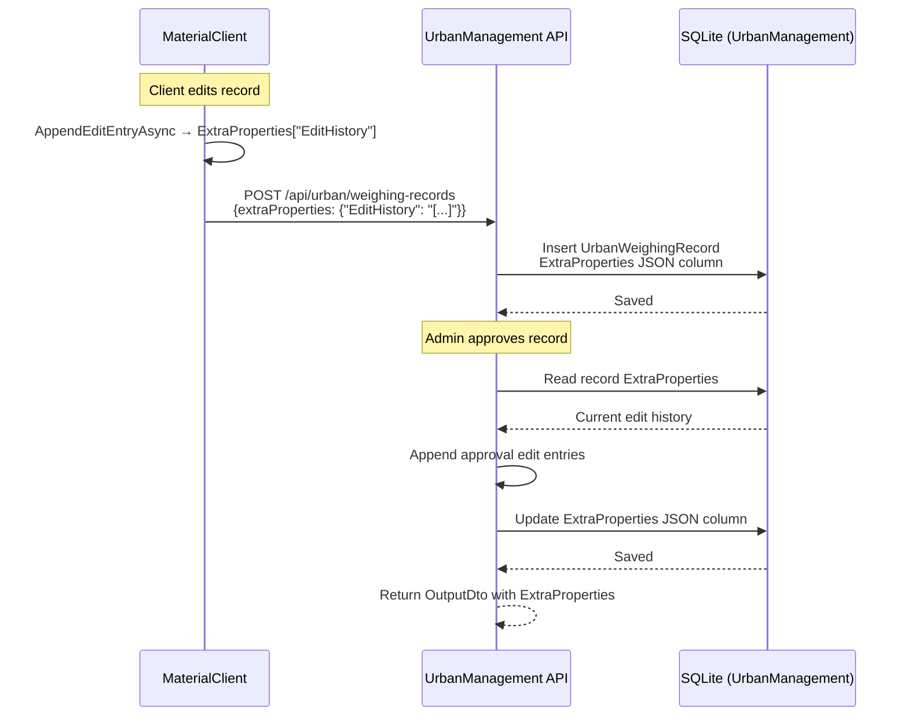

## Context

ABP 框架通过 `IHasExtraProperties` 接口提供标准化的扩展属性机制：实体实现该接口后，`ConfigureByConvention()` 自动将 `ExtraProperties` 字典序列化为 JSON 列持久化到数据库。项目中 `WeighingRecord`、`Waybill`、`Material` 等实体已广泛采用此模式，并通过 `SetProperty<T>` / `GetProperty<T>` 扩展方法实现类型安全的读写（参见 `SolidWasteInfoExtensions.cs`）。

当前 `EditHistoryJson` 作为专用 `string?` 字段分别存在于：
- **MaterialClient**: `UrbanWeighingExtension.EditHistoryJson` + `[NotMapped] EditHistory` 计算属性
- **UrbanManagement**: `UrbanWeighingRecord.EditHistoryJson`（无计算属性，在 AppService 中直接 JSON 序列化/反序列化）

两者通过 API 层（`UrbanWeighingRecordSubmitDto.EditHistoryJson` → `UrbanWeighingRecordReceiveInputDto.EditHistoryJson`）传递。

**关键约束**：
- `UrbanWeighingRecord`（UrbanManagement）当前 **未实现** `IHasExtraProperties`
- `UrbanWeighingExtension`（MaterialClient）当前 **未实现** `IHasExtraProperties`
- ABP 的 `ConfigureByConvention()` 会自动处理 `ExtraProperties` 的 EF Core 列映射（JSON 格式），无需手动配置
- 不需要向后兼容，可以跳过数据迁移

## Goals / Non-Goals

**Goals:**
- 将两处 `EditHistoryJson` 字段统一迁移到 `IHasExtraProperties.ExtraProperties` 存储
- 在 MaterialClient 中提供类型安全的扩展方法（遵循 `SolidWasteInfoExtensions` 模式）
- 在 UrbanManagement 中为 `UrbanWeighingRecord` 添加 `IHasExtraProperties` 支持
- 保持 API 传输语义不变（编辑历史数据仍通过 DTO 传递）
- 生成 EF Core 迁移删除旧列、新增 `ExtraProperties` 列

**Non-Goals:**
- 不迁移现有 `EditHistoryJson` 数据（按需求描述，不需要向后兼容）
- 不修改审批业务逻辑（仅变更存储方式）
- 不添加单元测试或文档
- 不重构其他实体字段

## Decisions

### Decision 1: ExtraProperties 键名使用 `"EditHistory"` 单层命名

**选择**: 使用 `EditHistory` 作为 ExtraProperties 的键名（存储序列化后的 JSON 数组字符串）。

**替代方案**: 使用层级命名 `"EditHistory.Json"` — 与项目中 `SolidWasteInfo.SolidWasteType` 模式一致。

**理由**: `EditHistory` 是自描述的单一值（一个 JSON 数组字符串），不像 SolidWasteInfo 有多个子属性需要层级区分。单层命名更简洁。ABP 的 `GetProperty<string>` 会直接返回 JSON 字符串，消费者再反序列化为 `List<EditEntry>`。

### Decision 1b: EditEntry 使用完整快照模型而非增量字段

**选择**: `EditEntry` 模型包含四个字段：`ChangedAt`（DateTime）、`PlateNumber`（string）、`TotalWeight`（decimal）、`AnomalyReason`（string?）。每次修改时保存记录的完整状态快照。

**替代方案 A**: 保持增量字段模式（Field/OldValue/NewValue）。

**替代方案 B**: 混合模式：快照 + 变更标记字段。

**理由**: 完整快照使 UI 渲染更直观（每条记录即为该时刻的完整状态，直接展示），避免增量模式中需要跨条目重建状态的复杂度。审批流程中每次修改必然同时涉及多个字段（车牌、重量、异常原因），快照模式自然匹配此场景。数组中相邻条目的字段差异即可看出哪些字段被修改。

### Decision 2: MaterialClient 通过扩展方法访问编辑历史

**选择**: 在 `MaterialClient.Common/Entities/Urban/` 下新增 `EditHistoryExtensions.cs` 静态类，提供 `GetEditHistory()` / `SetEditHistory()` 扩展方法（遵循 `SolidWasteInfoExtensions` 模式）。

**理由**: `UrbanWeighingExtension` 核心属性（SyncStatus、IsAnomaly 等）保持强类型，编辑历史通过扩展方法操作 ExtraProperties，保持编译时类型安全的同时统一存储方式。这符合项目中已有的扩展方法模式。

### Decision 3: UrbanManagement DTO 保留 ExtraProperties 字典属性

**选择**: `UrbanWeighingRecordReceiveInputDto` 和 `UrbanWeighingRecordOutputDto` 移除 `EditHistoryJson` 属性，改为接收 `ExtraProperties` 字典（或直接从 `ExtraProperties` 读取编辑历史）。

**替代方案**: DTO 也实现 `IHasExtraProperties`。

**理由**: ABP 的 DTO 基类（如 `PagedAndSortedResultRequestDto`）已有 ExtraProperties 支持。对于简单的接收/输出 DTO，添加一个 `Dictionary<string, object?>? ExtraProperties` 属性即可满足需求，无需引入 ABP DTO 基类。服务层负责从 DTO 的 ExtraProperties 中提取编辑历史并写入实体的 ExtraProperties。

### Decision 4: MaterialClient SubmitDto 使用 `Dictionary<string, object?>` 传递 ExtraProperties

**选择**: `UrbanWeighingRecordSubmitDto` 移除 `EditHistoryJson`，新增 `Dictionary<string, object?>? ExtraProperties` 属性，序列化时通过 `[JsonPropertyName("extraProperties")]` 发送到服务端。

**理由**: 与 UrbanManagement 接收 DTO 对齐，形成统一的 ExtraProperties 传输协议。

### Decision 5: UrbanManagement DbContext 无需手动配置 ExtraProperties 列

**选择**: 依赖 `ConfigureByConvention()` 自动处理。

**理由**: ABP 的 `AbpDbContext` 基类在 `ConfigureByConvention()` 中自动为 `IHasExtraProperties` 实体注册 JSON 列。项目中所有现有 IHasExtraProperties 实体（WeighingRecord、Waybill 等）均无手动配置，保持一致。

## Risks / Trade-offs

**[Risk] UrbanWeighingRecord 新增 ExtraProperties 列增大行体积**
→ Mitigation: ExtraProperties 以 JSON 存储，无编辑历史时为空对象 `{}`，开销可忽略。编辑历史通常只有 2-5 条记录，JSON 体积很小。

**[Risk] ExtraProperties 字典反序列化缺少编译时检查**
→ Mitigation: MaterialClient 侧通过扩展方法封装（编译时安全）。UrbanManagement 侧由于数据来源单一（仅审批流程写入），风险可控。

**[Risk] SQLite 不支持 DROP COLUMN，旧 EditHistoryJson 列将遗留**
→ Mitigation: 按需求描述不需要向后兼容。SQLite 的 ALTER TABLE DROP COLUMN 从 3.35.0+ 已支持（项目使用的 EF Core SQLite provider 版本通常满足）。迁移将使用标准 DropColumn。若目标 SQLite 版本不支持，迁移脚本可跳过删除列（列不再被代码引用即可）。

## Architecture

```
MaterialClient                           UrbanManagement
┌──────────────────────┐                 ┌──────────────────────────┐
│ UrbanWeighingExtension│                │ UrbanWeighingRecord       │
│  : Entity<Guid>       │                │  : Entity<long>,          │
│  : IHasExtraProperties│                │    IHasExtraProperties    │
├──────────────────────┤                ├──────────────────────────┤
│ WeighingRecordId      │                │ ClientRecordId             │
│ SyncStatus            │                │ PlateNumber                │
│ IsAnomaly             │                │ TotalWeight                │
│ AnomalyReason         │                │ IsAnomaly                 │
│ [ExtraProperties]     │                │ AnomalyReason             │
│  └─ "EditHistory" ────┼──API───────→   │ [ExtraProperties]          │
│     = JSON array      │  SubmitDto     │  └─ "EditHistory"         │
│  (List<EditEntry>)    │  ExtraProps    │     = JSON array           │
│  每条快照:            │                │  每条快照:                  │
│  ChangedAt            │                │  ChangedAt, PlateNumber,  │
│  PlateNumber          │                │  TotalWeight,             │
│  TotalWeight          │                │  AnomalyReason             │
│  AnomalyReason        │                │                            │
└──────────────────────┘                └──────────────────────────┘
          │                                         │
    ┌─────┴──────┐                           ┌─────┴──────┐
    │EditHistory  │                           │AppService  │
    │Extensions  │                           │ApproveAsync│
    │.GetHistory()│                           │ reads/     │
    │.SetHistory()│                           │ writes     │
    └────────────┘                           └────────────┘
```

## Data Flow



## API Sequence



## Detailed Code Change Inventory

### UrbanManagement

| File Path | Change Type | Change Description | Affected Module |
|-----------|-------------|-------------------|-----------------|
| `Core/Entities/UrbanWeighingRecord.cs` | Modify | 移除 `EditHistoryJson` 属性；类声明添加 `IHasExtraProperties`；添加 `_extraProperties` 字段和 `ExtraProperties` 属性 | Entity |
| `Core/Models/UrbanWeighingRecordDtos.cs` | Modify | `ReceiveInputDto` 移除 `EditHistoryJson`；新增 `Dictionary<string, object?>? ExtraProperties` | DTO |
| `Core/Models/UrbanWeighingRecordOutputDto.cs` | Modify | 移除 `EditHistoryJson`；新增 `Dictionary<string, object?>? ExtraProperties`；`FromEntity` 方法映射 ExtraProperties | DTO |
| `Core/Services/UrbanWeighingRecordAppService.cs` | Modify | `ReceiveAsync`: 从 `input.ExtraProperties` 读取编辑历史写入实体；`ApproveAsync`: 创建完整快照 EditEntry（包含审批后的 PlateNumber、TotalWeight、AnomalyReason=""）并追加到历史列表；移除逐字段比较和内部 `EditEntryDto` 类 | Service |
| `Core/EntityFrameworkCore/UrbanManagementDbContext.cs` | Modify | `UrbanWeighingRecord` 配置块移除 `b.Property(e => e.EditHistoryJson)` | EF Core |
| `App/Pages/WeighingApproval.razor` | Modify | 从 `record.ExtraProperties["EditHistory"]` 反序列化编辑历史快照列表；更新 UI 渲染逻辑展示每条快照的完整字段（车牌号、重量、异常原因）；更新内部 `EditHistoryEntry` 模型匹配快照结构 | UI |
| `Migrations/` | Add | 新增 EF Core 迁移：DropColumn "EditHistoryJson"；ABP 自动处理 ExtraProperties 列（若首次添加 IHasExtraProperties） | Migration |

### MaterialClient

| File Path | Change Type | Change Description | Affected Module |
|-----------|-------------|-------------------|-----------------|
| `Common/Entities/Urban/UrbanWeighingExtension.cs` | Modify | 移除 `EditHistoryJson` 属性和 `EditHistory` 计算属性；类声明添加 `IHasExtraProperties`；添加 `_extraProperties` 字段和 `ExtraProperties` 属性 | Entity |
| `Common/Entities/Urban/EditHistoryExtensions.cs` | Add | 新增静态扩展方法类：`GetEditHistory(this UrbanWeighingExtension)` / `SetEditHistory(this UrbanWeighingExtension, List<EditEntry>)` | Extension |
| `Common/Entities/Urban/EditEntry.cs` | Modify | 重构为快照模型：移除 Field/OldValue/NewValue；新增 PlateNumber (string)、TotalWeight (decimal)、AnomalyReason (string?)、ChangedAt (DateTime) 四个字段 | Model |
| `Common/EntityFrameworkCore/MaterialClientDbContext.cs` | Modify | `UrbanWeighingExtension` 配置块移除 `EditHistoryJson` 和 `EditHistory` Ignore 配置 | EF Core |
| `Common/Services/Urban/IUrbanWeighingExtensionService.cs` | Modify | `AppendEditEntryAsync` 签名更新为接收完整快照参数（PlateNumber、TotalWeight、AnomalyReason），文档注释引用 ExtraProperties | Interface |
| `Common/Services/Urban/UrbanWeighingExtensionService.cs` | Modify | `AppendEditEntryAsync` 实现改为创建快照式 EditEntry 并追加到历史列表 | Service |
| `Urban/Services/UrbanServerUploadService.cs` | Modify | DTO 映射改为从 `extension.GetEditHistory()` 设置到 SubmitDto 的 ExtraProperties | Service |
| `Urban/Dtos/UrbanWeighingRecordSubmitDto.cs` | Modify | 移除 `EditHistoryJson` 属性；新增 `Dictionary<string, object?>? ExtraProperties` 及 `[JsonPropertyName("extraProperties")]` | DTO |
| `Migrations/` | Add | 新增 EF Core 迁移：DropColumn "EditHistoryJson"；ABP 自动处理 ExtraProperties 列 | Migration |
