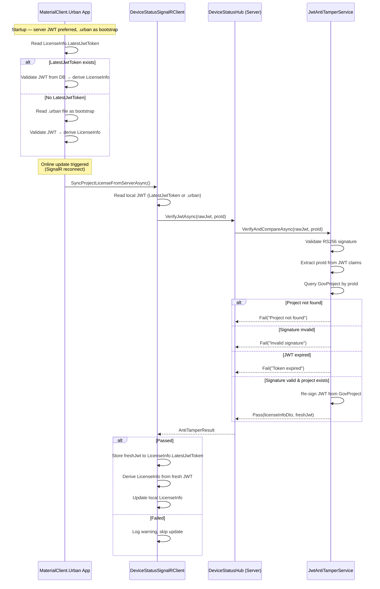
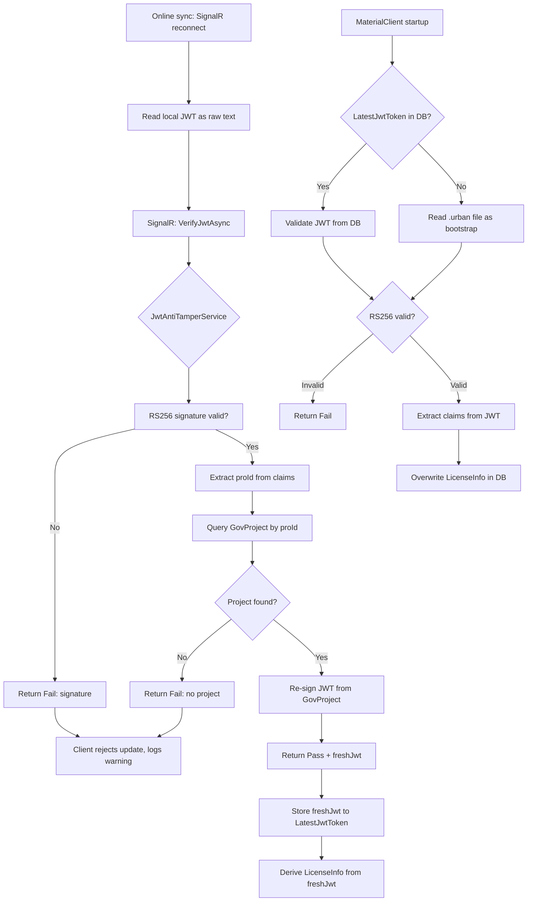

## Context

当前 UrbanManagement 生成 JWT 许可证令牌（RS256 签名，2048-bit RSA）后，以 `.urban` 文件形式分发给 MaterialClient.Urban。客户端通过 `StaticLicenseChecker` 验证 JWT 签名、iss/aud/exp 声明。在线更新流程通过 SignalR `GetClientProjectLicenseInfo` 拉取项目字段同步本地 `LicenseInfo` 实体，但不校验 JWT 原文完整性。

**约束**:
- RSA 密钥对已在 `Jwt:PrivateKey` / `Jwt:PublicKey` 配置中管理（PEM 格式）。
- 现有两个 spec: `jwt-license-generation`（服务器端生成）和 `jwt-offline-license`（客户端离线验证）。
- 不考虑向后兼容。
- 跳过文档与单元测试。

**威胁模型**:
- **防御目标**: 防止用户篡改本地 SQLite 数据库中 `LicenseInfo` 表的授权相关信息（如 `AuthEndTime`、`ProjectId` 等字段），以延长或篡改授权状态。
- **授权来源**: 服务器端签发的 JWT 为唯一权威来源。在线时客户端提交本地 JWT 进行 RS256 验签，服务器通过后从 GovProject 重新签发最新 JWT 推送给客户端；离线时 `.urban` 文件作为引导初始化。
- **允许**: 用户可以将 `.urban` 文件替换为另一合法签名 JWT——这不属于防篡改范畴。
- **不涉及**: 机器绑定、硬件指纹验证。用户可以在任意机器上运行客户端。

## Goals / Non-Goals

**Goals:**
- 提供 JWT 验签 + claims 查询 + 分发服务：通过 RS256 签名验证确认客户端 JWT 未被篡改，查询 GovProject 获取最新项目数据，重新签发 JWT 推送给客户端。
- 在 MaterialClient 在线更新流程中集成 JWT 验签，通过后采纳服务器最新 JWT。
- MaterialClient 存储服务器最后一次提供的 JWT（`LicenseInfo.LatestJwtToken`），启动时优先使用，其次回退到 `.urban` 文件。
- 每次从 JWT 派生 `LicenseInfo` 时覆盖数据库记录，确保数据库篡改无法持久。
- 保持现有的离线 RS256 签名验证流程不变（`StaticLicenseChecker` 独立工作）。

**Non-Goals:**
- 不修改 RSA 密钥管理方式（沿用 PEM 配置）。
- 不修改 JWT claims 结构或签名算法。
- 不引入令牌撤销/吊销机制。
- 不引入机器绑定或硬件指纹验证（用户可在任意机器上运行客户端）。
- 不阻止用户替换 `.urban` 文件为另一合法签名 JWT。
- 不持久化已签发的 JWT 令牌到数据库（服务端通过 GovProject 查询获取最新数据）。
- 不做向后兼容或数据迁移。
- 不添加单元测试或文档。

## Decisions

### Decision 1: 验签 + claims 查询 vs 全文比对

**选择**: RS256 验签 + JWT claims 提取 proId + GovProject 查询 + 重新签发。

**理由**: RS256 签名本身即可保证 JWT 内容未被篡改——签名无效则说明 JWT 被修改，签名有效则 claims 可信。无需额外持久化 JWT 并做全文比对。服务器通过 JWT 中的 proId 查询 GovProject 获取最新项目数据，重新签发 JWT 返回给客户端，确保客户端始终持有最新授权。此方案省去了一条完整的持久化链路（实体、仓储、迁移）。

**替代方案**: 全文比对（持久化 JWT → 与客户端提交的 JWT 逐字符比较）。增加了一张表、一个实体、一个仓储和生成时的 upsert 开销，且与 RS256 签名验证功能重复。

### Decision 2: SignalR Hub 方法 vs REST API

**选择**: 扩展现有 SignalR Hub（`DeviceStatusHub`），新增 `VerifyJwtAsync` 方法。

**理由**: 在线更新流程已通过 SignalR 建立，保持传输通道一致。JWT 提交是一次性操作，不需要 REST 的幂等性或缓存优势。

**替代方案**: 新增 REST controller `/api/jwt/verify`。增加一层 HTTP 开销且需要额外的认证配置。

### Decision 3: 客户端 JWT 读取方式

**选择**: 在 `SyncProjectLicenseFromServerAsync` 中读取本地 JWT（优先 `LatestJwtToken`，其次 `.urban` 文件）作为字符串提交。

**理由**: `DeviceStatusSignalRClient` 已持有 `ProId`，只需额外读取本地 JWT 文本。通过 `LicenseService.GetLocalJwtTokenAsync()` 统一读取。

### Decision 4: 服务器为权威来源，.urban 文件为离线引导

**选择**: 服务器端为授权的唯一权威来源。在线时客户端通过 SignalR 提交本地 JWT 验签，服务器通过后返回最新签发的 JWT 并存储到 `LicenseInfo.LatestJwtToken`。离线启动时优先使用 `LatestJwtToken`，其次回退到 `.urban` 文件。无论哪种来源，JWT claims 均用于覆盖 `LicenseInfo` 的派生字段，确保数据库篡改无法持久。

**理由**: `.urban` 文件仅作为离线初始化的引导机制——首次部署时使用，后续由服务器在线更新接管。将服务器确立为权威来源后：
- 服务器重新签发许可证时，客户端在线更新即可获得新 JWT。
- 客户端存储的 `LatestJwtToken` 使得离线启动不依赖 `.urban` 文件存在（`.urban` 文件删除后仍可从 DB 恢复）。
- 用户篡改 `LicenseInfo` 派生字段（如 `AuthEndTime`）后，下次启动从 JWT 重新派生即覆盖。
- 用户篡改 `LatestJwtToken` JWT 文本后，RS256 验签失败即可检出。

**设计细节**:
- `JwtAntiTamperResult` 通过时包含 `ServerJwt` 字段——服务器从 GovProject 重新签发的 JWT。
- 客户端在线验签通过后，将 `ServerJwt` 存入 `LicenseInfo.LatestJwtToken`。
- 启动时 JWT 来源优先级: `LatestJwtToken`（DB）> `.urban` 文件（文件系统）。
- 从任何来源获得 JWT 后，解析 claims 并覆盖 `LicenseInfo` 的派生字段。

**替代方案**: 仅保留 `.urban` 文件作为唯一来源（上一版设计）。问题：删除文件即丧失授权，且无法利用服务器在线更新推送的新 JWT。

## Risks / Trade-offs

- **[GovProject 被删除]** → 如果项目在服务器端被删除，验签时查询不到 GovProject，比对将失败。这是预期行为——项目授权已不存在。
- **[网络中断导致验签超时]** → SignalR 调用超时时，客户端应回退到现有的字段同步逻辑（仅同步 ProName/BuildLicenseNo 等字段，不更新授权状态），保持可用性。
- **[JWT 文件被替换为合法但不同项目的令牌]** → 允许此行为。在线更新时服务器将从新 JWT 的 proId 查询对应 GovProject 并签发该项目的最新 JWT。
- **[用户直接篡改 SQLite 数据库]** → 每次启动时从 JWT（优先 `LatestJwtToken`）重新派生 `LicenseInfo`，数据库篡改将被覆盖。篡改 `LatestJwtToken` 会导致 RS256 验签失败。
- **[用户删除 .urban 文件]** → 只要 `LicenseInfo.LatestJwtToken` 存在（之前完成过一次在线同步），启动仍可正常进行。`.urban` 文件仅在首次部署且未完成在线同步时不可或缺。

## Architecture

```
UrbanManagement (Server)
├── Core
│   ├── Services
│   │   ├── IJwtAntiTamperService      [NEW] - 验签 + GovProject 查询 + 重新签发接口
│   │   └── JwtAntiTamperService       [NEW] - 验签 + GovProject 查询 + 重新签发实现
│   ├── Hubs
│   │   └── DeviceStatusHub           [MODIFIED] - 新增 VerifyJwtAsync
│   └── Models
│       ├── JwtAntiTamperResult        [NEW] - 验签结果 DTO (含 ServerJwt)
│       └── JwtVerificationRequest     [NEW] - 客户端提交 DTO

MaterialClient (Client)
├── Common
│   ├── Entities
│   │   └── LicenseInfo                [MODIFIED] - 新增 LatestJwtToken
│   ├── Services
│   │   ├── StaticLicenseChecker       [MODIFIED] - 支持从字符串直接验证 JWT
│   │   ├── DeviceStatusSignalRClient  [MODIFIED] - 提交 JWT + 采纳服务器 JWT
│   │   └── Authentication
│       │   └── LicenseService          [MODIFIED] - 存储 LatestJwtToken
```

## API Sequence



## Data Flow



## Detailed Code Change Inventory

| File Path (UrbanManagement) | Change Type | Change Description | Affected Module |
|---|---|---|---|
| `Core/Services/IJwtAntiTamperService.cs` | New | 接口: `VerifyAndCompareAsync(string jwtToken, Guid proId)` → `JwtAntiTamperResult`（含 ServerJwt） | Core Services |
| `Core/Services/JwtAntiTamperService.cs` | New | 实现: RS256 验签 + 提取 proId claims + GovProject 查询 + 重新签发 JWT | Core Services |
| `Core/Models/JwtAntiTamperResult.cs` | New | DTO: Passed(bool), Reason(string?), ServerJwt(string?), ProName, BuildLicenseNo, FdBuildLicenseNo, AuthEndTime | Core Models |
| `Core/Models/JwtVerificationRequest.cs` | New | DTO: JwtToken(string), ProId(string) | Core Models |
| `Core/Hubs/DeviceStatusHub.cs` | Modified | 注入 `IJwtAntiTamperService`，新增 `VerifyJwtAsync(jwt, proId)` | SignalR |

| File Path (MaterialClient) | Change Type | Change Description | Affected Module |
|---|---|---|---|
| `Common/Entities/LicenseInfo.cs` | Modified | 新增 `LatestJwtToken` (string?) 属性，存储服务器最后提供的权威 JWT | Common Entities |
| `Common/Services/StaticLicenseChecker.cs` | Modified | 支持从字符串直接验证 JWT（不限于文件路径），返回 JWT 派生的完整声明值 | Common Services |
| `Common/Services/DeviceStatusSignalRClient.cs` | Modified | 在线更新时提交 JWT 验签，通过后存储 `ServerJwt` 到 `LatestJwtToken`，从 JWT 派生 `LicenseInfo` | Common Services |
| `Common/Services/Authentication/LicenseService.cs` | Modified | 处理防篡改结果，存储 `LatestJwtToken`，从 JWT claims 更新 `LicenseInfo` | Common Services |
