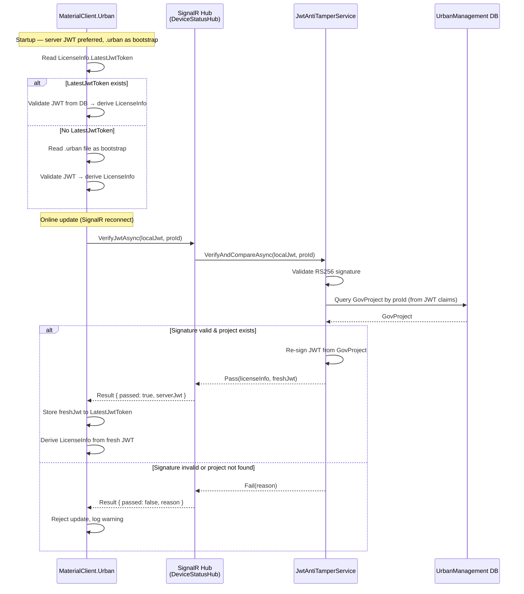

## Why

MaterialClient.Urban 在线更新授权信息时，仅通过 SignalR 拉取项目字段（ProName、BuildLicenseNo 等）写入本地 `LicenseInfo` 数据库记录。当前 `LicenseInfo` 作为持久化的授权状态存储，用户可直接修改 SQLite 数据库中的授权相关信息（如 `AuthEndTime` 延长授权时间）来绕过授权限制。需要将服务器端确立为授权的唯一权威来源，`.urban` 文件仅作为离线启动的引导机制。

**威胁模型范围**:
- **防御目标**: 防止用户篡改本地数据库中的授权相关信息（如修改 `AuthEndTime`、`ProjectId` 等字段以延长或篡改授权状态）。
- **授权来源**: 服务器端签发的 JWT 为唯一权威来源。在线更新时，服务器验证客户端 JWT 签名后，从 GovProject 重新签发最新 JWT 推送给客户端。离线启动时，`.urban` 文件作为引导初始化。
- **允许**: 用户可以将 `.urban` 文件替换为另一合法签名的 JWT——这不属于防篡改范畴。
- **不涉及**: 机器绑定或硬件指纹验证。

## What Changes

- UrbanManagement 新增 JWT 验签+分发服务：接收客户端提交的 JWT 令牌，执行 RS256 签名验证，从 JWT claims 提取 proId 查询 GovProject，通过时重新签发最新 JWT 供客户端采纳。
- UrbanManagement SignalR Hub 新增方法，使客户端可提交 JWT 并接收验签结果及服务器侧最新 JWT。
- MaterialClient.Urban 在线更新流程改造：在 `SyncProjectLicenseFromServerAsync` 中，提交本地 JWT 进行验签，通过后采纳服务器返回的最新 JWT，更新本地 `LicenseInfo` 及存储的 JWT 文本。
- MaterialClient.Urban 授权存储改造：`LicenseInfo` 新增 `LatestJwtToken` 字段，存储服务器最后一次提供的权威 JWT 文本，供离线启动时使用。
- **BREAKING**: 在线更新流程中，若防篡改验签失败，MaterialClient 将拒绝更新本地授权状态并记录告警日志，不再静默同步。
- **BREAKING**: 启动时优先使用服务器最后提供的 JWT（`LicenseInfo.LatestJwtToken`），其次回退到 `.urban` 文件引导，并从 JWT claims 重新派生 `LicenseInfo` 覆盖数据库。

## Capabilities

### New Capabilities
- `jwt-anti-tamper`: 服务器端 JWT 验签及分发服务，接收客户端提交的 JWT，校验 RS256 签名，查询 GovProject 确认项目存在，通过时重新签发最新 JWT 返回客户端。
- `jwt-anti-tamper-sync`: MaterialClient.Urban 在线更新流程中的 JWT 防篡改集成，包括 JWT 提交、服务器 JWT 采纳、结果处理、失败回退。启动时优先使用服务器存储的 JWT，其次回退到 `.urban` 文件。

### Modified Capabilities
（无现有 spec 的 REQUIREMENTS 变更）

## Impact

- **UrbanManagement Core**: 新增 `IJwtAntiTamperService`、`JwtAntiTamperService`。
- **UrbanManagement SignalR Hub**: `DeviceStatusHub` 新增方法以接受 JWT 验签请求。
- **MaterialClient Common**: `DeviceStatusSignalRClient` 扩展 `SyncProjectLicenseFromServerAsync` 增加 JWT 提交及服务器 JWT 采纳逻辑；`LicenseService` 增加防篡改结果处理；`StaticLicenseChecker` 增加从 JWT 派生并覆盖 `LicenseInfo` 的逻辑；启动时优先使用 `LatestJwtToken`。
- **MaterialClient Entities**: `LicenseInfo` 实体新增 `LatestJwtToken` (string?) 字段，存储服务器最后一次提供的权威 JWT 文本。
- **数据库迁移**: MaterialClient EF Core 迁移为 `LicenseInfo` 新增 `LatestJwtToken` 列（UrbanManagement 无新增表）。

### Interaction Flow

### Code Change Table

| File Path | Change Type | Change Reason | Impact Scope |
|-----------|-------------|---------------|--------------|
| `UrbanManagement.Core/Services/IJwtAntiTamperService.cs` | New | 防篡改验签+分发服务接口 | UrbanManagement Core |
| `UrbanManagement.Core/Services/JwtAntiTamperService.cs` | New | 防篡改验签+分发服务实现（验签 + GovProject 查询 + 重新签发） | UrbanManagement Core |
| `UrbanManagement.Core/Models/JwtAntiTamperResult.cs` | New | 防篡改结果 DTO（含服务器 JWT） | UrbanManagement Core |
| `UrbanManagement.Core/Hubs/DeviceStatusHub.cs` | Modified | 新增 JWT 验签 Hub 方法 | UrbanManagement SignalR |
| `MaterialClient.Common/Entities/LicenseInfo.cs` | Modified | 新增 `LatestJwtToken` (string?) 字段 | MaterialClient Entities |
| `MaterialClient.Common/Services/DeviceStatusSignalRClient.cs` | Modified | 在线更新时提交 JWT 验签，采纳服务器 JWT | MaterialClient Common |
| `MaterialClient.Common/Services/Authentication/LicenseService.cs` | Modified | 处理防篡改结果，存储服务器 JWT | MaterialClient Common |
| `MaterialClient.Common/Services/StaticLicenseChecker.cs` | Modified | 支持从 JWT 字符串直接验证（不限于文件路径） | MaterialClient Common |
