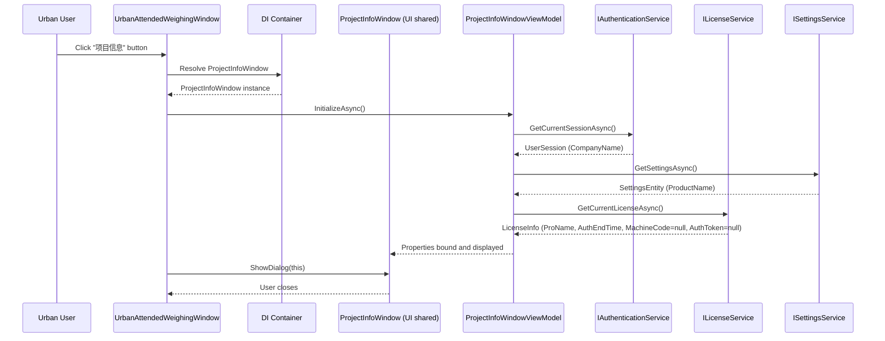

## Context

MaterialClient 主项目通过 `ProjectInfoWindow`（Window + ViewModel）展示授权信息（项目名称、产品名称、到期时间、机器码、授权码）。该窗口在 `MaterialClient.Views` 命名空间下，依赖 `MaterialClient.ViewModels` 中的 `ProjectInfoWindowViewModel`。

MaterialClient.Urban 的主窗口 `UrbanAttendedWeighingWindow` 继承 `WeighingWindowBase`，通过 `WeighingWindowBase.MenuItems` 注入顶部菜单按钮。当前仅有"系统设置"按钮，该按钮直接从 DI 解析 `SettingsWindow`（已在 MaterialClient.UI 共享层）。

MaterialClient.UI 已有共享窗口先例（`SettingsWindow` + `SettingsWindowViewModel`），采用 `ITransientDependency` + 构造函数注入 ViewModel/DI 的模式。

Urban 的 `LicenseInfo` 由 `ILicenseService` 在启动时从 JWT 声明中提取并持久化，可用 `GetCurrentLicenseAsync()` 获取。但 Urban JWT 不含 `MachineCode` 和 `AuthToken` 字段。

## Goals / Non-Goals

**Goals:**
- 将 `ProjectInfoWindow` / `ProjectInfoWindowViewModel` 迁移至 `MaterialClient.UI` 共享层
- 在 Urban 顶部菜单栏添加"项目信息"按钮，打开共享的 `ProjectInfoWindow`
- 主项目 namespace 引用更新为 `MaterialClient.UI`
- Urban 中 `MachineCode` / `AuthToken` 无数据时显示为空文本行（不隐藏）

**Non-Goals:**
- 不修改 ProjectInfoWindow 的视觉样式或布局
- 不实现授权状态轮询或过期预警
- 不增加运行时授权检查逻辑
- 不处理服务不可达时的降级 UI（显示"获取失败"已由现有 InitializeAsync 错误处理覆盖）

## Decisions

### D-01: 迁移目标为 MaterialClient.UI 共享层

**选择**: 将 `ProjectInfoWindow` 三件套（AXAML、code-behind、ViewModel）迁移到 `MaterialClient.UI`，主项目删除原始文件并更新 namespace。

**替代方案**: 在 MaterialClient.Urban 中创建独立的 ProjectInfoWindow 副本。

**理由**: 已有 `SettingsWindow` 共享先例，避免代码重复；主项目和 Urban 通过 DI 共用同一实现，后续维护只需改一处。

### D-02: Urban 无数据字段处理 — 显示空文本行

**选择**: `MachineCode` 和 `AuthToken` 在 Urban 中为空时，仍显示对应行标签但值为空文本。

**替代方案**: (a) 隐藏对应行；(b) 替换为 Urban 特有字段。

**理由**: 保持窗口布局与主项目完全一致，避免条件布局增加复杂度；空文本行对用户无害，视觉上不影响理解。

### D-03: 20 次点击清除功能保留

**选择**: Urban 版保留产品名称 20 次点击清除授权数据的隐藏功能。

**替代方案**: 移除该功能。

**理由**: 该功能在迁移后的共享窗口中统一存在，无需为 Urban 特殊处理；`IAuthenticationService.ClearAllAuthDataAsync()` 在 Common 层定义，Urban 可用。

### D-04: Window 打开方式沿用 Urban 现有模式

**选择**: Urban 中通过 code-behind 事件处理（`Click` 事件），从 DI 解析 `ProjectInfoWindow`，调用 `ShowDialog(this)`。

**替代方案**: (a) 使用 ReactiveCommand 绑定；(b) 在 ViewModel 中处理。

**理由**: Urban 现有"系统设置"按钮使用 code-behind `Click` 事件 + DI 解析模式（见 `OnSystemSettingsClick`），保持一致性。

## Architecture

```
MaterialClient.UI (shared layer)
├── Views/
│   ├── SettingsWindow.axaml          (existing shared)
│   └── ProjectInfoWindow.axaml        ← NEW (migrated from MaterialClient)
├── ViewModels/
│   ├── SettingsWindowViewModel.cs     (existing shared)
│   └── ProjectInfoWindowViewModel.cs  ← NEW (migrated from MaterialClient)

MaterialClient (main project)
├── Views/
│   ├── ProjectInfoWindow.axaml        ← DELETE
│   └── AttendedWeighingWindow.axaml   ← MODIFY (namespace ref update)
└── ViewModels/
│   ├── ProjectInfoWindowViewModel.cs   ← DELETE
│   └── AttendedWeighingViewModel.cs    ← MODIFY (namespace ref update)

MaterialClient.Urban
├── Views/
│   └── UrbanAttendedWeighingWindow.axaml  ← MODIFY (add button)
│   └── UrbanAttendedWeighingWindow.axaml.cs ← MODIFY (add click handler)
```

## API Sequence



## Risks / Trade-offs

- **[Risk] 主项目 namespace 更新遗漏编译引用** → 全解决方案编译验证（`dotnet build MaterialClient.sln -o .build-verify`），逐文件 grep `using MaterialClient.Views` 和 `using MaterialClient.ViewModels` 确认无残留
- **[Risk] Urban 中 MachineCode/AuthToken 为空导致遮掩函数异常** → `MaskCode` 方法对 null/空输入返回空字符串，现有实现已处理此边界
- **[Trade-off] 20 次点击功能在 Urban 中语义不同** → Urban 使用静态授权（`IStaticLicenseChecker`），`ClearAllAuthDataAsync` 的行为与主项目不同，但保留该功能不增加额外风险

## Code Change Inventory

| File Path | Change Type | Change Description | Affected Module |
|-----------|-------------|-------------------|-----------------|
| `MaterialClient.UI/Views/ProjectInfoWindow.axaml` | NEW | Migrate from MaterialClient; update namespace to `MaterialClient.UI.Views` | MaterialClient.UI |
| `MaterialClient.UI/Views/ProjectInfoWindow.axaml.cs` | NEW | Migrate from MaterialClient; update namespace, add `ITransientDependency` | MaterialClient.UI |
| `MaterialClient.UI/ViewModels/ProjectInfoWindowViewModel.cs` | NEW | Migrate from MaterialClient; update namespace to `MaterialClient.UI.ViewModels` | MaterialClient.UI |
| `MaterialClient/Views/ProjectInfoWindow.axaml` | DELETE | Migrated to MaterialClient.UI | MaterialClient (main) |
| `MaterialClient/Views/ProjectInfoWindow.axaml.cs` | DELETE | Migrated to MaterialClient.UI | MaterialClient (main) |
| `MaterialClient/ViewModels/ProjectInfoWindowViewModel.cs` | DELETE | Migrated to MaterialClient.UI | MaterialClient (main) |
| `MaterialClient/ViewModels/AttendedWeighingViewModel.cs` | MODIFY | Update `using` from `MaterialClient.Views` / `MaterialClient.ViewModels` to `MaterialClient.UI.Views` / `MaterialClient.UI.ViewModels` | MaterialClient (main) |
| `MaterialClient/Views/AttendedWeighing/AttendedWeighingWindow.axaml` | MODIFY | Update `x:Name` / type references if any point to original namespace | MaterialClient (main) |
| `MaterialClient.Urban/Views/UrbanAttendedWeighingWindow.axaml` | MODIFY | Add "项目信息" button in MenuItems StackPanel before "系统设置" | MaterialClient.Urban |
| `MaterialClient.Urban/Views/UrbanAttendedWeighingWindow.axaml.cs` | MODIFY | Add `OnProjectInfoClick` handler: DI resolve ProjectInfoWindow, InitializeAsync, ShowDialog | MaterialClient.Urban |
