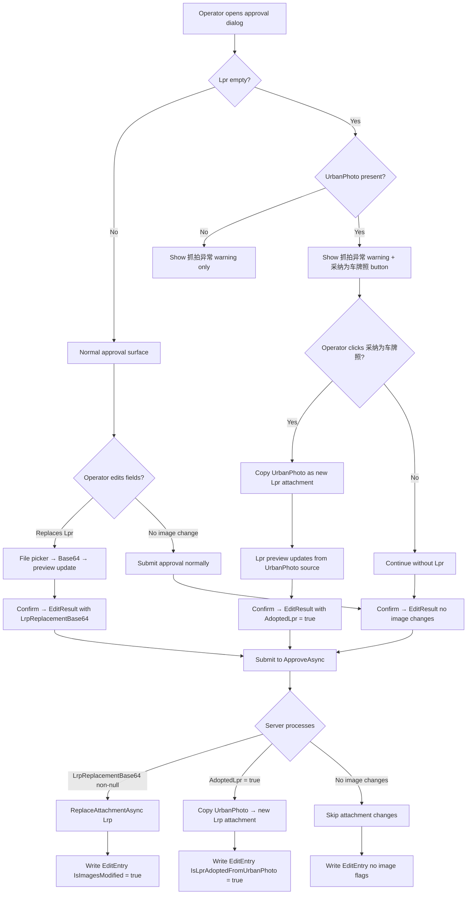

## Why

UrbanPhoto (摄像头抓拍) 当前可被审批流程替换，与其只读附加上下文的语义冲突——UrbanPhoto 是辅助现场照片，不应被人工修改。同时，当 Lpr (车牌识别抓拍) 为空但 UrbanPhoto 存在时，审批人员没有途径将 UrbanPhoto 提升为 Lpr，导致记录的 Lpr 槽位持续为空，只能依赖外部工具修补。

## What Changes

- **BREAKING** — 审批图片替换范围从"任意照片"收窄为仅 Lpr 照片。`UrbanPhotoReplacementBase64` 字段从审批 DTO、EditResult、客户端 ViewModel 中移除。UrbanPhoto 在客户端和服务端均变为只读，不可替换。
- **新增** — 审批流程中新增"采纳 UrbanPhoto 为 Lpr"操作。当 Lpr 为空且 UrbanPhoto 非空时，审批编辑弹窗显示"采纳为车牌照"按钮；点击后，系统以 UrbanPhoto 原图为源创建新的 `AttachType.Lrp` 附件记录，Lpr 预览区即时更新。
- **修改** — 服务端 `ApproveAsync` 不再接受 `UrbanPhotoReplacementBase64` 字段。新增 `AdoptUrbanPhotoAsLpr` 布尔标志，审批提交后若为 `true`，`FileService` 从现有 UrbanPhoto 附件复制文件创建新的 Lrp 附件。
- **修改** — 编辑历史 `EditEntry` 新增 `IsLprAdoptedFromUrbanPhoto` 字段，采纳操作发生时标记为 `true`。

## Interaction Flow



## UI Prototype

```
┌─────────────────────────────────────────────────────────────┐
│  WeighingRecordEditDialog                                    │
├─────────────────────────────────────────────────────────────┤
│                                                             │
│  车牌号: [___________]        总重量: [________]            │
│                                                             │
│  ┌─── 车牌识别抓拍 ──────────────┐  ┌── 摄像头抓拍 ───────┐ │
│  │                              │  │                      │ │
│  │    [placeholder image]       │  │  [UrbanPhoto img]    │ │
│  │                              │  │                      │ │
│  │    ⚠ 抓拍异常                │  │  [read-only, no      │ │
│  │                              │  │   replace button]    │ │
│  │  ┌──────────────────────┐    │  │                      │ │
│  │  │  📷 采纳为车牌照      │    │  │                      │ │
│  │  └──────────────────────┘    │  └──────────────────────┘ │
│  │  ┌────────┐                   │                          │
│  │  │ 替换   │                   │                          │
│  │  └────────┘                   │                          │
│  └──────────────────────────────┘                          │
│                                                             │
│  Note: "采纳为车牌照" only visible when                     │
│        Lpr is empty AND UrbanPhoto is present.              │
│        UrbanPhoto section has NO replace button.            │
│                                                             │
│              [ 取消 ]                    [ 确定 ]           │
└─────────────────────────────────────────────────────────────┘
```

```
┌─────────────────────────────────────────────────────────────┐
│  WeighingRecordEditDialog  (Lpr present, no adoption)       │
├─────────────────────────────────────────────────────────────┤
│                                                             │
│  车牌号: [浙A12345    ]        总重量: [25.50   ]           │
│                                                             │
│  ┌─── 车牌识别抓拍 ──────────────┐  ┌── 摄像头抓拍 ───────┐ │
│  │                              │  │                      │ │
│  │  [Lpr photo preview]         │  │  [UrbanPhoto img]    │ │
│  │                              │  │  [read-only, no      │ │
│  │                              │  │   replace button]    │ │
│  │  ┌────────┐                   │  │                      │ │
│  │  │ 替换   │                   │  │                      │ │
│  │  └────────┘                   │  └──────────────────────┘ │
│  └──────────────────────────────┘                          │
│                                                             │
│              [ 取消 ]                    [ 确定 ]           │
└─────────────────────────────────────────────────────────────┘
```

## Capabilities

### New Capabilities

- `lpr-adoption-from-urban-photo`: 在审批流程中，当 Lpr 为空且 UrbanPhoto 存在时，审批人员可将 UrbanPhoto 采纳为 Lpr 附件。包含客户端"采纳为车牌照"按钮、服务端 UrbanPhoto→Lpr 附件复制逻辑、编辑历史标记 `IsLprAdoptedFromUrbanPhoto`。

### Modified Capabilities

- `approval-image-replacement`: 移除 `UrbanPhotoReplacementBase64` 字段及所有 UrbanPhoto 替换场景。审批图片替换仅保留 Lpr 类型。客户端移除 UrbanPhoto 替换按钮和命令。服务端 `ApproveAsync` 不再处理 UrbanPhoto 替换。
- `edit-history-tracking`: `EditEntry` 新增 `IsLprAdoptedFromUrbanPhoto` 布尔字段。审批采纳 UrbanPhoto 时，该字段设为 `true`。
- `urban-approval-photo-preview`: 移除 UrbanPhoto 预览区的"替换"按钮。Lpr 预览区在空值且 UrbanPhoto 存在时，额外显示"采纳为车牌照"操作按钮。

## Impact

### Server Side (UrbanManagement)

- `UrbanWeighingRecordApproveInputDto` — 移除 `UrbanPhotoReplacementBase64`；新增 `AdoptUrbanPhotoAsLpr` 布尔字段
- `UrbanWeighingRecordAppService.ApproveAsync` — 移除 UrbanPhoto 替换分支；新增采纳分支调用 `IFileService`
- `IFileService` / `FileService` — 新增 `AdoptUrbanPhotoAsLprAsync(Guid recordId)` 方法（复制 UrbanPhoto 文件为 Lpr 附件）；现有 `ReplaceAttachmentAsync` 仅用于 Lrp
- `EditEntry` — 新增 `IsLprAdoptedFromUrbanPhoto` 属性
- `WeighingPhotoPreview.razor` — 无替换 UI 变更（Web 端本来就没有替换控件），但需确认 UrbanPhoto 不再参与替换

### Client Side (MaterialClient.Urban)

- `WeighingRecordEditDialogViewModel` — 移除 `ReplaceUrbanPhotoCommand` / `UrbanPhotoReplacementBase64`；新增 `AdoptUrbanPhotoAsLprCommand`；扩展 `EditResult` 增加 `AdoptedLpr` 布尔字段
- `WeighingRecordEditDialog.axaml` — 移除 UrbanPhoto 区域"替换"按钮；Lpr 区域在空值+UrbanPhoto 存在时显示"采纳为车牌照"按钮
- `UrbanAttendedWeighingViewModel` — `ApproveRecordAsync` 传递 `AdoptedLpr` 标志而非 UrbanPhoto 替换 Base64

### Cross-Cutting

- 审批替换规则从"任意照片"变为"Lpr only"，两端的替换逻辑、DTO、EditResult 都需对齐
- 采纳操作产生新的 `AttachmentFile`（`AttachType.Lrp`），原始 `AttachmentFile`（`AttachType.UrbanPhoto`）保留不动
