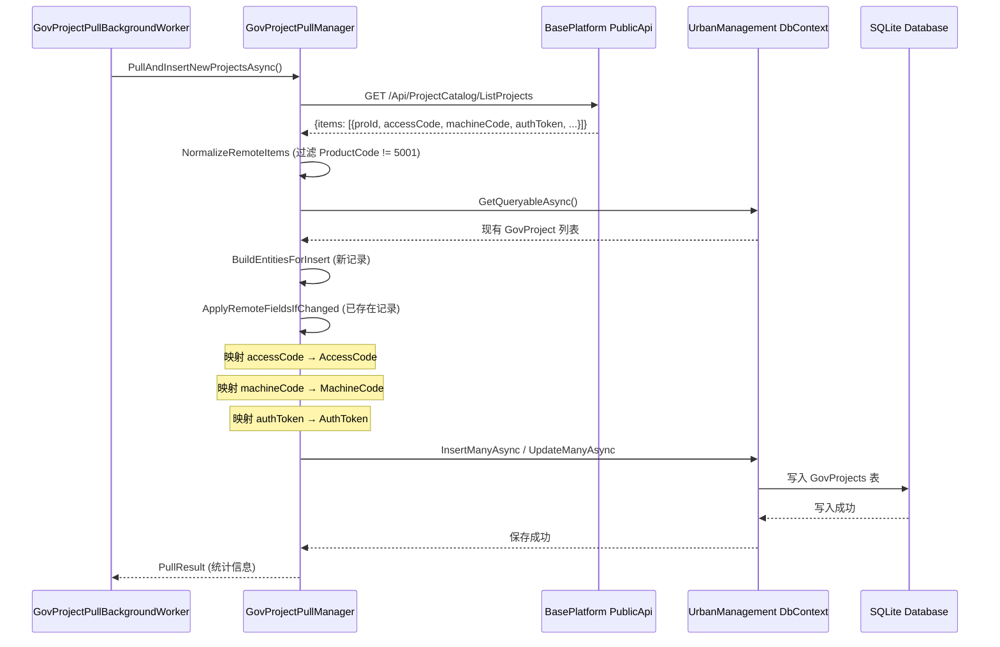
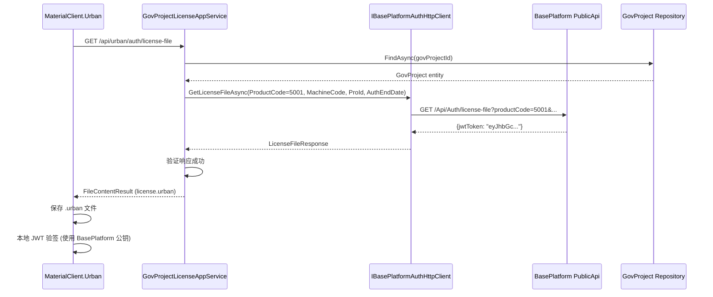
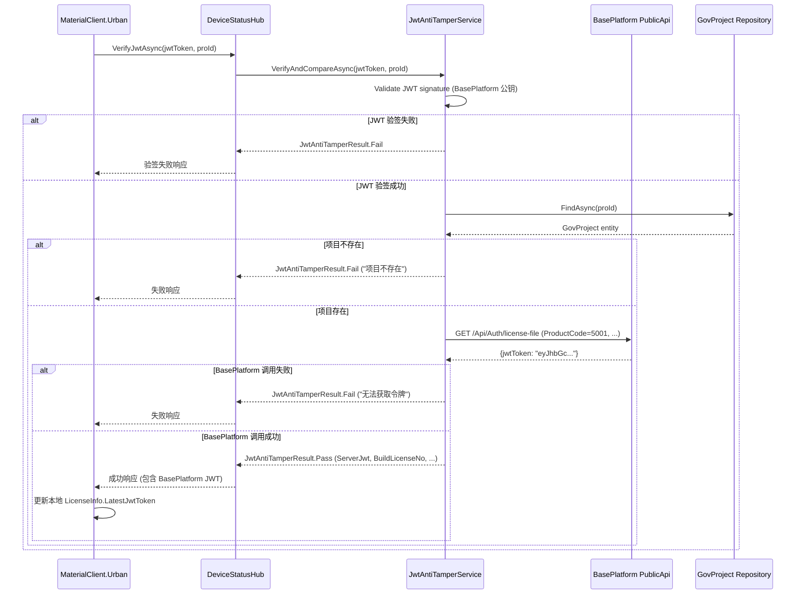

# UrbanManagement 迁移设计文档

## Execution Status

**当前状态：✅ 可以执行**

本设计文档基于以下已完成的基础设施：
- ✅ BasePlatform PublicApi 已实现 AccessCode/MachineCode 分列存储
- ✅ BasePlatform PublicApi 已实现 JWT 签发端点
- ✅ 所有 API 端点和响应格式已明确并可使用

UrbanManagement 可按本设计文档开始执行代码迁移。

## Context

### 背景与现状

当前 UrbanManagement 服务端存在两个核心技术债务：

1. **数据语义问题**：`GovProject.BuildLicenseNo` 字段名称与实际用途不符。该字段存储的是"城管接入码"（AccessCode），而非建筑施工许可证号，且缺少 `MachineCode`（机器码）和 `AuthToken`（授权令牌）字段，无法完整存储授权信息。

2. **JWT 签发分散问题**：JWT 授权令牌由 UrbanManagement 本地使用 RSA 私钥签发，存在密钥管理风险且无法与 BasePlatform 授权体系统一。UrbanManagement 当前通过 `UrbanLicenseGenerator` 服务签发 JWT，并在 `JwtAntiTamperService` 中重新签发。

### 约束条件

- **数据库**：UrbanManagement 使用 SQLite，需要无损数据迁移
- **向后兼容**：需保持政府平台协议字段名不变（`buildLicenseNo`）
- **灰度发布**：需支持 Feature Flag 控制迁移启用
- **客户端兼容**：MaterialClient 的 `LicenseInfo.BuildLicenseNo` 属性暂不重命名（后续单独立项）
- **依赖关系**：
  - ✅ BasePlatform PublicApi 已完成 `accessCode`、`machineCode` 字段输出（见 `2026-06-24-add-access-token-support` 提案）
  - ✅ BasePlatform PublicApi 已完成 JWT 签发端点（见 `2025-06-25-baseplatform-jwt` 提案）
  - UrbanManagement 可直接对接 BasePlatform 已实现的功能

### 利益相关者

- **UrbanManagement 团队**：负责服务端代码实现与数据库迁移
- **BasePlatform 团队**：负责提供 PublicApi 字段扩展与 JWT 签发端点
- **MaterialClient 团队**：负责客户端 JWT 验签逻辑（无需修改）
- **运维团队**：负责数据库迁移脚本执行与灰度发布配置

## Goals / Non-Goals

**Goals:**

1. 完成 `GovProject.BuildLicenseNo` → `AccessCode` 字段重命名与数据迁移
2. 新增 `GovProject.MachineCode` 和 `AuthToken` 字段并集成到拉取同步流程
3. 下线 `UrbanLicenseGenerator` 本地 JWT 签发，委托 BasePlatform 统一签发
4. 更新 `JwtAntiTamperService` 验签后转发 BasePlatform JWT
5. 更新 SignalR Hub 推送逻辑使用 BasePlatform JWT
6. 提供 Feature Flag 支持灰度发布与回滚

**Non-Goals:**

1. **不包含** BasePlatform 表结构变更、授权后台 UI（见 02、03 提案）
2. **不包含** 客户端 `LicenseInfo.BuildLicenseNo` 属性重命名（后续单独立项）
3. **不包含** 政府平台协议字段改名（仍叫 `buildLicenseNo`）
4. **不包含** `POST /api/urban/auth/activate` 在线激活代理（见 05-联合发版说明）

## Decisions

### 决策 1：EF Core 迁移策略选择

**决策**：使用 `ALTER TABLE RENAME COLUMN` 语法进行字段重命名，而非 ADD + UPDATE + DROP 序列。

**理由**：

- **数据无损**：RENAME COLUMN 在 SQLite 中是原子操作，不会丢失数据
- **性能优势**：避免 ADD 列后的全表 UPDATE 操作（大数据量时性能差）
- **回滚简单**：直接 RENAME 回即可，无需数据恢复

**替代方案**：ADD `AccessCode` + UPDATE `AccessCode = BuildLicenseNo` + DROP `BuildLicenseNo`  
**拒绝原因**：需要全表扫描和更新，性能较差且容易出错

**实施细节**：

```sql
-- EF 迁移脚本示例
ALTER TABLE Gov_Project RENAME COLUMN BuildLicenseNo TO AccessCode;
ALTER TABLE Gov_Project ADD COLUMN MachineCode TEXT NULL;
ALTER TABLE Gov_Project ADD COLUMN AuthToken TEXT NULL;

-- 索引迁移
DROP INDEX IF EXISTS IX_Gov_Projects_BuildLicenseNo;
CREATE INDEX IX_Gov_Projects_AccessCode ON Gov_Projects(AccessCode);
```

### 决策 2：Feature Flag 架构设计

**决策**：使用 appsettings.json 配置 + 代码中的条件判断实现 Feature Flag，不引入专门的 Feature Flag 库。

**理由**：

- **简单性**：灰度期短暂（预计 1-2 周），无需复杂特性开关系统
- **配置化**：运维人员可直接修改 JSON 文件，无需重新编译
- **就地回滚**：修改配置文件即可回滚，无需重新部署

**实施细节**：

```json
// appsettings.json
{
  "UrbanAuth": {
    "UseAccessCodeMigration": true,
    "UseBasePlatformJwtIssuer": true
  }
}
```

```csharp
// 代码中的使用
if (_authOptions.Value.UseAccessCodeMigration)
{
    // 新逻辑：映射 AccessCode
}
else
{
    // 旧逻辑：映射 BuildLicenseNo
}
```

### 决策 3：BasePlatform HTTP 客户端实现

**决策**：使用 Refit 接口定义 BasePlatform API 客户端，复用现有的 Refit 基础设施。

**理由**：

- **一致性**：项目已使用 Refit 实现 `IBasePlatformProjectHttpClient`
- **类型安全**：编译时检查 API 契约
- **易测试**：可轻松 Mock Refit 接口进行单元测试
- **对接已实现 API**：BasePlatform PublicApi 已完成相关端点实现

**实施细节**：

```csharp
[Headers("Content-Type: application/json")]
public interface IBasePlatformAuthHttpClient
{
    // 对接 BasePlatform 已实现的 JWT 签发端点
    [Get("/api/auth/license-file")]
    Task<BasePlatformApiResponse<LicenseFileResponse>> GetLicenseFileAsync(
        [Query] int productCode,
        [Query] string machineCode,
        [Query] string proId,
        [Query] DateTime authEndDate,
        [Query] string format = "json",
        CancellationToken cancellationToken = default);

    // 可选：对接 BasePlatform 在线激活端点
    [Post("/api/auth/activate-urban")]
    Task<BasePlatformApiResponse<ActivateUrbanResponse>> ActivateUrbanAsync(
        [Body] ActivateUrbanRequest request,
        CancellationToken cancellationToken = default);
}

public class LicenseFileResponse
{
    public string JwtToken { get; set; } = string.Empty;
    public string ProId { get; set; } = string.Empty;
    public string ProName { get; set; } = string.Empty;
    public string AuthEndDate { get; set; } = string.Empty;
}
```

**BasePlatform API 规格**（已实现）：

1. **GET /api/auth/license-file**
   - 参数：`productCode`（固定 5001）、`machineCode`、`proId`、`authEndDate`、`format`
   - 返回：JSON 或 Stream 格式的 JWT token

2. **POST /api/auth/activate-urban**
   - 参数：`productCode`、`code`、`machineCode`
   - 功能：验证 Redis 授权码、回写 MachineCode、签发 JWT

### 决策 4：JWT 防篡改服务改造策略

**决策**：修改 `JwtAntiTamperService.VerifyAndCompareAsync` 方法，在验签通过后调用 BasePlatform API 获取 JWT，而非使用本地 `UrbanLicenseGenerator`。

**理由**：

- **最小改动**：仅需修改验签后的 JWT 获取逻辑，验签流程不变
- **向后兼容**：客户端调用接口不变，仅 JWT 来源变更
- **错误处理清晰**：BasePlatform API 调用失败时直接返回 Fail，不回退本地签发

**实施细节**：

```csharp
// 旧逻辑（移除）
var freshJwt = _urbanLicenseGenerator.GenerateLicenseToken(request);

// 新逻辑
var licenseResponse = await _basePlatformAuthClient.GetLicenseFileAsync(
    productCode: 5001,
    machineCode: project.MachineCode ?? "",
    proId: project.Id,
    authEndDate: project.AuthEndTime ?? DateTime.Now.AddYears(1),
    cancellationToken);

if (!licenseResponse.Success || string.IsNullOrEmpty(licenseResponse.Data?.JwtToken))
{
    return JwtAntiTamperResult.Fail("无法获取授权令牌，请稍后重试");
}

var freshJwt = licenseResponse.Data.JwtToken;
```

### 决策 5：脏数据修复脚本实现

**决策**：使用后台 Worker 在应用启动时延迟执行脏数据修复，而非提供独立的管理工具。

**理由**：

- **自动化**：无需人工干预，应用启动自动修复
- **渐进式**：使用分页处理避免内存压力
- **幂等性**：多次执行不造成数据重复或错误

**实施细节**：

```csharp
public class AccessCodeMigrationBackgroundWorker : AsyncPeriodicBackgroundWorkerBase
{
    protected override async Task ExecutePeriodicTaskAsync()
    {
        var projects = await _govProjectRepository.GetListAsync();
        foreach (var project in projects)
        {
            // 从 BasePlatform 拉取最新数据
            var response = await _basePlatformClient.GetProjectAsync(project.Id);
            if (response.Success && response.Data != null)
            {
                project.AccessCode = response.Data.AccessCode;
                project.MachineCode = response.Data.MachineCode;
                project.AuthToken = response.Data.AuthToken;
                await _govProjectRepository.UpdateAsync(project);
            }
        }
    }
}
```

## Component Architecture

```
Component Hierarchy: UrbanManagement Migration
├── Data Layer (数据层)
│   ├── GovProject Entity (实体变更)
│   │   ├── AccessCode (原 BuildLicenseNo，重命名)
│   │   ├── MachineCode (新增)
│   │   └── AuthToken (新增)
│   └── EF Core Migrations (迁移脚本)
│       ├── Rename BuildLicenseNo → AccessCode
│       └── Add MachineCode, AuthToken columns
├── Domain Layer (领域层)
│   ├── GovProjectPullManager (拉取同步服务)
│   │   ├── ApplyRemoteFieldsIfChanged (修改映射逻辑)
│   │   └── NormalizeRemoteItems (新增 ProductCode 验证)
│   └── UrbanLicenseGenerator (删除或标记 Obsolete)
├── Application Layer (应用层)
│   ├── GovProjectLicenseAppService (授权服务)
│   │   └── GenerateAsync (改为代理调用 BasePlatform)
│   └── JwtAntiTamperService (防篡改服务)
│       └── VerifyAndCompareAsync (修改验签后 JWT 获取)
├── Infrastructure Layer (基础设施层)
│   ├── IBasePlatformAuthHttpClient (新增)
│   │   └── GetLicenseFileAsync (调用 BasePlatform JWT 签发)
│   └── DeviceStatusHub (SignalR Hub)
│       └── UpdateClientLicense (推送 BasePlatform JWT)
└── Configuration (配置)
    ├── appsettings.json (Feature Flag 配置)
    │   ├── UrbanAuth:UseAccessCodeMigration
    │   └── UrbanAuth:UseBasePlatformJwtIssuer
    └── Jwt:PublicKey (保留用于验证 BasePlatform JWT)
```

## API Sequence Diagrams

### Sequence 1: AccessCode 拉取同步流程



### Sequence 2: JWT 委托签发流程



### Sequence 3: JWT 防篡改服务流程



## Detailed Code Change Inventory

### UrbanManagement 仓库变更清单

| 文件路径 | 变更类型 | 变更描述 | 影响模块 |
|---------|---------|---------|---------|
| `src/UrbanManagement.Core/Entities/GovProject.cs` | **BREAKING** 字段重命名+新增 | `BuildLicenseNo` → `AccessCode`；新增 `MachineCode`、`AuthToken` 可空字符串字段 | EF 实体、数据库迁移 |
| `src/UrbanManagement.Core/EntityFrameworkCore/UrbanManagementDbContext.cs` | 修改实体配置 | 更新 `BuildLicenseNo` → `AccessCode` 配置；新增 `MachineCode`、`AuthToken` 列配置 | EF Core 模型 |
| `src/UrbanManagement.Core/EntityFrameworkCore/Migrations/` | 新增 EF 迁移 | 生成 `RenameBuildLicenseNoToAccessCode` 迁移脚本 | 数据库结构 |
| `src/UrbanManagement.Core/Services/GovProjectPullManager.cs` | 修改映射逻辑 | `ApplyRemoteFieldsIfChanged` 改为映射 `AccessCode`、`MachineCode`；新增 `NormalizeRemoteItems` ProductCode 验证 | 拉取同步服务 |
| `src/UrbanManagement.Core/Api/IBasePlatformProjectHttpClient.cs` | 新增响应字段 | `ProjectCatalogItemResponse` 新增 `AccessCode`、`MachineCode`、`AuthToken` 属性 | BasePlatform HTTP 客户端 |
| `src/UrbanManagement.Core/Services/UrbanLicenseGenerator.cs` | **BREAKING** 删除或标记 Obsolete | 删除 `IUrbanLicenseGenerator` 接口和实现，或标记 `[Obsolete]` | 授权生成服务 |
| `src/UrbanManagement.Core/Services/GovProjectLicenseAppService.cs` | 改为代理调用 | `GenerateAsync` 方法改为调用 `IBasePlatformAuthClient.GetLicenseFileAsync` 并透传 JWT | 授权文件下载 API |
| `src/UrbanManagement.Core/Services/JwtAntiTamperService.cs` | 修改验签后行为 | `VerifyAndCompareAsync` 方法在验签通过后调用 BasePlatform API 获取 JWT，不再使用本地签发 | JWT 防篡改服务 |
| `src/UrbanManagement.Core/Services/IBasePlatformAuthHttpClient.cs` | **新增** | 新增 Refit 接口定义 BasePlatform JWT 签发 API | BasePlatform HTTP 客户端 |
| `src/UrbanManagement.Core/Hubs/DeviceStatusHub.cs` | SignalR 推送 JWT 来源 | `GetClientProjectLicenseInfo` 和 `UpdateClientLicense` 推送的 JWT 来自 BasePlatform 签发 | SignalR Hub |
| `src/UrbanManagement.Core/Configuration/BasePlatformSyncOptions.cs` | 新增配置项 | 新增 `UseAccessCodeMigration` 和 `UseBasePlatformJwtIssuer` 配置属性 | 配置模型 |
| `src/UrbanManagement.App/appsettings.json` | 新增配置节 | 新增 `UrbanAuth` 节点，包含 Feature Flag 配置 | 应用配置 |
| `src/UrbanManagement.Core/Services/AccessCodeMigrationBackgroundWorker.cs` | **新增**（可选） | 后台 Worker 用于脏数据修复，从 BasePlatform 拉取最新数据覆盖本地 `AccessCode` | 数据修复 |

### BasePlatform 仓库变更清单（本提案仅更新 spec，不在 apply 阶段改代码）

| 文件路径 | 变更类型 | 变更描述 | 影响模块 |
|---------|---------|---------|---------|
| `PublicApi/ProjectCatalogController.cs` | 新增响应字段 | `ProjectCatalogItemResponse` 新增 `AccessCode`、`MachineCode`、`AuthToken` 字段 | 目录 API |
| `PublicApi/AuthController.cs` | 新增 JWT 签发端点 | 新增 `GET /Api/Auth/license-file` 端点，支持 ProductCode=5001（Urban） | 授权 API |

### MaterialClient 仓库变更清单（无需修改）

| 文件路径 | 变更类型 | 变更描述 | 影响模块 |
|---------|---------|---------|---------|
| `src/MaterialClient.Common/Entities/LicenseInfo.cs` | **不变** | `BuildLicenseNo` 属性保持不变（客户端属性重命名后续单独立项） | 客户端实体 |
| `src/MaterialClient.Common/Services/Authentication/LicenseService.cs` | **不变** | 客户端以本地 JWT 验签为准，无需 verify API 门禁 | 授权服务 |

## Risks / Trade-offs

### Risk 1: 数据库迁移失败导致数据丢失

**风险**：EF 迁移脚本执行失败可能导致数据丢失或应用无法启动。

**缓解措施**：

- 在生产环境执行前，先在测试环境完整验证迁移脚本
- 执行迁移前备份数据库文件（`urbanmanagement.db`）
- 使用事务包装迁移脚本，失败时自动回滚
- 提供手动回滚脚本（RENAME 回 `BuildLicenseNo`，DROP 新列）

### Risk 2: BasePlatform API 不可用导致授权失败

**风险**：BasePlatform `/api/auth/license-file` 端点不可用时，客户端无法获取授权令牌。

**缓解措施**：

- 实现 HTTP 客户端超时与重试机制（超时 30 秒，重试 1 次）
- 提供明确的错误消息指导用户检查网络连接
- 考虑实现短期缓存机制（缓存 BasePlatform JWT 5 分钟）
- 灰度期保留 Feature Flag `UseBasePlatformJwtIssuer=false` 回退选项

### Risk 3: Feature Flag 配置错误导致服务异常

**风险**：运维人员误配置 Feature Flag 可能导致服务使用错误的逻辑分支。

**缓解措施**：

- 在应用启动时验证 Feature Flag 配置，记录配置值到日志
- 提供配置文档说明每个 Feature Flag 的作用和推荐值
- 监控关键业务指标（授权成功率、拉取同步成功率），异常时触发告警
- 灰度期结束后移除 Feature Flag，强制使用新逻辑

### Risk 4: 政府平台协议字段名变更导致对接失败

**风险**：如果误将政府平台协议的 `buildLicenseNo` 改为 `accessCode`，可能导致政府平台无法解析数据。

**缓解措施**：

- 在代码审查阶段重点检查政府平台出站序列化逻辑
- 添加单元测试验证 `buildLicenseNo` 字段名保持不变
- 在提案文档中明确标注协议字段名不更改
- 与政府平台技术负责人确认协议兼容性

### Risk 5: 脏数据修复脚本执行性能问题

**风险**：如果 `GovProject` 表数据量大，后台修复脚本可能导致应用启动缓慢或数据库负载过高。

**缓解措施**：

- 使用分页查询（每页 100 条）避免内存压力
- 设置执行间隔（如每 10 秒修复一批）避免集中负载
- 提供手动触发修复的管理 API（可选）
- 监控修复脚本执行时间，超时时记录告警

## Migration Plan

### 迁移步骤

#### 阶段 1：代码开发（预计 3 天）

1. **EF 实体与迁移开发**（0.5 天）
   - 修改 `GovProject` 实体字段
   - 生成 EF 迁移脚本
   - 在测试环境验证迁移脚本

2. **拉取同步逻辑更新**（1 天）
   - 更新 `GovProjectPullManager` 映射逻辑
   - 新增 `NormalizeRemoteItems` ProductCode 验证
   - 更新 `IBasePlatformProjectHttpClient` 响应字段

3. **JWT 委托逻辑实现**（1 天）
   - 新增 `IBasePlatformAuthHttpClient` Refit 接口
   - 修改 `GovProjectLicenseAppService` 代理调用
   - 修改 `JwtAntiTamperService` 验签后行为
   - 更新 `DeviceStatusHub` SignalR 推送
   - 删除或标记 `UrbanLicenseGenerator` 为 `[Obsolete]`

4. **Feature Flag 与配置**（0.5 天）
   - 新增 `UrbanAuth` 配置节
   - 实现条件判断逻辑
   - 编写配置文档

#### 阶段 2：测试验证（预计 2 天）

1. **单元测试**
   - `GovProjectPullManager` 映射逻辑测试
   - `JwtAntiTamperService` 验签测试
   - `GovProjectLicenseAppService` 代理调用测试

2. **集成测试**
   - BasePlatform API 集成测试
   - SignalR Hub 推送测试
   - 端到端授权流程测试

3. **灰度测试**
   - 设置 `UseBasePlatformJwtIssuer=false` 验证回退逻辑
   - 设置 `UseAccessCodeMigration=false` 验证旧映射逻辑
   - 逐步启用 Feature Flag 验证新逻辑

#### 阶段 3：部署上线（预计 1 天）

1. **预生产验证**
   - 在预生产环境执行完整迁移流程
   - 验证数据迁移无损
   - 验证 BasePlatform API 调用成功

2. **生产部署**
   - 备份生产数据库
   - 设置 Feature Flag 为 `false`（初始使用旧逻辑）
   - 部署新版本代码
   - 验证应用启动正常

3. **灰度启用**
   - 监控业务指标 1 小时
   - 设置 `UseAccessCodeMigration=true` 启用 AccessCode 映射
   - 监控拉取同步成功率
   - 设置 `UseBasePlatformJwtIssuer=true` 启用 JWT 委托
   - 监控授权成功率

4. **全量上线**
   - 观察 24 小时业务指标
   - 确认无异常后移除 Feature Flag
   - 删除 `UrbanLicenseGenerator` 旧代码

### Rollback 策略

#### 数据库回滚

```sql
-- 回滚 AccessCode 重命名
ALTER TABLE Gov_Project RENAME COLUMN AccessCode TO BuildLicenseNo;

-- 回滚新增列
ALTER TABLE Gov_Project DROP COLUMN MachineCode;
ALTER TABLE Gov_Project DROP COLUMN AuthToken;

-- 回滚索引
DROP INDEX IF EXISTS IX_Gov_Projects_AccessCode;
CREATE INDEX IX_Gov_Projects_BuildLicenseNo ON Gov_Projects(BuildLicenseNo);
```

#### 应用回滚

1. 设置 Feature Flag：
   ```json
   {
     "UrbanAuth": {
       "UseAccessCodeMigration": false,
       "UseBasePlatformJwtIssuer": false
     }
   }
   ```

2. 重启应用，应用将自动回退到旧逻辑

3. 如果旧代码已删除，需要回滚代码版本并重新部署

### 依赖关系

本迁移依赖于以下前置变更（均已完成）：

- ✅ **BasePlatform-AccessCode与MachineCode分列**（`2026-06-24-add-access-token-support`）：PublicApi 输出 `accessCode`、`machineCode` 字段
- ✅ **BasePlatform-JWT签发迁移**（`2025-06-25-baseplatform-jwt`）：PublicApi 提供 `/api/auth/license-file` 端点支持 Urban 产品

**注**：BasePlatform 相关基础设施已实现，UrbanManagement 可直接对接使用。

## Open Questions

1. **脏数据修复策略确认**
   - 是否需要提供手动触发修复的管理 API？
   - 修复脚本是否应该在应用启动时立即执行，还是延迟执行？

2. **Feature Flag 移除时机**
   - 灰度期结束后，是否立即移除 Feature Flag 和旧逻辑？
   - 还是保留 Feature Flag 一个版本周期（如 1 个月）以便紧急回滚？

3. **BasePlatform API 超时配置**
   - 30 秒超时是否合适？是否需要根据网络环境调整？
   - 是否需要实现重试机制？如果重试，重试几次？

4. **监控与告警**
   - 需要监控哪些关键指标（授权成功率、拉取同步成功率、BasePlatform API 调用延迟等）？
   - 告警阈值如何设置（如授权成功率低于 95% 触发告警）？

5. **客户端影响**
   - MaterialClient 是否需要感知服务端 JWT 来源变更？
   - 客户端是否需要更新 BasePlatform 公钥（JWT 的 `iss` claim 从 "UrbanManagement" 变为 "BasePlatform"）？
