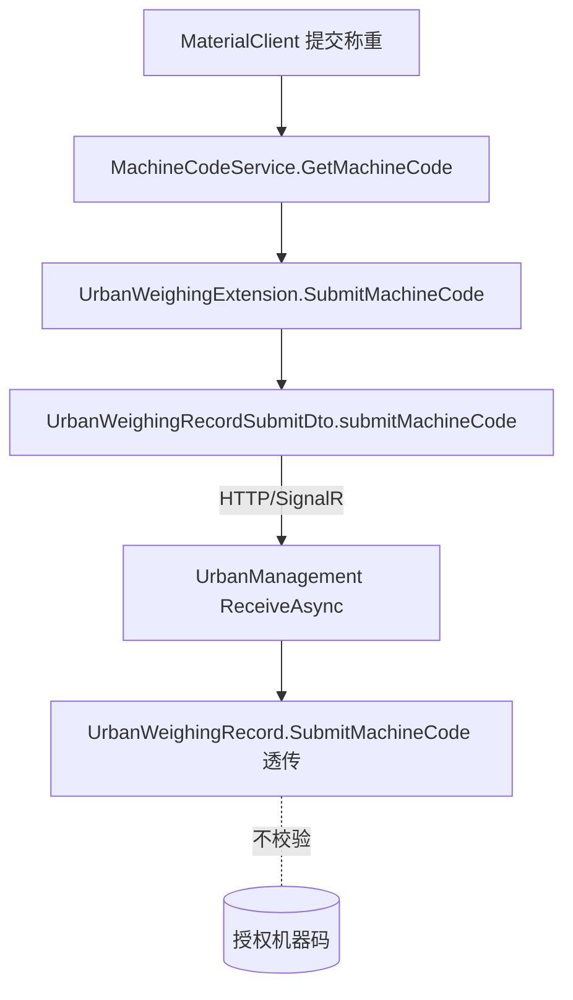
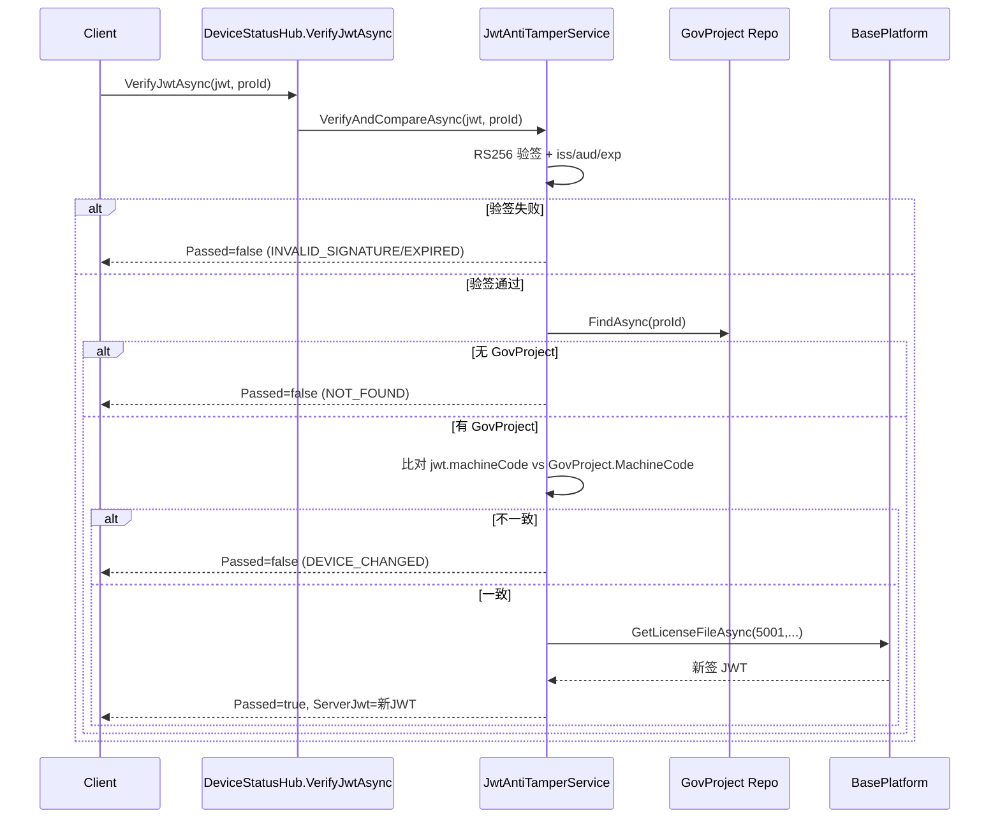

## Context

V1 授权方案（`iss=BasePlatform`、JWT 唯一权威、仅 5001）已实施，vault `00-EPIC-授权修正迭代V2-拟稿提案` 在联调/运营反馈基础上提出 V2 功能修正。本 change 将其落地为 spec-driven 工件，作用域限定两个可编辑仓库。

当前代码现状（2026-06-29 探索验证）：

- **F4 根因确认**：`UrbanManagement.Core/Services/JwtAntiTamperService.cs:67 VerifyAndCompareAsync` 当前流程为「RS256 验签 → 查 `GovProject` → 调 BasePlatform 取新 JWT → 返回 Pass」，**未读取提交 JWT 的 `machineCode` claim、未与 `GovProject.MachineCode` 比对**。`GovProject.MachineCode` 已存在（`Entities/GovProject.cs:20`）。`JwtAntiTamperResult` 有 `Passed/Reason/ServerJwt` 等字段，但**无 `RevocationReason`**。
- **F4 客户端现状**：`MaterialClient.Common/Services/DeviceStatusSignalRClient.cs:486 SyncProjectLicenseFromServerAsync` 在 `Passed=false` 时仅记录告警并 `return`（跳过同步），**不清除 JWT、不终止**。
- **F1 现状**：离线 UI 内嵌于 `MaterialClient.Urban/Views/Dialogs/UnauthorizedNoticeWindow.axaml:29-53`，已由 `UrbanActivationUiOptions.ShowOfflineActivationUi = false`（const）软隐藏；无独立离线导入对话框。
- **F2 现状**：`UrbanWeighingRecord`/`UrbanWeighingExtension`/`UrbanWeighingRecordSubmitDto` 均**无 `SubmitMachineCode`**；`UrbanWeighingRecord` 有 `AddTime`。
- **F3 现状**：`GovProject`/`UrbanWeighingRecord` 等均有非标准 `AddTime`；`LicenseInfo` 用 `CreatedAt`/`UpdatedAt`。

约束：遵循 `repos/UrbanManagement/AGENTS.md` 与 `repos/MaterialClient/AGENTS.md`（AppService+DTO、`record` 命名、禁止 tuple、`[UnitOfWork]` 写操作、Refit 客户端独立文件等）；本 change 明确**允许破坏性变更、无需 back-compat、无需文档与单元测试**。

## Goals / Non-Goals

**Goals:**

- F4：服务端 `VerifyAndCompareAsync` 新增 machineCode 比对；客户端 `DEVICE_CHANGED` 时清除 JWT + 终止运行
- F1：彻底移除离线授权导入 UI 与 `ShowOfflineActivationUi` 开关，未授权窗仅在线激活
- F2：`SubmitMachineCode` 端到端（实体 + DTO + 透传 + 迁移）
- F3：实体实现 ABP 审计接口、移除手动赋值、`AddTime→CreationTime` 迁移、MaterialClient 拦截器、政府出站 DTO 独立映射

**Non-Goals:**

- `BasePlatform` 任何代码变更（F1-2 后台 UI 隐藏、F4-3 `license-file` machineCode 校验）——跨项目依赖
- RSA 密钥轮换 / 签名版本控制（无业务需求）
- 向后兼容层、文档产出、单元测试（任务约束）
- `activate` 代理、`UpdateClientLicense` 推送（其它 change）

## 架构与边界

```
授权数据流（三系统）
┌─────────────────────┐      ┌──────────────────────────────┐      ┌──────────────┐
│ MaterialClient.Urban │      │ UrbanManagement（权威校验侧）  │      │ BasePlatform │
│  - StaticLicenseChecker│    │  - JwtAntiTamperService ★F4  │      │ (不可编辑)   │
│    （本地验签门禁）   │ SignalR│    VerifyAndCompareAsync    │ HTTP │  activate-urban│
│  - DeviceStatusSignalR│◄────►│    + machineCode 比对        │◄────►│  license-file │
│    Client ★F1/F4     │      │  - GovProject.MachineCode    │      │  JWT 签发     │
│  - UnauthorizedNotice │      │  - UrbanWeighingRecord ★F2/F3│      └──────────────┘
│    Window ★F1        │      │  - 实体 ABP 审计 ★F3         │
└─────────────────────┘      └──────────────────────────────┘
  MaterialClient.Common           MaterialClient.Urban 也承载
  - LicenseInfo ★F3              F2 实体/DTO、F3 拦截器、F1 UI
  - SaveChangesInterceptor ★F3
```

★ 标注各 Feature 落点。本 change **不跨仓库物理搬迁代码**；F4 是将「设备绑定校验」**上收到 UrbanManagement 服务端**（权威收敛），F1 是**裁剪 MaterialClient 的离线自足能力**。

### 决策表速览

| # | 决策 | 归属 |
| --- | --- | --- |
| D1 | machineCode 比对置于「查 GovProject 之后、取 JWT 之前」，复用 `GovProject.MachineCode`，无新字段 | F4 |
| D2 | `JwtAntiTamperResult` 新增 `RevocationReason` 枚举区分失败类型 | F4 |
| D3 | 客户端仅 `DEVICE_CHANGED` 终止；其它失败保持可用性优先 | F4 |
| D4 | F1 彻底删除离线 UI + `ShowOfflineActivationUi`；保留 bootstrap 代码 | F1 |
| D5 | F2 透传不校验，仅溯源 | F2 |
| D6 | `UrbanWeighingRecord` 仅 `IHasCreationTime`；政府出站 DTO 独立映射 | F3 |
| D7 | `AddTime→CreationTime` 列重命名迁移 + 过渡列映射 | F3 |
| D8 | 复用 `jti`/`GovProject.MachineCode`，不做签名版本控制 | F4 |
| D9 | 接受「启动→首次 SignalR 验签」窗口期（F2 可追溯） | F4 |
| D10 | BasePlatform 项列为跨项目依赖，本 change 不实现 | 全局 |

## Decisions

### 决策 D1：machineCode 比对位置（F4 根因最小修复）

**决策**：在 `VerifyAndCompareAsync` 中，于「`GovProject` 查询成功」之后、「调用 `TryGetBasePlatformJwtAsync` 取新 JWT」之前，新增：从已验签 principal 提取 `machineCode` claim，与 `project.MachineCode` 比较。

**理由**：`handler.ValidateToken` 已返回 `principal`，复用其 claims 零成本；位置在签名/项目校验之后、外部调用之前，可提前短路省去 BasePlatform 调用；`GovProject.MachineCode` 已被 `activate` 代理回写为最新设备，是权威来源，无需新增字段。

**备选**：在 BasePlatform `license-file` 签发时校验请求 machineCode（F4-3，可选增强）——属跨仓库，本 change 不实现，列为依赖。

### 决策 D2：RevocationReason 区分失败类型

**决策**：`JwtAntiTamperResult` 新增 `RevocationReason`（枚举：`DEVICE_CHANGED`、`EXPIRED`、`NOT_FOUND`、`INVALID_SIGNATURE`、`UNREACHABLE` 等，可空）。`Reason` 仍保留中文用户提示。

**理由**：客户端需对「设备变更」做终止运行的差异化处理；纯字符串 `Reason` 易因文案变动失配，枚举提供稳定契约。

### 决策 D3：客户端仅 DEVICE_CHANGED 终止

**决策**：`SyncProjectLicenseFromServerAsync` 仅当 `RevocationReason == DEVICE_CHANGED` 时清除 `LatestJwtToken` + 弹仅在线激活窗 + 终止；签名失败/过期/项目不存在/网络超时等保持「记录 + 跳过」的可用性优先行为。

**理由**：网络抖动等瞬态失败不应误杀合法客户端；设备变更是不可逆的业务事实，须立即下线旧设备。无宽限期（EPIC §5.9 已决议）。

### 决策 D4：F1 彻底删除而非软隐藏

**决策**：删除 `UnauthorizedNoticeWindow.axaml` 离线 UI 区域（行 29-53 相关）与 `UrbanActivationUiOptions.ShowOfflineActivationUi` 开关及其消费点；保留 `license.urban` bootstrap 读取代码路径（无 UI 交互）。

**理由**：本 change 允许破坏性变更、无需 back-compat；彻底删除优于保留无用开关，降低维护面；bootstrap 代码保留以应应急/防回退（EPIC §2.2 保留清单）。

### 决策 D5：SubmitMachineCode 透传不校验（F2）

**决策**：服务端接收 `submitMachineCode` 直接写入 `UrbanWeighingRecord.SubmitMachineCode`，MUST NOT 与授权机器码比对；客户端由 `MachineCodeService.GetMachineCode()` 写入。

**理由**：F2 目标是数据溯源而非鉴权；鉴权由 F4 的 `VerifyJwtAsync` 机器码比对负责，职责分离。

### 决策 D6：UrbanWeighingRecord 仅创建审计 + 政府出站独立映射（F3）

**决策**：`UrbanWeighingRecord`（API 无用户上下文）仅实现 `IHasCreationTime`，MUST NOT 实现 `ICreationAudited`；数据来源项目用 `ProId` 表达。政府出站 DTO（`GovSyncWorker`）经 AutoMapper Profile/手动映射显式配置，字段名保持协议 `addTime`。

**理由**：API 推送无登录用户，`CreatorUserId` 无法填充；复用审计字段表达来源会污染审计语义；政府协议字段名不可变。

### 决策 D7：AddTime→CreationTime 迁移策略（F3）

**决策**：默认列重命名迁移（`AddTime → CreationTime`）+ `UPDATE` 回填；若现场不便立即重命名，过渡期使用 `HasColumnName("AddTime")` 映射，后续版本收敛。所有含 `AddTime` 实体（`GovProject`/`GovSyncData`/`GovLog`/`UrbanWeighingRecord`/`UrbanWeighingExtension`）统一迁移。

**理由**：历史审计数据不可丢；提供过渡映射降低一次性风险。

### 决策 D8：不做签名版本控制（F4）

**决策**：复用 JWT `jti` claim（每次签发新 GUID，天然唯一）与 `GovProject.MachineCode`，SHALL NOT 新增签名版本号字段或机制。

**理由**：EPIC §5.6 已论证——Case 1 核心是 machineCode 比对，Case 2 由现有 ServerJwt 流程天然支持；当前无密钥泄露/轮换业务需求。

### 决策 D9：接受启动→首次验签窗口期（F4）

**决策**：客户端启动通过本地验签后、首次 SignalR `VerifyJwtAsync` 前的数秒窗口期，旧设备 JWT 仍可本地验签；接受该窗口期，不消除。

**理由**：消除需在启动期阻塞网络校验，影响启动体验与离线可用；窗口期内数据由 F2 `SubmitMachineCode` 可追溯（EPIC §5.9 / §12.2 已决议）。

### 决策 D10：BasePlatform 项列为跨项目依赖

**决策**：F1-2（后台 `DownloadUrbanLicense` UI 隐藏）与 F4-3（`license-file` machineCode 校验，可选增强）SHALL NOT 在本 change 实现；在 tasks 中以「跨项目依赖」条目记录，供发版协调。

**理由**：`BasePlatform` 不在可编辑仓库范围；本 change 主体功能（F4 服务端比对、F1 客户端裁剪）不依赖这两项即可成立。

## Risks / Trade-offs

| 风险 | 缓解 |
| --- | --- |
| F4 `DEVICE_CHANGED` 误判致合法设备被下线 | 比对基于 `GovProject.MachineCode`（经 activate 回写），权威一致；客户端仅对明确枚举终止，瞬态失败不终止 |
| `activate` 无条件覆盖 MachineCode 致误操作挤下线（EPIC §9） | 跨项目项；建议 BasePlatform 增确认/审计（F4-3 范畴，列为依赖） |
| `AddTime→CreationTime` 迁移失败致审计断裂 | 列重命名 + `UPDATE` 回填 + 过渡列映射；历史数据保留 |
| 政府出站字段名漂移 | 出站 DTO 独立映射（D6），实体属性重命名不影响协议字段 |
| 启动→首次验签窗口期旧设备短暂可用 | 已接受（D9）；F2 `SubmitMachineCode` 可追溯窗口期数据来源 |
| F3 范围广、触及多实体迁移 | F3 独立为单一新 capability，可独立拆分/分批；P1 阶段 |
| F1 删除离线 UI 后无应急入口 | 保留 `license.urban` bootstrap 代码路径；可通过命令行/文件拷贝应急 |

## 数据流：F2 提交机器码



## API 时序：F4 VerifyAndCompareAsync 内部



## Migration Plan

| 阶段 | 工作 | 归属 |
| --- | --- | --- |
| P0 | F4 服务端 machineCode 比对 + `RevocationReason` | UrbanManagement |
| P0 | F4 客户端 DEVICE_CHANGED 清除+终止 | MaterialClient |
| P0 | F1 删除离线 UI + 开关 | MaterialClient |
| P1 | F2 实体/DTO/透传 + 迁移 | 两仓库 |
| P1 | F3 ABP 审计接口 + 移除手动赋值 + 迁移 | 两仓库 |
| 依赖 | F1-2 BasePlatform UI 隐藏、F4-3 BasePlatform machineCode 校验 | BasePlatform（跨项目） |

**回滚**：F4 比对可作为可配置开关（`JwtAntiTamper:EnableMachineCodeBinding`，默认 true）以备紧急回滚；F1 删除的离线 UI 可从版本控制恢复。本 change 无 back-compat 约束，回滚以版本控制为准。

## Open Questions

1. **F4 失败信号载体**：`RevocationReason` 用枚举还是字符串常量？——**建议枚举**（D2），客户端 switch 稳定；实现时确认 `JwtAntiTamperResult` 序列化兼容（SignalR 传输）。
2. **F1 设置页离线 UI**：设置页是否存在独立「离线授权」区域需删除？——探索仅发现 `UnauthorizedNoticeWindow` 内嵌离线 UI；实现时若设置页另有区域一并删除。
3. **F3 迁移策略现场选择**：列重命名 vs 过渡列映射由哪个版本定？——**建议本 change 直接列重命名**（无 back-compat 约束）；若现场数据量大可临时过渡。
4. **F4 客户端终止方式**：清除 JWT 后「终止运行」是 `Environment.Exit` 还是回未授权窗循环？——**建议回仅在线激活窗**（用户体验优于闪退），用户取消则退出。
