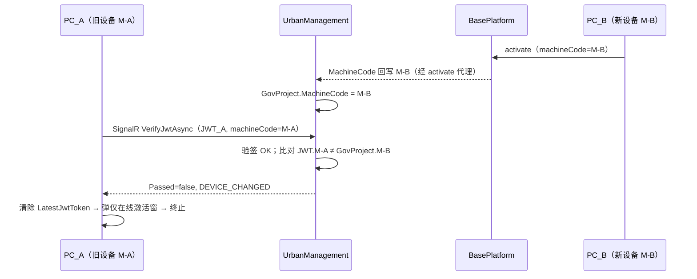
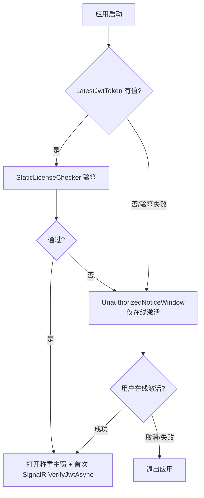

## Why

V1 授权方案（`iss=BasePlatform`、JWT 唯一权威、仅 ProductCode 5001）已落地实施，但联调/运营阶段暴露出四项**功能性**问题：① 实际部署中 5001 客户端恒在线，离线双路径从未被使用却持续增加维护负担；② 称重记录提交时不记录来源设备机器码，数据无法溯源；③ 审计字段（`AddTime` 等）在领域方法中手动赋值，分散且不符合 ABP 规范；④ **同一项目跨设备重新激活后，旧设备的 JWT 仍可通过验签继续运行**——这是最严重的安全缺口。

本迭代（V2）基于 vault `00-EPIC-授权修正迭代V2-拟稿提案`（doc-first 源文档）做**功能修正**，不推翻 V1 架构决策。需要明确：本迭代**不是物理代码搬迁**，而是**授权权威的收敛**（F4 将设备绑定校验上收到 UrbanManagement 服务端）+ **冗余离线能力的裁剪**（F1 收敛 MaterialClient 在线-only），并补齐数据溯源（F2）与审计规范化（F3）。

**范围假设**（非交互模式）：本 change 覆盖 EPIC 全部 F1–F4，仅作用于两个可编辑仓库（`UrbanManagement` + `MaterialClient`）。`BasePlatform` 不在可编辑范围（F1-2 后台 UI 隐藏、F4-3 可选 machineCode 校验）列为跨项目依赖 / Non-Goals。

## What Changes

- **F1（P0，BREAKING）客户端收敛为纯在线验证 + 离线 UI 隐藏**
  - 移除 `UnauthorizedNoticeWindow` 内离线授权（`license.urban` 导入）相关 UI 区域，仅保留「在线激活」入口（当前代码已用 `UrbanActivationUiOptions.ShowOfflineActivationUi = false` 软隐藏，本 change **彻底移除该 UI 与开关**）
  - 启动门禁流程变更：`LatestJwtToken` 无值/验签失败 → 弹出仅含在线激活的未授权窗（移除离线导入分支）
  - **保留**：`StaticLicenseChecker` 本地验签、`license.urban` bootstrap 代码路径、`LatestJwtToken`/`MachineCode` 字段、SignalR `VerifyJwtAsync`（防回退/应急，仅隐藏 UI 入口）

- **F2（P1）称重记录新增提交时机器码字段**
  - `UrbanWeighingRecord`（UrbanManagement）新增 `SubmitMachineCode`
  - `UrbanWeighingExtension`（MaterialClient）新增 `SubmitMachineCode`
  - 上传 DTO `UrbanWeighingRecordSubmitDto` 新增 `submitMachineCode`；客户端提交时由 `MachineCodeService` 写入；服务端**透传不校验**，仅记录

- **F3（P1，BREAKING）ABP 审计字段改由框架控制**
  - UrbanManagement 实体（`GovProject`、`GovSyncData`、`GovLog`、`UrbanWeighingRecord`、`UrbanWeighingExtension`）实现 ABP 审计接口；`AddTime → CreationTime` 标准化迁移
  - 移除领域方法 / 应用服务中手动赋值 `CreationTime`/`CreatorUserId`/`LastModificationTime` 等
  - MaterialClient（非 ABP 宿主，SQLite）新增 `SaveChangesInterceptor` 自动填充 `CreationTime`/`LastModificationTime`
  - 政府出站 DTO（`GovSyncWorker`）通过独立映射保持协议字段名（`addTime`）不变

- **F4（P0）重新激活后旧设备令牌失效机制**
  - UrbanManagement `JwtAntiTamperService.VerifyAndCompareAsync` 新增 **machineCode 比对**：提交 JWT 的 `machineCode` claim ≠ `GovProject.MachineCode` → `Passed=false`，Reason 标记设备变更
  - `JwtAntiTamperResult` 增加 `RevocationReason`（或 Reason 前缀 `DEVICE_CHANGED:`）以区分「设备变更」与其它失败
  - MaterialClient `DeviceStatusSignalRClient.SyncProjectLicenseFromServerAsync` 收到设备变更失败 → **清除 `LatestJwtToken` + 弹出仅在线激活窗 + 终止运行**（当前仅 `return` 跳过同步）
  - 不新增数据库字段：复用已有 `GovProject.MachineCode`；`jti` claim 已天然唯一，无需签名版本号

**Non-Goals（本 change 不做）：**

- `BasePlatform` 代码变更（F1-2 后台 `DownloadUrbanLicense` UI 隐藏、F4-3 `license-file` API machineCode 校验）——跨项目依赖，另行协调
- 非 5001 产品改动
- `POST /api/urban/auth/activate` 代理实现（V1 遗留，见 `add-urban-auth-activate-proxy` change）
- SignalR `UpdateClientLicense` 主动推送（P2 可选）
- RSA 密钥轮换 / 签名版本控制（当前无业务需求）
- 向后兼容：本 change 明确**允许破坏性变更**，无 back-compat 兼容层

## Capabilities

### New Capabilities

- `abp-audit-field-standardization`：UrbanManagement 实体实现 ABP 标准审计接口、移除手动赋值、`AddTime→CreationTime` 列迁移；MaterialClient（非 ABP 宿主）自定义 `SaveChangesInterceptor`；政府出站 DTO 独立映射不受实体属性重命名影响。**P1、可独立拆分。**

### Modified Capabilities

- `jwt-anti-tamper`：`VerifyAndCompareAsync` 在查到 `GovProject` 后新增「JWT `machineCode` claim vs `GovProject.MachineCode`」比对；设备不一致返回 `Passed=false` 并标记 `DEVICE_CHANGED`
- `jwt-anti-tamper-sync`：客户端收到 `DEVICE_CHANGED` 失败时，由「仅跳过同步」升级为「清除 `LatestJwtToken` + 终止运行」
- `urban-license-startup-gate`：启动门禁失败仅展示在线激活窗（移除离线导入 UI 分支）；`license.urban` bootstrap 代码保留但无 UI 入口
- `materialclient-urban-activation`：移除离线 `license.urban` 导入 UI 入口，未授权窗仅保留在线激活
- `urban-weighing-extension`：MaterialClient 实体新增 `SubmitMachineCode`，上传时由 `MachineCodeService` 写入
- `urban-weighing-record-reception`：服务端接收 DTO 新增 `submitMachineCode` 并透传写入 `UrbanWeighingRecord.SubmitMachineCode`，不做校验

## Impact

| 范围 | 影响 |
|------|------|
| **UrbanManagement** | F4 `JwtAntiTamperService`/`JwtAntiTamperResult`；F2 `UrbanWeighingRecord`+EF 映射+Migration；F3 实体审计接口改造+`AddTime→CreationTime` Migration+政府出站 DTO 映射 |
| **MaterialClient** | F1 `UnauthorizedNoticeWindow`+`UrbanActivationUiOptions` 裁剪；F2 `UrbanWeighingExtension`+`UrbanWeighingRecordSubmitDto`+上传服务+Migration；F3 `SaveChangesInterceptor`+`LicenseInfo` 审计字段；F4 `DeviceStatusSignalRClient` 失败处理升级 |
| **BasePlatform** | 无代码变更（跨项目依赖，见 Non-Goals） |
| **数据库** | UrbanManagement：`UrbanWeighingRecords.SubmitMachineCode`、`AddTime→CreationTime` 列迁移；MaterialClient(SQLite)：`UrbanWeighingExtensions.SubmitMachineCode` |
| **发版** | P0(F1+F4) 先行；P1(F2+F3) 可独立或延后；F4 需 UrbanManagement+MaterialClient 联调 |

### 变更地图（代码影响视图）

| 仓库 / 文件 | 变更类型 | 变更原因 | 归属 |
| --- | --- | --- | --- |
| UrbanManagement `Services/JwtAntiTamperService.cs` | 修改 | 新增 machineCode 比对（F4） | F4 |
| UrbanManagement `Models/JwtAntiTamperResult.cs` | 修改 | 新增 `RevocationReason` / 失败原因区分（F4） | F4 |
| UrbanManagement `Entities/UrbanWeighingRecord.cs` | 修改 | 新增 `SubmitMachineCode`；`AddTime→CreationTime`（F2/F3） | F2/F3 |
| UrbanManagement `Entities/GovProject.cs` 等 | 修改 | 实现 `IHasCreationTime`；移除手动 `AddTime`（F3） | F3 |
| UrbanManagement `EntityFrameworkCore/*` + `Migrations/*` | 新增 | EF 映射 + Migration（F2/F3） | F2/F3 |
| UrbanManagement `GovSyncWorker` 出站 DTO 映射 | 修改 | 独立映射保持政府协议字段名（F3） | F3 |
| MaterialClient `Views/Dialogs/UnauthorizedNoticeWindow.axaml(.cs)` | 修改/删除 | 移除离线 UI 区域（F1） | F1 |
| MaterialClient `UrbanActivationUiOptions.cs` | 修改/删除 | 移除 `ShowOfflineActivationUi` 开关（F1） | F1 |
| MaterialClient `Services/DeviceStatusSignalRClient.cs` | 修改 | 设备变更失败→清 JWT+终止（F4） | F4 |
| MaterialClient `Entities/Urban/UrbanWeighingExtension.cs` | 修改 | 新增 `SubmitMachineCode`（F2） | F2 |
| MaterialClient `Dtos/UrbanWeighingRecordSubmitDto.cs` + `Services/UrbanServerUploadService.cs` | 修改 | DTO 携带 `submitMachineCode`（F2） | F2 |
| MaterialClient `Common` `SaveChangesInterceptor` + `Entities/LicenseInfo.cs` | 新增/修改 | 自动审计填充（F3） | F3 |

### 交互流程：F4 设备失效时序



### 交互流程：F1 启动门禁（V2 在线-only）



### 原型：F1 裁剪后 UnauthorizedNoticeWindow（ASCII）

```
┌───────────────────────────────────────────────┐
│  软件未授权                              [×]  │
├───────────────────────────────────────────────┤
│  本机机器码：A1B2-C3D4-E5F6     [ 复制 ]      │
│                                               │
│  请联系运营获取接入码，点击下方在线激活。     │
│                                               │
│  接入码：┌─────────────────────────────┐      │
│          │                             │      │
│          └─────────────────────────────┘      │
│                                               │
│  (离线授权导入入口已移除 — V2)               │
│                                               │
│              [ 在线激活 ]   [ 退出 ]          │
└───────────────────────────────────────────────┘
```
