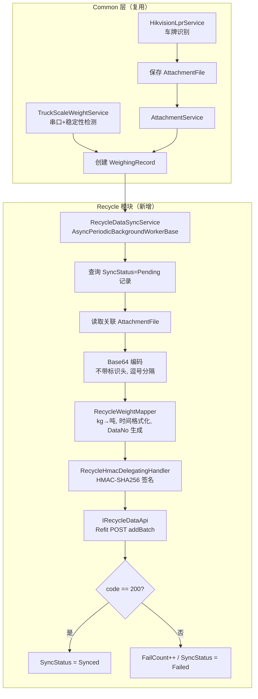
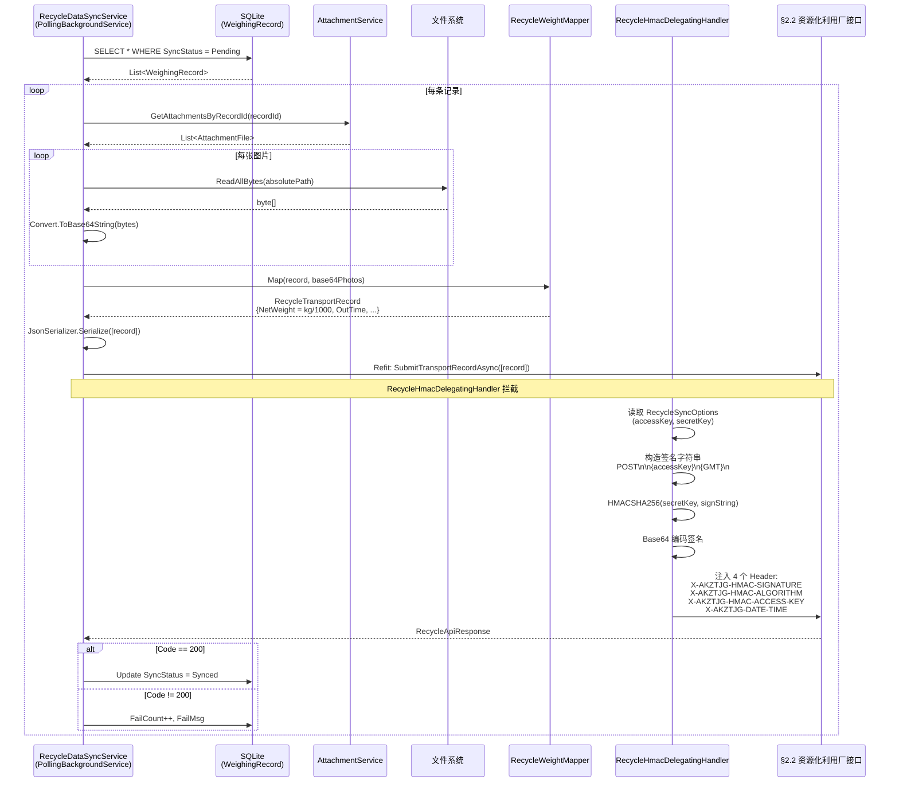

## Context

MaterialClient 是一套模块化 .NET 桌面称重客户端系统，采用 ABP 框架 + Avalonia UI + EF Core/SQLite + Refit HTTP 客户端架构。当前已有三种客户端模式：

| ProductCode | WeighingMode | 模块 | 上报目标 |
|---|---|---|---|
| 5000 (Standard) | 0 | MaterialClient 主程序 | MaterialPlatform (`SynchronizationOrderAsync`) |
| 5010 (SolidWaste) | 1 | MaterialClient 主程序内模式切换 | MaterialPlatform (`SynchronizationOrderAsync`) |
| 5001 (Urban) | 201 | MaterialClient.Urban | UrbanManagement (`IUrbanManagementApi`) |

本次变更需新增 **Recycle 客户端（ProductCode=5020, WeighingMode=301）**，前端功能与 SolidWaste 完全一致，但数据上报直连杭州市资源化利用厂外部 API（§2.2 端点），不走 MaterialPlatform 中转。

**约束条件**：
- 授权沿用 5010 的 `SendAuthLicense` / `DownloadAuth`（非 JWT）
- §2.2 接口要求 HMAC-SHA256 签名认证（与现有内部认证完全不同）
- 图片需 Base64 内嵌（非 OSS 上传后推元数据）
- 重量单位为吨（需从 kg 转换 ÷1000）
- 请求体为 JSON Array（非单条 Object）

## Goals / Non-Goals

**Goals:**
- 新增 `WeighingMode.Recycle = 301` 和 `ProductCode.Recycle = 5020` 枚举成员
- 创建 `MaterialClient.Recycle` ABP 模块，遵循 Urban 模块的扩展模式
- 实现 §2.2 接口对接：HMAC-SHA256 签名、字段映射、Base64 图片编码、kg→吨转换
- 扩展 `ISettingsService` 的双向映射支持 Recycle
- 在 BasePlatform 授权体系注册 ProductCode 5020

**Non-Goals:**
- 不改动 UrbanManagement 服务端代码（Recycle 直连外部接口）
- 不改动 SolidWaste 现有同步链路
- 不实现 §2.1（渣土接收）、§2.7（附件上传）、§2.8（废弃物处置）等其他端点
- 不实现 UrbanManagement 管理面查看 Recycle 数据
- 不实现 JWT 授权模式

## Decisions

### D1: Recycle 作为独立 Avalonia 桌面端项目（非主程序内模式切换）

**选择**：创建 `MaterialClient.Recycle` 独立项目，与 `MaterialClient.Urban` 并列。

**理由**：
- Recycle 数据上报直连外部第三方，与 MaterialPlatform 完全解耦，独立项目可避免主程序内 `WeighingMatchingService` 分支膨胀
- Urban 模块已验证"独立项目 + Common 共享层"模式可行，降低架构风险
- Recycle 授权虽沿用 5010 模式，但启动配置（ProductCode、WeighingMode、HMAC 密钥等）与 SolidWaste 不同，独立项目可隔离配置

**替代方案**：在 MaterialClient 主程序内新增 WeighingMode.Recycle 模式切换（类似 SolidWaste=1）。未采用原因：`WeighingMatchingService.SyncNewWaybillAsync()` 已有 SolidWaste 分支，再增加 Recycle 分支会使 Common 层与外部 API 耦合，违反 Common 层只面向内部 MaterialPlatform 的设计原则。

### D2: 不在 Common 层修改 WeighingMatchingService

**选择**：Recycle 同步逻辑完全在 `RecycleDataSyncService`（Recycle 模块内）实现，不修改 Common 层的 `WeighingMatchingService`。

**理由**：
- `WeighingMatchingService` 直接依赖 `IMaterialPlatformApi`（内部 Refit 客户端），Recycle 需要调用外部 §2.2 接口
- Recycle 的签名认证（HMAC-SHA256）、图片处理（Base64 内嵌）、重量转换（kg→吨）均为 Recycle 专属逻辑
- Common 层的 `WeighingRecord` 实体、`AttachmentFile` 体系、`SyncStatus` 枚举可被 Recycle 直接复用，无需改动

### D3: HMAC-SHA256 签名通过 Refit DelegatingHandler 实现

**选择**：创建 `RecycleHmacDelegatingHandler`（`DelegatingHandler` 子类），在 HTTP 请求管道中自动注入签名 Header，而非在 Refit 接口方法签名中传递签名参数。

**理由**：
- §2.2 文档提供了 Java 参考实现，签名需对请求体进行计算。Refit 的 `[Headers]` 特性是静态的，无法动态计算每个请求的签名
- `DelegatingHandler` 可拦截请求、计算签名、注入 Header，与 Refit 接口解耦
- 签名计算需要 `accessKey`、`secretKey`、当前时间戳——这些可从 `RecycleSyncOptions` 配置注入到 Handler 中

**替代方案**：在 `RecycleDataSyncService` 中手动构造 `HttpClient` 请求。未采用原因：丢失 Refit 的序列化/反序列化便利性，且不复用已有的 Polly 重试策略。

### D4: 图片 Base64 编码在 Recycle 模块内完成

**选择**：`RecycleDataSyncService` 读取 `AttachmentFile` 关联的本地图片文件，Base64 编码后内嵌到 `outPhotos` 字段。

**理由**：
- SolidWaste 的图片先上传 OSS 再推元数据，Recycle 需要直接内嵌 Base64
- `AttachmentFile.LocalPath` + `PathManager.ToAbsolutePath()` 可定位图片文件
- 编码逻辑简单（`Convert.ToBase64String`），不需要新依赖

**注意**：需复用已有的 `CompressImage` 压缩逻辑（JPEG quality 配置），避免 Base64 数据过大。§2.2 接口文档未明确图片大小限制，需联调时确认。

### D5: 重量转换 kg→吨在映射层完成

**选择**：在 `RecycleWeightMapper` 中将 `WeighingRecord.OrderGoodsWeight / 1000m` 转为吨。

**理由**：
- §2.2 接口要求重量单位为吨
- `decimal` 类型可保持精度，÷1000 不会引入浮点误差
- 与 Urban 的重量转换模式一致（Urban 也有 ton↔kg 双向转换，见 `urban-weight-upload-unit` spec）

### D6: Recycle 授权复用 SolidWaste 的非 JWT 模式

**选择**：Recycle 使用 `SendAuthLicense` / `DownloadAuth`（写入 `mlic.lic`），不使用 JWT。

**理由**：
- 5010 的非 JWT 流程成熟且已验证
- JWT 仅限 5001，体系已隔离
- Recycle 功能与 SolidWaste 一致，授权对齐更合理
- BasePlatform 的 `ProjectAuthAdd` 页面只需对 5020 复制 5010 的 UI 模式（AccessCode + MachineCode）

## Risks / Trade-offs

| 风险 | 等级 | 缓解措施 |
|------|------|---------|
| HMAC-SHA256 accessKey / secretKey 缺失 | **阻断** | 需平台方提供；开发阶段用 mock 签名测试 |
| pointNumber / productName 缺失 | **阻断** | 需运营方提供；配置化为 `RecycleSyncOptions` 字段 |
| 外部接口网络不可达 | 中 | 离线暂存（SyncStatus.Pending）+ 重试 + 运维确认防火墙 |
| Base64 图片过大超出接口限制 | 中 | 复用 `CompressImage` 逻辑，联调时实测确认 |
| HMAC 签名实现偏差导致认证失败 | 中 | 提前对照 §2.2 文档 Java 示例验证签名输出 |
| §2.2 接口无幂等性保证 | 低 | 使用 `DataNo` 唯一标识作为幂等键，本地已同步记录不再提交 |
| Common 层新增枚举成员影响已有客户端 | 低 | 仅新增成员，不改已有接口，向后兼容 |
| Recycle 与 SolidWaste 共享 WeighingRecord 但同步逻辑完全独立 | 低 | 可接受——各自维护同步状态，不冲突 |

## Migration Plan

### 部署步骤

1. **Common 层先行**：合入 `WeighingMode.Recycle = 301` + `ProductCode.Recycle = 5020` + `SettingsService` 映射扩展 → 确保 5000/5010/5001 回归通过
2. **Recycle 模块合入**：`MaterialClient.Recycle` 项目 + `MaterialClient.sln` 引用
3. **BasePlatform 注册**：ProductCode 5020 在授权体系中注册
4. **客户端部署**：分发 ProductCode=5020 的安装包，配置 `RecycleSync` 段（API URL、密钥、厂标识）
5. **联调验证**：与资源化利用厂 §2.2 接口联调

### 回滚策略

- Recycle 是独立项目，删除 `MaterialClient.Recycle` 项目引用 + Common 层枚举新增成员即可完全回滚
- Common 层枚举新增成员向后兼容，不影响已有客户端
- 无数据库迁移（Recycle 复用 WeighingRecord + AttachmentFile 实体，无新表）

## Open Questions

| # | 问题 | 负责方 | 状态 |
|---|------|--------|------|
| 1 | HMAC-SHA256 的 accessKey / secretKey 具体值 | 平台方 | ❌ 待获取 |
| 2 | 各资源化利用厂的 pointNumber 唯一标识映射 | 运营方 | ❌ 待获取 |
| 3 | productName（成品名称）与称重记录的映射规则 | 运营方 | ❌ 待确认 |
| 4 | §2.2 接口网络可达性（URL、端口、防火墙） | 运维方 | ❌ 待确认 |
| 5 | Base64 图片大小限制（单张、总量） | 开发方+平台方 | ❌ 待联调确认 |
| 6 | 接口是否支持幂等（DataNo 去重） | 平台方 | ❌ 待确认 |

## Architecture

```
模块依赖关系

MaterialClient.Recycle (新增)
├── MaterialClient.Common (共享层，仅引用)
│   ├── Entities: WeighingRecord, AttachmentFile, LicenseInfo
│   ├── Enums: WeighingMode, ProductCode, SyncStatus, AttachType
│   ├── Services: ISettingsService, IAttachmentService
│   └── Utils: PathManager
└── MaterialClient.UI (UI 共享层)
    ├── Views: 称重主界面基类
    └── ViewModels: 称重 ViewModel 基类

MaterialClient.Urban (已有，不改动)
├── MaterialClient.Common
└── MaterialClient.UI

MaterialClient (主程序，不改动)
├── MaterialClient.Common
└── MaterialClient.UI
```

## Data Flow



## API Sequence



## Detailed Change List

### MaterialClient.Common（共享层）

| 文件路径 | 变更类型 | 变更说明 |
|---------|---------|---------|
| `Entities/Enums/WeighingMode.cs` | 修改 | 新增 `Recycle = 301` 枚举成员，`[Description("资源化利用厂称重系统客户端软件")]` |
| `Entities/Enums/ProductCode.cs` | 修改 | 新增 `Recycle = 5020` 枚举成员，`[Description("资源化利用厂称重系统客户端软件")]` |
| `Services/SettingsService.cs` | 修改 | `GetProductCodeAsync()` switch 新增 `WeighingMode.Recycle => ProductCode.Recycle`；`SaveDefaultWeighingModeAsync()` switch 新增 `ProductCode.Recycle => WeighingMode.Recycle` |

### MaterialClient.Recycle（新增模块）

| 文件路径 | 变更类型 | 变更说明 |
|---------|---------|---------|
| `MaterialClient.Recycle.csproj` | **新增** | Avalonia WinExe 项目，TargetFramework net10.0，引用 MaterialClient.Common + MaterialClient.UI |
| `Program.cs` | **新增** | 入口点，Mutex 单实例，zh-CN 文化，BuildAvaloniaApp |
| `App.axaml` | **新增** | Avalonia Application XAML |
| `App.axaml.cs` | **新增** | ABP 初始化（MaterialClientRecycleModule），授权检查，主窗口 |
| `MaterialClientRecycleModule.cs` | **新增** | ABP Module：依赖 MaterialClientCommonModule + MaterialClientUiModule + AbpAutofacModule，配置 Serilog、Refit（IRecycleDataApi + RecycleHmacDelegatingHandler）、RecycleSyncOptions、BackgroundWorker |
| `Api/IRecycleDataApi.cs` | **新增** | Refit 接口：`[Post("/dataCenter/resourcePlace/productTransportRecord/v1/addBatch")] Task<RecycleApiResponse> SubmitTransportRecordAsync([Body] List<RecycleTransportRecord> records)` |
| `Models/RecycleTransportRecord.cs` | **新增** | 请求 DTO：17 个字段（dataNo, pointNumber, carNo, productName, netWeight, tareWeight, grossWeight, outTime, outPhotos 等） |
| `Models/RecycleApiResponse.cs` | **新增** | 响应 DTO：Code (int), Msg (string?), Data (object?) |
| `Models/RecycleSyncOptions.cs` | **新增** | 配置模型：Enabled, ApiUrl, AccessKey, SecretKey, PointNumber, ProductName, PollIntervalSeconds, MaxFailCount, TimeoutSeconds |
| `Services/RecycleHmacDelegatingHandler.cs` | **新增** | DelegatingHandler：拦截请求，构造 HMAC-SHA256 签名，注入 4 个 X-AKZTJG-* Header |
| `Services/RecycleDataSyncService.cs` | **新增** | AsyncPeriodicBackgroundWorkerBase：定时扫描未同步记录，调用 IRecycleDataApi，管理同步状态 |
| `Services/RecycleWeightMapper.cs` | **新增** | WeighingRecord → RecycleTransportRecord 映射：kg→吨、时间格式化、DataNo 生成、图片 Base64 |
| `Backgrounds/RecyclePollingBackgroundService.cs` | **新增** | 后台轮询入口，周期性触发 RecycleDataSyncService |
| `appsettings.json` | **新增** | 配置：ProductCode=5020, RecycleSync 段（ApiUrl、密钥、轮询间隔等） |
| `appsettings.secret.json` | **新增** | 密钥占位（accessKey, secretKey） |

### MaterialClient.sln

| 文件路径 | 变更类型 | 变更说明 |
|---------|---------|---------|
| `MaterialClient.sln` | 修改 | 添加 `src/MaterialClient.Recycle/MaterialClient.Recycle.csproj` 项目引用 |

### BasePlatform（服务端）

| 文件路径 | 变更类型 | 变更说明 |
|---------|---------|---------|
| ProductCode 配置/枚举 | 修改 | 注册 5020 |
| `ProjectAuthAdd.cshtml` / `CompanyAuthAdd.cshtml` | 修改 | 5020 显示 AccessCode + MachineCode（同 5010 模式） |
| `SendAuthLicense` Redis 载荷 | 确认 | 5020 沿用现网 JSON（不增加 AccessCode） |
