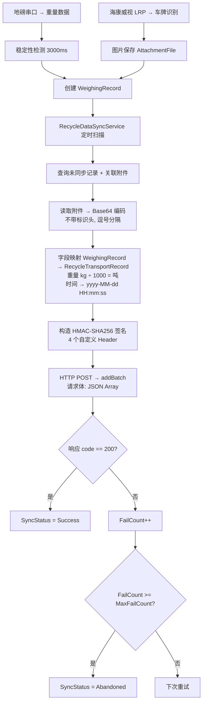
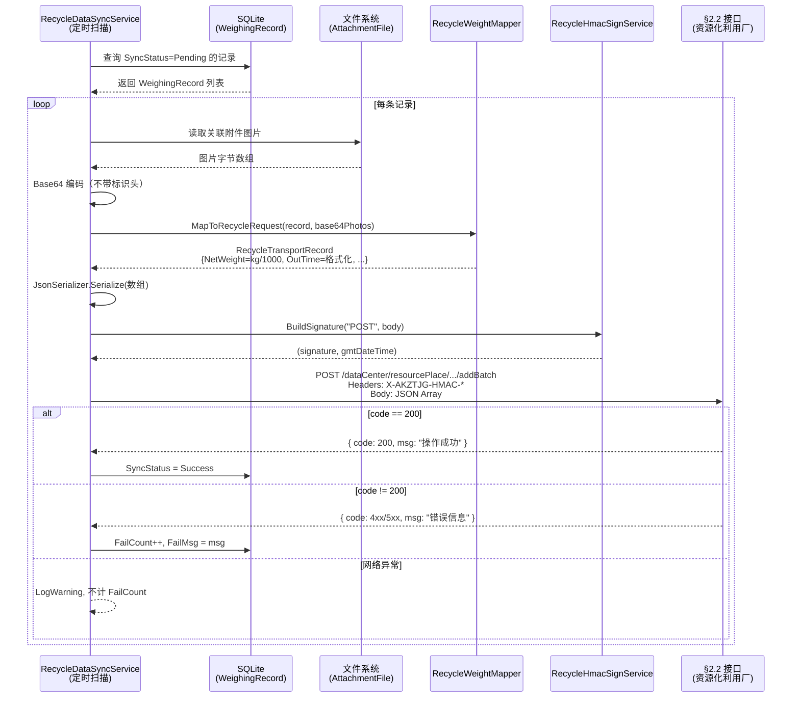

## Why

需要新增 MaterialClient.Recycle 客户端（ProductCode=5020, WeighingMode=301），其称重、车牌识别、图片保存等前端功能与 SolidWaste（5010）完全一致，但数据上报链路必须替换：不走 `SynchronizationOrderAsync`（内部 MaterialPlatform），改用「杭州市资源化利用厂数据接入接口 V1.0」§2.2 端点，直连外部第三方平台，要求 HMAC-SHA256 签名认证、Base64 图片内嵌、重量单位由 kg 转吨、JSON Array 批量提交。现在启动是因为接口文档已就位、SolidWaste 同步链路已完整定位，且运营侧有明确的交付时间要求。

## What Changes

- 新增 `WeighingMode.Recycle = 301` 枚举成员（MaterialClient.Common）
- 新增 `ProductCode.Recycle = 5020` 枚举成员（MaterialClient.Common）
- 新增 `MaterialClient.Recycle` ABP 模块项目，遵循 MaterialClient.Urban 扩展模式
- 新增 `IRecycleDataApi` Refit 接口，对接 §2.2 端点 `POST /dataCenter/resourcePlace/productTransportRecord/v1/addBatch`
- 新增 `RecycleTransportRecord` 请求 DTO（17 个字段，含必填：dataNo、pointNumber、carNo、productName、netWeight、outTime、outPhotos）
- 新增 `RecycleHmacSignService`，实现 HMAC-SHA256 签名（4 个自定义 Header）
- 新增 `RecycleDataSyncService` 核心同步服务：查询未同步记录 → 读取附件 Base64 编码（不带标识头，逗号分隔）→ 字段映射（含 kg→吨 ÷1000）→ 构造签名 → HTTP POST → 解析响应（code==200 成功）
- 新增 `RecycleSyncOptions` 配置模型（accessKey、secretKey、pointNumber、productName、API URL 等）
- 扩展 `ISettingsService` 的 `GetProductCodeAsync` / `SaveDefaultWeighingModeAsync`，增加 Recycle ↔ ProductCode.Recycle 映射
- 修改 `MaterialClient.sln` 添加 Recycle 项目引用
- 配置 `appsettings.json` 添加 RecycleSync 配置段 + ProductCode=5020 + WeighingMode=301
- BasePlatform 侧注册 ProductCode 5020（授权页显示 AccessCode + MachineCode，沿用 5010 非 JWT 模式）
- Recycle 客户端授权沿用 SolidWaste 的 `SendAuthLicense` / `DownloadAuth`（不使用 JWT）

## Capabilities

### New Capabilities
- `recycle-abp-module`: MaterialClient.Recycle ABP 模块定义，包括模块依赖（MaterialClientCommonModule）、启动配置、DI 注册、RecycleSync 配置绑定
- `recycle-data-sync`: Recycle 数据上报同步管线，包括未同步记录查询、WeighingRecord → RecycleTransportRecord 字段映射（kg→吨、时间格式化、DataNo 生成）、附件 Base64 编码（不带标识头、逗号分隔）、失败重试与放弃策略（MaxFailCount）
- `recycle-hmac-authentication`: §2.2 接口的 HMAC-SHA256 签名认证，包括签名字符串构造（`{METHOD}\n{query}\n{accessKey}\n{datetime}\n`）、4 个自定义 Header（X-AKZTJG-HMAC-SIGNATURE / ALGORITHM / ACCESS-KEY / DATE-TIME）、GMT+8 时间戳格式
- `recycle-transport-record-dto`: RecycleTransportRecord 请求 DTO 定义（17 个字段）与 RecycleApiResponse 响应 DTO 定义，以及 Refit 接口 IRecycleDataApi

### Modified Capabilities
- `system-configuration`: `GetProductCodeAsync` 需新增 WeighingMode.Recycle → ProductCode.Recycle 映射；`SaveDefaultWeighingModeAsync` 需新增 ProductCode.Recycle → WeighingMode.Recycle 映射
- `detail-viewmodel-hierarchy`: WeighingMode 新增 Recycle=301 分支，Recycle 模式复用 SolidWasteWeighingDetailViewModel（功能一致）

## Impact

### 变更地图

| 模块 | 文件 | 操作 | 原因 |
|------|------|------|------|
| MaterialClient.Common | `Entities/Enums/WeighingMode.cs` | 修改 | 新增 `Recycle = 301` |
| MaterialClient.Common | `Entities/Enums/ProductCode.cs` | 修改 | 新增 `Recycle = 5020` |
| MaterialClient.Common | `Services/ISettingsService` 实现 | 修改 | 扩展 ProductCode/WeighingMode 双向映射 |
| MaterialClient.Recycle | `MaterialClientRecycleModule.cs` | **新增** | ABP 模块注册入口 |
| MaterialClient.Recycle | `Api/IRecycleDataApi.cs` | **新增** | Refit 接口对接 §2.2 |
| MaterialClient.Recycle | `Models/RecycleTransportRecord.cs` | **新增** | 请求 DTO（17 字段） |
| MaterialClient.Recycle | `Models/RecycleApiResponse.cs` | **新增** | 响应 DTO |
| MaterialClient.Recycle | `Models/RecycleSyncOptions.cs` | **新增** | 配置模型 |
| MaterialClient.Recycle | `Services/RecycleHmacSignService.cs` | **新增** | HMAC-SHA256 签名 |
| MaterialClient.Recycle | `Services/RecycleDataSyncService.cs` | **新增** | 核心同步服务 |
| MaterialClient.Recycle | `Services/RecycleWeightMapper.cs` | **新增** | 字段映射（kg→吨） |
| MaterialClient | `appsettings.json` | 修改 | 添加 RecycleSync 配置段 |
| MaterialClient | `Program.cs` / 启动配置 | 修改 | ProductCode 5020 路由到 Recycle 模块 |
| MaterialClient | `MaterialClient.sln` | 修改 | 添加 Recycle 项目引用 |
| BasePlatform | ProductCode 配置/枚举 | 修改 | 注册 5020 |
| BasePlatform | 授权管理 UI | 修改 | 5020 显示 AccessCode + MachineCode |
| UrbanManagement | — | **无改动** | Recycle 直连外部接口，不经过 UrbanManagement |

### 数据上报交互流程

### API 调用时序

### 风险摘要

| 风险 | 等级 | 状态 |
|------|------|------|
| HMAC-SHA256 accessKey / secretKey 缺失 | **阻断** | ❌ 待平台方提供 |
| pointNumber（资源化利用厂标识）缺失 | **阻断** | ❌ 待运营方提供 |
| productName（成品名称）映射未确认 | **阻断** | ❌ 待运营方确认 |
| 外部接口网络不可达（防火墙） | 中 | ❌ 待运维确认 |
| §2.2 接口文档已获取 | — | ✅ 已解决 |
| SynchronizationOrderAsync 链路已定位 | — | ✅ 已解决 |
| WeighingMode 枚举已确认 | — | ✅ 已解决 |
