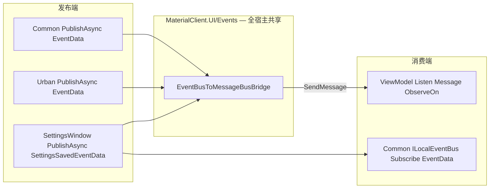

## Context

归档变更 `2026-07-13-refactor-local-eventbus-rollback-to-bridge-mode` 已将 ViewModel 订阅改为 `MessageBus.Listen<*Message>().ObserveOn(MainThreadScheduler)`，并恢复 `*Message` 类型；主规范 `common-eventbus-migration` / `viewmodel-messagebus-communication` 亦要求存在桥接器。但运行时代码缺口：

1. 桥接器缺失——`EventBusToMessageBusBridge.cs` 在 `a6cc5c8` 删除后，回滚实现提交 `2d72c51` 未恢复；且不得仅放在 `MaterialClient` 宿主（Urban/Recycle 不会加载）。
2. Urban 的 `UploadCompletedEventData` / `ServerApprovalSyncedEventData` 有对应 Message 与 Listen，但不在历史 9 桥接清单中。
3. `SettingsWindowViewModel` 仅 `SendMessage(SettingsSavedMessage)`；Common 的 `AttendedWeighingService` / `GateIoControlService` 仍订阅 `SettingsSavedEventData`，形成反向断链。

约束（`repos/MaterialClient/AGENTS.md`）：SDK/生产侧禁止 `ObserveOn`/`Dispatcher.UIThread`；桥接 `SendMessage` 可在任意线程调用。

## Goals / Non-Goals

**Goals:**
- 恢复并扩展 `EventBusToMessageBusBridge.cs`，接通 Common/Urban `*EventData` → UI `*Message`。
- 修复 SettingsSaved 发布路径，使 Common 与 UI 同时收到。
- 完成关键路径回归（归档提案 7.x 等价项）。

**Non-Goals:**
- 不重写已正确的 ViewModel `Listen`/`ObserveOn`/`CompositeDisposable`。
- 不改领域称重/匹配/设备协议逻辑。
- 不把桥接迁入 Common（Common 禁止 MessageBus）；桥接放在 `MaterialClient.UI` 供全宿主共享。
- 不含文档/单元测试（与归档提案一致）；回归以手工关键路径为准。

## Decisions

**D1 — 桥接放在 MaterialClient.UI（全宿主共享），不全量 revert**
- 从 `a6cc5c8^` 恢复 9 个 Handler，落到 `src/MaterialClient.UI/Events/EventBusToMessageBusBridge.cs`（命名空间 `MaterialClient.UI.Events`），按现行 `*EventData`/`*Message` 字段适配。
- 原因：`MaterialClient` / `MaterialClient.Urban` / `MaterialClient.Recycle` 均 `DependsOn(MaterialClientUiModule)`；放在宿主 `MaterialClient` 仅主程序生效。Common 禁止 MessageBus，故 UI 层是正确共享适配点。
- 备选：每个宿主各复制一份桥接。放弃：重复维护。备选：`git revert` 历史提交。放弃：blast radius 过大。

**D2 — 桥接清单（完整）**

| EventData | Message | 备注 |
| --- | --- | --- |
| LicensePlateRecognized | LicensePlateRecognizedMessage | 历史 |
| StatusChanged | StatusChangedMessage | 历史 |
| PlateNumberChanged | PlateNumberChangedMessage | 历史 |
| DeliveryTypeChanged | DeliveryTypeChangedMessage | 历史 |
| WeighingRecordCreated | WeighingRecordCreatedMessage | 历史 |
| UpdatePlateNumber | UpdatePlateNumberMessage | 历史 |
| MatchSucceeded | MatchSucceededMessage | 历史 |
| SettingsSaved | SettingsSavedMessage | 历史 |
| GhostGateSessionReset | GhostGateSessionResetMessage | 历史 |
| UploadCompleted | UploadCompletedMessage | **新增 Urban** |
| ServerApprovalSynced | ServerApprovalSyncedMessage | **新增 Urban** |

- 全部实现于单一文件 `EventBusToMessageBusBridge.cs`，`ITransientDependency` + `ILocalEventHandler<T>`，ABP 自动注册。
- `HandleEventAsync`：仅 `SendMessage` + `return Task.CompletedTask`，禁止切 UI 线程。

**D3 — SettingsSaved：UI 改发 EventData，Message 仅由桥接产生**
- `SettingsWindowViewModel` 保存成功：`await _localEventBus.PublishAsync(new SettingsSavedEventData())`，移除直接 `SendMessage(SettingsSavedMessage)`。
- `DetailCloseRequestedMessage` 仍直发 MessageBus（VM↔VM，不经桥接）。
- 备选：同时 SendMessage + PublishAsync。放弃：双通道易重复刷新 UI；单一 EventData→桥接更干净。

**D4 — 不改 ViewModel 消费端**
- `AttendedWeighingViewModel` / `UrbanAttendedWeighingViewModel` / `SettingsWindowViewModel` Listen 已正确；本变更只补生产→桥接缺口。

## 组件 / 数据流

## Risks / Trade-offs

- **[风险] Settings 改 PublishAsync 后若桥接仍缺失则 UI 也收不到 SettingsSaved** → 本变更同一 PR 内必须先落桥接再改 Settings；编译/自检清单强制存在桥接文件。
- **[风险] 字段漂移（EventData vs Message）** → 恢复自历史桥接并对齐现行属性；Urban 两项构造器参数与现有 Message 记录一致。
- **[权衡] 双类型并存继续** → 与归档架构一致，本次不消除，只接通断点。

## Migration Plan

1. 在 `MaterialClient.UI/Events/` 新增/恢复 `EventBusToMessageBusBridge.cs`（9+2 Handler）。
2. 修改 `SettingsWindowViewModel` 保存发布路径。
3. `dotnet build MaterialClient.sln -o .build-verify`。
4. 手工回归：主程序车牌/状态/新建记录；Urban 上传/审批同步重载；设置保存后 Common 与 UI 均响应。

回滚：删除桥接文件并还原 Settings 发布行即可回到「前端收不到 Common 事件」的当前坏态（不推荐生产回滚）；若需临时恢复前端，可临时在发布端双发 Message（仅应急）。

## Open Questions

无。范围与归档提案缺口一一对应，实现路径明确。
