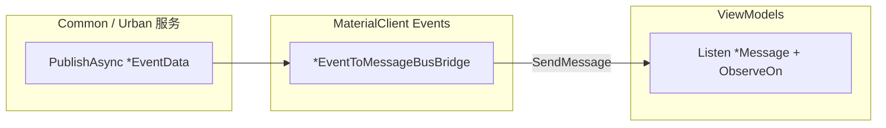

## Why

归档变更 `2026-07-13-refactor-local-eventbus-rollback-to-bridge-mode` 将 ViewModel 消费端改回 `MessageBus.Listen<*Message>`，并恢复了 `*Message` 类型，但 **tasks 1.1 要求的 `EventBusToMessageBusBridge.cs` 实际未落盘**（`src/MaterialClient/Events/` 为空；实现提交 `2d72c51` 无桥接文件）。结果是 Common 仍 `PublishAsync(*EventData)`，UI 只 `Listen<*Message>`，中间转接缺失，前端收不到车牌/状态/新建记录等业务事件。需增量补齐桥接实现，并覆盖归档提案未列入的 Urban 事件与 Settings 反向断链。

## What Changes

- **恢复桥接器文件**：在共享层 `src/MaterialClient.UI/Events/EventBusToMessageBusBridge.cs` 恢复（并按现行类型适配）历史 9 个 `*EventToMessageBusBridge`（`ILocalEventHandler<TEventData>, ITransientDependency`），使 MaterialClient / Urban / Recycle 等所有宿主生效；`HandleEventAsync` 内 `MessageBus.Current.SendMessage(*Message)`，不切 UI 线程。
- **补齐 Urban 桥接**：新增 `UploadCompletedEventToMessageBusBridge`、`ServerApprovalSyncedEventToMessageBusBridge`（对应已有 `*Message` 与 ViewModel `Listen`，发布端仍为 EventData）。
- **修复 SettingsSaved 反向断链**：`SettingsWindowViewModel` 保存成功后改为（或同时）`_localEventBus.PublishAsync(SettingsSavedEventData)`，由桥接转 `SettingsSavedMessage`；保证 Common（`AttendedWeighingService` / `GateIoControlService`）与 UI 都能收到。
- **核对回归任务**：完成归档提案未勾选的 7.x 关键路径验证（车牌、状态、列表刷新、Urban 注入/重载）。
- **不做**：不回退已改好的 ViewModel `Listen`/`ObserveOn`；不改 Common 发布端除 Settings 路径外的形态；不处理无关技术债务。

## Capabilities

### New Capabilities

无。本次为归档回滚提案的增量补齐，不引入新能力域。

### Modified Capabilities

- `common-eventbus-migration`: 明确桥接器 MUST 实际存在于共享层 `MaterialClient.UI/Events/EventBusToMessageBusBridge.cs`（所有宿主依赖 UI 模块因而自动注册）；桥接清单扩展为历史 9 个 + Urban `UploadCompleted` / `ServerApprovalSynced`；Settings 保存路径 MUST 经 `ILocalEventBus` 发布 `SettingsSavedEventData`（再由桥接转 Message），禁止仅 `SendMessage(SettingsSavedMessage)` 导致 Common 收不到。
- `viewmodel-messagebus-communication`: 补充 Urban ViewModel 消费 `UploadCompletedMessage` / `ServerApprovalSyncedMessage` 必须经桥接抵达的场景；强调 Common→UI 事件不得因缺少桥接而静默失败。

## Impact

- **影响仓库**：仅 `repos/MaterialClient`。
- **影响模块**：`MaterialClient`（桥接器恢复/扩展）、`MaterialClient.UI`（Settings 发布路径）、`MaterialClient.Urban` / `MaterialClient.AttendedWeighing`（消费端已就绪，行为恢复）。
- **影响行为**：恢复 Common→UI 事件到达；恢复 Urban 上传完成/审批同步后的列表重载；恢复设置保存后 Common 服务的 SettingsSaved 订阅。
- **非影响**：VM↔VM 直发 Message（Detail/ManualMatch）保持不变；5 个基础设施 Handler、2 个 License 生命周期 Handler 不动。
- **与归档提案关系**：补齐其 tasks 1.1 / 1.4 与未完成的 7.x；扩展其未覆盖的 Urban 两桥接与 Settings 反向路径。

### 变更地图（代码变更表）

| 文件路径 | 变更类型 | 变更原因 | 影响范围 |
| --- | --- | --- | --- |
| `src/MaterialClient.UI/Events/EventBusToMessageBusBridge.cs` | 新增（恢复+扩展） | 接通 EventData→Message；含 Urban 两项；全宿主共享 | MaterialClient.UI（主/城管/再生等宿主） |
| `src/MaterialClient.UI/ViewModels/SettingsWindowViewModel.cs` | 修改 | 保存改为 PublishAsync SettingsSavedEventData | Settings→Common+UI |
| ViewModel Listen 端 | 不改 | 已按归档提案改完 | — |

### 交互流程（修复后）

