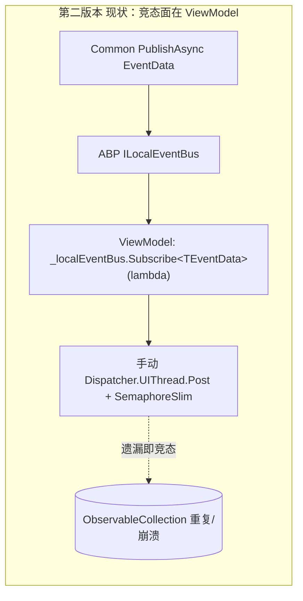
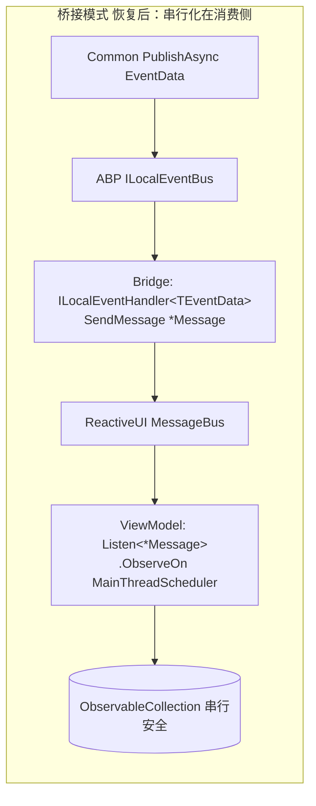
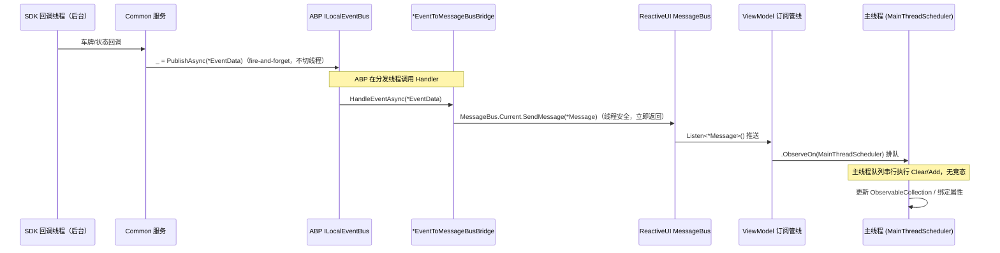

## Context

`2026-06-03-refactor-local-eventbus-unification`（第二版本）把 UI 刷新与并发防抖职责压到 ViewModel 侧：ViewModel 用 `_localEventBus.Subscribe<TEventData>(lambda)` 接收后台事件，每个回调手动 `Dispatcher.UIThread.Post/InvokeAsync` 切线程、`SemaphoreSlim` 加锁。遗漏任一处即触发 `ObservableCollection` 竞态。

证据：
- `fc8a4f9 fix(urban): serialize ReloadRecordsAsync on UI thread`（2026-07-13）—— 用 `_reloadGate`(`SemaphoreSlim`) + `Dispatcher.UIThread.InvokeAsync` 修补 `UrbanAttendedWeighingViewModel.ReloadRecordsAsync` 的 `ListItems.Clear()/Add()` 并发重复行。
- 归档提案 tasks 5.2/5.3/5.4（主程序与 Urban 关键链路回归）从未完成，第二版本未经验证。
- 架构文档 `docs/architecture-abp-local-eventbus-vs-reactiveui-messagebus.md` §6 明确论证桥接模型并警告删除桥接「属于架构变更」，但代码中桥接已被 `a6cc5c8` 删除——文档与代码漂移。

约束（`repos/MaterialClient/AGENTS.md`）：
- 非托管 SDK 回调禁止 `ObserveOn(RxApp.MainThreadScheduler)`（关闭阶段 UI 线程不可用 → SDK Close ↔ UI 线程死锁）；`MessageBus.Current.SendMessage` 线程安全，可直在回调线程调用。
- 服务注册采用 ABP 集成式 + `[AutoConstructor]`；非托管资源单例实现 `IAsyncDisposable`。

## Goals / Non-Goals

**Goals**
- 恢复三层事件模型：Common(`ILocalEventBus`) → 桥接(`*EventToMessageBusBridge`) → UI(`MessageBus.Listen` + `ObserveOn`)。
- 把 UI 串行化收敛到消费侧 Rx 调度器，消除散落各 Handler 的 `SemaphoreSlim` / `Dispatcher.UIThread` 手写并发。
- 明确界定「保留 `ILocalEventBus`」的范围：纯基础设施 Handler 与 Common 发布端不动。

**Non-Goals**
- 不改领域流程（称重/匹配/设备协议）、不改 UI 布局。
- 不改 Common 层发布端（继续 `PublishAsync(*EventData)`）。
- 不做向后兼容（破坏性重构第二版本 ViewModel 订阅代码）。
- 不含文档与单元测试（按输入约束）。

## Decisions

**D1 — 三层事件模型（核心架构）**
- L1 Common/服务：`_localEventBus.PublishAsync(*EventData)`，不变。
- L2 桥接器（应用层 `MaterialClient/Events/`）：`*EventToMessageBusBridge : ILocalEventHandler<TEventData>, ITransientDependency`，`HandleEventAsync` 内 `MessageBus.Current.SendMessage(new *Message(...))` 后立即返回。
- L3 UI（ViewModel/View）：`MessageBus.Current.Listen<*Message>().ObserveOn(RxApp.MainThreadScheduler).Subscribe(...)`。
- 备选：全量 `git revert a6cc5c8`。放弃：会回滚其后多项修复（Urban 上传、recycle 客户端等），blast radius 过大；改为外科式恢复（仅桥接 + Message 类 + ViewModel 消费端）。

**D2 — 事件分类与范围**
| 类别 | 事件 | 第二版本现状 | 回滚动作 |
| --- | --- | --- | --- |
| Common→UI（9） | LicensePlateRecognized、StatusChanged、PlateNumberChanged、DeliveryTypeChanged、WeighingRecordCreated、UpdatePlateNumber、MatchSucceeded、SettingsSaved、GhostGateSessionReset | VM 用 `Subscribe<EventData>` 直接消费 | 恢复桥接 + `*Message`；VM 改 `Listen<*Message>` |
| ViewModel↔ViewModel（3） | DetailOperationCompleted、DetailCloseRequested、ManualMatchSaveCompleted | `PublishAsync`/`Subscribe` 走 `ILocalEventBus` | 回归纯 `MessageBus.SendMessage`/`Listen`，不经桥接 |
| Common 基础设施 Handler（5） | DeviceStatus、TryMatch、SessionRefreshRequired、SignalRConnectionRestored、UrbanWeighingUpload | `ILocalEventHandler<T>` | **保留不动**（无 UI、无列表竞态） |
| Urban 生命周期 Handler（2） | LicenseExpired、LicenseDeviceRevoked | `ILocalEventHandler<T>` + `Dispatcher.UIThread`（弹激活窗→重启/关） | **保留不动**（应用生命周期，非列表竞态） |

**D3 — `ObserveOn` 仅置于消费侧（遵守 AGENTS.md 关闭死锁约束）**
- 生产侧（SDK 回调）`_ = _localEventBus.PublishAsync(...)` fire-and-forget；桥接器 `SendMessage` 直调（线程安全）。二者均不 `ObserveOn`/`Dispatcher.UIThread`。
- 消费侧 `Listen(...).ObserveOn(RxApp.MainThreadScheduler).Subscribe(...)` 统一串行化。
- 原因：关闭阶段 UI 线程可能不可用，生产侧切 UI 线程会与 SDK Close 互锁。

**D4 — 生命周期与防泄漏**
- 桥接器：`ITransientDependency` + `ILocalEventHandler<T>`，ABP 自动注册/分发，无状态、无需手动释放。
- ViewModel/View：所有 `Listen().ObserveOn().Subscribe()` 返回的 `IDisposable` 收集进 `CompositeDisposable`（沿用现有 `_disposables` / `_subscriptions`），在 `Dispose` / `BackToMain` / 窗口关闭时统一释放。替代第二版本散落的 `_localEventBus.Subscribe(...).DisposeWith(_disposables)`（语义等价，通道不同）。

**D5 — 移除手动并发补丁**
- 删除 `UrbanAttendedWeighingViewModel._reloadGate`(`SemaphoreSlim`) 及其 `WaitAsync/Release/Dispose`（`fc8a4f9`）；`ReloadRecordsAsync` 的 `TotalCount`/`Clear`/`Add` 收敛进 `ObserveOn` 管线。
- 删除 `AttendedWeighingViewModel` 各订阅回调内的 `Dispatcher.UIThread.Post(...)` 包装。

**D6 — `*Message` 类保真恢复**
- 从 `a6cc5c8^` 恢复 8 个 `*Message` 类（`LicensePlateRecognizedMessage` 已存在），字段与现行 `*EventData` 一一对应；放回 `src/MaterialClient.Common/Events/`。

## 组件 / 模块架构（恢复后）

```
┌─ MaterialClient.Common ───────────────────────────────────────┐
│  Services/Infra (LPR, Weighing, Matching, GateIo, Auth)        │
│    └─ _localEventBus.PublishAsync(*EventData)  [fire-and-forget│
│                                                  in SDK cb]    │
│  ILocalEventHandler<T> (纯业务/基础设施，保留)                  │
│    DeviceStatus / TryMatch / SessionRefresh / SignalRRestored  │
│    UrbanWeighingUpload                                         │
└───────────────────────┬───────────────────────────────────────┘
                        │ ABP ILocalEventBus (EventData)
                        ▼
┌─ MaterialClient (app) ────────────────────────────────────────┐
│  Events/EventBusToMessageBusBridge.cs  [RESTORED]             │
│    *EventToMessageBusBridge : ILocalEventHandler<TEventData>,  │
│                               ITransientDependency             │
│    HandleEventAsync → MessageBus.Current.SendMessage(*Message) │
└───────────────────────┬───────────────────────────────────────┘
                        │ ReactiveUI MessageBus (*Message)
                        ▼
┌─ MaterialClient.AttendedWeighing / .Urban / .UI ───────────────┐
│  ViewModels / Views                                            │
│    MessageBus.Current.Listen<*Message>()                       │
│      .ObserveOn(RxApp.MainThreadScheduler)  [串行化在此]        │
│      .Subscribe(...)  →  ObservableCollection Clear/Add         │
│    CompositeDisposable 生命周期管理                             │
└────────────────────────────────────────────────────────────────┘
```

## 数据流：第二版本（现状）→ 桥接模式（恢复后）





## 派发时序（后台多线程 → UI 串行化）



> 关键：`ObserveOn` 仅在 VM 消费侧；SDK 回调 → 桥接全程不碰 UI 线程，规避关闭死锁。

## 详细代码变更清单

| 文件路径 | 变更类型 | 变更说明 | 影响模块 |
| --- | --- | --- | --- |
| `src/MaterialClient/Events/EventBusToMessageBusBridge.cs` | 新增（恢复自 `a6cc5c8^`） | 9 个 `*EventToMessageBusBridge`（`ILocalEventHandler<TEventData>, ITransientDependency`） | MaterialClient 应用 |
| `src/MaterialClient.Common/Events/StatusChangedMessage.cs` | 新增（恢复） | `StatusChangedMessage(Status)` | Common |
| `src/MaterialClient.Common/Events/PlateNumberChangedMessage.cs` | 新增（恢复） | `PlateNumberChangedMessage(PlateNumber)` | Common |
| `src/MaterialClient.Common/Events/DeliveryTypeChangedMessage.cs` | 新增（恢复） | `DeliveryTypeChangedMessage(DeliveryType)` | Common |
| `src/MaterialClient.Common/Events/WeighingRecordCreatedMessage.cs` | 新增（恢复） | `WeighingRecordCreatedMessage(WeighingRecordId)` | Common |
| `src/MaterialClient.Common/Events/UpdatePlateNumberMessage.cs` | 新增（恢复） | `UpdatePlateNumberMessage(RecordId, PlateNumber)` | Common |
| `src/MaterialClient.Common/Events/MatchSucceededMessage.cs` | 新增（恢复） | `MatchSucceededMessage(WaybillId, RecordId)` | Common |
| `src/MaterialClient.Common/Events/SettingsSavedMessage.cs` | 新增（恢复） | `SettingsSavedMessage()` | Common |
| `src/MaterialClient.Common/Events/GhostGateSessionResetMessage.cs` | 新增（恢复） | 字段对齐 `GhostGateSessionResetEventData` | Common |
| `src/MaterialClient.AttendedWeighing/ViewModels/AttendedWeighingViewModel.cs` | 重写 | 11 处 `Subscribe<*EventData>`+`Dispatcher.UIThread.Post` → `Listen<*Message>().ObserveOn().Subscribe()`，收集进 `CompositeDisposable` | AttendedWeighing |
| `src/MaterialClient.Urban/ViewModels/UrbanAttendedWeighingViewModel.cs` | 重写 | 订阅回写；删除 `_reloadGate`(SemaphoreSlim)，`ReloadRecordsAsync` 的 `Clear/Add` 入 `ObserveOn` 管线（回退 `fc8a4f9`） | Urban |
| `src/MaterialClient.UI/ViewModels/SettingsWindowViewModel.cs` | 重写 | `Subscribe<LicensePlateRecognizedEventData>` → `Listen<LicensePlateRecognizedMessage>().ObserveOn()` | UI |
| `src/MaterialClient.UI/Views/SettingsWindow.axaml.cs` | 重写 | `Subscribe<DetailCloseRequestedEventData>` → `Listen<DetailCloseRequestedMessage>().ObserveOn()` | UI |
| `src/MaterialClient.AttendedWeighing/ViewModels/AttendedWeighingDetailViewModelBase.cs` | 修改 | `PublishAsync(DetailOperationCompletedEventData/DetailCloseRequestedEventData)` → `MessageBus.Current.SendMessage(*Message)`（VM↔VM） | 详情流程 |
| `src/MaterialClient.AttendedWeighing/ViewModels/ManualMatchEditWindowViewModel.cs` | 修改 | `PublishAsync(ManualMatchSaveCompletedEventData)` → `SendMessage(ManualMatchSaveCompletedMessage)` | 手动匹配 |
| Common 5 个 `ILocalEventHandler` / Urban 2 个 License Handler | 不改 | 纯基础设施/生命周期，非竞态来源 | — |

## Risks / Trade-offs

- **[风险] 订阅泄漏** → 桥接器无状态（Transient）无泄漏面；ViewModel 全部订阅进 `CompositeDisposable`，`Dispose`/`BackToMain`/窗口关闭统一释放。
- **[风险] `*Message` 字段与 `*EventData` 漂移** → 恢复自同一历史提交 `a6cc5c8^`，字段一一对应；后续以 `common-eventbus-migration`「一一对应」约束守住。
- **[风险] 桥接器多一层维护** → 收益为线程安全串行化天然获得，且职责分离使排障「事件如何抵达 UI」只需查单一文件。
- **[权衡] 双类型并存（EventData + Message）** → 收益为分层清晰、UI 线程模型成熟（Rx）；第二版本的「类型更薄」收益让位于「竞态根治」。
- **[风险] 回退 `fc8a4f9` 后回归** → 该补丁即竞态症状；以 `ObserveOn` 串行化替代，需在主程序与 Urban 关键链路（车牌刷新、状态、详情操作、手动匹配、记录重载）回归验证。

## Migration Plan

1. 从 `a6cc5c8^` 恢复 `EventBusToMessageBusBridge.cs` 与 8 个 `*Message` 类，按现行命名空间/`using` 适配。
2. 重写 4 个 UI 消费端（`AttendedWeighingViewModel` / `UrbanAttendedWeighingViewModel` / `SettingsWindowViewModel` / `SettingsWindow.axaml.cs`）订阅管线；回退 `fc8a4f9` 手写锁。
3. 将 VM↔VM 事件（Detail 操作/关闭/手动匹配完成）发布端改回 `MessageBus.SendMessage`。
4. 编译验证（`dotnet build MaterialClient.sln -o .build-verify`，避开文件锁）。
5. 回归：主程序车牌刷新/状态/详情操作/手动匹配；Urban `/api/lpr/test-plate` 注入→UI 实时更新、记录重载无重复行。

回滚策略：保留小步提交；若桥接恢复引入回归，可回退至「第二版本 + `fc8a4f9` 补丁」中间态。无数据库/数据结构变更。
