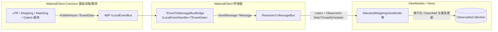

## Why

第二版本（完全 `ILocalEventBus` 统一方案）把 UI 刷新与并发防抖职责压到了 ViewModel 侧：每个订阅回调都要手动 `Dispatcher.UIThread.Post/InvokeAsync` 切线程、手动 `SemaphoreSlim` 加锁，**一旦遗漏即触发 `ObservableCollection` 竞态**（列表行重复/数量异常增加）。这不是假设——`fc8a4f9 fix(urban): serialize ReloadRecordsAsync on UI thread`（今日提交）正是用 `_reloadGate` + `Dispatcher.UIThread.InvokeAsync` 临时修补 `ListItems.Clear()/Add()` 的并发竞态；且原归档提案的回归任务（5.2/5.3/5.4）从未完成，第二版本始终未经回归验证。回滚至第一版本（桥接模式）可借助 `ObserveOn(RxApp.MainThreadScheduler)` 在消费侧天然串行化，根治竞态并降低团队心智负担。

## What Changes

- **恢复全局桥接器** `src/MaterialClient/Events/EventBusToMessageBusBridge.cs`（含 `*EventToMessageBusBridge` 处理器，`ILocalEventHandler<TEventData>` → `MessageBus.Current.SendMessage`），把 Common 层发布的 ABP `*EventData` 转接为 ViewModel 已订阅的 `*Message`。
- **恢复 8 个 `*Message` 类型**（`StatusChangedMessage`、`PlateNumberChangedMessage`、`DeliveryTypeChangedMessage`、`WeighingRecordCreatedMessage`、`UpdatePlateNumberMessage`、`MatchSucceededMessage`、`SettingsSavedMessage`、`GhostGateSessionResetMessage`）；`LicensePlateRecognizedMessage` 已存在。ViewModel↔ViewModel 事件（`DetailOperationCompleted`/`DetailCloseRequested`/`ManualMatchSaveCompleted`）回归纯 `MessageBus` 直发，不经桥接。
- **重写 ViewModel 消费端**：`AttendedWeighingViewModel`、`UrbanAttendedWeighingViewModel`、`SettingsWindowViewModel`、`SettingsWindow.axaml.cs` 从 `_localEventBus.Subscribe<TEventData>(...) + Dispatcher.UIThread.Post + SemaphoreSlim` 改回 `MessageBus.Current.Listen<TMessage>().ObserveOn(RxApp.MainThreadScheduler).Subscribe(...)`，统一由主线程调度器串行化。
- **移除手动并发补丁**：删除 `UrbanAttendedWeighingViewModel._reloadGate`（`SemaphoreSlim`）等手写锁，把 `ReloadRecordsAsync` 的 `Clear/Add` 收敛进 `ObserveOn` 管线。
- **保留 Common 层现状**：Common 服务继续 `_localEventBus.PublishAsync` 发布 `*EventData`；`DeviceStatusEventHandler`、`TryMatchEventHandler`、`SessionRefreshRequiredEventHandler`、`SignalRConnectionRestoredHandler`、`UrbanWeighingUploadRequestedEventHandler` 五个**纯基础设施/业务** Handler 保持 `ILocalEventHandler<T>`（无 UI、无列表竞态，正是桥接模型中 Common 侧 Handler 的正确形态）；`LicenseDeviceRevokedEventHandler`/`LicenseExpiredEventHandler`（Urban 应用生命周期：弹激活窗 → 重启/关闭）亦保留，不触碰列表。
- **BREAKING**：直接对第二版本相关 ViewModel 订阅代码与手动锁做破坏性重构，不做向后兼容。`local-eventbus-only-communication` 能力被整体回退（其两条 Requirement 删除）。

## Capabilities

### New Capabilities

无。本次为回滚（恢复第一版本行为），不引入新能力。

### Modified Capabilities

- `viewmodel-messagebus-communication`: 将 ViewModel 通信规范从「必须 `ILocalEventBus`」回退为「必须 `ReactiveUI MessageBus`（经桥接消费 Common 的 `ILocalEventBus` 事件），UI/列表更新统一 `ObserveOn(RxApp.MainThreadScheduler)` 串行化，订阅随 `CompositeDisposable` 释放」。保留与事件总线无关的 `DetailOperationType` 枚举与遗留 `EventArgs` 清理要求。
- `common-eventbus-migration`: 反转「ViewModel 层禁止桥接 EventHandler」要求——桥接器重新成为受规范保护的有意适配层；保留「Common 层只用 `ILocalEventBus`（禁止 `MessageBus.Listen/SendMessage`）」「`EventData`↔`Message` 一一对应」「SDK 回调 fire-and-forget」「停止时清理订阅」等正确约束。

### Removed Capabilities

- `local-eventbus-only-communication`: 该能力由前次统一提案整体新增，其「全项目仅 `ILocalEventBus`、禁止 MessageBus、禁止桥接」前提与本回滚直接冲突，整体回退（删除其两条 Requirement）。

## Impact

- **影响仓库**：仅 `repos/MaterialClient`。
- **影响模块**：`MaterialClient`（桥接器恢复）、`MaterialClient.Common`（恢复 `*Message` 类型）、`MaterialClient.AttendedWeighing`、`MaterialClient.Urban`、`MaterialClient.UI`（ViewModel/View 订阅回写）。
- **影响行为**：消除后台多线程触发事件导致的 `ObservableCollection` 竞态（重复行/内核崩溃风险）；线程串行化职责从散落各 Handler 收敛到消费侧 Rx 调度器。
- **非影响（明确排除）**：5 个纯基础设施 `ILocalEventHandler`、2 个 Urban 生命周期 Handler、领域流程（称重/匹配/设备协议）均不动。
- **文档/测试**：本次提案不含文档与单元测试（按输入约束）；架构文档 `docs/architecture-abp-local-eventbus-vs-reactiveui-messagebus.md` 当前描述的桥接器在代码中已不存在（文档与代码漂移），回滚使其重新一致。

### 变更地图（代码变更表）

| 文件路径 | 变更类型 | 变更原因 | 影响范围 |
| --- | --- | --- | --- |
| `src/MaterialClient/Events/EventBusToMessageBusBridge.cs` | 恢复（新增） | 桥接 Common `*EventData` → `*Message` | MaterialClient 应用启动装配 |
| `src/MaterialClient.Common/Events/*Message.cs`（8 个） | 恢复（新增） | 桥接与 ViewModel 订阅所需载荷类型 | Common 层 |
| `src/MaterialClient.AttendedWeighing/ViewModels/AttendedWeighingViewModel.cs` | 重写（11 处订阅） | `Subscribe`+`Dispatcher.UIThread.Post` → `Listen`+`ObserveOn` | 主称重窗口 UI 刷新 |
| `src/MaterialClient.Urban/ViewModels/UrbanAttendedWeighingViewModel.cs` | 重写（订阅 + `ReloadRecordsAsync`） | 同上；移除 `_reloadGate` `SemaphoreSlim` 手写锁 | Urban 称重窗口 UI 刷新 |
| `src/MaterialClient.UI/ViewModels/SettingsWindowViewModel.cs` | 重写（1 处订阅） | 订阅回写为 MessageBus | 设置窗口 |
| `src/MaterialClient.UI/Views/SettingsWindow.axaml.cs` | 重写（1 处订阅） | 订阅回写为 MessageBus | 设置窗口关闭请求 |
| `src/MaterialClient.AttendedWeighing/ViewModels/AttendedWeighingDetailViewModelBase.cs` 等 | 修改（发布端） | ViewModel→ViewModel 事件由 `PublishAsync` 回退 `MessageBus.SendMessage` | 详情/手动匹配流程 |
| Common 5 个 `ILocalEventHandler` + 2 个 Urban License Handler | 不改 | 纯基础设施/生命周期，非列表竞态来源 | — |

### 交互流程（桥接模式数据流）

> UI 原型：本变更不涉及界面布局/控件变更（仅内部事件总线架构回滚），界面形态保持现状，故不附 ASCII 原型。
