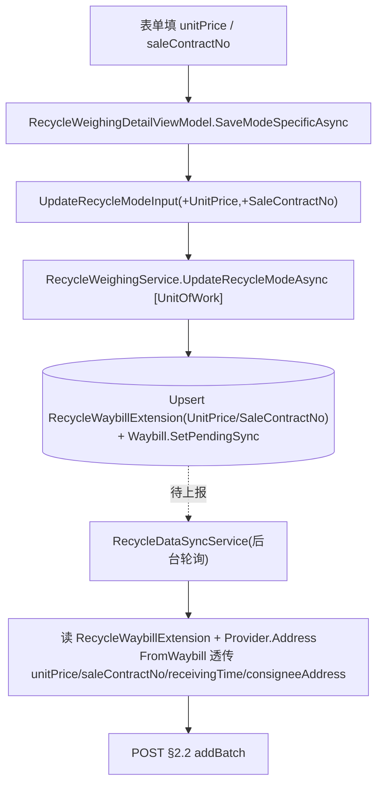
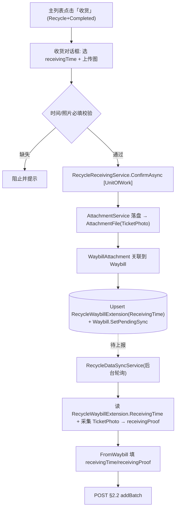
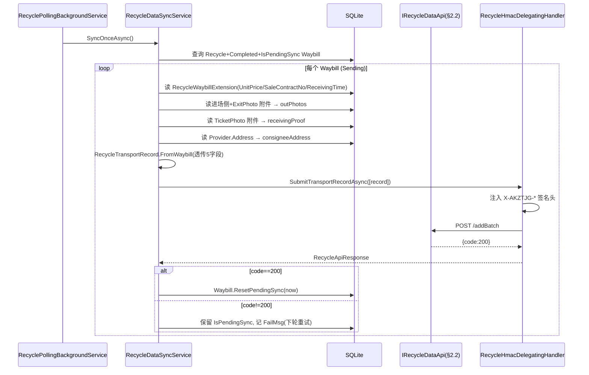

# Design — MaterialClient Recycle Enhancement

## 1. 目标与范围

补齐 §2.2 `productTransportRecord/v1/addBatch` 未填字段的数据源链路：UI 采集 → 本地持久化 → 后台同步上报。五条改动落在三个项目：`MaterialClient.Common`（实体/服务/DTO/迁移）、`MaterialClient.Recycle`（同步与 DTO 映射）、`MaterialClient.AttendedWeighing`（表单与收货 UI）。

**存储策略（本变更核心决策）**：Waybill 的三个新字段（`UnitPrice`/`SaleContractNo`/`ReceivingTime`）**不扩展 Waybill 主表**，而是新建 `RecycleWaybillExtension` 扩展表存储，遵循既有 `UrbanWeighingExtension` 约定（见 §3、§7-D6）。`Provider.Address` 仍直接加在 Provider 实体（本地专用字段）。

## 2. 架构（分层与模块边界）

```
┌─ MaterialClient.AttendedWeighing (UI / ViewModel) ──────────────────────┐
│  RecycleModeFormView.axaml          AttendedWeighingMainView.axaml      │
│   ├─ 单价 unitPrice (新)             ├─ [修改] [收货(新)]  ← 替换[打印] │
│   └─ 合同号 saleContractNo (新)      │                                   │
│  RecycleWeighingDetailViewModel      AttendedWeighingViewModel          │
│   ├─ UnitPrice/SaleContractNo (新)   ├─ ReceiveCommand (新, Recycle only)│
│   └─ CreateNewProviderAsync(+Addr)   └─ PrintSolidWasteCommand(Recycle屏蔽)│
│         │                                     │                         │
│         ▼                                     ▼                         │
│  RecycleWeighingService.UpdateRecycleModeAsync   RecycleReceivingService(新)│
└────────│──────────────────────────────────────────│──────────────────────┘
         │ DB (RecycleWaybillExtension upsert)      │ DB (RecycleWaybillExtension.ReceivingTime
         ▼                                          │   + AttachmentFile(TicketPhoto)
┌─ MaterialClient.Common (Domain / EF) ─────────────▼─────────────────────┐
│  RecycleWaybillExtension(新表): WaybillId + UnitPrice + SaleContractNo  │
│                                  + ReceivingTime (逻辑关联, 无FK/无导航) │
│  Provider (+Address 可空, 本地专用)                                      │
│  AttachmentFile / AttachType.TicketPhoto(复用) / WaybillAttachment       │
│  ProviderService(+Address) / MaterialProviderListResultDto.ToEntity      │
└────────│─────────────────────────────────────────────────────────────────┘
         │ Waybill.IsPendingSync=true (待上报)
         ▼
┌─ MaterialClient.Recycle (Background Sync) ──────────────────────────────┐
│  RecyclePollingBackgroundService → RecycleDataSyncService.SyncOnceAsync │
│   ├─ 读 RecycleWaybillExtension → unitPrice/saleContractNo/receivingTime│
│   ├─ BuildPhotos: 进场侧 + ExitPhoto(§2.2) / 仅进场侧(§2.3)             │
│   ├─ BuildReceivingProof: TicketPhoto → receivingProof (§2.2)           │
│   ├─ Resolve Provider.Address → consigneeAddress (§2.2)                 │
│   └─ RecycleTransportRecord.FromWaybill(透传 5 字段)                    │
│              │                                                          │
│              ▼  HMAC                                                    │
│   IRecycleDataApi.SubmitTransportRecordAsync → §2.2 addBatch            │
└─────────────────────────────────────────────────────────────────────────┘
```

**边界原则**：UI 层只采集与触发；持久化全部经领域服务（`[UnitOfWork]`）；后台同步只读已持久化数据，不直接读 UI。收货是**独立动作**（不复用 `UpdateRecycleModeAsync`），避免与保存/完成路径耦合。扩展表按 `WaybillId` 显式查询（逻辑关联，无导航属性），与 `UrbanWeighingExtension` 一致。

## 3. 数据模型变更

| 实体 / 表 | 新增项 | 类型 | 可空 | 说明 |
| --- | --- | --- | --- | --- |
| `Provider` | `Address` 列 | string | 是 | 本地专用，§2.2 consigneeAddress 数据源 |
| `RecycleWaybillExtension`（**新实体/新表**） | — | — | — | Waybill 的 Recycle 扩展；遵循 `UrbanWeighingExtension` 约定，按 `WaybillId` 逻辑关联（**无 DB FK、无 EF 导航**） |
| `RecycleWaybillExtension` | `Id` | Guid | — | 主键（与 `UrbanWeighingExtension` 一致用 Guid） |
| `RecycleWaybillExtension` | `WaybillId` | long | 否 | 关联 Waybill（逻辑关联，每个 Waybill 至多一条扩展） |
| `RecycleWaybillExtension` | `UnitPrice` | decimal? | 是 | 单价（元/吨） |
| `RecycleWaybillExtension` | `SaleContractNo` | string | 是 | 销售合同编号 |
| `RecycleWaybillExtension` | `ReceivingTime` | DateTime? | 是 | 收货时间 |

- **不新增枚举**：`AttachType.TicketPhoto`（=3）已存在，收货附件直接复用。
- **不新增关联表**（除扩展表外）：`WaybillAttachment`（WaybillId ↔ AttachmentFileId）已存在，收货附件经它关联。
- **不扩展 Waybill 主表**：三个字段进 `RecycleWaybillExtension`，保持 Waybill 主表精简、与 Urban 模式一致。
- EF 迁移：一个迁移文件覆盖 Provider.Address 列 + 新增 `RecycleWaybillExtension` 表。

## 4. 数据流

### 4.1 表单录入 → 持久化 → 后台 §2.2 上报



### 4.2 收货动作 → 持久化 → 后台 §2.2 上报（receivingTime/receivingProof）



## 5. API 调用时序

### 5.1 收货确认（用户交互 → 本地持久化）

```mermaid
sequenceDiagram
    participant U as 用户
    participant VM as AttendedWeighingViewModel
    participantDlg as 收货对话框(新)
    participant Svc as RecycleReceivingService(新)
    participant Att as AttachmentService
    participant DB as SQLite(Waybill/RecycleWaybillExtension/AttachmentFile)

    U->>VM: 点击「收货」(Recycle+Completed)
    VM->>Dlg: 打开收货对话框
    U->>Dlg: 选 receivingTime + 上传图片
    Dlg->>Dlg: 必填校验(时间/照片)
    U->>Dlg: 确认收货
    Dlg->>Svc: ConfirmAsync(waybillId, receivingTime, imageStream)
    Svc->>Att: SaveAsync(image, TicketPhoto)
    Att-->>Svc: AttachmentFile(Id, LocalPath, TicketPhoto)
    Svc->>DB: Insert WaybillAttachment(waybillId, fileId)
    Svc->>DB: Upsert RecycleWaybillExtension(WaybillId, ReceivingTime); Waybill.SetPendingSync()
    Svc-->>VM: 完成
    VM-->>U: 关闭对话框, 刷新状态
```

### 5.2 后台同步上报 §2.2（聚合所有新字段）



## 6. 详细代码变更清单

| 文件 | 变更类型 | 变更说明 | 影响模块 |
| --- | --- | --- | --- |
| `Common/Entities/Provider.cs` | 新增 | 加 `public string? Address { get; set; }` | 实体 |
| `Common/Entities/RecycleWaybillExtension.cs`（**新**） | 新增 | `Entity<Guid>`；`WaybillId`(long, 逻辑关联无 FK/无导航)；`UnitPrice`/`SaleContractNo`/`ReceivingTime`；XML 注释标明遵循 `UrbanWeighingExtension` 约定 | 新实体/新表 |
| `Common/MaterialClientDbContext.cs` | 修改 | 注册 `DbSet<RecycleWaybillExtension>`（表名如 `RecycleWaybillExtensions`） | EF 配置 |
| `Common/Migrations/<ts>_RecycleEnhancementFields.cs` | 新增 | 迁移：Provider.Address 列 + 新建 `RecycleWaybillExtension` 表 | 数据库 |
| `Common/Api/Dtos/ProviderDto.cs` | 新增 | 加 `Address` | DTO |
| `Common/Api/Dtos/MaterialProviderListResultDto.cs` | 修改 | `ToEntity` 不覆盖 Address（远端无此字段，保持默认 null） | 远端映射 |
| `Common/Services/ProviderService.cs` | 修改 | `CreateProviderAsync(name, deliveryType, address?)`：远端创建后回填 Address 再 upsert；`GetPagedProvidersAsync` 投影带回 Address；`UpdateProviderAsync` 保持远端契约不变 | 服务 |
| `Common/Services/MaterialProviderSyncService.cs` | 修改 | 删表重建前按 Id 快照 Address，重建后回填 | 一次性同步 |
| `Common/Services/RecycleWeighingService.cs` | 修改 | `UpdateRecycleModeInput` 增 `UnitPrice`/`SaleContractNo`；Waybill 分支按 `WaybillId` upsert `RecycleWaybillExtension`（存在则更新、否则插入） | 领域服务 |
| `Common/Services/RecycleWaybillExtensionRepository` 查询 | 新增/修改 | 提供「按 WaybillId 取/写扩展」的查询与 upsert 入口（可由各服务直接用 `IRepository<RecycleWaybillExtension, Guid>`） | 数据访问 |
| `Recycle/Models/RecycleTransportRecord.cs` | 修改 | `FromWaybill` 签名增参（unitPrice/saleContractNo/receivingTime/receivingProof/consigneeAddress）并赋值；`OutPhotos` 注释更新；`ForLogging` 已脱敏 receivingProof（保持） | §2.2 DTO |
| `Recycle/Services/RecycleDataSyncService.cs` | 修改 | `EntryPhotoTypes` 旁增 `ExitPhoto` 用于 §2.2；新增 `BuildExitPhotosBase64Async`/合并；新增 `BuildReceivingProofBase64Async`(TicketPhoto)；`SubmitSendingAsync` 读取 `RecycleWaybillExtension` 与 `Provider.Address`，透传 FromWaybill | 后台同步 |
| `AttendedWeighing/ViewModels/RecycleWeighingDetailViewModel.cs` | 修改 | 加 `[Reactive] UnitPrice`/`SaleContractNo`；`LoadRecycleDataAsync` 从 `RecycleWaybillExtension` 回填；`SaveModeSpecific`/`CompleteModeSpecific` 透传入 Input；`CreateNewProviderAsync` 增 Address 必填校验 | ViewModel |
| `AttendedWeighing/Views/Controls/RecycleModeFormView.axaml` | 修改 | 加单价、合同号两行（Grid ColumnDefinitions 72,*） | 表单 UI |
| `AttendedWeighing/ViewModels/AttendedWeighingViewModel.cs` | 修改 | Recycle 模式下 `CanPrintSolidWaste` 屏蔽打印显示；新增 `ReceiveCommand`/`CanReceive`（Recycle+Completed）；实现收货对话框交互 | 主 ViewModel |
| `AttendedWeighing/Views/Controls/AttendedWeighingMainView.axaml` | 修改 | Recycle 模式按钮切换为「收货」（可用独立 Button + IsVisible，或复用按钮按模式切命令/文案） | 主列表 UI |
| `AttendedWeighing/ViewModels/RecycleReceivingViewModel.cs`（新） | 新增 | 对话框 VM：receivingTime、图片选择、必填校验、确认/取消 | 新 VM |
| `AttendedWeighing/Views/.../RecycleReceivingWindow.axaml`（新） | 新增 | 对话框：DatePicker+时间、图片选择/预览、确认/取消 | 新 UI |
| `Common/Services/RecycleReceivingService.cs`（新） | 新增 | `ConfirmAsync(waybillId, receivingTime, stream)`：落盘 TicketPhoto、建 WaybillAttachment、**upsert `RecycleWaybillExtension.ReceivingTime`**、`Waybill.SetPendingSync`，`[UnitOfWork]` | 新服务 |
| `AttendedWeighing/Views/AttendedWeighing/ProviderEditWindow.axaml`(.cs) | 修改 | 展示/编辑 Address | 管理页 UI |

## 7. 关键设计决策

### D1. Provider.Address 采用「本地专用」而非远端往返
- **背景**：Provider 是远端同步实体，`CreateProviderInput`/`UpdateProviderInput`/`MaterialProviderListResultDto` 均无 Address；服务端仓库不在本次可编辑范围。
- **决策**：Address 仅本地列。远端创建/更新不传 Address；`ToEntity` 不覆盖；一次性同步删表重建前快照-回填。
- **代价**：Address 不上云、不在多端间共享。可接受（Recycle 客户端单机场景）。

### D2. 「Entity 可空 / Recycle 新增必填」的双层语义
- DB 列 nullable（非 Recycle 场景不强制）；Recycle 内联新建（`CreateNewProviderAsync`）在表单层校验必填。校验不进 DB 约束，避免污染其他模式。

### D3. 收货为独立动作，不并入 `UpdateRecycleModeAsync`
- 收货发生在运单完成后，是独立业务节点；单独 `RecycleReceivingService` + 独立命令，避免与保存/完成事务耦合，且 receivingTime/附件的生命周期独立。

### D4. outPhotos 语义变更（进场 → 进场+出场）是有意 breaking
- 与既有 `recycle-data-sync` spec「SHALL NOT 使用 ExitPhoto」直接冲突。本变更 MODIFIED 该 requirement。§2.3 `inPhoto` 维持仅进场侧，不受影响。

### D5. unitPrice 范围
- 主供 §2.2。§2.3 `materialTransportRecord` 也有 `unitPrice` 字段，但本次默认**不扩展** §2.3（保持现状，避免范围蔓延）。如需同步，design 可后续追加。

### D6. Waybill 三字段进扩展表而非主表（反馈采纳）
- **背景反馈**：Waybill 的三个新字段不应扩展主表，应新建 Extensions 表存储。
- **决策**：新建 `RecycleWaybillExtension`（`Entity<Guid>`，`WaybillId` 逻辑关联），与既有 `UrbanWeighingExtension` 完全同构（无 DB FK、无 EF 导航、按父 Id 显式查询/upsert）。
- **理由**：保持 Waybill 主表精简；Recycle 专用可选字段隔离；复用已验证的扩展表模式，降低对 Waybill 读写路径的干扰。
- **代价**：服务层需按 `WaybillId` 显式 upsert/查询扩展记录（无导航属性懒加载）；UI 回填需多一次扩展表读取。

## 8. 兼容性与回滚

- **DB 迁移**：Provider 加列 + 新增 `RecycleWaybillExtension` 表（Waybill 1—0..1）；纯增量、向后兼容。回滚迁移删表 + 删列（会丢失已录入扩展数据，需提示）。
- **远端契约**：不变；若远端未来支持 Address，可平滑切到 D1 的「远端往返」方案。
- **既有数据**：历史 Waybill 无 `RecycleWaybillExtension` 记录，§2.2 上报这些可选字段为 null，不影响既有成功上报。

## 9. 测试策略

- **单元**：`FromWaybill` 五字段映射（含 null 分支）；`BuildExitPhotosBase64Async` 进场+出场聚合与顺序；`BuildReceivingProofBase64Async` TicketPhoto 采集与缺失分支；`RecycleReceivingService.ConfirmAsync` 事务回滚；`RecycleWaybillExtension` 按 `WaybillId` upsert（存在更新/不存在插入）。
- **集成**：收货 → 后台同步端到端，断言 §2.2 payload 含 `unitPrice`/`saleContractNo`/`receivingTime`/`receivingProof`/`consigneeAddress`/进场+出场 `outPhotos`；一次性同步前后 Provider.Address 保留。
- **UI**：Recycle 模式显示「收货」、SolidWaste 显示「打印」；收货必填校验；表单单价/合同号回填（从扩展表）。
- 构建验证按子仓库约定：`dotnet build MaterialClient.sln -o .build-verify`。

## 10. 风险

- outPhotos 进场+出场顺序若与市平台预期不符，需联调确认（约定进场在前）。
- 收货附件落盘路径遵循 `PathManager.ToAbsolutePath`，与既有附件规范一致，避免 System32 路径问题。
- 主列表按钮按模式切换命令时，注意 `CanPrintSolidWaste` 现包含 Recycle，需拆分可见性以免 Recycle 仍显示打印。
- 扩展表无 DB FK：服务层写入须保证 `WaybillId` 唯一性（每 Waybill 至多一条扩展），建议在 upsert 前按 `WaybillId` 查询，避免重复记录。
