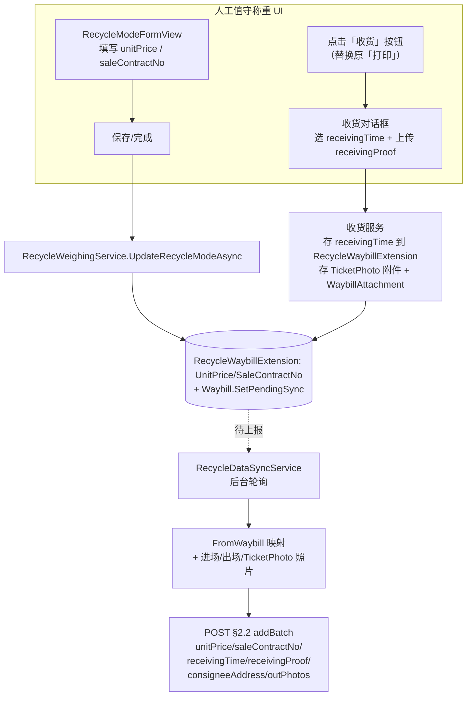

## Why

MaterialClient.Recycle 已能将称重数据上报至资源化利用厂 §2.2 `productTransportRecord/v1/addBatch` 接口，但接口 DTO 中 `unitPrice`、`saleContractNo`、`receivingTime`、`receivingProof`、`consigneeAddress` 等字段在 `FromWaybill` 映射中**长期未被填充**，`outPhotos` 也只携带进场侧照片、未携带出场照片。根因是这些字段缺少**数据源**：UI 表单没有采集入口、收货动作仍停留在「打印」按钮、供应商实体没有地址字段。本次变更补齐从「UI 采集 → 本地持久化 → 后台同步上报」的完整数据链路，使 §2.2 上报字段完整、贴合收货业务流程。

## What Changes

- **Entity Provider 新增可空 `Address` 字段**：作为 §2.2 `consigneeAddress` 的本地数据源；DB 列可空，仅在 Recycle 新增供应商时由表单校验为必填。Provider 为远端同步实体，`Address` 为**本地专用**字段，不进入远端 `CreateProviderInput`/`UpdateProviderInput`/`MaterialProviderListResultDto` 契约，一次性同步 SHALL 保留本地已设值。
- **Recycle 表单新增单价 `unitPrice` 与合同号 `saleContractNo` 输入**：经 `UpdateRecycleModeInput` → `RecycleWeighingService` 持久化到**新建 `RecycleWaybillExtension` 扩展表**（不扩展 Waybill 主表），供后台 §2.2 上报。
- **打印按钮替换为收货功能**：Recycle 模式下将主列表的「打印」按钮替换为「收货」动作，弹出时间选择器录入 `receivingTime`、上传图片作为 `receivingProof`（`AttachmentFile.AttachType = TicketPhoto`，经 `WaybillAttachment` 关联到 Waybill）；`receivingTime` 持久化到 `RecycleWaybillExtension` 扩展表。
- **`outPhotos` 扩展为进场+出场照片**：§2.2 上报照片由「仅进场侧」改为「进场侧 + 出场侧（`ExitPhoto`）」聚合；§2.3 `inPhoto` 维持仅进场侧。
- **后台同步补齐 §2.2 字段映射**：`FromWaybill` 填充 `unitPrice`/`saleContractNo`/`receivingTime`/`receivingProof`/`consigneeAddress`；`receivingProof` 取自 `TicketPhoto` 附件 Base64。

**非目标（Non-goals）**：
- 不修改 §2.3 `materialTransportRecord/v1/addBatch` 的字段集合（`unitPrice` 例外，见 design）。
- 不修复既有 spec 间重量单位（kg/吨）的历史描述漂移。
- 不改动远端 MaterialPlatform 服务端契约（仅 MaterialClient 可编辑）。

## Capabilities

### New Capabilities
- `recycle-receiving-confirmation`：Recycle 模式收货动作——主列表「收货」按钮替换「打印」，录入收货时间 + 上传收货照片（`TicketPhoto`），持久化 `receivingTime` 与收货附件。

### Modified Capabilities
- `recycle-transport-record-dto`：`OutPhotos` 语义由「进场照片」改为「进场+出场照片」；`FromWaybill` 映射补齐 `UnitPrice`/`SaleContractNo`/`ReceivingTime`/`ReceivingProof`/`ConsigneeAddress`。
- `recycle-data-sync`：§2.2 照片聚合纳入 `ExitPhoto`；新增 `TicketPhoto` 收货照片采集；向 `FromWaybill` 传入新字段与 `Provider.Address`。
- `recycle-weighing-form`：`RecycleModeFormView` 新增 `unitPrice`、`saleContractNo` 输入控件。
- `recycle-weighing-service`：`UpdateRecycleModeInput` 新增 `UnitPrice`、`SaleContractNo` 并持久化到 `Waybill`。
- `material-provider-sync`：`Provider` 新增本地可空 `Address`；`ProviderDto`/`ProviderService`/`ToEntity`/一次性同步保留该字段；Provider 管理页展示 `Address`。

## Impact

### 变更地图（Change Map）

| 文件路径 | 变更类型 | 变更原因 | 影响范围 |
| --- | --- | --- | --- |
| `MaterialClient.Common/Entities/Provider.cs` | 新增字段 | 补可空 `Address`（§2.2 consigneeAddress 数据源） | 实体 + EF 迁移 |
| `MaterialClient.Common/Entities/RecycleWaybillExtension.cs`（新） | 新增实体 | 存 `UnitPrice`/`SaleContractNo`/`ReceivingTime`，按 `WaybillId` 逻辑关联（遵循 `UrbanWeighingExtension`，无 FK/无导航） | 新表 + EF 迁移 |
| `MaterialClient.Common/Migrations/*` | 新增迁移 | 落地 Provider.Address 列 + 新建 `RecycleWaybillExtension` 表 | 数据库 schema |
| `MaterialClient.Common/Api/Dtos/ProviderDto.cs` | 新增字段 | 透传 `Address` 到选择器/管理页 | DTO |
| `MaterialClient.Common/Api/Dtos/MaterialProviderListResultDto.cs` | 修改 | `ToEntity` 保留本地 `Address`（远端无此字段） | 远端→本地映射 |
| `MaterialClient.Common/Services/ProviderService.cs` | 修改 | `CreateProviderAsync` 接受可选 `Address`，本地 upsert 前写入；分页投影带回 `Address` | 服务层 |
| `MaterialClient.Recycle/Models/RecycleTransportRecord.cs` | 修改 | `FromWaybill` 填充 5 个字段；`OutPhotos` 注释更新 | §2.2 DTO |
| `MaterialClient.Recycle/Services/RecycleDataSyncService.cs` | 修改 | 照片聚合含 `ExitPhoto`；采 `TicketPhoto` 为 `receivingProof`；读 `RecycleWaybillExtension` + 解析 `Provider.Address` | 后台同步 |
| `MaterialClient.Common/Services/RecycleWeighingService.cs` | 修改 | `UpdateRecycleModeInput` 增 `UnitPrice`/`SaleContractNo`；按 `WaybillId` upsert `RecycleWaybillExtension` | 领域服务 |
| `MaterialClient.AttendedWeighing/ViewModels/RecycleWeighingDetailViewModel.cs` | 修改 | 新增 `UnitPrice`/`SaleContractNo` 响应式属性 + 透传 | ViewModel |
| `MaterialClient.AttendedWeighing/Views/Controls/RecycleModeFormView.axaml` | 修改 | 新增单价、合同号输入行 | 表单 UI |
| `MaterialClient.AttendedWeighing/ViewModels/AttendedWeighingViewModel.cs` | 修改 | Recycle 模式「收货」命令替换「打印」；收货对话框交互 | 主 ViewModel |
| `MaterialClient.AttendedWeighing/Views/Controls/AttendedWeighingMainView.axaml` | 修改 | Recycle 模式按钮文案/命令切换为「收货」 | 主列表 UI |
| 新增收货对话框 View/ViewModel | 新增 | 时间选择 + 图片上传交互 | 新 UI |
| `MaterialClient.AttendedWeighing/Views/AttendedWeighing/ProviderEditWindow.axaml` 等 | 修改 | Provider 管理页展示/编辑 `Address` | 管理页 UI |

### 交互流程（Recycle 收货与上报链路）



### Recycle 表单 ASCII 原型（新增控件落点）

```
┌─ Recycle 称重详情 ────────────────────────────────┐
│ 称重类型   [ 发料 ▼ ]   (Waybill 只读)            │
│ 车牌号     [ 浙A12345        ]                    │
│ 供应商     [ 测试运输公司 ▼  ]  (新建时 Address 必填)│
│ 材料名称   [ 成品灰土 ▼      ]                    │
│ 单价       [ 120.00  ] 元/吨     ← 新增           │
│ 合同编号   [ HT-2026-0001 ]      ← 新增           │
│ 备注       [              ]                       │
├──────────────────────────────────────────────────┤
│ (下方空白区：收货凭证预览/历史，按需)              │
└──────────────────────────────────────────────────┘

主列表行操作（Recycle 模式）：[修改] [收货]   ← 「收货」替换「打印」
```

### 收货对话框 ASCII 原型

```
┌─ 收货确认 ───────────────────────── [×] ┐
│ 运单：fl-20260709103000-0001           │
│                                        │
│ 收货时间 *   [ 2026-07-09 15:20 ▾ ]    │
│              (DatePicker + 时间)        │
│                                        │
│ 收货照片 *   [ 选择图片… ]   [📷预览]   │
│              → AttachmentFile(TicketPhoto)│
│                                        │
│              [ 取消 ]    [ 确认收货 ]   │
└────────────────────────────────────────┘
```

### 假设（非交互模式记录）

1. `Provider.Address` 采用**本地专用**方案（不改远端契约）；一次性 `MaterialProviderSyncService` SHALL 在删表重建前快照并恢复本地 `Address`。
2. 「Entity 可空 / Recycle 新增必填」解读为：DB 列可空，Recycle 内联新建供应商表单（`CreateNewProviderAsync`）层校验 `Address` 必填。
3. 收货为独立动作（不并入 `UpdateRecycleModeAsync`），其 `receivingTime`/收货附件由专用收货服务持久化。
4. `unitPrice` 主供 §2.2；是否同时回填 §2.3 由 design 决定（默认：§2.3 暂不扩展，保持现状）。
5. Waybill 三字段（`UnitPrice`/`SaleContractNo`/`ReceivingTime`）存入**新建 `RecycleWaybillExtension` 扩展表**（不扩展 Waybill 主表），遵循既有 `UrbanWeighingExtension` 约定（按 `WaybillId` 逻辑关联、无 DB FK/无 EF 导航）。
