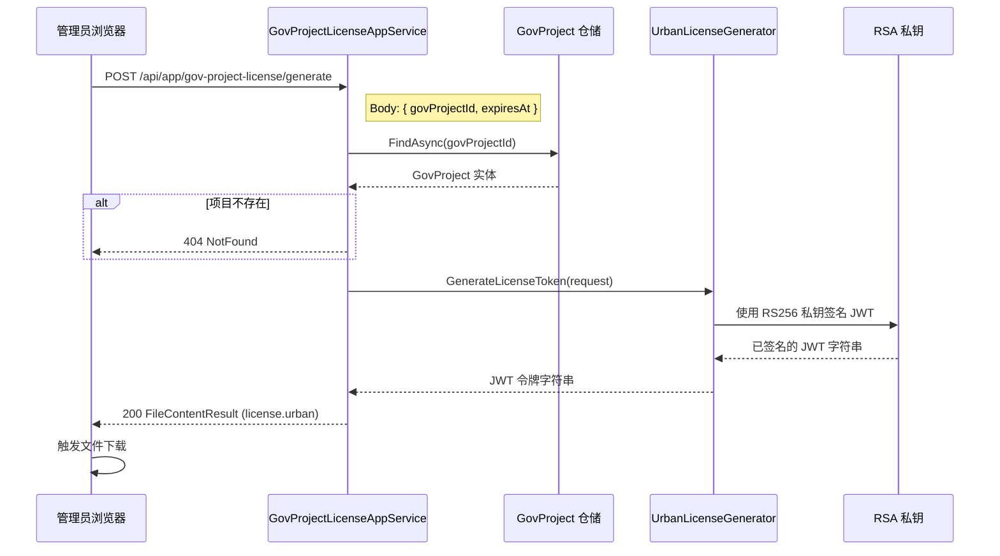
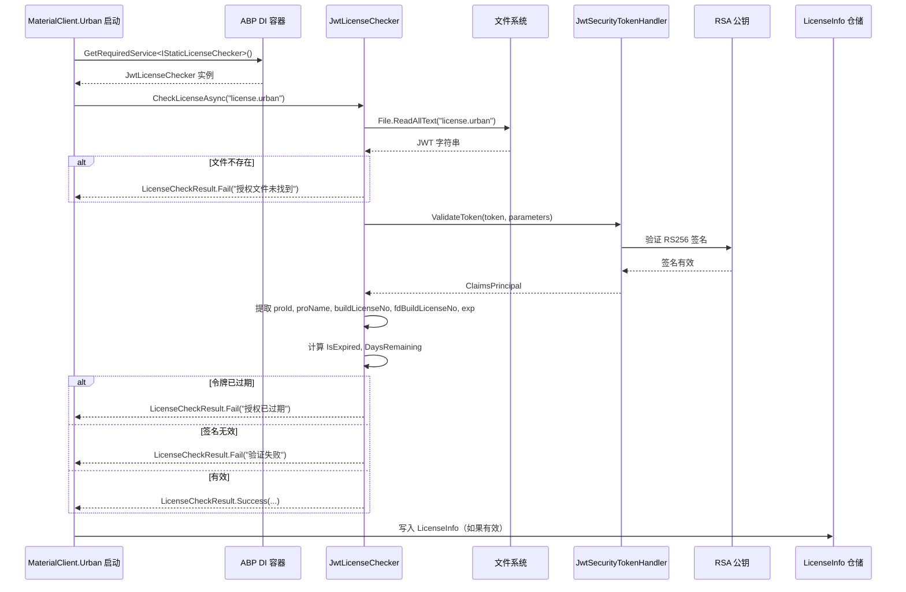

## Context

MaterialClient.Urban 使用 RSA.xml 文件进行离线授权。文件中将 RSA 私钥与加密字段（authEndTime、xmlString、proId）一同嵌入，这意味着任何拥有该文件的人都可以解密和伪造授权数据。UrbanManagement 没有授权生成能力 — RSA.xml 文件由外部生成。

授权流程有两条独立路径：
- **离线路径**: `IStaticLicenseChecker` → `StaticLicenseChecker` → `RsaLicenseDecryptor` → RSA.xml
- **在线路径**: `LicenseService` → 基础平台 API（独立于本次变更）

两个仓库均使用 ABP 框架，通过 `[AutoConstructor]` + `ISingletonDependency` 进行服务注册。均通过 `Directory.Packages.props` 使用集中包管理。

## Goals / Non-Goals

**目标:**
- 将 RSA.xml 替换为 JWT RS256 `.urban` 令牌文件用于离线授权
- 私钥不离开 UrbanManagement 服务端；仅公钥嵌入 MaterialClient
- 复用 `IStaticLicenseChecker` 接口作为切换点 — 启动注入逻辑零修改
- 在 UrbanManagement 管理后台中按 GovProject 生成并下载 `.urban` 文件
- JWT 承载比 RSA.xml 更丰富的 Claims（proName、fdBuildLicenseNo）

**非目标:**
- 在线授权路径（`LicenseService`）不在本次范围内
- 机器绑定或设备锁定（需求: "允许复制到其他电脑"）
- 与 RSA.xml 向后兼容（需求: "无需考虑向后兼容"）
- 密钥轮换或多密钥支持（初始版本使用单密钥对）
- 单元测试和文档（需求: "可跳过文档与单元测试"）

## Decisions

### D1: 保持 `IStaticLicenseChecker` 接口不变

该接口（`CheckLicenseAsync(string licenseFilePath) → LicenseCheckResult`）足够通用，可同时支持 RSA 和 JWT 实现。`MaterialClientUrbanModule` 从 DI 解析它时无需知道具体类型 — 这是一个干净的切换点。

**已考虑的替代方案**: 创建新的 `IJwtLicenseChecker` 接口。已否决 — 现有接口已经足够，新接口会增加不必要的抽象层。

### D2: 新增 `JwtLicenseChecker` 作为单例，通过构造函数注入公钥

遵循 ABP 约定: `[AutoConstructor]` + `ISingletonDependency`。公钥在构造时从 `IConfiguration`（`Jwt:PublicKey`）加载。密钥解析一次后复用于所有验证。

**已考虑的替代方案**: 从嵌入资源加载公钥。已否决 — 配置方式更灵活，无需重新编译即可更新密钥。

### D3: `System.IdentityModel.Tokens.Jwt` 作为唯一新增依赖

该单一 NuGet 包同时提供 JWT 生成（UrbanManagement）和验证（MaterialClient）功能。使用 `JwtSecurityTokenHandler`、`TokenValidationParameters` 和 `SigningCredentials` — 均来自 Microsoft 官方技术栈。

### D4: JWT Claims 映射到 `LicenseCheckResult` 字段

| Claim | 类型 | 映射到 |
|-------|------|--------|
| `proId` | string (Guid) | `LicenseCheckResult.ProId` |
| `proName` | string | `LicenseCheckResult.ProName` |
| `buildLicenseNo` | string | `LicenseCheckResult.BuildLicenseNo` |
| `fdBuildLicenseNo` | string | `LicenseCheckResult.FdBuildLicenseNo` |
| `exp` (注册声明) | Unix 时间戳 | `LicenseCheckResult.AuthEndTime` |
| `iss` | "UrbanManagement" | 验证但不对外暴露 |
| `aud` | "MaterialClient.Urban" | 验证但不对外暴露 |
| `jti` | Guid string | 唯一令牌 ID，不对外暴露 |

注册声明（`exp`、`iss`、`aud`、`jti`）使用 `JwtRegisteredClaimNames` 常量。自定义声明使用字符串字面量。

### D5: RSA 密钥对 — 预生成，配置在 appsettings 中

使用 `openssl` 或 .NET 工具一次性生成密钥对（2048 位）。私钥存储在 UrbanManagement 的 `appsettings.json` 中（`Jwt:PrivateKey`），公钥存储在 MaterialClient 的 `appsettings.json` 中（`Jwt:PublicKey`）。PEM 格式。

**已考虑的替代方案**: 首次启动时自动生成并持久化到文件。已否决 — 对小规模部署场景增加了不必要的复杂性。手动生成更透明、可审计。

### D6: 授权生成为新的 `GovProjectLicenseAppService`

新增 ABP `ApplicationService`，包含单一方法 `GenerateAsync(Guid govProjectId, DateTime expiresAt)`:
1. 从仓储加载 `GovProject`
2. 调用 `IUrbanLicenseGenerator.GenerateLicenseToken()`
3. 将 JWT 字符串作为 `FileContentResult` 返回，内容类型 `application/octet-stream`，`Content-Disposition: attachment; filename="license.urban"`

使用 `[UnitOfWork]` 属性进行数据库访问。端点: `POST /api/app/gov-project-license/generate`。

### D7: 管理后台 UI — GovProject 列表操作按钮 + 弹窗生成

不单独创建页面，而是将授权生成 UI 集成到现有的 GovProject 管理中，作为每行项目的操作按钮。点击后弹出弹窗，管理员可确认或调整过期时间，然后点击"生成并下载"。

### D8: 完整删除 `RsaLicenseDecryptor` 和 `StaticLicenseChecker`

无需向后兼容。两个文件全部移除。`IStaticLicenseChecker` 接口（与 `LicenseCheckResult` 在同一文件中）保留 — 仅实现类变更。

### D9: `SystemSettings.LicenseFilePath` 默认值改为 `"license.urban"`

`LicenseFilePath` 属性当前默认为 `"RSA.xml"`。更新为 `"license.urban"`。如果现有的 MaterialClient.Urban `appsettings.json` 中显式设置了该值，可能需要同步更新。

## Architecture

```
UrbanManagement (服务端)                           MaterialClient.Urban (客户端)
├── UrbanManagement.Core                          ├── MaterialClient.Common
│   ├── Services/                                │   ├── Services/
│   │   ├── GovProjectLicenseAppService (新增)     │   │   ├── IStaticLicenseChecker (保留)
│   │   │   └── GenerateAsync()                 │   │   ├── LicenseCheckResult (保留)
│   │   └── UrbanLicenseGenerator (新增)          │   │   ├── JwtLicenseChecker (新增)
│   │       └── GenerateLicenseToken()         │   │   └── [RsaLicenseDecryptor 已移除]
│   ├── Models/                                  │   │   └── [StaticLicenseChecker 已移除]
│   │   └── UrbanLicenseRequestDto (新增)        │   ├── Configuration/
│   └── Entities/                                │   │   └── SystemSettings (编辑: 默认路径)
│       └── GovProject (不变)                    │   └── Entities/
├── UrbanManagement.App                          │       └── LicenseInfo (保留)
│   ├── Controllers/ (AppService 自动生成)        ├── MaterialClient.Urban
│   ├── Pages/                                   │   ├── appsettings.json (编辑: JwtPublicKey)
│   │   └── GovProject 授权弹窗 (新增)            │   └── MaterialClientUrbanModule (保留)
│   └── appsettings.json (编辑: JwtPrivateKey)  │
```

## API Sequence: 授权生成



## API Sequence: 客户端离线验证



## Risks / Trade-offs

| 风险 | 缓解措施 |
|------|---------|
| **公钥配置错误** → 所有授权检查失败，客户端无授权启动 | 启动时记录明确错误日志；`JwtLicenseChecker` 返回包含描述信息的 `Fail` 结果。非阻塞启动意味着应用仍可运行。 |
| **时钟偏差** → 有效 JWT 被拒绝为已过期 | `TokenValidationParameters` 默认 `ClockSkew = 5 分钟`。标准 JWT 行为。 |
| **私钥泄露** → 任何人可伪造授权 | 私钥仅存放在 UrbanManagement 服务端配置中。生产环境建议使用环境变量或密钥管理服务。密钥轮换机制延后实现。 |
| **JWT 库漏洞** | 使用 Microsoft 官方 `System.IdentityModel.Tokens.Jwt`。通过集中包管理保持更新。 |
| **JWT 令牌较大** → Base64 编码膨胀 | 对离线文件分发场景可接受。典型令牌大小: ~500-800 字节，对比 RSA.xml ~2-4 KB。 |

## Design Code Change Inventory

### MaterialClient

| 文件路径 | 变更类型 | 变更描述 | 影响模块 |
|---------|---------|---------|---------|
| `MaterialClient.Common/Services/RsaLicenseDecryptor.cs` | 删除 | 移除整个文件（静态类 + RsaLicenseDecryptResult 记录） | Services |
| `MaterialClient.Common/Services/StaticLicenseChecker.cs` | 删除 | 移除整个文件（使用 RSA.xml 的 IStaticLicenseChecker 实现） | Services |
| `MaterialClient.Common/Services/JwtLicenseChecker.cs` | 新增 | 新增类: `ISingletonDependency`、`[AutoConstructor]`，使用 RS256 公钥验证 JWT、提取 Claims、返回 `LicenseCheckResult` | Services |
| `MaterialClient.Common/Configuration/SystemSettings.cs` | 编辑 | `LicenseFilePath` 默认值从 `"RSA.xml"` 改为 `"license.urban"` | Configuration |
| `MaterialClient.Urban/appsettings.json` | 编辑 | 新增 `Jwt:PublicKey` 配置段，包含 RSA 公钥 PEM | Configuration |
| `Directory.Packages.props` | 编辑 | 新增 `<PackageVersion Include="System.IdentityModel.Tokens.Jwt" />` | Build |

### UrbanManagement

| 文件路径 | 变更类型 | 变更描述 | 影响模块 |
|---------|---------|---------|---------|
| `UrbanManagement.Core/Services/UrbanLicenseGenerator.cs` | 新增 | 新增文件: `IUrbanLicenseGenerator` 接口 + `UrbanLicenseGenerator` 实现。`ITransientDependency`、`[AutoConstructor]`，从配置加载 RSA 私钥，生成签名 JWT | Services |
| `UrbanManagement.Core/Services/GovProjectLicenseAppService.cs` | 新增 | 新增文件: `IGovProjectLicenseAppService` 接口 + 实现。`ApplicationService`，加载 GovProject，调用生成器，返回 FileContentResult | Services |
| `UrbanManagement.Core/Models/UrbanLicenseRequestDto.cs` | 新增 | 新增文件: 输入 DTO，包含 `GovProjectId` (Guid) 和 `ExpiresAt` (DateTime) | Models |
| Blazor 页面/组件（授权生成） | 新增 | 新增 UI: 项目选择下拉框、过期日期选择器、生成并下载按钮 | UI |
| `UrbanManagement.App/appsettings.json` | 编辑 | 新增 `Jwt:PrivateKey` 配置段，包含 RSA 私钥 PEM | Configuration |
| `Directory.Packages.props` | 编辑 | 新增 `<PackageVersion Include="System.IdentityModel.Tokens.Jwt" />` | Build |

## Open Questions

无 — 所有设计决策已基于架构文档、现有代码模式和需求确认。

<!-- reasoning-annotate: auto-generated — openspec/reasoning-categories.yaml -->
## Reasoning Annotations

**Classification source**: `openspec/reasoning-categories.yaml`
**Categories active**: 15 / 19
**Annotations found**: 13

### Summary by Domain
| Domain | Categories matched | Annotation count |
|--------|-------------------|-----------------|
| 技术   | auth-license, abp-module, data-model, ui-architecture | 8 |
| 业务   | gov-compliance | 1 |
| 通用   | cross-repo, scope-decision | 4 |

### Coverage metrics
- Reasoning passages detected: 15
- Matched to subscribed categories: 13
- Unmatched passages: 2

---

### auth-license ⬆️ HIGH
**Location**: "Context — 第一段"
> RSA 私钥与加密字段一同嵌入，意味着任何拥有该文件的人都可以解密和伪造授权数据

当前方案将签名能力（私钥）与授权数据同文件分发，等同于将伪造能力交给持有者。JWT RS256 非对称签名是直接对症的改进。

### scope-decision ◉ MEDIUM
**Location**: "Context — 授权流程"
> 离线路径: IStaticLicenseChecker → StaticLicenseChecker → RsaLicenseDecryptor → RSA.xml 与 在线路径: LicenseService → 基础平台 API（独立于本次变更）

明确标识两条独立授权路径并选择只修改离线路径 — 在线路径(LicenseService)保持独立，避免连锁变更风险。

### abp-module ◉ MEDIUM
**Location**: "D1 — 保持 IStaticLicenseChecker 接口不变"
> 该接口足够通用，可同时支持 RSA 和 JWT 实现。MaterialClientUrbanModule 从 DI 解析它时无需知道具体类型

ABP DI 的 `IStaticLicenseChecker` 作为策略切换点 — 接口通用性允许零修改启动注入，否决了 `IJwtLicenseChecker` 新抽象层。

### auth-license ⬆️ HIGH
**Location**: "D2 — 公钥注入方式"
> 公钥在构造时从 IConfiguration（Jwt:PublicKey）加载。密钥解析一次后复用于所有验证。配置方式更灵活，无需重新编译即可更新密钥。

ABP `[AutoConstructor]` + `ISingletonDependency` — 构造时单次解析密钥，每次验证复用。选择配置而非嵌入资源允许运行时更新密钥。

### auth-license ⬆️ HIGH
**Location**: "D5 — RSA 密钥管理"
> 手动生成更透明、可审计。初始版本不做密钥轮换。

密钥管理采用预生成而非自动生成 — 优先透明性和审计能力。但单密钥对意味着密钥泄露时无法渐进式轮换，生产环境应提升到环境变量或密钥管理服务。

### data-model ◉ MEDIUM
**Location**: "D4 — JWT Claims 映射"
> 注册声明使用 JwtRegisteredClaimNames 常量。自定义声明使用字符串字面量。

Claims 设计平衡 JWT 标准互操作性(exp, iss, aud, jti) 与领域业务字段(proId, proName, buildLicenseNo, fdBuildLicenseNo)。Guid→string 序列化需注意跨平台一致性。

### abp-module ◉ MEDIUM
**Location**: "D6 — 授权生成服务设计"
> 新增 ABP ApplicationService，包含单一方法。使用 [UnitOfWork] 属性进行数据库访问。端点: POST /api/app/gov-project-license/generate。

遵循 ABP 约定控制器模式 — `ApplicationService` + `[AutoConstructor]` + `[UnitOfWork]`，端点自动注册。单一方法保持服务粒度合理。

### ui-architecture ○ LOW
**Location**: "D7 — 管理后台 UI 集成方式"
> 不单独创建页面，而是将授权生成 UI 集成到现有的 GovProject 管理中，作为每行项目的操作按钮

选择嵌入式操作按钮+弹窗而非独立 Blazor 页面 — 降低导航复杂度，但将授权功能与 GovProject 项目管理耦合。

### scope-decision ◉ MEDIUM
**Location**: "D8 — 完整删除旧实现"
> 无需向后兼容。两个文件全部移除。IStaticLicenseChecker 接口保留 — 仅实现类变更。

干净切换策略 — 无向后兼容需求简化迁移，但要求所有 MaterialClient 实例同步更新到支持 .urban 的版本。

### scope-decision ◉ MEDIUM
**Location**: "Non-Goals"
> 机器绑定或设备锁定（允许复制到其他电脑）; 密钥轮换或多密钥支持（初始版本使用单密钥对）

两个安全相关 Non-Goals — 允许设备复制意味着单个授权可被多台机器使用，初始单密钥对意味着密钥泄露时无法渐进式轮换。

### cross-repo ⬆️ HIGH
**Location**: "Architecture — 双仓库架构图"
> UrbanManagement (服务端) 签发 JWT / MaterialClient.Urban (客户端) 验证 JWT

跨仓库职责划分清晰 — UrbanManagement 持私钥签发(UrbanLicenseGenerator)，MaterialClient 持公钥验证(JwtLicenseChecker)。Code Change Inventory 明确标注每侧变更文件。

### auth-license ⬆️ HIGH
**Location**: "Risks — 私钥泄露"
> 私钥仅存放在 UrbanManagement 服务端配置中。生产环境建议使用环境变量或密钥管理服务。密钥轮换机制延后实现。

私钥泄露是最高影响风险 — appsettings.json 存储私钥是开发便利性与安全性的妥协。生产部署需提升到环境变量或密钥管理服务。

### gov-compliance ⬆️ HIGH
**Location**: "D4 / Capabilities — Claims 合规字段"
> Claims: buildLicenseNo, fdBuildLicenseNo, proId, proName

离线授权服务于城管合规场景 — buildLicenseNo 和 fdBuildLicenseNo 是政务平台项目标识字段，JWT Claims 结构化承载替代 RSA.xml 自定义 XML 格式，便于政务平台对接。

<!-- /reasoning-annotate -->
