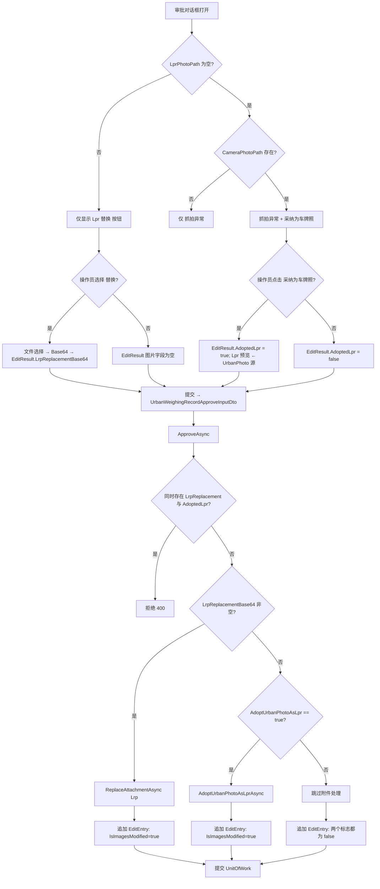

## Context

当前 `AttachType.Lrp`（车牌识别抓拍）和 `AttachType.UrbanPhoto`（摄像头抓拍）共用同一条审批期图片替换规则。该规则贯穿三层：

1. **客户端（`MaterialClient.Urban`）**：`WeighingRecordEditDialogViewModel` 同时暴露 `ReplaceLrpCommand` 和 `ReplaceUrbanPhotoCommand`。`EditResult` 同时携带 `LrpReplacementBase64` 与 `UrbanPhotoReplacementBase64`。`UrbanAttendedWeighingViewModel.ApproveRecordAsync` 将两者一并转发到服务端。
2. **服务端（`UrbanManagement`）**：`UrbanWeighingRecordApproveInputDto` 同时携带两种替换字段。`UrbanWeighingRecordAppService.ApproveAsync` 将每个非空字段路由到 `IFileService.ReplaceAttachmentAsync(recordId, attachType, base64)`。
3. **文件服务**：`IFileService.ReplaceAttachmentAsync` 删除旧的附件表行和磁盘文件，然后用传入的 Base64 创建新的 `AttachmentFile` 和关联表行。

变更输入中的约束：
- 不需要考虑向后兼容。本提案被明确允许破坏 DTO 与 `EditResult` 的结构。
- 可以跳过文档与单元测试。
- 提案完成后可以直接提交变更。
- 跨仓库 C# 约定：签名中不得使用元组；使用具名 `record`。
- 架构规则：ViewModel 严禁直接访问 `IRepository`；数据写入必须通过标注 `[UnitOfWork]` 的 Service 方法。

## Goals / Non-Goals

**Goals：**
- 在审批入口处让 UrbanPhoto 严格只读（无 UI 入口、无服务端路径）。
- 提供唯一一条在审批流程内用既有 UrbanPhoto 附件填补空 Lpr 槽位的路径。
- 采纳后保留原始 UrbanPhoto 附件在磁盘和数据库中。
- 在 UrbanPhoto 不可替换之后，保持 `IsImagesModified` 语义自洽——只要 Lpr 被替换（手动或采纳）即置位。

**Non-Goals：**
- 在审批编辑对话框以外的地方暴露采纳动作（不在 Web 审批对话框、不在列表行操作）。
- 允许在审批流程之外进行 UrbanPhoto→Lpr 采纳。
- 修改 `IFileService.ReplaceAttachmentAsync` 的内部实现——它的契约仍服务于 Lrp。
- 除对话框内对暂存动作的一次性撤销外，提供移除或「撤销采纳」已有 Lrp 的 UI 入口。
- 新增编辑历史字段以区分「采纳」与「手动替换」——`IsImagesModified` 既覆盖手动替换也覆盖采纳，不区分来源。


## Architecture

### 两个仓库间的组件归属

```
MaterialMonospec（仅 OpenSpec —— 本仓库）
│
├── repos/MaterialClient  (Avalonia 桌面端, ReactiveUI)
│   └── MaterialClient.Urban
│       ├── Views
│       │   └── WeighingRecordEditDialog.axaml        [MODIFY: 移除 UrbanPhoto 的 替换; 新增 采纳为车牌照]
│       └── ViewModels
│           ├── WeighingRecordEditDialogViewModel.cs  [MODIFY: 移除 ReplaceUrbanPhotoCommand + UrbanPhotoReplacementBase64;
│           │                                            新增 AdoptUrbanPhotoAsLprCommand + EditResult.AdoptedLpr]
│           └── UrbanAttendedWeighingViewModel.cs     [MODIFY: ApproveRecordAsync 转发 AdoptedLpr, 不再转发 UrbanPhoto Base64]
│
└── repos/UrbanManagement  (ABP Web, 服务端)
    └── UrbanManagement.Application
        ├── Dtos
        │   └── UrbanWeighingRecordApproveInputDto.cs [MODIFY: 移除 UrbanPhotoReplacementBase64; 新增 AdoptUrbanPhotoAsLpr]
        ├── Services
        │   ├── UrbanWeighingRecordAppService.cs     [MODIFY: 移除 UrbanPhoto 分支; 新增采纳分支]
        │   ├── IFileService.cs                       [MODIFY: 新增 AdoptUrbanPhotoAsLprAsync(Guid)]
        │   └── FileService.cs                        [MODIFY: 实现 AdoptUrbanPhotoAsLprAsync]
        └── EditHistory
            └── EditEntry.cs                          [UNCHANGED: 沿用既有 IsImagesModified, 不新增字段]
```

### 跨层决策流转

```
┌──────────────────────────────────────────────────────────────────┐
│  MaterialClient.Urban（客户端）                                   │
│                                                                  │
│  WeighingRecordEditDialogViewModel                               │
│  ├─ ReplaceLrpCommand             → EditResult.LrpReplacement…   │
│  ├─ AdoptUrbanPhotoAsLprCommand   → EditResult.AdoptedLpr = true │
│  └─ (ReplaceUrbanPhotoCommand)    → 已移除                        │
│                                                                  │
│  UrbanAttendedWeighingViewModel.ApproveRecordAsync               │
│  └─ 构造 UrbanWeighingRecordApproveInputDto {                    │
│         PlateNumber, TotalWeight,                                │
│         LrpReplacementBase64?, AdoptUrbanPhotoAsLpr              │
│     }                                                            │
└──────────────────────────────────────────────────────────────────┘
                                │
                                │  HTTP POST /approve
                                ▼
┌──────────────────────────────────────────────────────────────────┐
│  UrbanManagement（服务端）                                        │
│                                                                  │
│  UrbanWeighingRecordAppService.ApproveAsync                      │
│  ├─ 校验 车牌 / 重量 / IsAnomaly                                  │
│  ├─ 若 LrpReplacementBase64 非空 且 AdoptUrbanPhotoAsLpr:         │
│  │      → 拒绝（互斥）                                            │
│  ├─ 若 LrpReplacementBase64 非空:                                 │
│  │      → FileService.ReplaceAttachmentAsync(Lrp)                │
│  │      → EditEntry.IsImagesModified = true                      │
│  ├─ 否则若 AdoptUrbanPhotoAsLpr == true:                          │
│  │      → FileService.AdoptUrbanPhotoAsLprAsync(recordId)        │
│  │      → EditEntry.IsImagesModified = true            │
│  └─ 否则：无附件处理                                             │
│                                                                  │
│  FileService.AdoptUrbanPhotoAsLprAsync                           │
│  ├─ 加载 UrbanPhoto AttachmentFile（LocalPath）                   │
│  ├─ 复制字节 → 新的 AttachmentFile(AttachType.Lrp)                │
│  ├─ 插入 UrbanWeighingRecordAttachment 关联表行                   │
│  └─ 不要触碰原始 UrbanPhoto AttachmentFile 或磁盘文件             │
└──────────────────────────────────────────────────────────────────┘
```

## Data Flow



## API Sequence

### Sequence A — Lrp 替换路径（结构不变，字段集合收窄）

```mermaid
sequenceDiagram
    participant U as 操作员
    participant Dlg as EditDialog（客户端）
    participant VM as UrbanAttendedWeighingViewModel
    participant API as ApproveAsync（服务端）
    participant FS as FileService
    participant DB as DbContext
    participant Disk as 文件系统

    U->>Dlg: 点击 Lpr 的 替换
    Dlg->>Disk: 文件选择 → 读取所选文件
    Disk-->>Dlg: 字节
    Dlg->>Dlg: Base64 编码; 更新 Lpr 预览; EditResult.LrpReplacementBase64 = b64
    U->>Dlg: 确定
    Dlg->>VM: EditResult
    VM->>API: POST /approve { Plate, Weight, LrpReplacementBase64, AdoptUrbanPhotoAsLpr=false }
    API->>API: 校验; 检查互斥（跳过 —— Adopt=false）
    API->>FS: ReplaceAttachmentAsync(recordId, AttachType.Lrp, b64)
    FS->>Disk: SaveAndCompressImagesAsync → 新文件
    FS->>DB: 插入 AttachmentFile(Lrp); 插入关联表行; 删除旧 Lrp 行
    FS->>Disk: 删除旧 Lrp 文件（尽力而为）
    FS-->>API: 新 AttachmentFile Guid
    API->>DB: 更新记录; 追加 EditEntry(IsImagesModified=true)
    API-->>VM: 200 OK
```

### Sequence B — 采纳路径（新增）

```mermaid
sequenceDiagram
    participant U as 操作员
    participant Dlg as EditDialog（客户端）
    participant VM as UrbanAttendedWeighingViewModel
    participant API as ApproveAsync（服务端）
    participant FS as FileService
    participant DB as DbContext
    participant Disk as 文件系统

    U->>Dlg: 点击 采纳为车牌照（Lpr 为空, UrbanPhoto 存在）
    Dlg->>Disk: 读取 UrbanPhoto 源文件（仅用于预览 —— 不上传）
    Disk-->>Dlg: 字节
    Dlg->>Dlg: 用 UrbanPhoto 字节更新 Lpr 预览; 清除 抓拍异常; EditResult.AdoptedLpr = true
    U->>Dlg: 确定
    Dlg->>VM: EditResult
    VM->>API: POST /approve { Plate, Weight, LrpReplacementBase64=null, AdoptUrbanPhotoAsLpr=true }
    API->>API: 校验; 检查 Lpr 当前为空 且 存在 UrbanPhoto
    API->>FS: AdoptUrbanPhotoAsLprAsync(recordId)
    FS->>DB: 加载 UrbanPhoto AttachmentFile（LocalPath）
    FS->>Disk: 读取 UrbanPhoto 源字节
    FS->>FS: 走 SaveAndCompressImagesAsync 等价路径 → 写入新 Lrp 文件（复制）
    FS->>DB: 插入 AttachmentFile(Lrp); 插入关联表行
    FS-->>API: 新 Lrp AttachmentFile Guid
    Note over FS,DB: 原始 UrbanPhoto AttachmentFile 与磁盘文件保持不变
    API->>DB: 更新记录; 追加 EditEntry(IsImagesModified=true)
    API-->>VM: 200 OK
```

### Sequence C — 互斥保护

```mermaid
sequenceDiagram
    participant VM as 客户端 ViewModel
    participant API as ApproveAsync
    participant FS as FileService

    VM->>API: POST /approve { LrpReplacementBase64="...", AdoptUrbanPhotoAsLpr=true }
    API->>API: 检测到两个信号同时存在
    API-->>VM: 400 业务校验错误: "不能同时进行 Lrp 替换与采纳"
    Note over API,FS: 不调用 FileService; 附件无任何变更
```

## Decisions

### D1 — 完全移除 `UrbanPhotoReplacementBase64`（BREAKING）

**选择：** 从服务端 DTO、客户端 `EditResult` 以及 ViewModel 中移除该字段。不以功能开关隐藏，也不采用「接收后忽略」语义。

**理由：** UrbanPhoto 在语义上是只读的补充上下文。服务端接收该字段并默默忽略，会给未来任何以为还能替换 UrbanPhoto 的客户端埋下陷阱。变更输入明确免除了向后兼容约束。

**备选方案：**
- *接收后忽略：* 保留 DTO 上的字段但空操作。已否决——留下误导性契约，并让 `IsImagesModified` 场景复杂化。
- *先废弃再移除：* 添加 `[Obsolete]`，发布过渡版本。已否决——任务约束明确跳过向后兼容工作。

### D2 — 采纳复制字节；原始 UrbanPhoto 不动

**选择：** `AdoptUrbanPhotoAsLprAsync` 从磁盘读取 UrbanPhoto 源文件并写入一条新的 Lrp `AttachmentFile`。它不会改动 UrbanPhoto 表行、其关联表行或其磁盘文件。

**理由：** UrbanPhoto 是被采纳 Lpr 的来源凭据。如果我们移动或重指向该表行，会丢失原始抓拍上下文，并破坏任何针对该记录加载 `AttachType.UrbanPhoto` 的消费方。提案明确要求「创建一条源自 UrbanPhoto 的新 Lpr 记录」。

**备选方案：**
- *将 UrbanPhoto 关联表行重指向新的 `AttachType.Lrp` AttachmentFile：* 已否决——会破坏该记录的 UrbanPhoto 可用性。
- *通过硬链接 / 符号链接共享字节：* 已否决——增加平台相关的文件系统复杂度，并让「替换时删除」语义复杂化。简单复制更直接，磁盘代价仅为每次采纳一张图片。

### D3 — `EditResult` 新增 `AdoptedLpr` 布尔，而不是用特殊 Base64 值表示采纳

**选择：** 在 `EditResult`（以及服务端 DTO）上新增一个独立的 `AdoptedLpr` 布尔。采纳与显式替换互斥。

**理由：** 布尔值无歧义、序列化简单，并为服务端提供了一个清晰的信号：调用 `AdoptUrbanPhotoAsLprAsync` 而不是 `ReplaceAttachmentAsync`。如果用哨兵 Base64 字符串表示采纳，服务端需要脆弱的字符串匹配。

**备选方案：**
- *哨兵 Base64（例如 `"ADOPT_FROM_URBAN"`）：* 已否决——脆弱且削弱 DTO 契约。
- *联合类型 / 可判别字段：* 已否决——对二态选择而言过度设计。

### D4 — 互斥在服务端强制，客户端再加一层保险

**选择：** `ApproveAsync` 拒绝同时提供非空 `LrpReplacementBase64` 且 `AdoptUrbanPhotoAsLpr == true` 的请求。客户端 ViewModel 另外保证：暂存其中一种会取消另一种（对话框无法同时产生两者）。

**理由：** 服务端强制是事实来源（纵深防御——否则 Web UI 或未来的其他调用方可能同时发送两者）。客户端保护改善体验（避免一次错误往返）。

**备选方案：**
- *服务端默默优先 Lrp 替换：* 在默认策略中被否决，但在规范中列为可接受的变体（允许实现时由调用方决定）。两种选择都符合规范；实现时任选其一并写明注释。

### D5 — 采纳前置条件检查放在 AppService，而不是 FileService

**选择：** `ApproveAsync` 在调用 `AdoptUrbanPhotoAsLprAsync` 之前校验：(a) 记录当前不存在 Lrp 附件 且 (b) 记录存在 UrbanPhoto 附件。FileService 方法对直接调用方独立守护同样的条件。

**理由：** AppService 是审批编排器，拥有横切校验（异常状态、车牌格式）。FileService 方法对于未来直接调用它的调用方是「复用安全」的。

**备选方案：**
- *仅在 AppService 校验，信任 FileService 的调用方：* 已否决——FileService 是公共服务表面，信任调用方会招致误用。

### D6 — 沿用既有 `IsImagesModified`，不新增编辑历史字段

**选择：** 不在 `EditEntry` 上新增任何字段。既有 `IsImagesModified` 标志在 Lrp 替换（手动）**或** 采纳（从 UrbanPhoto 提升）发生时均置为 `true`——即「Lpr 是否被替换」的统一信号，不区分来源。

**理由：** 审计消费方关心的是「这条记录的 Lpr 图片在审批过程中是否被改动过」，而不是改动是来自本地上传还是从已有抓拍提升。区分两种来源会引入一个新字段、增加历史 JSON 体积、并迫使消费方学会读取两个不同的标志。沿用既有 `IsImagesModified` 足以覆盖业务诉求，且不破坏任何历史读取路径。

**备选方案：**
- *新增 `IsLprAdoptedFromUrbanPhoto` 以区分两种来源：* 已否决——业务方明确表示不需要区分替换类型，仅记录「Lpr 是否被替换」即可。
- *仅在采纳时置位 `IsImagesModified`：* 已否决——会让手动 Lrp 替换失去审计信号。

### D7 — `ReplaceAttachmentAsync` 签名不变

**选择：** `IFileService.ReplaceAttachmentAsync(Guid recordId, AttachType attachType, string base64Image)` 保持不变。仅其调用方收窄。

**理由：** 该方法是一个通用的「原子替换」原语。收窄其签名（例如硬编码 `AttachType.Lrp`）会把一个原语耦合到单一调用点。规范层面的保证（「UrbanPhoto 不可替换」）在 AppService 层强制。

## Detailed Code Change Inventory

### 服务端 — `repos/UrbanManagement`

| 文件路径 | 变更类型 | 变更描述 | 受影响模块 |
|-----------|-------------|--------------------|-----------------|
| `.../UrbanWeighingRecordApproveInputDto.cs` | Modify (BREAKING) | 删除 `UrbanPhotoReplacementBase64` 属性。新增 `bool AdoptUrbanPhotoAsLpr` 属性（默认 `false`）。 | 审批 DTO 契约 |
| `.../UrbanWeighingRecordAppService.cs` → `ApproveAsync` | Modify | 移除 UrbanPhoto 替换分支。新增互斥校验（Lrp 替换 vs 采纳）。新增采纳分支，调用 `IFileService.AdoptUrbanPhotoAsLprAsync(recordId)`。更新 `EditEntry` 追加逻辑：在 Lrp 替换或采纳发生时均置既有 `IsImagesModified = true`，不新增任何编辑历史字段。 | 审批应用服务 |
| `.../IFileService.cs` | Modify | 在接口上新增 `Task<Guid> AdoptUrbanPhotoAsLprAsync(Guid recordId)`。 | 文件服务契约 |
| `.../FileService.cs` | Modify | 实现 `AdoptUrbanPhotoAsLprAsync`：加载 UrbanPhoto `AttachmentFile`（LocalPath），读取字节，通过既有 `SaveAndCompressImagesAsync` 类似路径持久化为新的 `AttachmentFile(AttachType.Lrp)`，插入关联表行。UrbanPhoto 表行与磁盘文件保持不动。 | 文件服务实现 |

### 客户端 — `repos/MaterialClient`

| 文件路径 | 变更类型 | 变更描述 | 受影响模块 |
|-----------|-------------|--------------------|-----------------|
| `.../WeighingRecordEditDialogViewModel.cs` | Modify (BREAKING) | 删除 `ReplaceUrbanPhotoCommand` 以及任何 UrbanPhoto 替换状态。从 `EditResult` 删除 `UrbanPhotoReplacementBase64`。新增 `AdoptUrbanPhotoAsLprCommand`（ReactiveCommand），其暂存 `EditResult.AdoptedLpr = true`，清除已暂存的 Lrp 替换，并用 UrbanPhoto 源字节更新 Lrp 预览。在 `EditResult` 上新增 `bool AdoptedLpr`。暴露可观察对象 `CanAdoptUrbanPhotoAsLpr`，由 `LprPhotoPath` 为空 且 `CameraPhotoPath` 非空 驱动。 | 对话框 ViewModel |
| `.../WeighingRecordEditDialog.axaml`（必要时含 `.axaml.cs` partial） | Modify | 移除 UrbanPhoto 区域的 替换 按钮及其绑定。在 Lpr 预览区域添加「采纳为车牌照」按钮，绑定到 `AdoptUrbanPhotoAsLprCommand`，`IsVisible` 绑定到 `CanAdoptUrbanPhotoAsLpr`。可选提供「取消采纳」入口以撤销暂存的采纳。 | 对话框视图 |
| `.../UrbanAttendedWeighingViewModel.cs` → `ApproveRecordAsync` | Modify | 不再转发 `UrbanPhotoReplacementBase64`。将 `EditResult` 的 `AdoptedLpr` 作为服务端 DTO 的 `AdoptUrbanPhotoAsLpr` 转发。`LrpReplacementBase64` 原样转发。 | 审批协调器 |

### 横切关注点

| 领域 | 变更类型 | 变更描述 |
|------|-------------|--------------------|
| 编辑历史 JSON 结构 | Unchanged | `EditEntry` 不新增字段。既有 `IsImagesModified` 在 Lrp 替换或采纳时置位（沿用既有语义，不区分来源）。 |
| 审批 DTO 契约 | Modify (BREAKING) | 旧客户端发送的 `UrbanPhotoReplacementBase64` 将被忽略或拒绝。根据变更约束，不提供垫片。 |
| OpenSpec 规范 | Modify | 本次变更中的增量规范归档到 `approval-image-replacement`、`edit-history-tracking`、`urban-approval-photo-preview`、`urbanmanagement-weighing-record-approval`。新规范 `lpr-adoption-from-urban-photo` 归档为一条新能力。 |

## Risks / Trade-offs

- **[风险] 客户端与服务端必须同时上线** → 根据变更约束（无向后兼容），此项被接受。缓解：服务端与客户端同步部署；不要将新客户端指向旧服务端。
- **[风险] 采纳复制字节 → 磁盘占用每次采纳增长一张图片** → 可接受：采纳很少发生（仅在 Lpr 从未抓拍时），且图片大小受既有压缩路径约束。
- **[风险] 操作员暂存采纳后又改主意使用 替换** → 缓解：`AdoptUrbanPhotoAsLprCommand` 清除任何已暂存的 Lrp 替换；`ReplaceLrpCommand` 清除 `AdoptedLpr`。互斥在 ViewModel 强制，并在服务端再次校验。
- **[风险] 在 Lpr 已存在时调用采纳（竞争或 UI 过期）** → 缓解：服务端以业务错误拒绝；FileService 也会守护。UI 在 `LprPhotoPath` 非空时禁用该命令。
- **[风险] Web 审批 UI 无对应入口** → 已接受：Web 审批当前就没有图片控件（替换也是如此）。采纳是仅限客户端的操作员工作流。
- **[权衡] `IsImagesModified` 不区分手动替换与采纳** → 审计消费方只能看到「Lpr 是否被替换」，无法从编辑历史单独识别「替换来源是本地上传还是 UrbanPhoto 提升」。已在规范中记录；业务方明确不需要这种区分。

## Migration Plan

根据变更约束，**不引入任何向后兼容垫片**。部署需同步进行：

1. 合并并把服务端变更部署到 UrbanManagement。旧客户端发送的 `UrbanPhotoReplacementBase64` 会被拒绝/忽略；不会再发生 UrbanPhoto 替换。
2. 合并并把客户端变更部署到 MaterialClient.Urban。新客户端不再发送 `UrbanPhotoReplacementBase64`；当操作员暂存采纳时开始发送 `AdoptUrbanPhotoAsLpr`。
3. 无需数据库迁移——`EditEntry` 结构保持不变，不新增任何字段。

**回滚：** 同时回滚服务端与客户端的提交。`EditEntry` 既有的 JSON 结构完全未变动，回滚不涉及任何编辑历史相关的兼容性考虑。

## Open Questions

- **OQ1：** 当操作员暂存采纳后点击「取消」彻底关闭对话框时，暂存的 `AdoptedLpr = true` 是否应还原为 `false`？—— 假设为是（对话框取消会丢弃所有暂存编辑）。实现时确认。
- **OQ2：** 采纳命令是否还应要求底层记录 `IsAnomaly == true`？—— 假设为是（采纳只在审批流程内有意义，而审批流程本身就是异常驱动的）。实现时确认。
- **OQ3：** 服务端的互斥策略应为「拒绝」还是「优先 Lrp 替换」？—— 规范允许任一；实现时任选其一并在 AppService XML 文档中写明。
