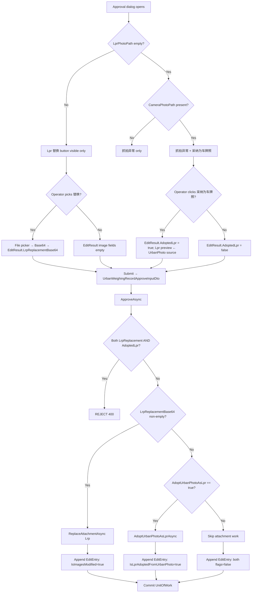

## Context

Today both `AttachType.Lrp` (车牌识别抓拍) and `AttachType.UrbanPhoto` (摄像头抓拍) participate in the same approval-time image-replacement rule. The rule flows through three layers:

1. **Client (`MaterialClient.Urban`)**: `WeighingRecordEditDialogViewModel` exposes both `ReplaceLrpCommand` and `ReplaceUrbanPhotoCommand`. `EditResult` carries both `LrpReplacementBase64` and `UrbanPhotoReplacementBase64`. `UrbanAttendedWeighingViewModel.ApproveRecordAsync` forwards both to the server.
2. **Server (`UrbanManagement`)**: `UrbanWeighingRecordApproveInputDto` carries both replacement fields. `UrbanWeighingRecordAppService.ApproveAsync` routes each non-empty field to `IFileService.ReplaceAttachmentAsync(recordId, attachType, base64)`.
3. **File service**: `IFileService.ReplaceAttachmentAsync` deletes old attachment rows + disk file, then creates a new `AttachmentFile` + junction row using the supplied Base64.

Constraints from the change input:
- Backward compatibility does NOT need to be considered. The proposal is explicitly allowed to break the DTO and `EditResult` shapes.
- Documentation and unit tests may be skipped.
- After the proposal is complete, the changes can be committed directly.
- Cross-repo C# convention: no tuples in signatures; use named `record`.
- Architectural rule: ViewModels must NOT touch `IRepository` directly; data writes go through Service methods decorated with `[UnitOfWork]`.

## Goals / Non-Goals

**Goals:**
- Make UrbanPhoto strictly read-only at the approval surface (no UI affordance, no server path).
- Provide a single in-approval path to fill an empty Lrp slot from an existing UrbanPhoto attachment.
- Preserve the original UrbanPhoto attachment on disk and in the database after adoption.
- Keep `IsImagesModified` semantics coherent now that UrbanPhoto cannot be replaced.
- Add an audit-trail marker (`IsLprAdoptedFromUrbanPhoto`) so future inspectors can distinguish adoption from manual replacement.

**Non-Goals:**
- Backfilling or migrating historical `EditEntry` records that lack `IsLprAdoptedFromUrbanPhoto`.
- Surfacing the adoption action anywhere outside the approval edit dialog (not on the Web approval dialog, not on a list-row action).
- Allowing UrbanPhoto→Lrp adoption outside the approval flow.
- Touching `IFileService.ReplaceAttachmentAsync`'s internal implementation — its contract still serves Lrp.
- Adding UI affordances to remove or "un-adopt" a previously adopted Lrp beyond a single in-dialog undo of the staged action.

## Architecture

### Component ownership across the two repos

```
MaterialMonospec (OpenSpec only — this repo)
│
├── repos/MaterialClient  (Avalonia desktop, ReactiveUI)
│   └── MaterialClient.Urban
│       ├── Views
│       │   └── WeighingRecordEditDialog.axaml        [MODIFY: drop UrbanPhoto 替换; add 采纳为车牌照]
│       └── ViewModels
│           ├── WeighingRecordEditDialogViewModel.cs  [MODIFY: drop ReplaceUrbanPhotoCommand + UrbanPhotoReplacementBase64;
│           │                                            add AdoptUrbanPhotoAsLprCommand + EditResult.AdoptedLpr]
│           └── UrbanAttendedWeighingViewModel.cs     [MODIFY: ApproveRecordAsync forwards AdoptedLpr, not UrbanPhoto Base64]
│
└── repos/UrbanManagement  (ABP Web, server)
    └── UrbanManagement.Application
        ├── Dtos
        │   └── UrbanWeighingRecordApproveInputDto.cs [MODIFY: drop UrbanPhotoReplacementBase64; add AdoptUrbanPhotoAsLpr]
        ├── Services
        │   ├── UrbanWeighingRecordAppService.cs     [MODIFY: drop UrbanPhoto branch; add adoption branch]
        │   ├── IFileService.cs                       [MODIFY: add AdoptUrbanPhotoAsLprAsync(Guid)]
        │   └── FileService.cs                        [MODIFY: implement AdoptUrbanPhotoAsLprAsync]
        └── EditHistory
            └── EditEntry.cs                          [MODIFY: add IsLprAdoptedFromUrbanPhoto]
```

### Decision flow across layers

```
┌──────────────────────────────────────────────────────────────────┐
│  MaterialClient.Urban (client)                                   │
│                                                                  │
│  WeighingRecordEditDialogViewModel                               │
│  ├─ ReplaceLrpCommand             → EditResult.LrpReplacement…   │
│  ├─ AdoptUrbanPhotoAsLprCommand   → EditResult.AdoptedLpr = true │
│  └─ (ReplaceUrbanPhotoCommand)    → REMOVED                      │
│                                                                  │
│  UrbanAttendedWeighingViewModel.ApproveRecordAsync               │
│  └─ builds UrbanWeighingRecordApproveInputDto {                  │
│         PlateNumber, TotalWeight,                                │
│         LrpReplacementBase64?, AdoptUrbanPhotoAsLpr              │
│     }                                                            │
└──────────────────────────────────────────────────────────────────┘
                                │
                                │  HTTP POST /approve
                                ▼
┌──────────────────────────────────────────────────────────────────┐
│  UrbanManagement (server)                                        │
│                                                                  │
│  UrbanWeighingRecordAppService.ApproveAsync                      │
│  ├─ validate plate / weight / IsAnomaly                          │
│  ├─ if LrpReplacementBase64 non-empty && AdoptUrbanPhotoAsLpr:   │
│  │      → REJECT (mutually exclusive)                            │
│  ├─ if LrpReplacementBase64 non-empty:                           │
│  │      → FileService.ReplaceAttachmentAsync(Lrp)                │
│  │      → EditEntry.IsImagesModified = true                      │
│  ├─ elif AdoptUrbanPhotoAsLpr == true:                           │
│  │      → FileService.AdoptUrbanPhotoAsLprAsync(recordId)        │
│  │      → EditEntry.IsLprAdoptedFromUrbanPhoto = true            │
│  └─ else: no attachment work                                     │
│                                                                  │
│  FileService.AdoptUrbanPhotoAsLprAsync                           │
│  ├─ load UrbanPhoto AttachmentFile (LocalPath)                   │
│  ├─ copy bytes → new AttachmentFile(AttachType.Lrp)              │
│  ├─ insert UrbanWeighingRecordAttachment junction                │
│  └─ DO NOT touch original UrbanPhoto AttachmentFile or disk file │
└──────────────────────────────────────────────────────────────────┘
```

## Data Flow



## API Sequence

### Sequence A — Lpr replacement path (unchanged shape, narrowed field set)

```mermaid
sequenceDiagram
    participant U as Operator
    participant Dlg as EditDialog (client)
    participant VM as UrbanAttendedWeighingViewModel
    participant API as ApproveAsync (server)
    participant FS as FileService
    participant DB as DbContext
    participant Disk as File system

    U->>Dlg: Clicks 替换 on Lpr
    Dlg->>Disk: File picker → read selected file
    Disk-->>Dlg: bytes
    Dlg->>Dlg: Base64-encode; update Lrp preview; EditResult.LrpReplacementBase64 = b64
    U->>Dlg: 确定
    Dlg->>VM: EditResult
    VM->>API: POST /approve { Plate, Weight, LrpReplacementBase64, AdoptUrbanPhotoAsLpr=false }
    API->>API: Validate; check mutual exclusion (skip — Adopt=false)
    API->>FS: ReplaceAttachmentAsync(recordId, AttachType.Lrp, b64)
    FS->>Disk: SaveAndCompressImagesAsync → new file
    FS->>DB: Insert AttachmentFile(Lrp); Insert junction; Delete old Lrp rows
    FS->>Disk: Delete old Lrp file (best-effort)
    FS-->>API: new AttachmentFile Guid
    API->>DB: Update record; append EditEntry(IsImagesModified=true)
    API-->>VM: 200 OK
```

### Sequence B — Adoption path (new)

```mermaid
sequenceDiagram
    participant U as Operator
    participant Dlg as EditDialog (client)
    participant VM as UrbanAttendedWeighingViewModel
    participant API as ApproveAsync (server)
    participant FS as FileService
    participant DB as DbContext
    participant Disk as File system

    U->>Dlg: Clicks 采纳为车牌照 (Lpr empty, UrbanPhoto present)
    Dlg->>Disk: Read UrbanPhoto source file (preview only — no upload)
    Disk-->>Dlg: bytes
    Dlg->>Dlg: Update Lrp preview from UrbanPhoto bytes; clear 抓拍异常; EditResult.AdoptedLpr = true
    U->>Dlg: 确定
    Dlg->>VM: EditResult
    VM->>API: POST /approve { Plate, Weight, LrpReplacementBase64=null, AdoptUrbanPhotoAsLpr=true }
    API->>API: Validate; check Lrp is currently empty AND UrbanPhoto exists
    API->>FS: AdoptUrbanPhotoAsLprAsync(recordId)
    FS->>DB: Load UrbanPhoto AttachmentFile (LocalPath)
    FS->>Disk: Read UrbanPhoto source bytes
    FS->>FS: SaveAndCompressImagesAsync-equivalent path → write new Lrp file (copy)
    FS->>DB: Insert AttachmentFile(Lrp); Insert junction
    FS-->>API: new Lrp AttachmentFile Guid
    Note over FS,DB: Original UrbanPhoto AttachmentFile and disk file UNCHANGED
    API->>DB: Update record; append EditEntry(IsLprAdoptedFromUrbanPhoto=true)
    API-->>VM: 200 OK
```

### Sequence C — Mutual-exclusion guard

```mermaid
sequenceDiagram
    participant VM as Client ViewModel
    participant API as ApproveAsync
    participant FS as FileService

    VM->>API: POST /approve { LrpReplacementBase64="...", AdoptUrbanPhotoAsLpr=true }
    API->>API: Detect both signals present
    API-->>VM: 400 Business validation error: "cannot combine Lrp replacement with adoption"
    Note over API,FS: FileService NOT invoked; no attachment changes
```

## Decisions

### D1 — Drop `UrbanPhotoReplacementBase64` entirely (BREAKING)

**Choice:** Remove the field from the server DTO, client `EditResult`, and ViewModel. Do not gate it behind a feature flag or accept-and-ignore semantics.

**Why:** UrbanPhoto is semantically read-only supplementary context. Accepting the field server-side and silently ignoring it would create a footgun for any future client that thinks it can still replace UrbanPhoto. The change input explicitly waives backward-compatibility constraints.

**Alternatives considered:**
- *Accept-and-ignore:* Keep the field on the DTO but no-op. Rejected — leaves a misleading contract and complicates the IsImagesModified scenario.
- *Deprecate-then-remove:* Add `[Obsolete]`, ship a transitional release. Rejected — task constraints explicitly skip backward-compat work.

### D2 — Adoption copies bytes; original UrbanPhoto untouched

**Choice:** `AdoptUrbanPhotoAsLprAsync` reads the UrbanPhoto source file from disk and writes a new Lrp `AttachmentFile`. It does NOT mutate the UrbanPhoto row, its junction, or its disk file.

**Why:** The UrbanPhoto is the provenance trail for the adopted Lrp. If we moved or repointed the row, we would lose the original capture context and break any consumer that loads `AttachType.UrbanPhoto` for this record. The proposal explicitly calls out "creates a new Lpr record sourced from the UrbanPhoto".

**Alternatives considered:**
- *Repoint the UrbanPhoto junction row to a new `AttachType.Lrp` AttachmentFile:* Rejected — destroys UrbanPhoto availability for the record.
- *Share bytes via hardlink / symlinks:* Rejected — adds platform-specific filesystem complexity and complicates delete-on-replace semantics. A plain copy is simpler and the disk cost is one image per adoption.

### D3 — `EditResult` gains `AdoptedLpr` boolean instead of carrying adoption as a special Base64 value

**Choice:** Add a dedicated `AdoptedLpr` boolean on `EditResult` (and the server DTO). Adoption and explicit replacement are mutually exclusive.

**Why:** Boolean is unambiguous, trivially serializable, and gives the server a clean signal to invoke `AdoptUrbanPhotoAsLprAsync` rather than `ReplaceAttachmentAsync`. Encoding adoption as a sentinel Base64 string would require fragile string-matching server-side.

**Alternatives considered:**
- *Sentinel Base64 (e.g. `"ADOPT_FROM_URBAN"`):* Rejected — fragile and weakens the DTO contract.
- *Union type / discriminated field:* Rejected — over-engineering for a 2-state choice.

### D4 — Mutual exclusion enforced server-side, with belt-and-suspenders client-side guard

**Choice:** `ApproveAsync` rejects a request that supplies both `LrpReplacementBase64` non-empty AND `AdoptUrbanPhotoAsLpr == true`. The client ViewModel additionally guarantees that staging one unstages the other (so the dialog cannot produce both).

**Why:** Server-side enforcement is the source of truth (defense in depth — Web UI or other future callers could otherwise send both). Client-side guard improves UX (no error round-trip).

**Alternatives considered:**
- *Server silently prioritizes Lrp replacement:* Rejected in default policy but listed as an acceptable variant in the spec (allows caller to choose at implementation time). Either choice is spec-conformant; pick one when implementing and document it.

### D5 — Adoption precondition checks live in the AppService, not the FileService

**Choice:** `ApproveAsync` validates (a) the record has no current Lrp attachment AND (b) the record has an UrbanPhoto attachment before calling `AdoptUrbanPhotoAsLprAsync`. The FileService method independently guards the same conditions for direct callers.

**Why:** The AppService is the approval orchestrator and owns cross-cutting validation (anomaly status, plate format). The FileService method is reused-safe if a future caller invokes it directly.

**Alternatives considered:**
- *Only validate in AppService, trust FileService callers:* Rejected — FileService is a public service surface; trusting callers invites misuse.

### D6 — `IsImagesModified` narrows to Lrp replacement only

**Choice:** The existing `IsImagesModified` flag now toggles `true` only when `LrpReplacementBase64` is processed. Adoption does NOT set `IsImagesModified` (it sets the new `IsLprAdoptedFromUrbanPhoto` instead).

**Why:** The two flags measure different things: `IsImagesModified` means "operator manually swapped the image"; adoption means "operator promoted an existing capture". Keeping them separate preserves audit clarity.

### D7 — `ReplaceAttachmentAsync` signature unchanged

**Choice:** `IFileService.ReplaceAttachmentAsync(Guid recordId, AttachType attachType, string base64Image)` is unchanged. Only its callers narrow.

**Why:** The method is a generic atomic-replace primitive. Narrowing its signature (e.g. hard-coding `AttachType.Lrp`) would couple a primitive to one call site. Spec-level guarantees ("UrbanPhoto cannot be replaced") are enforced at the AppService layer.

## Detailed Code Change Inventory

### Server — `repos/UrbanManagement`

| File Path | Change Type | Change Description | Affected Module |
|-----------|-------------|--------------------|-----------------|
| `.../UrbanWeighingRecordApproveInputDto.cs` | Modify (BREAKING) | Delete `UrbanPhotoReplacementBase64` property. Add `bool AdoptUrbanPhotoAsLpr` property (default `false`). | Approval DTO contract |
| `.../UrbanWeighingRecordAppService.cs` → `ApproveAsync` | Modify | Remove UrbanPhoto replacement branch. Add mutual-exclusion validation (Lrp replacement vs adoption). Add adoption branch that calls `IFileService.AdoptUrbanPhotoAsLprAsync(recordId)`. Update `EditEntry` append logic to set `IsImagesModified` only on Lrp replacement and `IsLprAdoptedFromUrbanPhoto` on adoption. | Approval application service |
| `.../IFileService.cs` | Modify | Add `Task<Guid> AdoptUrbanPhotoAsLprAsync(Guid recordId)` to the interface. | File service contract |
| `.../FileService.cs` | Modify | Implement `AdoptUrbanPhotoAsLprAsync`: load UrbanPhoto `AttachmentFile` (LocalPath), read bytes, persist new `AttachmentFile(AttachType.Lrp)` via existing `SaveAndCompressImagesAsync`-style path, insert junction row. Leave UrbanPhoto rows and disk file untouched. | File service implementation |
| `.../EditEntry.cs` | Modify | Add `bool IsLprAdoptedFromUrbanPhoto` property (default `false`). Ensure JSON serialization includes the new field. | Edit-history DTO |

### Client — `repos/MaterialClient`

| File Path | Change Type | Change Description | Affected Module |
|-----------|-------------|--------------------|-----------------|
| `.../WeighingRecordEditDialogViewModel.cs` | Modify (BREAKING) | Delete `ReplaceUrbanPhotoCommand` and any UrbanPhoto-replacement state. Delete `UrbanPhotoReplacementBase64` from `EditResult`. Add `AdoptUrbanPhotoAsLprCommand` (ReactiveCommand) that stages `EditResult.AdoptedLpr = true`, clears any staged Lrp replacement, and updates the Lrp preview from the UrbanPhoto source bytes. Add `bool AdoptedLpr` to `EditResult`. Expose observable `CanAdoptUrbanPhotoAsLpr` driven by `LprPhotoPath` empty AND `CameraPhotoPath` non-empty. | Dialog ViewModel |
| `.../WeighingRecordEditDialog.axaml` (and `.axaml.cs` if partial) | Modify | Remove the UrbanPhoto section's 替换 button and its binding. Add an「采纳为车牌照」button in the Lrp preview section, bound to `AdoptUrbanPhotoAsLprCommand` with `IsVisible` bound to `CanAdoptUrbanPhotoAsLpr`. Optionally add a 取消采纳 affordance to revert a staged adoption. | Dialog view |
| `.../UrbanAttendedWeighingViewModel.cs` → `ApproveRecordAsync` | Modify | Stop forwarding `UrbanPhotoReplacementBase64`. Forward `AdoptedLpr` from `EditResult` as `AdoptUrbanPhotoAsLpr` on the server DTO. Forward `LrpReplacementBase64` unchanged. | Approval coordinator |

### Cross-Cutting

| Area | Change Type | Change Description |
|------|-------------|--------------------|
| Edit-history JSON shape | Modify (additive) | `EditEntry` gains a new boolean. Existing entries deserialize with the field defaulting to `false` (no migration needed for read paths). |
| Approval DTO contract | Modify (BREAKING) | Old clients sending `UrbanPhotoReplacementBase64` will be ignored or rejected. Per change constraints, no shim is provided. |
| OpenSpec specs | Modify | Delta specs in this change archive into `approval-image-replacement`, `edit-history-tracking`, `urban-approval-photo-preview`, `urbanmanagement-weighing-record-approval`. New spec `lpr-adoption-from-urban-photo` archives into a new capability. |

## Risks / Trade-offs

- **[Risk] Client and server must ship together** → Per change constraints (no backward compat), this is accepted. Mitigation: deploy server and client in lockstep; do not enable the new client against an old server.
- **[Risk] Adoption copies bytes → disk usage grows by one image per adoption** → Acceptable: adoptions are rare (only when Lpr was never captured) and image sizes are bounded by the existing compression path.
- **[Risk] Operator stages adoption, then changes their mind and uses 替换 instead** → Mitigation: `AdoptUrbanPhotoAsLprCommand` clears any staged Lrp replacement; `ReplaceLrpCommand` clears `AdoptedLpr`. Mutual exclusion is enforced at the ViewModel and re-validated server-side.
- **[Risk] Adoption called when Lrp already exists (race or stale UI)** → Mitigation: server rejects with business error; FileService also guards. UI disables the command when `LprPhotoPath` is non-empty.
- **[Risk] Web approval UI has no equivalent affordance** → Accepted: Web approval has no image controls today (already true for replacement). Adoption is a client-only operator workflow.
- **[Trade-off] `IsImagesModified` semantics narrow** → Existing audit consumers that conflated "any image changed" with "Lrp image swapped" must now also read `IsLprAdoptedFromUrbanPhoto`. Documented in spec; no silent behavior change.

## Migration Plan

Per change constraints, **no backward-compatibility shims are introduced**. Deployment is lockstep:

1. Merge and deploy server change to UrbanManagement. Old clients sending `UrbanPhotoReplacementBase64` will be rejected/ignored; no UrbanPhoto replacement occurs.
2. Merge and deploy client change to MaterialClient.Urban. New client no longer sends `UrbanPhotoReplacementBase64`; starts sending `AdoptUrbanPhotoAsLpr` when the operator stages adoption.
3. No database migration is required — `EditEntry.IsLprAdoptedFromUrbanPhoto` is a JSON-field addition that deserializes to `false` for historical entries.

**Rollback:** revert both server and client commits together. Historical `EditEntry` JSON without `IsLprAdoptedFromUrbanPhoto` continues to deserialize cleanly because the field defaults to `false`.

## Open Questions

- **OQ1:** When the operator stages adoption and then clicks 取消 to dismiss the dialog entirely, should the staged `AdoptedLpr = true` revert to `false`? — Assumed yes (dialog cancel discards all staged edits). Confirm during implementation.
- **OQ2:** Should the adoption command also require `IsAnomaly == true` on the underlying record? — Assumed yes (adoption is only meaningful inside the approval flow, which is itself anomaly-gated). Confirm during implementation.
- **OQ3:** Should the mutual-exclusion policy on the server be REJECT or PRIORITIZE-LRP-REPLACEMENT? — Spec permits either; pick one at implementation time and document in the AppService XML doc.
