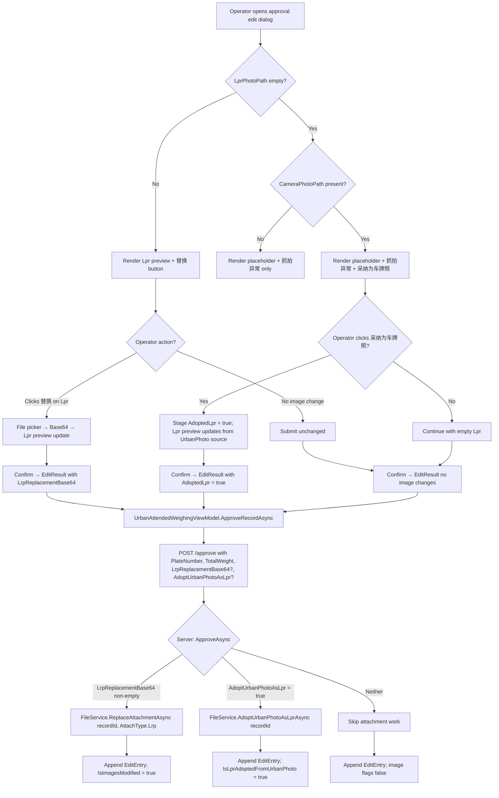

## Why

UrbanPhoto (摄像头抓拍) currently participates in the same image-replacement rule as Lpr (车牌识别抓拍), which conflicts with its intended read-only supplementary-context semantics. At the same time, when the Lpr photo is empty but an UrbanPhoto exists, reviewers have no in-approval mechanism to promote the UrbanPhoto into the Lpr slot — leaving records incomplete and forcing external tooling workarounds. This change narrows replacement to Lpr only and introduces an adoption action so reviewers can fill an empty Lpr slot from an existing UrbanPhoto.

## What Changes

- **BREAKING** — Approval image-replacement scope narrows from "any photo" to "Lpr only". `UrbanPhotoReplacementBase64` is removed from `UrbanWeighingRecordApproveInputDto`, the client `EditResult`, and the client `WeighingRecordEditDialogViewModel`. UrbanPhoto becomes read-only on both the client and the server.
- **NEW** — Approval flow gains an "adopt UrbanPhoto as Lpr" action. When Lpr is empty AND UrbanPhoto is non-empty, the approval edit dialog exposes a「采纳为车牌照」button. Clicking it stages the adoption; on submit the server copies the existing UrbanPhoto file to a new `AttachType.Lrp` `AttachmentFile` and links it to the record.
- **MODIFIED** — `UrbanWeighingRecordAppService.ApproveAsync` no longer handles the UrbanPhoto replacement branch; it gains an `AdoptUrbanPhotoAsLpr` boolean input that triggers `IFileService.AdoptUrbanPhotoAsLprAsync(recordId)`.
- **MODIFIED** — `IFileService.ReplaceAttachmentAsync` is now Lrp-only at the call sites; `IFileService` gains `AdoptUrbanPhotoAsLprAsync(Guid recordId)` that copies the UrbanPhoto source file into a new Lrp attachment without modifying the original UrbanPhoto attachment.
- **MODIFIED** — `EditEntry` gains an `IsLprAdoptedFromUrbanPhoto` boolean field. When adoption occurs during approval, the appended `EditEntry` for that approval SHALL set `IsLprAdoptedFromUrbanPhoto = true`.
- **MODIFIED** — Existing `IsImagesModified` semantics narrow to Lpr replacement only (since UrbanPhoto can no longer be replaced).

## Interaction Flow



## UI Prototype

Approval edit dialog when Lpr is empty and UrbanPhoto is present (adoption candidate):

```
┌─────────────────────────────────────────────────────────────┐
│  WeighingRecordEditDialog                                    │
├─────────────────────────────────────────────────────────────┤
│                                                             │
│  车牌号: [___________]            总重量: [________]        │
│                                                             │
│  ┌─── 车牌识别抓拍 (Lpr) ───────┐  ┌── 摄像头抓拍 (UrbanPhoto) ┐│
│  │                              │  │                      │ │
│  │    [placeholder image]       │  │  [UrbanPhoto img]    │ │
│  │                              │  │                      │ │
│  │    ⚠ 抓拍异常                │  │  (read-only)         │ │
│  │                              │  │  no 替换 button      │ │
│  │  ┌──────────────────────┐    │  │                      │ │
│  │  │ 📷 采纳为车牌照       │    │  └──────────────────────┘ │
│  │  └──────────────────────┘    │                          │
│  │  ┌────────┐                   │                          │
│  │  │ 替换   │  (still allowed)  │                          │
│  │  └────────┘                   │                          │
│  └──────────────────────────────┘                          │
│                                                             │
│  Visibility rule:                                           │
│    采纳为车牌照 button shown only when                       │
│    LprPhotoPath is empty AND CameraPhotoPath is non-empty.  │
│  UrbanPhoto section NEVER shows a 替换 button.              │
│                                                             │
│              [ 取消 ]                    [ 确定 ]           │
└─────────────────────────────────────────────────────────────┘
```

Approval edit dialog when Lpr is present (no adoption candidate):

```
┌─────────────────────────────────────────────────────────────┐
│  WeighingRecordEditDialog  (Lpr present)                    │
├─────────────────────────────────────────────────────────────┤
│                                                             │
│  车牌号: [浙A12345    ]            总重量: [25.50   ]       │
│                                                             │
│  ┌─── 车牌识别抓拍 (Lpr) ───────┐  ┌── 摄像头抓拍 (UrbanPhoto) ┐│
│  │                              │  │                      │ │
│  │  [Lpr photo preview]         │  │  [UrbanPhoto img]    │ │
│  │                              │  │  (read-only)         │ │
│  │                              │  │  no 替换 button      │ │
│  │  ┌────────┐                   │  │                      │ │
│  │  │ 替换   │                   │  │                      │ │
│  │  └────────┘                   │  └──────────────────────┘ │
│  └──────────────────────────────┘                          │
│                                                             │
│  No 采纳为车牌照 button (Lpr is not empty).                 │
│                                                             │
│              [ 取消 ]                    [ 确定 ]           │
└─────────────────────────────────────────────────────────────┘
```

## Capabilities

### New Capabilities

- `lpr-adoption-from-urban-photo`: In-approval promotion of an existing UrbanPhoto attachment into the Lpr slot when Lpr is empty. Covers client「采纳为车牌照」trigger, server-side UrbanPhoto→Lpr attachment copy via `IFileService.AdoptUrbanPhotoAsLprAsync`, and the `IsLprAdoptedFromUrbanPhoto` edit-history marker.

### Modified Capabilities

- `approval-image-replacement`: Remove `UrbanPhotoReplacementBase64` field from server DTO, client `EditResult`, and client ViewModel. Remove UrbanPhoto replace button/command. `ReplaceAttachmentAsync` continues to exist but is now invoked only for `AttachType.Lrp`. `IsImagesModified` edit-history flag triggers only on Lpr replacement.
- `edit-history-tracking`: `EditEntry` gains `IsLprAdoptedFromUrbanPhoto` boolean. New scenarios describe when the flag is set. Existing `IsImagesModified` scenario narrows to Lpr-replacement-only triggering.
- `urban-approval-photo-preview`: UrbanPhoto preview section becomes read-only (no 替换 button overlay). Lpr preview section gains an「采纳为车牌照」overlay button that is visible only when `LprPhotoPath` is empty AND `CameraPhotoPath` is non-empty.
- `urbanmanagement-weighing-record-approval`: Approval attachment contract narrows to Lpr-replacement-only; new `AdoptUrbanPhotoAsLpr` input drives the adoption path. Web UI continues to provide no replacement controls (already true).

## Impact

### Code Change Table

| File Path (repo) | Change Type | Change Reason | Impact Scope |
|------------------|-------------|---------------|--------------|
| `repos/UrbanManagement/.../UrbanWeighingRecordApproveInputDto.cs` | Modify (BREAKING) | Remove `UrbanPhotoReplacementBase64`; add `AdoptUrbanPhotoAsLpr` | Server DTO contract |
| `repos/UrbanManagement/.../UrbanWeighingRecordAppService.cs` | Modify | Drop UrbanPhoto replace branch; add adoption branch | Approval application service |
| `repos/UrbanManagement/.../IFileService.cs` + `FileService.cs` | Modify | Add `AdoptUrbanPhotoAsLprAsync(Guid recordId)`; `ReplaceAttachmentAsync` callers restricted to Lrp | File/attachment service |
| `repos/UrbanManagement/.../EditEntry.cs` | Modify | Add `IsLprAdoptedFromUrbanPhoto` boolean | Edit-history DTO |
| `repos/MaterialClient/.../WeighingRecordEditDialogViewModel.cs` | Modify (BREAKING) | Remove `ReplaceUrbanPhotoCommand` + `UrbanPhotoReplacementBase64`; add `AdoptUrbanPhotoAsLprCommand`; extend `EditResult` with `AdoptedLpr` | Client dialog VM |
| `repos/MaterialClient/.../WeighingRecordEditDialog.axaml` | Modify | Drop UrbanPhoto 替换 button; add Lpr「采纳为车牌照」button with visibility binding | Client dialog UI |
| `repos/MaterialClient/.../UrbanAttendedWeighingViewModel.cs` | Modify | `ApproveRecordAsync` passes `AdoptedLpr` flag instead of UrbanPhoto Base64 | Client approval coordinator |

### Cross-Cutting

- Replacement-rule gating moves from "any photo" to "Lpr only" across client DTO, server DTO, and edit-history semantics.
- A new Lpr-from-UrbanPhoto creation path is introduced for the approval stage; the original UrbanPhoto `AttachmentFile` and junction row are preserved untouched.
- Edit history gains an adoption marker; `IsImagesModified` semantics narrow to Lpr replacement only.
- No backward-compatibility shims are introduced (per task constraints); clients and servers move in lockstep.
