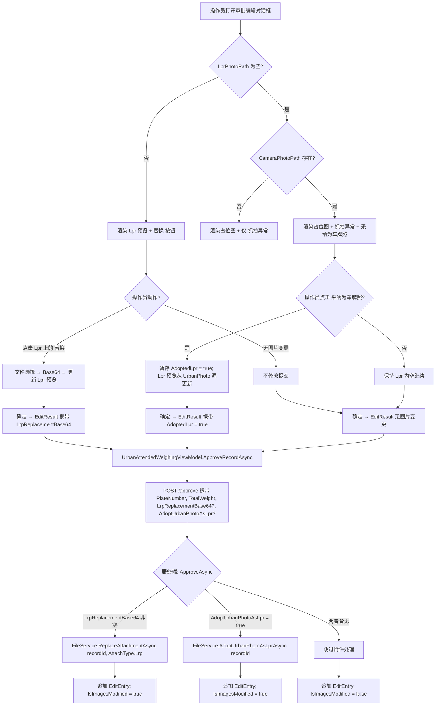

## Why

当前 UrbanPhoto（摄像头抓拍）与 Lpr（车牌识别抓拍）共用同一条审批期图片替换规则，这与 UrbanPhoto 本应作为只读补充上下文的语义相冲突。同时，当 Lpr 图片为空但存在 UrbanPhoto 时，审批人员没有在审批流程内将 UrbanPhoto 提升到 Lpr 槽位的机制——这导致记录不完整，并迫使业务方借助外部工具绕开限制。本次变更将替换范围收窄为仅 Lpr，并新增一个采纳动作，让审批人员可以用已有的 UrbanPhoto 填补空的 Lpr 槽位。

## What Changes

- **BREAKING** — 审批图片替换范围由「任意图片」收窄为「仅 Lpr」。`UrbanPhotoReplacementBase64` 从 `UrbanWeighingRecordApproveInputDto`、客户端 `EditResult` 以及客户端 `WeighingRecordEditDialogViewModel` 中移除。UrbanPhoto 在客户端与服务端均变为只读。
- **NEW** — 审批流程新增「将 UrbanPhoto 采纳为 Lpr」动作。当 Lpr 为空且 UrbanPhoto 非空时，审批编辑对话框暴露一个「采纳为车牌照」按钮。点击该按钮将暂存采纳意图；提交时服务端把现有的 UrbanPhoto 文件复制为一个新的 `AttachType.Lrp` `AttachmentFile` 并关联到记录。
- **MODIFIED** — `UrbanWeighingRecordAppService.ApproveAsync` 不再处理 UrbanPhoto 替换分支；新增 `AdoptUrbanPhotoAsLpr` 布尔输入，触发 `IFileService.AdoptUrbanPhotoAsLprAsync(recordId)`。
- **MODIFIED** — `IFileService.ReplaceAttachmentAsync` 在调用点处仅限 Lrp 使用；`IFileService` 新增 `AdoptUrbanPhotoAsLprAsync(Guid recordId)`，将 UrbanPhoto 源文件复制为新的 Lrp 附件，且不修改原有 UrbanPhoto 附件。
- **UNCHANGED** — `EditEntry` 结构保持不变；不新增任何编辑历史字段。既有 `IsImagesModified` 标志沿用原语义——只要 Lpr 图片被替换（无论是手动替换还是从 UrbanPhoto 采纳）就置为 `true`，不再为 UrbanPhoto 触发（因为 UrbanPhoto 不可替换）。

## Interaction Flow



## UI Prototype

当 Lpr 为空且存在 UrbanPhoto（具备采纳条件）时的审批编辑对话框：

```
┌─────────────────────────────────────────────────────────────┐
│  WeighingRecordEditDialog                                    │
├─────────────────────────────────────────────────────────────┤
│                                                             │
│  车牌号: [___________]            总重量: [________]        │
│                                                             │
│  ┌─── 车牌识别抓拍 (Lpr) ───────┐  ┌── 摄像头抓拍 (UrbanPhoto) ┐│
│  │                              │  │                      │ │
│  │    [占位图]                  │  │  [UrbanPhoto 图片]   │ │
│  │                              │  │                      │ │
│  │    ⚠ 抓拍异常                │  │  (只读)              │ │
│  │                              │  │  无 替换 按钮        │ │
│  │  ┌──────────────────────┐    │  │                      │ │
│  │  │ 📷 采纳为车牌照       │    │  └──────────────────────┘ │
│  │  └──────────────────────┘    │                          │
│  │  ┌────────┐                   │                          │
│  │  │ 替换   │  (仍然允许)        │                          │
│  │  └────────┘                   │                          │
│  └──────────────────────────────┘                          │
│                                                             │
│  可见性规则:                                                 │
│    仅当 LprPhotoPath 为空 且 CameraPhotoPath 非空 时,        │
│    才显示 采纳为车牌照 按钮.                                 │
│  UrbanPhoto 区域永不显示 替换 按钮.                          │
│                                                             │
│              [ 取消 ]                    [ 确定 ]           │
└─────────────────────────────────────────────────────────────┘
```

当 Lpr 已存在（无采纳候选）时的审批编辑对话框：

```
┌─────────────────────────────────────────────────────────────┐
│  WeighingRecordEditDialog  (Lpr 已存在)                     │
├─────────────────────────────────────────────────────────────┤
│                                                             │
│  车牌号: [浙A12345    ]            总重量: [25.50   ]       │
│                                                             │
│  ┌─── 车牌识别抓拍 (Lpr) ───────┐  ┌── 摄像头抓拍 (UrbanPhoto) ┐│
│  │                              │  │                      │ │
│  │  [Lpr 图片预览]              │  │  [UrbanPhoto 图片]   │ │
│  │                              │  │  (只读)              │ │
│  │                              │  │  无 替换 按钮        │ │
│  │  ┌────────┐                   │  │                      │ │
│  │  │ 替换   │                   │  │                      │ │
│  │  └────────┘                   │  └──────────────────────┘ │
│  └──────────────────────────────┘                          │
│                                                             │
│  无 采纳为车牌照 按钮 (Lpr 不为空).                         │
│                                                             │
│              [ 取消 ]                    [ 确定 ]           │
└─────────────────────────────────────────────────────────────┘
```

## Capabilities

### New Capabilities

- `lpr-adoption-from-urban-photo`：在审批流程内，当 Lpr 为空时，将已有的 UrbanPhoto 附件提升至 Lpr 槽位。覆盖客户端「采纳为车牌照」触发以及服务端通过 `IFileService.AdoptUrbanPhotoAsLprAsync` 执行的 UrbanPhoto→Lpr 附件复制。采纳同样会触发既有 `IsImagesModified` 编辑历史标志（与手动 Lpr 替换一致），不新增任何编辑历史字段。

### Modified Capabilities

- `approval-image-replacement`：从服务端 DTO、客户端 `EditResult` 以及客户端 ViewModel 中移除 `UrbanPhotoReplacementBase64` 字段。移除 UrbanPhoto 的替换按钮/命令。`ReplaceAttachmentAsync` 仍然保留，但仅用于 `AttachType.Lrp`。`IsImagesModified` 编辑历史标志在 Lpr 替换或采纳时触发。
- `edit-history-tracking`：`EditEntry` 结构保持不变；不新增任何字段。既有 `IsImagesModified` 场景在「Lpr 替换」和「从 UrbanPhoto 采纳为 Lpr」两种情况下均置位（沿用原语义，不区分替换来源），不再因 UrbanPhoto 触发（因为 UrbanPhoto 已不可替换）。
- `urban-approval-photo-preview`：UrbanPhoto 预览区域变为只读（不再叠加 替换 按钮）。Lpr 预览区域新增「采纳为车牌照」叠加按钮，仅当 `LprPhotoPath` 为空 且 `CameraPhotoPath` 非空 时可见。
- `urbanmanagement-weighing-record-approval`：审批附件契约收窄为仅限 Lpr 替换；新增 `AdoptUrbanPhotoAsLpr` 输入驱动采纳路径。Web UI 继续不提供任何替换控件（现状即如此）。

## Impact

### Code Change Table

| 文件路径（仓库内） | 变更类型 | 变更原因 | 影响范围 |
|------------------|-------------|---------------|--------------|
| `repos/UrbanManagement/.../UrbanWeighingRecordApproveInputDto.cs` | Modify (BREAKING) | 删除 `UrbanPhotoReplacementBase64`；新增 `AdoptUrbanPhotoAsLpr` | 服务端 DTO 契约 |
| `repos/UrbanManagement/.../UrbanWeighingRecordAppService.cs` | Modify | 删除 UrbanPhoto 替换分支；新增采纳分支 | 审批应用服务 |
| `repos/UrbanManagement/.../IFileService.cs` + `FileService.cs` | Modify | 新增 `AdoptUrbanPhotoAsLprAsync(Guid recordId)`；`ReplaceAttachmentAsync` 调用方仅限 Lrp | 文件/附件服务 |
| `repos/MaterialClient/.../WeighingRecordEditDialogViewModel.cs` | Modify (BREAKING) | 删除 `ReplaceUrbanPhotoCommand` + `UrbanPhotoReplacementBase64`；新增 `AdoptUrbanPhotoAsLprCommand`；在 `EditResult` 上扩展 `AdoptedLpr` | 客户端对话框 VM |
| `repos/MaterialClient/.../WeighingRecordEditDialog.axaml` | Modify | 移除 UrbanPhoto 的 替换 按钮；在 Lpr 区域添加「采纳为车牌照」按钮并通过可见性绑定控制 | 客户端对话框 UI |
| `repos/MaterialClient/.../UrbanAttendedWeighingViewModel.cs` | Modify | `ApproveRecordAsync` 传递 `AdoptedLpr` 标志，而非 UrbanPhoto Base64 | 客户端审批协调器 |

### Cross-Cutting

- 替换规则约束由「任意图片」改为「仅 Lpr」，影响客户端 DTO、服务端 DTO 以及编辑历史语义。
- 为审批阶段新增一条「从 UrbanPhoto 创建 Lpr」的路径；原始 UrbanPhoto 的 `AttachmentFile` 及关联表行保持不变。
- 编辑历史结构保持不变；`IsImagesModified` 在 Lpr 替换或采纳时均置位（沿用既有语义，不区分来源）。
- 不引入任何向后兼容垫片（遵循任务约束）；客户端与服务端必须同步演进。
