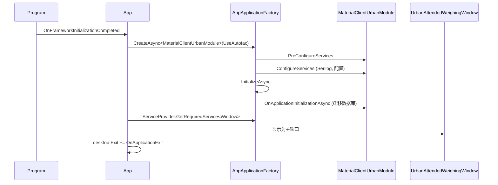
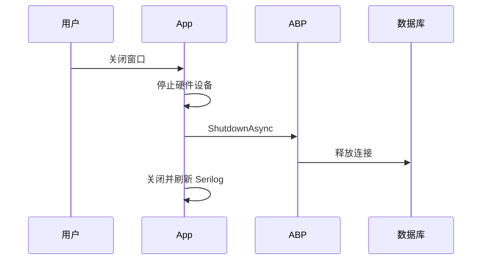

## Context

MaterialClient.Urban 是一个用于城管称重操作的单窗口 Avalonia 桌面客户端。它位于 `MaterialClient.Urban/` 目录下，作为独立项目引用 `MaterialClient.Common`。当前架构在 `App.axaml.cs` 中使用手动 `ServiceCollection` DI，存在本地重复实体模型（`Models/WeighingRecord.cs`、`Models/DeviceStatus.cs`），以及与 MaterialClient 共享样式系统不一致的内联暗色主题样式。

MaterialClient 主应用使用 `AbpApplicationFactory.CreateAsync<MaterialClientModule>()` 以及完整的 ABP 模块生命周期（Autofac、EF Core、后台工作器、数据库迁移）。Urban 需要采用相同的模式以获取共享服务、仓储和事件总线的访问权限。

### 当前架构（Urban）

```
MaterialClient.Urban/
├── Program.cs                    → Avalonia 经典桌面生命周期
├── App.axaml / App.axaml.cs      → 手动 ServiceCollection，无 ABP
├── MaterialClient.Urban.csproj   → 仅引用 MaterialClient.Common
├── Models/
│   ├── WeighingRecord.cs         → Common.Entities.WeighingRecord 的简化副本
│   └── DeviceStatus.cs           → 仅本地使用的模型
├── Services/
│   ├── UrbanWeighingService.cs   → IUrbanWeighingService（WeighingMode + ProductCode）
│   └── UrbanWeighingPipelineStrategy.cs → IWeighingPipelineStrategy
├── ViewModels/
│   └── WeighingSystemViewModel.cs → 使用 ILocalEventBus、IRepository（来自 Common）
└── Views/
    ├── WeighingSystemWindow.axaml     → 暗色主题，内联样式
    └── WeighingSystemWindow.axaml.cs  → 包含 tab/filter 逻辑的 code-behind
```

### 目标架构（Urban + ABP）

```
MaterialClient.Urban/
├── Program.cs                           → 不变（Avalonia 生命周期）
├── App.axaml / App.axaml.cs             → ABP 工厂，共享样式
├── MaterialClientUrbanModule.cs         → 新增：AbpModule
├── MaterialClient.Urban.csproj          → + ABP Autofac 包
├── Services/
│   └── UrbanWeighingPipelineStrategy.cs → 不变
├── ViewModels/
│   └── UrbanAttendedWeighingViewModel.cs → 重命名，使用 Common 实体
└── Views/
    ├── UrbanAttendedWeighingWindow.axaml     → 重命名，MaterialClient 样式
    └── UrbanAttendedWeighingWindow.axaml.cs  → 重命名
```

## Goals / Non-Goals

**Goals:**
- 将 ABP 模块化架构集成到 Urban 中，实现服务复用
- 通过直接使用 Common 实体消除重复的实体模型
- 对齐窗口布局和样式与 MaterialClient 的 `AttendedWeighingWindow` 模式
- 将窗口重命名为 `UrbanAttendedWeighingWindow` 以保持命名一致性
- 将 `IUrbanWeighingService` 的职责合并到 `ISettingsService`

**Non-Goals:**
- 为 Urban 添加登录/认证功能（这会移除"无登录"的设计约束）
- 为 Urban 添加 Generic Host（必须使用 Avalonia ApplicationLifetime）
- 实现实际的许可证验证（TODO 保持不变）
- 更改称重管线逻辑或策略模式
- 将 Urban 迁移为使用 MaterialClient 的多窗口启动流程

## Decisions

### Decision 1：ABP 模块结构

**选择**：创建 `MaterialClientUrbanModule`，依赖 `MaterialClientCommonModule` + `AbpAutofacModule`。

**理由**：镜像 `MaterialClientModule` 的依赖链。`MaterialClientCommonModule` 提供 EF Core、DbContext 和默认仓储。`AbpAutofac` 通过 `ITransientDependency` / `ISingletonDependency` 标记实现隐式服务注册。

**考虑过的替代方案**：让 Urban 直接依赖 `MaterialClientModule`。拒绝此方案，因为 `MaterialClientModule` 注册了 MaterialClient 特有的服务（API 客户端、`MainWindow`、`PollingBackgroundService`、Web 宿主），这些 Urban 不需要。

```
模块依赖链：

MaterialClientCommonModule          ← 共享：EF Core, DbContext, 实体
├── MaterialClientModule            ← 主应用：API 客户端, Web 宿主, 轮询
│   └── MaterialClient.App          ← 主桌面应用
└── MaterialClientUrbanModule       ← Urban 应用：仅 Urban 特有服务
    └── MaterialClient.Urban        ← Urban 桌面应用
```

### Decision 2：应用启动模式

**选择**：在 `App.axaml.cs.OnFrameworkInitializationCompleted` 中使用 `AbpApplicationFactory.CreateAsync<MaterialClientUrbanModule>()`，与 MaterialClient 的模式匹配。

**理由**：提供相同的生命周期管理（ConfigureServices → OnApplicationInitialization → OnShutdown）。启用 ABP 隐式服务注册和 `ILocalEventBus` 订阅，无需手动接线。

**启动流程**：


**关闭流程**（遵循 AGENTS.md 退出顺序）：


### Decision 3：将 IUrbanWeighingService 合并到 ISettingsService

**选择**：向 `ISettingsService` 添加 `GetProductCodeAsync()` 和 `SaveProductCodeAsync(ProductCode)`。完全移除 `IUrbanWeighingService`。

**理由**：`IUrbanWeighingService` 仅返回两个静态值（`WeighingMode.UrbanMode`、`ProductCode.Urban`）。`ISettingsService` 已通过 `GetWeighingModeAsync()` 和 `SaveDefaultWeighingModeAsync(ProductCode)` 管理 `WeighingMode`。`ProductCode` 可从存储的称重模式推导。添加 `GetProductCodeAsync()` 方法无需单独的服务即可完善接口。

**ProductCode 映射方式**：
```
WeighingMode.Standard  → ProductCode.Standard (5000)
WeighingMode.SolidWaste → ProductCode.SolidWaste (5010)
WeighingMode.UrbanMode → ProductCode.Urban (5030)
```

### Decision 4：移除重复模型

**选择**：删除 `Models/WeighingRecord.cs` 和 `Models/DeviceStatus.cs`。使用 `MaterialClient.Common.Entities.WeighingRecord`，在 ViewModel 中创建一个简单的 `DeviceStatusDisplay` record 内联或作为小型 struct。

**理由**：本地 `WeighingRecord` 模型使用 `INotifyPropertyChanged` 和字符串属性（`LicensePlate`、`WeighingTime`），而 Common 实体使用正确的类型（`PlateNumber`、`AddDate`）。ViewModel 已导入 `MaterialClient.Common.Entities.WeighingRecord`。XAML 必须更新为绑定到 Common 实体的属性名。

**属性映射**：
| 本地模型属性 | Common 实体属性 | 绑定变更 |
|---------------------|----------------------|----------------|
| `LicensePlate` | `PlateNumber` | 更新 XAML 绑定 |
| `WeighingTime`（string） | `AddDate`（DateTime） | 添加转换器或内联格式化 |
| `Weight`（double） | `TotalWeight`（decimal） | 更新 XAML 绑定 |
| `Status` / `IsNormal` | `SyncStatus` 枚举 | 更新可见性逻辑 |

### Decision 5：窗口重命名和布局对齐

**选择**：重命名为 `UrbanAttendedWeighingWindow` + `UrbanAttendedWeighingViewModel`。重构布局以匹配 `AttendedWeighingWindow` 的三列四行模式。

**理由**："WeighingSystem" 含义模糊。"UrbanAttendedWeighing" 与 MaterialClient 的 "AttendedWeighing" 命名镜像一致，明确表达用途。布局应使用相同的 Grid 结构以保持视觉一致性。

**布局结构**（匹配 AttendedWeighingWindow）：
```
┌──────────────────────────────────────────────────────────────┐
│ Row 0: 标题栏 (#4169E1)              [最小化] [关闭]          │
│  Logo | 标题 | 菜单（仅系统设置）                               │
├──────────────────────────────────────────────────────────────┤
│ Row 1: 重量显示区 (#4A85F9 渐变)                                │
│  重量（大字体）| 状态文字                                       │
├────────────┬────────────────────────┬────────────────────────┤
│ Col 0      │ Col 1                  │ Col 2                  │
│ 280px      │ * (弹性)                │ 360px                  │
│            │                        │                        │
│ 记录列表    │ [主内容区]              │ PhotoGridView          │
│ + 筛选器   │ (称重记录               │ (车牌识别抓拍 +         │
│ + 分页     │  详情视图)              │  摄像头抓拍)            │
├────────────┴────────────────────────┴────────────────────────┤
│ Row 3: 状态栏 (#F5F5F5)                                        │
│  ● 设备状态                                                   │
└──────────────────────────────────────────────────────────────┘
```

### Decision 6：样式迁移

**选择**：用 MaterialClient 的 `App.axaml` 共享样式类替换 Urban 的内联 `Window.Styles`。使用 `primary-button`、`titlebar-close-button`、`titlebar-minimize-button`、`card-border`、`section-border` 等。

**理由**：Urban 当前定义了约 130 行内联样式。MaterialClient 在 `App.axaml` 中有全面的全局样式。通过引用相同的样式类，Urban 获得一致的视觉效果，未来的样式更新会自动传播。

**样式映射**：
| Urban 内联样式 | MaterialClient 共享样式 |
|--------------------|-----------------------------|
| `header-menu-btn` | `popup-menu-item-button` |
| `titlebar-btn` | `titlebar-minimize-button` |
| `titlebar-close-btn` | `titlebar-close-button` |
| `tab-btn` | `tab-button` + `tab-button.active` |
| `search-btn` | `primary-button` |
| `approval-btn` | `primary-button`（小型） |
| 自定义 `#0F172A` 暗色背景 | MaterialClient 蓝色标题栏 (#4169E1) |

## Risks / Trade-offs

| 风险 | 缓解措施 |
|------|----------|
| **ABP 初始化增加启动延迟** | SQLite 数据库迁移速度快；Urban 无需配置 API 客户端。如启动超过 3 秒则分析和优化。 |
| **Common 实体属性名与 Urban 本地模型不同** | XAML 绑定必须在同一 PR 中更新。使用编译绑定（`x:DataType`）在构建时捕获不匹配。 |
| **样式变更改变视觉外观** | 目标是有意为之 — 对齐 MaterialClient 的设计。通过视觉对比验证。 |
| **SaveDefaultWeighingModeAsync 仅处理 Standard/SolidWaste** | 扩展以处理 Urban 模式。当前逻辑：`productCode == SolidWaste ? SolidWaste : Standard`。必须添加 UrbanMode 映射。 |
| **移除 IUrbanWeighingService 是破坏性变更** | 仅在 MaterialClient.Urban 内部消费。无外部消费者。可安全移除。 |
| **Urban 当前 ViewModel 通过构造函数注入 ILocalEventBus 和 IRepository** | ABP 工厂自动提供这些服务。构造函数签名保持不变。 |

## Migration Plan

1. **阶段 1 — ABP 模块**：添加 `MaterialClientUrbanModule.cs`，更新 `.csproj`，重写 `App.axaml.cs` 启动逻辑。验证应用启动和数据库迁移。
2. **阶段 2 — 服务合并**：扩展 `ISettingsService` 添加 `GetProductCodeAsync()`，删除 `IUrbanWeighingService` + `UrbanWeighingService`，更新 ViewModel 使用 `ISettingsService`。
3. **阶段 3 — 移除重复模型**：删除 `Models/`，将 XAML 绑定更新为 Common 实体属性。
4. **阶段 4 — 窗口重命名**：将所有文件和引用从 `WeighingSystem*` 重命名为 `UrbanAttendedWeighing*`。
5. **阶段 5 — 样式对齐**：用共享的 MaterialClient 样式类替换内联样式，重构布局以匹配 AttendedWeighingWindow。

**回滚策略**：每个阶段可通过 git 独立回滚。阶段 1 是基础 — 如果 ABP 初始化失败，回滚到手动 ServiceCollection。

## Open Questions

无。所有决策已基于现有代码库模式确定。
